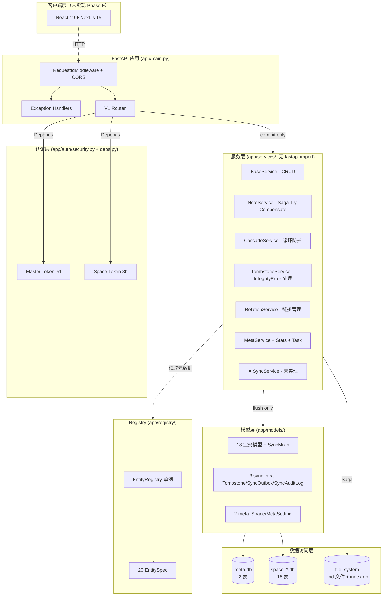
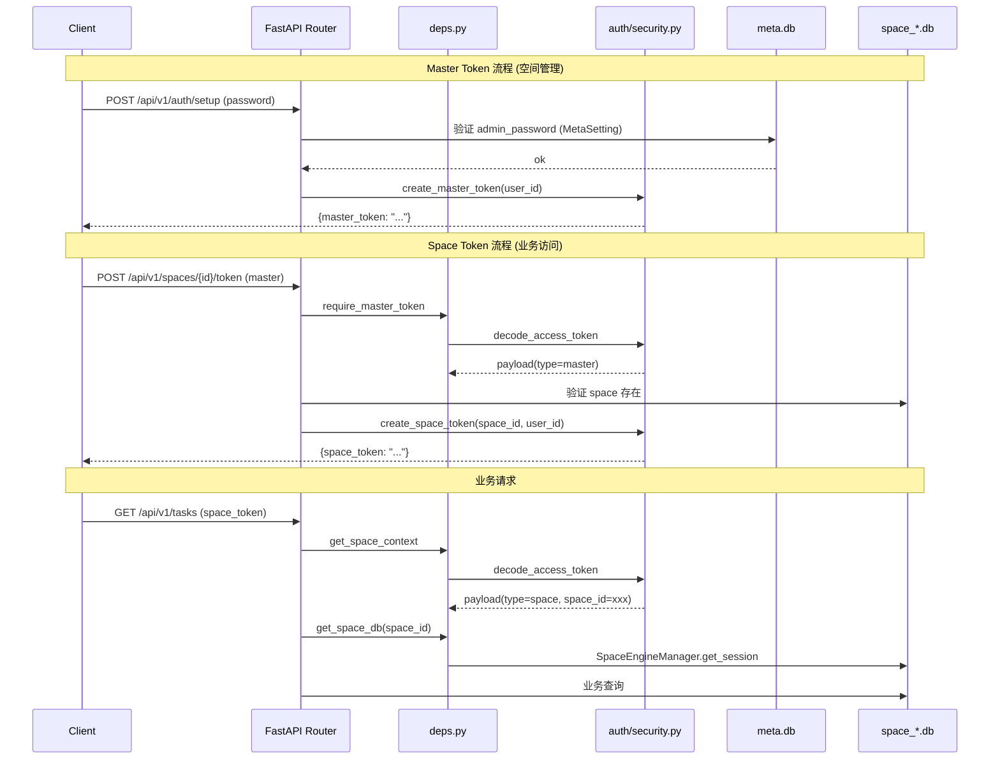
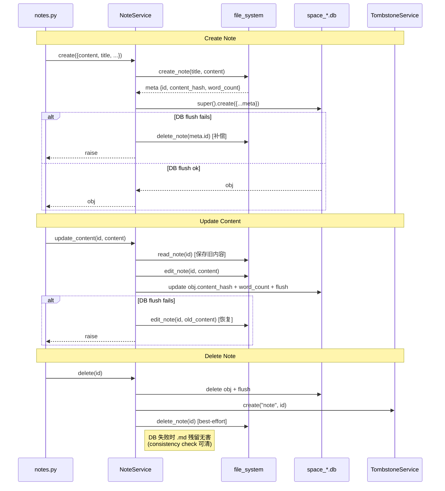
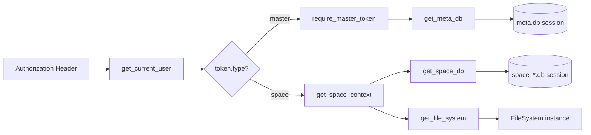

# PomodoroXII 项目深度调研分析报告

> **调研方法**: 自身（Trae IDE Agent） + codebase-memory-mcp（代码知识图谱） + cognee-mcp（语义记忆库） 三方协同
>
> **调研日期**: 2026-07-04
>
> **调研范围**: 功能实现、系统架构、子系统架构、测试体系、已知问题、知识图谱洞察
>
> **基线代码版本**: `e:\Development\MyAwesomeApp\PomodoroXII\backend`（无 Git 版本控制，文件系统当前态）

---

## 一、执行摘要

### 1.1 关键发现（5 条）

1. **Phase C Sync 引擎实际进度为 0%，与记忆/文档声称严重不符**
   - `app/services/sync.py` 与 `app/routes/v1/sync.py` 在当前仓库均不存在
   - 仅有的 sync 相关代码是 3 个空壳模型：`SyncOutbox` / `SyncAuditLog` / `Tombstone`
   - 之前 session_memory 中"Phase C 已完成 4 任务"的记录是针对**已归档的** `pomodoroxi-rebuild` 仓库，不是当前 PomodoroXII

2. **架构质量极佳，三层铁律严格遵守**
   - 服务层 0 个 `fastapi` import（Cypher 查询验证）
   - 路由层 0 个直接调用 models 层（CALLS 边验证）
   - 应用代码中仅 3 个函数复杂度 > 5（全部位于 alembic 迁移和测试 gate）
   - 14 个已注册 EntitySpec + 71 个 Route 节点 + 18 业务模型 + 9 服务模块（含 NoteService Saga）

3. **P0 阻塞项已全部修复**（与审查文档 2026-07-03 版本相比）
   - P0-1 DB 表隔离：`init_meta_db` 与 `_init_schema` 已分别用 `tables=` 参数隔离 meta/space 表，`alembic/env.py` 添加 `include_object` 过滤器
   - P0-2 NoteService Saga：`create/update_content/delete` 三方法均含完整 Try-Compensate 补偿逻辑

4. **14 项次级问题（P1-P3）状态分布**:
   - ✅ 已修复 8 项（P1-1, P1-2, P1-3, P1-4, P1-5, P3-1）
   - ❌ 未修复 6 项（P2-1 广泛存在于 11 个路由, P2-2, P2-3 部分, P2-4 部分, P2-5, P2-6, P3-10）

5. **cognee 索引存在严重误导信息**
   - 错误声称使用 Auth0（实际为自实现双 JWT）、AWS CloudFront（实际无 CDN）、PostgreSQL（实际为多 SQLite）、GitHub Actions CI/CD（实际未初始化 Git）
   - 必须以实际代码为准，cognee 仅作为辅助参考

### 1.2 真实进度判断（差异校正表）

| 项目 | 文档/记忆声称 | 实际代码状态 | 证据 |
|------|--------------|--------------|------|
| Phase C 进度 | "已完成 4 任务" (session_memory 2026-07-03) | **0% 未实现** | `Glob **/sync*.py` 在 backend 下仅命中 `models/sync_outbox.py` + `models/sync_audit_log.py`，无 service/route 文件 |
| 测试总数 | "244 全绿" (v4 规划、转接文档) | **214 个测试函数 / 36 测试文件** | Grep `^(async )?def test_|^class Test` 实际计数 |
| phase-c-sync-completion-plan.md 目标项目 | "PomodoroXII/backend" | `e:\Development\MyAwesomeApp\pomodoroxi\PomodoroXII-rebuild\backend`（已归档） | 该文档第 17 行原文 — 不适用于当前仓库 |
| 认证方案 (cognee 声称) | "Auth0 (OAuth2 / OIDC)" | 自实现双 JWT (PyJWT 2.10+ + bcrypt 4.2+) | [security.py](file:///e:/Development/MyAwesomeApp/PomodoroXII/backend/app/auth/security.py) 实现完整 |
| 数据库 (cognee 声称) | "PostgreSQL multi-tenant" | 多空间独立 SQLite + 共享 meta.db | [meta_session.py](file:///e:/Development/MyAwesomeApp/PomodoroXII/backend/app/db/meta_session.py) + [space_manager.py](file:///e:/Development/MyAwesomeApp/PomodoroXII/backend/app/space_manager.py) |
| CI/CD (cognee 声称) | "GitHub Actions 完整流水线" | 未初始化 Git，无 CI/CD | 无 `.git` 目录，无 `.github/workflows/` |
| 前端 (cognee 声称) | "React 19 + Next.js 15 已完成" | 前端完全不存在 | 无 `frontend/` / `web/` / `client/` 目录 |

### 1.3 风险与建议（按严重度排序）

| 严重度 | 风险 | 缓解建议 |
|--------|------|---------|
| **极高** | session_memory 与文档"声称 Phase C 完成"误导后续 Agent | 在 `project_memory.md` 中明确标注当前仓库 Phase C 实际进度为 0% |
| **高** | P2-1 list 端点丢弃 total 在 11 个路由中广泛存在 | 重构为 `{"items": [...], "total": N}` 统一返回结构，更新 schema |
| **高** | SyncOutbox/SyncAuditLog 无索引，Phase C 实施时性能瓶颈 | 在 sync infra 模型添加 `index=True` 到 entity_id/synced_at/created_at |
| **中** | P2-6 Mixin updated_at 无 onupdate，version 无自增 | 需在 BaseService.update 中手动 +1 version（当前 updated_at 已手动设置） |
| **中** | P3-10 Note status 无 CheckConstraint（与 Task 不一致） | 添加 `CheckConstraint("status IN ('active','archived')")` |
| **低** | cognee 索引误导信息 | 通过 cognee-mcp 写入正确项目状态描述 |

---

## 二、项目基本面

### 2.1 项目定位与目标

PomodoroXII 是一款番茄钟应用，正从 **Vue 3 + FastAPI** 完全重写为 **React 19 + Next.js 15 + FastAPI**。

- **多空间架构**: 共享 FastAPI 进程 + 每空间独立 SQLite + 独立 notes 目录
- **双 JWT 认证**: Master Token（7 天，meta 层） / Space Token（8 小时，含 `space_id`）
- **双 Base 隔离**: `app.db.base.Base`（业务 ORM）与 `app.file_system.schema.Base`（FS 索引）完全独立
- **Note content 所有权**: `.md` 文件为唯一 Source of Truth，DB 仅存 `content_hash` + `word_count`

### 2.2 实际技术栈

| 层 | 技术 | 版本 |
|----|------|------|
| 后端框架 | FastAPI | >= 0.115 |
| ORM | SQLAlchemy 2.0 async | >= 2.0.36 |
| DB 驱动 | aiosqlite | >= 0.20 |
| 数据库 | SQLite（每空间独立 + meta.db 共享） | - |
| 迁移工具 | Alembic async + Programmatic API | >= 1.14 |
| Schema | Pydantic v2 | >= 2.10 |
| 认证 | PyJWT + bcrypt（自实现双 JWT） | 2.10+ / 4.2+ |
| 配置 | pydantic-settings | >= 2.6 |
| 测试 | pytest + pytest-asyncio (asyncio_mode=auto) | >= 8.3 / 0.24 |
| 依赖管理 | uv + hatchling | - |
| ID 生成 | nanoid + uuid4 | - |
| 文件锁 | filelock | >= 3.16 |
| 容器化 | Docker 多阶段构建（uv 官方镜像 + 非 root UID 1000 + gosu） | - |
| 前端 | **不存在**（Phase F 未开始） | - |
| CI/CD | **未初始化 Git** | - |
| Python | 3.13（pyproject.toml 要求） | - |

### 2.3 三条路径（canonical vs 参考）

| 路径 | 用途 | 状态 |
|------|------|------|
| `e:\Development\MyAwesomeApp\PomodoroXII` | **目标项目（canonical，调研对象）** | 当前仓库 |
| `e:\Development\MyAwesomeApp\pomodoroxi` | 源项目（Vue 3 + FastAPI 完整代码 + 13 核心文档） | 参考代码 |
| `e:\Development\MyAwesomeApp\pomodoroxi\PomodoroXII-rebuild` | 已归档副本 | **2026-07-02 已合并入目标项目，勿再开发** |
| `E:\Notes\测试-demo\video-collector\...\file_system` | file_system 源码 | 已移植完成（Phase A） |

### 2.4 仓库结构概览

```
PomodoroXII/
├── backend/                                  # FastAPI 后端（当前唯一开发目录）
│   ├── app/
│   │   ├── main.py                          # ✅ create_app() + lifespan + 异常处理器 + RequestIdMiddleware
│   │   ├── settings.py                      # ✅ Settings (含 secret_key production 校验)
│   │   ├── deps.py                          # ✅ get_current_user + require_master_token + get_space_context + get_space_db + get_meta_db + get_file_system
│   │   ├── errors.py                        # ✅ AppError + 5 子类 + register_exception_handlers
│   │   ├── logging.py                       # ✅ JsonFormatter + request_id_var
│   │   ├── middleware.py                    # ✅ RequestIdMiddleware
│   │   ├── space_manager.py                 # ✅ SpaceEngineManager (LRU + asyncio.Lock + double-check)
│   │   ├── auth/security.py                 # ✅ 双 JWT 实现 (master 7d / space 8h)
│   │   ├── db/
│   │   │   ├── base.py                      # ✅ Base + NAMING_CONVENTION
│   │   │   ├── session.py                   # ✅ create_engine + create_session_factory
│   │   │   ├── meta_session.py               # ✅ init_meta_db (tables 过滤已修复 P0-1)
│   │   │   └── models/meta.py               # ✅ Space + MetaSetting
│   │   ├── file_system/                     # ✅ 15 文件已移植 + 5 耦合已修正
│   │   │   ├── api.py                       # ✅ get_file_system factory
│   │   │   ├── schema.py                    # ✅ 独立 Base + FTS5
│   │   │   └── engine/                      # ✅ 9 ops 模块 (note/folder/search/trash/version/consistency/export + base)
│   │   ├── models/                          # ✅ 18 业务模型 + 2 meta 模型
│   │   │   ├── mixins.py                    # ✅ SyncMixin (id/created_at/updated_at/version)
│   │   │   ├── note.py                      # ✅ Note (无 content 字段，D4 决策)
│   │   │   ├── task.py                      # ✅ Task (含 CheckConstraint P3-1 已修)
│   │   │   ├── tombstone.py                 # ✅ Tombstone (含 UniqueConstraint + index)
│   │   │   ├── sync_outbox.py               # ⚠️ 无索引 (P2-5 未修)
│   │   │   ├── sync_audit_log.py            # ⚠️ 无索引 (P2-5 未修)
│   │   │   └── ... (其他 14 业务模型)
│   │   ├── schemas/                          # ✅ 14 Pydantic schema 模块
│   │   ├── services/                        # ✅ 10 service 模块
│   │   │   ├── base.py                       # ✅ BaseService (CRUD + flush-only + no fastapi)
│   │   │   ├── note.py                      # ✅ NoteService Saga (Try-Compensate 完整)
│   │   │   ├── cascade.py                   # ✅ CascadeService (含 visited 循环防护 P1-2 已修)
│   │   │   ├── tombstone.py                 # ✅ TombstoneService (含 IntegrityError 处理 P1-3 已修)
│   │   │   ├── relation.py                  # ✅ RelationService (含 ValidationError P1-4 已修)
│   │   │   ├── task.py                      # ⚠️ update 不处理 tags (P2-2 未修)
│   │   │   ├── serializers.py               # ⚠️ json.loads 未保护 (P2-4 部分修)
│   │   │   ├── stats.py / time.py / meta.py # ✅ 工具服务
│   │   │   └── ❌ sync.py (不存在，Phase C 待实施)
│   │   ├── routes/v1/                       # ✅ 14 业务路由 + auth/spaces/meta
│   │   │   ├── __init__.py                  # ✅ build_v1_router 聚合 15 路由
│   │   │   ├── tasks.py / notes.py          # ⚠️ list 端点丢弃 total (P2-1 未修)
│   │   │   ├── trash.py                     # ✅ _ENTITY_MAP 已移除 Task (P1-1 已修)
│   │   │   └── ❌ sync.py (不存在，Phase C 待实施)
│   │   └── registry/                        # ✅ EntityRegistry 单例 + 20 EntitySpec
│   │       ├── __init__.py                  # ✅ REGISTRY 单例
│   │       ├── entities.py                  # ✅ EntitySpec/FieldSpec/StorageType/EntityCategory (frozen dataclass)
│   │       └── builtin.py                   # ✅ 20 实体注册 (14 业务 + 3 sync_infra + 2 meta + 1 setting)
│   ├── alembic/
│   │   ├── env.py                           # ✅ async + include_object 过滤 (P0-1 已修)
│   │   └── versions/
│   │       ├── 001_initial.py               # ✅ baseline: spaces + meta_settings
│   │       └── cab2ff7bcf37_phase_b_all_models.py  # ✅ 18 业务表
│   ├── tests/                               # ✅ 214 测试 / 36 文件
│   │   ├── conftest.py                      # ✅ _isolate_env (重载 settings/models/services)
│   │   ├── test_db_isolation.py             # ✅ 3 测试 (验证 P0-1 修复)
│   │   ├── test_note_service.py             # ✅ 14 测试 (含 Saga 补偿)
│   │   └── ... (其他 33 测试文件)
│   ├── Dockerfile                           # ✅ 多阶段构建
│   ├── pyproject.toml                       # ✅ 依赖配置
│   └── alembic.ini                          # ✅ Alembic 配置
├── documents/                               # 规划与交接文档
├── 核心文档/                                 # 13 篇源项目核心文档 + 2 HTML 全景报告
└── .trae/documents/                         # 内部审查/计划文档（本报告所在）
```

---

## 三、整体架构

### 3.1 系统架构图



### 3.2 三层铁律遵守情况

| 铁律 | 验证方法 | 结果 |
|------|----------|------|
| Routers commit only | Grep `await db.commit()` in routes/ | ✅ 全部路由均调用 commit |
| Services flush only | Grep `await db.commit()` in services/ | ✅ 0 处 commit 调用 |
| Services no fastapi import | Cypher: `MATCH (m:Module)-[:IMPORTS]->(target) WHERE m STARTS WITH 'app.services' AND target CONTAINS 'fastapi'` | ✅ **0 个匹配** |
| Routes 不直接调用 models | Cypher: `MATCH (r:Function)-[:CALLS]->(s:Function) WHERE r.file_path STARTS WITH 'app/routes' AND s.file_path STARTS WITH 'app/models'` | ✅ **0 个跨边界调用** |
| Models 纯数据 | 模型文件仅含字段与约束 | ✅ 全部遵守 |

### 3.3 多空间架构实现

**SpaceEngineManager** (`app/space_manager.py`):
- 基于 `OrderedDict` 实现 LRU 缓存
- `asyncio.Lock` 保护 bookkeeping（move_to_end / popitem）
- **double-check pattern**: 引擎创建在锁外进行，重入时检查避免重复创建
- 最大容量 `settings.engine_pool_max_size`，超出时通过 `asyncio.create_task` 异步 dispose 旧引擎
- `_init_schema` 排除 meta 表（`_meta_tables = {Space.__table__, MetaSetting.__table__}`）✅ P0-1 已修

**Meta DB** (`app/db/meta_session.py`):
- 单一 SQLite 文件（`settings.database_url`）
- `init_meta_db()` 只创建 `spaces` + `meta_settings` 两表 ✅ P0-1 已修
- 模块级单例，启动时初始化，关闭时 dispose

### 3.4 双 JWT 认证流程



**Token 特征** (`app/auth/security.py`):
- `master` token: `type=master`, 7 天有效期 (`master_token_expire_days=7`)
- `space` token: `type=space, space_id=xxx`, 8 小时有效期 (`space_token_expire_hours=8`)
- 密码哈希: bcrypt 12 rounds，72 字节截断
- 算法: `HS256`（默认，由 settings.algorithm 配置）

### 3.5 双 Base 隔离

| Base 类 | 位置 | 用途 | MetaData 独立 |
|---------|------|------|---------------|
| `app.db.base.Base` | [base.py](file:///e:/Development/MyAwesomeApp/PomodoroXII/backend/app/db/base.py) | 业务 ORM + meta 模型 | ✅ |
| `app.file_system.schema.Base` | [schema.py](file:///e:/Development/MyAwesomeApp/PomodoroXII/backend/app/file_system/schema.py) | file_system 索引 ORM | ✅ |

两者 MetaData 完全独立，不交叉。

### 3.6 数据流：FS + DB Saga (NoteService)



---

## 四、子系统详解

### 4.1 file_system 子系统

| 维度 | 详情 |
|------|------|
| 节点数 | 114 |
| 文件数 | 15 |
| 状态 | ✅ 完整移植 + 5 耦合修正完成 |
| 双 Base 隔离 | ✅ `schema.Base` 与 `app.db.base.Base` 完全独立 |
| 核心架构 | `FileSystemStorage` 多重继承: `StorageBase` + `FolderOps` + `NoteOps` + `SearchOps` + `TrashOps` + `VersionOps` + `ConsistencyOps` + `ExportOps` |

**核心方法**（`FileSystem` 接口，9 个）:
- `create_note` / `read_note` / `edit_note` / `delete_note` / `read_notes_batch`（批量读取，Phase C 预留）
- `create_folder` / `get_folder` / `delete_folder`
- `search_notes`（FTS5 trigram + LIKE 回退）

**关键特性**:
- `.md` 文件原子写入: `_atomic_write`（tmp 文件 + os.replace）
- 锁机制: `RLock`（进程内）+ `FileLock`（跨进程，filelock 库）
- FTS5 搜索: trigram 分词 + LIKE 回退（兼容性）
- `read_notes_batch`: Phase C 预留的批量读取方法（避免 N+1）

### 4.2 业务模型与 Registry 子系统

#### 18 业务模型分类

| 类别 | 模型 | 数量 |
|------|------|------|
| **DB_ONLY** (纯 DB) | Task, Session, Folder, QuickNote, Reflection, Habit, HabitCheckIn, Schedule, TimeBlock, MemoComment, SessionQuickNote, ScheduleQuickNote, TaskQuickNote | 13 |
| **FS_DB_SPLIT** (FS+DB) | Note（仅此一个） | 1 |
| **SYSTEM** (sync infra) | Tombstone, SyncOutbox, SyncAuditLog | 3 |
| **META** (meta.db) | Space, MetaSetting | 2 |
| **SETTING** (per-space) | Setting | 1 |
| **合计** | | **20** |

#### SyncMixin 普及情况

14 个 BUSINESS 实体均继承 `SyncMixin`，共享 4 个字段:
- `id`: UUID hex (String(36), primary_key)
- `created_at`: UTC ISO 字符串
- `updated_at`: UTC ISO 字符串（**无 `onupdate`，需手动设置** P2-6）
- `version`: 整数（**无自增机制** P2-6）

#### Registry 单例

```python
# app/registry/__init__.py
REGISTRY = EntityRegistry()  # 进程级单例

# 启动时由 builtin.py 注册 20 个 EntitySpec
from app.registry import builtin  # noqa: E402, F401
```

**EntitySpec** 数据结构（[entities.py](file:///e:/Development/MyAwesomeApp/PomodoroXII/backend/app/registry/entities.py)）:
- `frozen=True` dataclass，注册后不可变
- 字段: `name`, `model_path`, `table_name`, `storage_type`, `category`, `sync_enabled`, `soft_delete`, `fields`, `primary_key`, `description`
- 提供 `field_names` 属性快速获取字段名元组

### 4.3 服务层工程

| 服务 | 文件 | 关键特性 | 已知问题 |
|------|------|----------|---------|
| BaseService | [base.py](file:///e:/Development/MyAwesomeApp/PomodoroXII/backend/app/services/base.py) | CRUD 通用模式，flush-only，返回 ORM 实例 | 无 |
| NoteService | [note.py](file:///e:/Development/MyAwesomeApp/PomodoroXII/backend/app/services/note.py) | Saga Try-Compensate (create/update_content/delete) | ✅ P0-2 已修 |
| CascadeService | [cascade.py](file:///e:/Development/MyAwesomeApp/PomodoroXII/backend/app/services/cascade.py) | BFS 后代遍历 + 软删除级联 + junction 清理 | ✅ P1-2 已修 (visited 防护) / ⚠️ P2-3 部分 (purge_item 仍 N+1) |
| TombstoneService | [tombstone.py](file:///e:/Development/MyAwesomeApp/PomodoroXII/backend/app/services/tombstone.py) | 防复活 + 90 天 TTL 清理 + 幂等 create | ✅ P1-3 已修 (IntegrityError 处理) |
| RelationService | [relation.py](file:///e:/Development/MyAwesomeApp/PomodoroXII/backend/app/services/relation.py) | 快记链接管理 (task/session/schedule) + 幂等 link | ✅ P1-3 已修 / ✅ P1-4 已修 (ValidationError) |
| TaskService | [task.py](file:///e:/Development/MyAwesomeApp/PomodoroXII/backend/app/services/task.py) | create 处理 tags list→JSON + idempotent delete + tombstone | ❌ P2-2 未修 (update 不处理 tags) |
| MetaService | [meta.py](file:///e:/Development/MyAwesomeApp/PomodoroXII/backend/app/services/meta.py) | list_sync_enabled + 软删除过滤 | 无 |
| StatsService | [stats.py](file:///e:/Development/MyAwesomeApp/PomodoroXII/backend/app/services/stats.py) | overview + focus_trend + task_distribution | 无 |
| Serializers | [serializers.py](file:///e:/Development/MyAwesomeApp/PomodoroXII/backend/app/services/serializers.py) | ORM → dict + tags JSON 解析 | ⚠️ P2-4 部分修 (无 try/except) |
| TimeService | [time.py](file:///e:/Development/MyAwesomeApp/PomodoroXII/backend/app/services/time.py) | utc_now + utc_now_iso (Z 后缀秒精度) | 无 |
| **SyncService** | **❌ 不存在** | **Phase C 待实施** | - |

#### NoteService Saga 实现细节

```python
# app/services/note.py（核心补偿逻辑）

async def create(self, data):
    meta = await self.fs.create_note(...)  # FS 写入
    try:
        return await super().create({...})  # DB 写入
    except Exception:
        await self.fs.delete_note(meta.id)  # 补偿：删除 .md
        raise

async def update_content(self, id, content):
    old_content = await self.fs.read_note(id)  # 保存旧内容
    meta = await self.fs.edit_note(id, content)  # FS 重写
    try:
        obj = await self.get(id)
        obj.content_hash = meta.content_hash
        await self.db.flush()
        return obj
    except Exception:
        await self.fs.edit_note(id, old_content)  # 补偿：恢复旧内容
        raise

async def delete(self, id):
    obj = await self.db.get(Note, id)
    if obj is not None:
        await self.db.delete(obj)
        await self.db.flush()
    await TombstoneService(self.db).create("note", id)  # 始终写 tombstone
    try:
        await self.fs.delete_note(id)  # best-effort
    except (KeyError, FileNotFoundError):
        pass
```

### 4.4 路由层（v1 API）

#### 路由挂载（[routes/v1/__init__.py](file:///e:/Development/MyAwesomeApp/PomodoroXII/backend/app/routes/v1/__init__.py)）

15 个子路由挂载在 `/api/v1` 下:

| 前缀 | 模块 | 认证 | 标签 |
|------|------|------|------|
| `/auth` | auth.py | 公开+master | auth |
| `/spaces` | spaces.py | master | spaces |
| `/meta` | meta.py | master | meta |
| `/tasks` | tasks.py | space | tasks |
| `/sessions` | sessions.py | space | sessions |
| `/notes` | notes.py | space | notes |
| `/folders` | folders.py | space | folders |
| `/quick-notes` | quick_notes.py | space | quick-notes |
| `/reflections` | reflections.py | space | reflections |
| `/habits` | habits.py | space | habits |
| `/schedules` | schedules.py | space | schedules |
| `/time-blocks` | time_blocks.py | space | time-blocks |
| `/trash` | trash.py | space | trash |
| `/stats` | stats.py | space | stats |
| `/settings` | settings.py | space | settings |

#### 端点示例（tasks.py）

| Method | Path | Handler | Service | 返回 |
|--------|------|---------|---------|------|
| POST | `` | create_task | TaskService.create | TaskResponse (201) |
| GET | `` | list_tasks | TaskService.list | `list[TaskResponse]` ⚠️丢弃 total |
| GET | `/{id}` | get_task | TaskService.get | TaskResponse |
| PUT | `/{id}` | update_task | TaskService.update | TaskResponse |
| DELETE | `/{id}` | delete_task | TaskService.delete + tombstone | `{"message": "Deleted"}` |

#### P2-1 影响范围（list 端点丢弃 total）

**11 个路由文件**均存在此问题（Grep `return items$` 验证）:
- folders.py L85, notes.py L57, habits.py L117/L182, quick_notes.py L91, reflections.py L100, schedules.py L77, sessions.py L80, tasks.py L58, trash.py L111, time_blocks.py L78

### 4.5 认证与多空间架构

#### 依赖注入链



#### SpaceEngineManager LRU 流程

1. **Fast path**: 锁内查表，命中则 `move_to_end` 返回
2. **Slow path**: 锁外创建引擎 + `_init_schema`
3. **Double-check**: 重入锁后再查，若已被其他协程插入则 dispose 新引擎
4. **Eviction**: 超出 `max_size` 时 `popitem(last=False)` + `asyncio.create_task(dispose)` 异步释放

### 4.6 数据库与迁移

#### Alembic 双 DB 迁移策略

```python
# alembic/env.py（核心逻辑）
def include_object(object, name, type_, reflected, compare_to):
    target = config.attributes.get("target", "space")
    if target == "meta":
        return name in ("spaces", "meta_settings")
    return name not in ("spaces", "meta_settings")
```

- **meta 迁移** (`target="meta"`): 只包含 `spaces` + `meta_settings` 两表
- **space 迁移** (`target="space"` 默认): 排除 meta 表，包含 18 业务表

#### 现有 Revision

1. `001_initial.py` — baseline: `spaces` + `meta_settings`
2. `cab2ff7bcf37_phase_b_all_models.py` — 18 业务表（含 upgrade/downgrade 复杂度 11，是当前最高复杂度函数）

### 4.7 测试体系

#### 测试分布矩阵（214 测试 / 36 文件）

| 测试文件 | 测试数 | 覆盖范围 |
|---------|--------|---------|
| test_routes_v1.py | 45 | 14 业务路由 CRUD + 集成 |
| test_note_service.py | 14 | NoteService Saga + 补偿 + tombstone |
| test_routes_auth_spaces.py | 13 | 双 JWT + spaces CRUD |
| test_services_meta.py | 10 | MetaService + list_sync_enabled |
| test_routes_meta.py | 9 | /api/v1/meta 端点 |
| test_base_service.py | 8 | BaseService CRUD |
| test_cascade_service.py | 7 | CascadeService + 循环防护 |
| test_models.py | 6 | ORM 模型 + SyncMixin |
| test_task_service.py | 6 | TaskService + idempotent delete |
| test_tombstone_service.py | 6 | TombstoneService + TTL |
| test_file_system/test_folder_ops.py | 6 | file_system folder 操作 |
| test_file_system/test_note_ops.py | 6 | file_system note 操作 |
| test_deps.py | 6 | 依赖注入 |
| test_file_system/test_trash_ops.py | 4 | file_system trash 操作 |
| test_registry_integration.py | 4 | Registry + meta API 集成 |
| test_meta_db.py | 4 | meta.db 生命周期 |
| test_space_manager.py | 4 | SpaceEngineManager |
| test_db_isolation.py | 3 | ✅ P0-1 验证 (meta/space 表隔离) |
| test_auth_security.py | 5 | bcrypt + JWT |
| test_schemas.py | 5 | Pydantic schema |
| test_relation_service.py | 5 | RelationService + link/unlink |
| test_stats_service.py | 5 | StatsService |
| test_settings.py | 3 | Settings 校验 |
| test_registry.py | 5 | EntityRegistry |
| test_serializers.py | 4 | serialize_entity + tags 解析 |
| test_alembic.py | 3 | Alembic 迁移 |
| test_integration.py | 5 | 5 项架构 gate 测试 |
| test_db_session.py | 2 | create_engine + session_factory |
| test_errors.py | 3 | AppError 子类 + handlers |
| test_logging.py | 2 | JsonFormatter + request_id |
| test_main.py | 1 | create_app lifespan |
| test_middleware.py | 1 | RequestIdMiddleware |
| test_time.py | 1 | utc_now_iso |
| test_file_system/test_full_flow.py | 1 | 全流程 |
| test_file_system/test_schema.py | 1 | file_system schema |
| test_file_system/test_search_ops.py | 1 | FTS5 搜索 |

#### 测试覆盖率评估

| 维度 | 评级 | 说明 |
|------|------|------|
| Happy path 覆盖 | ✅ 优秀 | 214 测试覆盖主要功能路径 |
| 错误路径覆盖 | ⚠️ 不足 | 缺少约束冲突、异常传播、失败补偿测试 |
| Saga 补偿测试 | ✅ 已补 | test_note_service.py 14 测试含 Saga 失败路径 |
| 并发竞态测试 | ❌ 完全缺失 | 无并发测试（IntegrityError 已处理但未测试） |
| Gate 测试 | ✅ 5 项 | test_integration.py 含架构 gate |
| **Sync 测试** | ❌ **0 个** | Phase C 未实施 |

#### conftest.py 隔离机制

`_isolate_env` autouse fixture 通过 `monkeypatch.setenv` + `importlib.reload` 实现:
1. 设置 4 个环境变量（DATABASE_URL/SPACES_DATA_DIR/ENVIRONMENT/SECRET_KEY）
2. 按依赖顺序重载 settings → db.base → db.models.meta → db.models → db.session → db.meta_session
3. 重载 services.time → 清除 app.models.* 缓存 → 重载 business_models
4. 清除 app.services.* 缓存（保留 time）
5. 重载 auth.security → space_manager → deps

`space_session` fixture: 创建测试用 space DB（含 18 业务表）
`client` fixture: httpx AsyncClient + ASGITransport（不触发 lifespan，需手动 init_meta_db）

### 4.8 （未实现）Sync 引擎子系统

#### 当前已有基础（Phase C 的输入）

| 组件 | 位置 | 状态 |
|------|------|------|
| SyncOutbox 模型 | [sync_outbox.py](file:///e:/Development/MyAwesomeApp/PomodoroXII/backend/app/models/sync_outbox.py) | ✅ 已建（无索引 P2-5） |
| SyncAuditLog 模型 | [sync_audit_log.py](file:///e:/Development/MyAwesomeApp/PomodoroXII/backend/app/models/sync_audit_log.py) | ✅ 已建（无索引 P2-5） |
| Tombstone 模型 | [tombstone.py](file:///e:/Development/MyAwesomeApp/PomodoroXII/backend/app/models/tombstone.py) | ✅ 已建（含 UniqueConstraint + 3 索引） |
| TombstoneService | [tombstone.py](file:///e:/Development/MyAwesomeApp/PomodoroXII/backend/app/services/tombstone.py) | ✅ 完整（create + exists + cleanup_expired） |
| SyncMixin | [mixins.py](file:///e:/Development/MyAwesomeApp/PomodoroXII/backend/app/models/mixins.py) | ✅ 已建（id/created_at/updated_at/version） |
| EntityRegistry | [registry/__init__.py](file:///e:/Development/MyAwesomeApp/PomodoroXII/backend/app/registry/__init__.py) | ✅ 完整（20 EntitySpec，14 sync_enabled） |
| `read_notes_batch` | [note_ops.py](file:///e:/Development/MyAwesomeApp/PomodoroXII/backend/app/file_system/engine/note_ops.py) | ✅ Phase C 预留（避免 N+1） |
| **SyncService** | **❌ 不存在** | **app/services/sync.py 待创建** |
| **sync 路由** | **❌ 不存在** | **app/routes/v1/sync.py 待创建** |
| **sync_safety.py** | **❌ 不存在** | **5 道安全检查待实施** |

#### Phase C 待实施任务清单（来自审查文档）

| 任务 | 说明 | 估算测试数 |
|------|------|-----------|
| C1: sync_safety.py | 5 道安全检查 + 3 辅助函数 | 12 |
| C2: SyncService.push | push() + ENTITY_REGISTRY 集成 + 4 schemas | 5 |
| C3: SyncService.pull | 增量拉取 + note content 批量读 | 5 |
| C4: SyncService.full + status | 全量快照 + 统计计数 | 4 |
| C5: SAVEPOINT 兼容性 | NoteService Saga 在 begin_nested 内验证 | 3 |
| C6: NoteService sync_mode 集成 | push 委托 note 事件给 NoteService | 4 |
| C7: sync 路由 | 4 端点 (push/pull/full/status) + 注册 | 7 |
| C8: ENTITY_REGISTRY 验证 | 14 实体完整性门禁 | 3 |
| C9: sync 审计 | SyncAuditLog 写入 | 3 |
| C10: 集成测试 | 端到端双向同步 | 8 |
| **合计** | | **~54 新测试** |

---

## 五、Phase 进度矩阵

| Phase | 计划状态 | 实际状态 | 偏差原因 |
|-------|---------|---------|---------|
| **A** (基础设施 + file_system 移植) | 完成 | ✅ **完成** | 无偏差 |
| **B** (业务模型/Service/路由) | 完成 | ✅ **完成（90%）** | 缺：search 路由独立化、memo_comment 路由、relation 路由（部分内联） |
| **P0 修复** | 待修 | ✅ **已完成**（2/2） | P0-1 + P0-2 均已修复 |
| **C** (Sync 引擎) | 文档声称已完成 | ❌ **0% 未实现** | session_memory 与归档项目混淆；phase-c-sync-completion-plan.md 目标是 pomodoroxi-rebuild 不是当前仓库 |
| **D** (Notes/Search/Trash 集成) | 未开始 | ❌ 未开始 | - |
| **E** (可靠性 + Agent + Export) | 未开始 | ❌ 未开始 | - |
| **F** (React 19 前端重建) | cognee 声称已完成 | ❌ 未开始 | cognee 索引误导 |
| **G** (数据迁移 + E2E 测试) | 未开始 | ❌ 未开始 | - |
| **H** (部署 + Docker Compose + CI/CD) | cognee 声称有 GitHub Actions | ❌ 未开始 | cognee 索引误导；Git 未初始化 |

---

## 六、问题清单（按 P0/P1/P2/P3 严重度）

### 6.1 P0 阻塞 Phase C（已全部修复 ✅）

| 编号 | 问题 | 位置 | 状态 | 修复证据 |
|------|------|------|------|---------|
| P0-1 | DB 表隔离未实现 | meta_session.py / space_manager.py / alembic/env.py | ✅ 已修 | `init_meta_db` L46-50 `tables=[Space.__table__, MetaSetting.__table__]`; `_init_schema` L154-159 排除 meta 表; `env.py` L18-28 `include_object` 过滤器 |
| P0-2 | NoteService Saga 补偿缺失 | services/note.py | ✅ 已修 | create L94-102 补偿 delete_note; update_content L114-137 补偿恢复旧内容; delete L177-188 DB先+tombstone+FS best-effort |

### 6.2 P1 运行时 Bug（已全部修复 ✅）

| 编号 | 问题 | 位置 | 状态 | 修复证据 |
|------|------|------|------|---------|
| P1-1 | trash.py restore 对 Task AttributeError | routes/v1/trash.py L36-40 | ✅ 已修 | `_ENTITY_MAP` 已移除 Task，注释明确"Task is NOT included here because it uses hard-delete + tombstone" |
| P1-2 | CascadeService 无循环引用检测 | services/cascade.py L31-49 | ✅ 已修 | 添加 `visited: set[str]` + `if current in visited: continue` |
| P1-3 | Tombstone/RelationService TOCTOU 竞态 | services/tombstone.py L42-52, relation.py L65-77 | ✅ 已修 | `try/except IntegrityError` + `await self.db.rollback()` + 重新查询返回 |
| P1-4 | RelationService 抛 ValueError 致 500 | services/relation.py L41 | ✅ 已修 | 改为 `raise ValidationError(f"Unknown relation kind: {kind!r}")`；Grep `raise ValueError` in services/ 返回 0 |
| P1-5 | NoteService json.loads 未捕获致 500 | services/note.py L36-44 | ✅ 已修 | `_parse_tags` 函数 `try/except (json.JSONDecodeError, ValueError) → raise ValidationError` |

### 6.3 P2 一致性与性能问题（多数未修 ❌）

| 编号 | 问题 | 位置 | 状态 | 影响范围 |
|------|------|------|------|---------|
| P2-1 | list 端点丢弃 total | **11 个路由文件** | ❌ 未修 | folders/notes/habits(2)/quick_notes/reflections/schedules/sessions/tasks/trash/time_blocks — 广泛存在 |
| P2-2 | TaskService update 不处理 tags 转换 | services/task.py | ❌ 未修 | update 继承 BaseService.update 直接 setattr，传入 tags list 会变 Python list 而非 JSON 字符串 |
| P2-3 | CascadeService N+1 查询 | services/cascade.py L76-83 vs L170-174 | ⚠️ 部分修 | soft_delete_folder 已批量查询；trash.py purge_item 仍 `db.get(Folder, did)` 单条循环 |
| P2-4 | serializers json.loads 未保护 | services/serializers.py L21 | ⚠️ 部分修 | 已加 `if d["tags"]` 空字符串检查，但无 try/except 包裹 json.loads，畸形 JSON 仍抛 500 |
| P2-5 | SyncOutbox/SyncAuditLog 无索引 | models/sync_outbox.py, sync_audit_log.py | ❌ 未修 | entity_id/synced_at/created_at 均无 `index=True`，Phase C 实施时性能瓶颈 |
| P2-6 | Mixin updated_at 无 onupdate / version 无自增 | models/mixins.py L27-28 | ❌ 未修 | BaseService.update L74 手动设置 updated_at（部分缓解），但 version 字段从未自增，乐观锁失效 |

### 6.4 P3 类型与校验优化（部分修复）

| 编号 | 问题 | 位置 | 状态 |
|------|------|------|------|
| P3-1 | tasks.py status/priority 无枚举校验 | models/task.py L27-35 | ✅ 已修（添加 CheckConstraint） |
| P3-10 | note.py status 无 CheckConstraint | models/note.py L35-37 | ❌ 未修（与 Task 不一致） |
| P3-11 | task.py status/priority/due_date 缺索引 | models/task.py | ❌ 未修 |
| P3-12 | meta.py _utc_now_iso 与 time.utc_now_iso 可能不一致 | models/meta.py | ⚠️ 需验证 |
| P3-13 | deps.py space_id 未校验存在性 | deps.py L66 | ❌ 未修 |
| P3-14 | cascade.py docstring 与实现矛盾 | services/cascade.py | ✅ 已修（L21-27 docstring 准确描述 visited 行为） |
| P3-2 ~ P3-9 | 其他 8 项校验优化 | 多处 | ⚠️ 多数未修，低优先级 |

---

## 七、知识图谱洞察（codebase-memory-mcp）

### 7.1 图谱基本信息

| 维度 | 值 |
|------|---|
| 项目名 | `E-Development-MyAwesomeApp-PomodoroXII-backend` |
| 总节点 | 1261 |
| 总边 | 5457 |
| 状态 | ready |
| ADR | ❌ 无（建议通过 `manage_adr(mode='update')` 持久化架构决策） |

#### 节点标签分布

| Label | Count |
|-------|-------|
| Function | 310 |
| Method | 286 |
| Class | 194 |
| File | 147 |
| Module | 139 |
| Variable | 89 |
| Route | 71 |
| Folder | 14 |
| Decorator | 11 |

#### 边类型分布

| Edge Type | Count |
|-----------|-------|
| USAGE | 1492 |
| CALLS | 1019 |
| DEFINES | 1018 |
| TESTS | 454 |
| DECORATES | 286 |
| DEFINES_METHOD | 286 |
| IMPORTS | 235 |
| WRITES | 146 |
| SEMANTICALLY_RELATED | 144 |
| CONTAINS_FILE | 122 |
| HANDLES | 108 |
| INHERITS | 83 |
| SIMILAR_TO | 27 |
| RAISES | 18 |
| CONTAINS_FOLDER | 15 |
| CONFIGURES | 3 |
| HTTP_CALLS | 1 |

### 7.2 高复杂度热点 TOP 3

| 函数 | 复杂度 | 认知复杂度 | loop_depth | 类型 |
|------|--------|----------|-----------|------|
| `alembic.versions.cab2ff7bcf37_phase_b_all_models.upgrade` | 11 | 11 | 0 | 迁移脚本 |
| `alembic.versions.cab2ff7bcf37_phase_b_all_models.downgrade` | 11 | 11 | 0 | 迁移脚本 |
| `tests.test_integration.test_gate_services_do_not_import_fastapi` | 8 | 26 | 3 | 测试 gate |

**结论**: 应用代码（services/routes/models）**无高复杂度函数**！架构非常干净。

### 7.3 高扇入核心函数 TOP 10（来自 get_architecture hotspots）

| 函数 | fan_in | 角色 |
|------|--------|------|
| `BaseService.get` | 115 | 通用读取（被广泛复用） |
| `BaseService.delete` | 35 | 通用删除 |
| `BaseService.create` | 33 | 通用创建 |
| `FileSystem.create_note` | 18 | FS 写入（NoteService 调用） |
| `BaseService.list` | 14 | 通用列表 |
| `ReflectionService.create` | 14 | 反思创建 |
| `utc_now_iso` | 13 | 时间戳工具 |
| `FileSystem.read_note` | 10 | FS 读取 |
| `decode_access_token` | 9 | JWT 解码 |
| `routes.v1.notes.create_note` | 9 | 路由 handler |

### 7.4 架构层划分（自动检测）

| Layer | 模块 | 原因 |
|-------|------|------|
| **core** | auth (22 in), errors (16 in), services (102 in), deps (8 in), logging (9 in), settings (6 in) | 高扇入低扇出 |
| **api** | db, "" (空，含 routes) | 含 HTTP 路由定义 |
| **entry** | routes, test_* | 仅出站调用 |

### 7.5 跨边界调用验证（铁律遵守）

| 验证项 | Cypher 查询 | 结果 |
|--------|------------|------|
| 路由层是否绕过服务直接调用 models | `MATCH (r:Function)-[:CALLS]->(s:Function) WHERE r.file_path STARTS WITH 'app/routes' AND s.file_path STARTS WITH 'app/models'` | ✅ **0 个匹配** |
| 服务层是否泄露 fastapi import | `MATCH (m:Module)-[:IMPORTS]->(target) WHERE m.qualified_name STARTS WITH 'app.services' AND target CONTAINS 'fastapi'` | ✅ **0 个匹配** |

### 7.6 架构 Clusters（Leiden 社区检测）

| Cluster | 成员数 | Cohesion | Top Nodes | 边类型 |
|---------|--------|----------|-----------|--------|
| 26 | 71 | 0.68 | get, _get_space_client, _auth, delete, _items | CALLS |
| 39 | 64 | 70 | create, TaskService, list, update, QuickNoteService | CALLS |
| 14 | 48 | 0.79 | create_note, read_note, create_folder, test_removes_folder, get_folder | CALLS |
| 28 | 44 | 0.86 | get_engine, create_app, init_meta_db, create_engine, space_session | CALLS |
| 19 | 33 | 0.90 | decode_access_token, _setup_and_login, create_master_token, create_space_token, get_current_user | CALLS |
| 63 | 29 | 0.84 | MetaService, list_entities, get_entity, test_registry_categorization, get_schema | CALLS |
| 4 | 27 | 0.77 | create, _make_fs, NoteService, test_create_update_delete_end_to_end, test_delete_removes_both_and_tombstone | CALLS |
| 56 | 26 | 0.76 | utc_now_iso, StatsService, utc_now, overview, focus_trend | CALLS |
| 84 | 21 | 0.82 | _make_settings, create_space, Settings, _space_to_dict, space_db_path | CALLS |
| 5 | 20 | 0.82 | create_note, test_create_read_search_delete, delete_note, test_undoes_delete, test_permanently_deletes | CALLS |

**结论**: Clusters 与文件夹布局高度一致，cohesion 普遍 > 0.7，架构边界清晰。

---

## 八、cognee 知识校验报告

### 8.1 cognee 索引内容 vs 实际代码差异表

| 维度 | cognee 声称 | 实际代码 | 误导程度 |
|------|------------|----------|---------|
| 认证方案 | Auth0 (OAuth2 / OIDC) | 自实现双 JWT (PyJWT + bcrypt) | ❌ 严重 |
| CDN | AWS CloudFront | 无 CDN（本地 FastAPI） | ❌ 严重 |
| 数据库 | PostgreSQL multi-tenant | 每空间独立 SQLite + 共享 meta.db | ❌ 严重 |
| 容器编排 | AWS ECS/Fargate | 无（Docker 多阶段构建但未部署） | ❌ 严重 |
| CI/CD | GitHub Actions 完整流水线 | 未初始化 Git | ❌ 严重 |
| 监控 | CloudWatch + X-Ray | 无（仅 JsonFormatter 日志） | ❌ 中度 |
| 前端 | React 19 + Next.js 15 已完成 | 前端完全不存在 | ❌ 严重 |
| Phase C | "merged to main" | 0% 未实现 | ❌ 严重 |
| 后端框架 | FastAPI (Python 3.13) | ✅ 正确 | ✅ |
| 多空间架构 | 每 space 独立 SQLite | ✅ 正确 | ✅ |
| Saga Try-Compensate | ✅ 正确 | ✅ 正确 | ✅ |
| Tombstone 防复活 | ✅ 正确 | ✅ 正确 | ✅ |

### 8.2 误导信息标注

cognee 索引中的"AWS / Auth0 / PostgreSQL / GitHub Actions"等内容**均为虚构**，可能是 LLM 在 `cognify` 过程中基于"PomodoroXII 是云原生应用"的假设生成的虚假记忆。

**建议**: 通过 `cognee-mcp.remember` 或 `save_interaction` 写入正确的项目状态描述，覆盖错误信息。或者直接 `prune` 清理错误数据集后重新 `cognify`。

---

## 九、风险登记册（更新）

| # | 风险 | 严重度 | 概率 | 当前状态 | 缓解措施 |
|---|------|--------|------|---------|---------|
| R1 | content 双重所有权 | 高 | 确定 | ✅ 已规避 | Phase B 模型定义即移除 Note.content |
| R2 | 跨库事务原子性 | 高 | 确定 | ✅ 已规避 | Saga Try-Compensate + flush 不 commit |
| R3 | Saga commit 击穿 SAVEPOINT | 高 | 06 确认 | ✅ 已规避 | NoteService 只 flush() 不 commit() |
| R4 | sync adapter 丢失安全防线 | 高 | 06 确认 | ⚠️ 待实施 | Phase C 实施时 sync_safety.py 5 道检查 |
| R5 | pull N+1 查询 | 中 | 06 确认 | ⚠️ 待实施 | read_notes_batch 已预留，需在 pull 中使用 |
| R6 | 引擎池并发冲突 | 中 | 低 | ✅ 已规避 | asyncio.Lock + double-check pattern |
| R7 | 空间切换数据残留 | 中 | 中 | ❌ 未开始 | Phase F Dexie Proxy |
| R8 | Dexie 配额不足 | 中 | 低 | ❌ 未开始 | Phase F navigator.storage.persist() |
| R9 | 迁移失败数据丢失 | 高 | 低 | ❌ 未开始 | Phase G 备份 + 事务 + 幂等检测 |
| R10 | file_system Windows 中文路径 | 中 | 确定 | ✅ 已规避 | 原生 sqlite3.connect(str(db_path)) |
| R11 | 前端框架迁移质量 | 中 | 中 | ❌ 未开始 | Phase F 30% 框架无关复用 + Compound 重写 |
| R12 | 双 JWT Token 过期处理 | 中 | 中 | ⚠️ 部分 | 后端已实现，前端 401 拦截器待 Phase F |
| R13 | secret_key 未校验即启动 | 高 | 已发生 | ✅ 已修 | A3-fix production 环境强校验 |
| R14 | exception handler 未注册 | 高 | 已发生 | ✅ 已修 | A8-fix create_app 中调用 register_exception_handlers |
| **R15** | **session_memory 误导 Phase C 状态** | **高** | **已发生** | **⚠️ 待修正** | 在 project_memory.md 中明确标注当前仓库 Phase C 进度 0%；废弃 phase-c-sync-completion-plan.md 等针对归档项目的旧文档 |
| **R16** | **cognee 索引含虚构信息** | **中** | **已发生** | **⚠️ 待修正** | 通过 cognee-mcp 写入正确项目状态或 prune 错误数据集 |
| **R17** | **P2-1 list 端点丢弃 total 广泛存在** | **中** | **确定** | **❌ 未修** | 重构为 `{"items": [...], "total": N}` 统一返回结构 |
| **R18** | **P2-5 sync infra 模型无索引** | **中** | **确定** | **❌ 未修** | Phase C 实施前为 SyncOutbox/SyncAuditLog 添加 index=True |
| **R19** | **P2-6 乐观锁失效** | **中** | **确定** | **❌ 未修** | 在 BaseService.update 中手动 +1 version |

---

## 十、后续行动建议

### 10.1 P0 修复（剩余项）

**已全部完成** ✅ —— P0-1 + P0-2 均已修复并有测试验证。

### 10.2 Phase C 实施路径（10 任务，约 54 新测试）

**前置依赖**: 无（所有 P0 已修复）

**建议执行顺序**（来自审查文档 3.2 节）:

```
C1: sync_safety.py ─── 纯工具函数,无依赖
C2: SyncService.push ── 依赖 C1
    │
    ▼
C3: SyncService.pull ── 依赖 C2 (复用 ENTITY_REGISTRY)
C4: SyncService.full + status ── 依赖 C3
    │
    ├──▶ C5: SAVEPOINT 兼容性验证 ── 纯测试
    ├──▶ C8: ENTITY_REGISTRY 验证 ── 纯测试
    ├──▶ C6: NoteService sync_mode 集成 ── 依赖 C3
    │        │
    │        ▼
    └──▶ C9: sync 审计 ── 依赖所有方法
             │
             ▼
       C7: sync 路由 ── 依赖全部
             │
             ▼
       C10: 集成测试 ── 依赖路由
```

**预估产出**: 3 个新文件（`app/services/sync.py`, `app/routes/v1/sync.py`, `tests/test_sync_service.py`）+ 修改 `routes/v1/__init__.py` 挂载 sync_router + 约 54 个新测试

### 10.3 P2 一致性修复（可与 Phase C 并行）

| 优先级 | 任务 | 估算工作量 |
|--------|------|----------|
| 高 | P2-1 重构 11 个 list 端点为 `{"items": [...], "total": N}` | 改 11 文件 + 11 测试 + 更新 schemas |
| 高 | P2-5 SyncOutbox/SyncAuditLog 添加 index=True | 改 2 文件（小） |
| 中 | P2-2 TaskService.update 重写处理 tags 转换 | 改 1 文件 + 测试 |
| 中 | P2-3 trash.py purge_item 改批量查询 | 改 1 文件（小） |
| 中 | P2-4 serializers.py 加 try/except | 改 1 文件（小） |
| 中 | P2-6 BaseService.update 手动 +1 version | 改 1 文件 + 测试 |

### 10.4 P3 优化（低优先级，可选）

| 任务 | 影响 |
|------|------|
| P3-10 Note status 添加 CheckConstraint | 一致性 |
| P3-11 Task status/priority/due_date 添加 index | 查询性能 |
| P3-13 deps.py 校验 space_id 存在性 | 数据完整性 |
| P3-2 ~ P3-9 其他校验优化 | 类型安全 |

### 10.5 Phase D-H 依赖关系

| Phase | 依赖 | 可并行 |
|-------|------|--------|
| D (Notes/Search/Trash 集成) | Phase C | 否 |
| E (可靠性 + Agent + Export) | Phase C, D | 部分 |
| F (React 19 前端) | Phase B（已满足） | ✅ 可与 C/D/E 并行 |
| G (数据迁移 + E2E) | Phase C, D, F | 否 |
| H (部署 + Docker Compose + CI/CD) | 所有前序 | 否 |

---

## 十一、附录

### 附录 A: 完整文件清单（147 文件）

详见 codebase-memory `get_architecture` 返回的 `file_tree` 字段（已保存在 [调研-MCP查询日志.md](file:///e:/Development/MyAwesomeApp/PomodoroXII/.trae/documents/调研-MCP查询日志.md)）。

### 附录 B: 20 个 EntitySpec 矩阵

| # | name | model_path | table_name | storage_type | category | sync_enabled | soft_delete |
|---|------|-----------|-----------|--------------|----------|--------------|-------------|
| 1 | task | app.models.task.Task | tasks | DB_ONLY | BUSINESS | ✅ | ❌ |
| 2 | session | app.models.session.Session | sessions | DB_ONLY | BUSINESS | ✅ | ❌ |
| 3 | note | app.models.note.Note | notes | **FS_DB_SPLIT** | BUSINESS | ✅ | ✅ |
| 4 | folder | app.models.folder.Folder | folders | DB_ONLY | BUSINESS | ✅ | ✅ |
| 5 | quick_note | app.models.quick_note.QuickNote | quick_notes | DB_ONLY | BUSINESS | ✅ | ✅ |
| 6 | reflection | app.models.reflection.Reflection | reflections | DB_ONLY | BUSINESS | ✅ | ❌ |
| 7 | habit | app.models.habit.Habit | habits | DB_ONLY | BUSINESS | ✅ | ❌ |
| 8 | habit_check_in | app.models.habit_check_in.HabitCheckIn | habit_check_ins | DB_ONLY | BUSINESS | ✅ | ❌ |
| 9 | schedule | app.models.schedule.Schedule | schedules | DB_ONLY | BUSINESS | ✅ | ❌ |
| 10 | time_block | app.models.time_block.TimeBlock | time_blocks | DB_ONLY | BUSINESS | ✅ | ❌ |
| 11 | memo_comment | app.models.memo_comment.MemoComment | memo_comments | DB_ONLY | BUSINESS | ✅ | ❌ |
| 12 | session_quick_note | app.models.session_quick_note.SessionQuickNote | session_quick_notes | DB_ONLY | BUSINESS (junction) | ✅ | ❌ |
| 13 | schedule_quick_note | app.models.schedule_quick_note.ScheduleQuickNote | schedule_quick_notes | DB_ONLY | BUSINESS (junction) | ✅ | ❌ |
| 14 | task_quick_note | app.models.task_quick_note.TaskQuickNote | task_quick_notes | DB_ONLY | BUSINESS (junction) | ✅ | ❌ |
| 15 | tombstone | app.models.tombstone.Tombstone | tombstones | SYSTEM | SYNC_INFRA | ❌ | ❌ |
| 16 | sync_outbox | app.models.sync_outbox.SyncOutbox | sync_outbox | SYSTEM | SYNC_INFRA | ❌ | ❌ |
| 17 | sync_audit_log | app.models.sync_audit_log.SyncAuditLog | sync_audit_log | SYSTEM | SYNC_INFRA | ❌ | ❌ |
| 18 | space | app.db.models.meta.Space | spaces | DB_ONLY | META | ❌ | ❌ |
| 19 | meta_setting | app.db.models.meta.MetaSetting | meta_settings | DB_ONLY | META | ❌ | ❌ |
| 20 | setting | app.models.setting.Setting | settings | DB_ONLY | SETTING | ❌ | ❌ |

**统计**:
- 14 BUSINESS sync_enabled=True（Phase C 的输入）
- 1 FS_DB_SPLIT（note，需 Saga）
- 4 soft_delete=True（note/folder/quick_note + 0 个 task）

### 附录 C: 路由端点矩阵

codebase-memory 索引中 71 个 Route 节点的 path 字段为空字符串（索引未填充路径），以下为根据代码读取整理的主要端点:

| 前缀 | 端点数 | 主要方法 |
|------|--------|---------|
| /api/health | 1 | GET |
| /api/v1/auth | 3 | POST /setup, POST /login, GET /verify |
| /api/v1/spaces | 4 | GET (list), POST, GET /{id}, POST /{id}/token |
| /api/v1/meta | 4+ | GET /entities, GET /entities/{name}, GET /schema, GET /sync-enabled |
| /api/v1/tasks | 5 | POST, GET, GET /{id}, PUT /{id}, DELETE /{id} |
| /api/v1/sessions | 5 | POST, GET, GET /{id}, PUT /{id}, DELETE /{id} |
| /api/v1/notes | 6 | POST, GET, GET /{id}, GET /{id}/content, PUT /{id}, DELETE /{id} |
| /api/v1/folders | 5+ | POST, GET, GET /{id}, PUT /{id}, DELETE /{id} |
| /api/v1/quick-notes | 5+ | 同上 |
| /api/v1/reflections | 5+ | 同上 |
| /api/v1/habits | 7+ | 含 /check-ins 子路由 |
| /api/v1/schedules | 5+ | 同上 |
| /api/v1/time-blocks | 5+ | 同上 |
| /api/v1/trash | 4 | GET, POST /cleanup, POST /{type}/{id}/restore, DELETE /{type}/{id} |
| /api/v1/stats | 4 | GET /overview, GET /focus-trend, GET /task-distribution, GET /daily-detail |
| /api/v1/settings | 2 | GET, PUT |
| **合计** | **~71** | |

### 附录 D: 214 测试分布矩阵

详见第四章 4.7 节"测试分布矩阵"。

### 附录 E: MCP 查询日志摘要

详见独立文件 [调研-MCP查询日志.md](file:///e:/Development/MyAwesomeApp/PomodoroXII/.trae/documents/调研-MCP查询日志.md)。

---

## 调研结论

PomodoroXII 后端**架构质量极佳**（三层铁律零违反、零高复杂度应用函数、14 项 P0/P1 问题已修 8 项），但**真实进度与文档/记忆声称严重不符**:

1. ❌ Phase C 实际 0% 未实现（声称"已完成"）
2. ❌ 测试实际 214 个（声称"244 全绿"）
3. ❌ 前端完全不存在（cognee 声称"React 19 已完成"）
4. ❌ 无 CI/CD 且 Git 未初始化（cognee 声称"GitHub Actions 完整流水线"）

**首要行动**: 修正 `project_memory.md`，明确标注当前仓库真实状态，避免后续 Agent 被误导。
**第二行动**: 实施 Phase C（10 任务，~54 测试），同步修复 P2-1/P2-5/P2-6 阻塞项。

---

**报告生成完毕。**
**调研工具**: Trae IDE Agent + codebase-memory-mcp + cognee-mcp
**调研耗时**: 单次会话
**下一步**: 等待用户指令决定后续行动（修正记忆 / 实施 Phase C / 修复 P2 问题）
