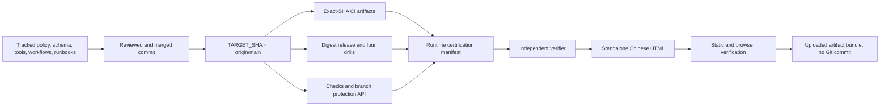

# Backend 95+ S6 Certification Implementation Plan

> **For agentic workers:** REQUIRED SUB-SKILL: Use superpowers:subagent-driven-development (recommended) or superpowers:executing-plans to implement this plan task-by-task. Steps use checkbox (`- [ ]`) syntax for tracking.

**Goal:** Certify one immutable backend commit with a branch-aware total coverage gate, seven deep-Module coverage gates, consolidated fault/security/resource evidence, exact-SHA GitHub and supply-chain proof, four production drills, a recomputed nine-module score of at least 95.0, and a standalone Chinese HTML certification artifact.

**Architecture:** S6 adds no product behavior. Tracked policy, schemas, scorecard, closure map, generators, verifiers, workflows, and runbooks are committed and reviewed first with a subject-neutral content-hash manifest; only after those inputs are merged is the resulting `main` commit selected as `TARGET_SHA`. A clean exact-SHA workflow gathers only uniquely identified trusted-main S0-S5 producer envelopes into a fresh run-unique `$RUNNER_TEMP` bundle root, recomputes every gate, and generates the manifest and HTML at runtime without writing inside the checkout. Neither artifact is committed, so a report never claims or embeds the SHA of a commit that contains the report itself. Squash/rebase of S6-only documentation remains content-eligible, but S5's separately evidenced producer and activation commits must remain distinct and reachable from `TARGET_SHA`.

**Tech Stack:** Python 3.13 standard library, pytest/pytest-cov/coverage.py, Ruff, uv, XML/JSON, Git, GitHub Checks/Actions/branch-protection APIs, Docker/OCI digests, SPDX, CycloneDX, Trivy, Cosign, GitHub provenance, Node.js, Playwright Chromium, semantic standalone HTML/CSS/JavaScript

## Global Constraints

- Start only after the S5 review gate accepts zero release blockers and retains exact-SHA CI, release, supply-chain, fresh-deploy, N-1 upgrade, restore, and rollback evidence.
- The certification subject is the final Task Space + FocusSession model, never the pre-integration backend: Space head `space_011_sync_clients_streaming`, Meta head `meta_002_active_session_locator`, catalog version `2` with exactly 31 entries, Dexie v19, no legacy `task`, `session`, `taskQuickNote`, `sessionQuickNote`, `/api/v1/tasks`, or `/api/v1/sessions` authority, active coordination classified clean-or-recoverable, and EffortProjection freshly verified. Every value is independently re-read from exact-SHA artifacts/runtime; any mismatch forces not-certified before score evaluation.
- All local PowerShell commands and Git pathspecs in this plan run from the repository root. Workflow snippets state their own working directory. Never depend on cwd inherited from another code block, and use only file-level `git -C . add -- ...` pathspecs.
- S6 is certification and documentation only. It may fix a verifier, workflow, test, or documentation contract, but a product-code failure reopens the owning S1-S5 wave; do not patch product behavior inside S6.
- The certification subject is the full 40-character commit selected only after every tracked S6 input has been committed, reviewed, and merged. The subject must be the fetched `origin/main` head used to dispatch the workflow.
- Tracked policy, schema, scorecard, closure map, generators, verifiers, workflows, package locks, and runbooks contain no `subject_sha` value. Runtime artifacts receive `TARGET_SHA` through an explicit argument.
- The manual workflow stages its complete evidence bundle at the fresh external root `$RUNNER_TEMP/backend-95plus-evidence-$TARGET_SHA-$GITHUB_RUN_ID-$GITHUB_RUN_ATTEMPT/bundle` and uploads it as `backend-95plus-certification-$TARGET_SHA`; the checkout stays at zero tracked, untracked, and ignored paths. The local Task 7 operator publishes the independently verified download to repository-relative ignored `.certification/$TARGET_SHA/` only after quarantine verification. No step stages or commits either runtime root.
- Downloaded `inputs/ci/**` and `inputs/release/**` are immutable evidence: after safe extraction the collector hashes them and marks them read-only. Certification reruns write only beneath `runtime/**`; no command may overwrite or normalize downloaded input bytes.
- Every producer record validates against the closed S0 `schema_version: "1.0"` envelope and contains one stable `evidence_id`, the same `subject_sha`, exact command/cwd/runtime/RFC 3339 timestamps/exit/result, artifact path/SHA-256/byte size, `trust_level`, confidence, modules, finding IDs, and certification tags. S6 joins only by exact ID and rejects partial records, extra keys, duplicate IDs across envelopes, filename/prose inference, tags, branches, and short SHAs.
- S5-owned `backend/app/audit/producer_contracts.py::PRODUCER_CONTRACTS` is the sole subject-neutral authority mapping every S5/S6 producer name to its envelope path, explicit artifact root, exact artifact-to-evidence-ID pairs, eligible trust levels, and workflow/event/ref/run binding. Its computed `S5_INPUT_PRODUCERS` excludes output-only `release`. The release contract independently owns `EV-RELEASE-BUNDLE -> release-artifact-index.json` and `EV-S5-HISTORY -> s5-history.json`. S6 imports both unchanged and rejects extension/shadowing. Collectors, matrix writers, the manifest builder, the independent verifier, tests, and the release-index verifier import this authority; no second filename/ID table or directory scan may infer producer ownership.
- The unchanged CI producer also owns `EV-CI-PXII-VFS-WHEEL-MANIFEST` and supplemental artifact `pxii-vfs-wheel-manifest-v1`; the unchanged supply-chain producer owns `EV-SUPPLY-PXII-VFS-RUNTIME`. Certification safely extracts and independently rehashes both Windows x64/Linux x86_64 wheels and extensions, source/native/toolchain/test/build/SQLite identities, then requires the installed Linux image extension to equal the manifest-selected Linux row. Certification dependency sync uses `--no-install-project`; it installs only that verified Linux wheel offline and rejects every project/native rebuild or platform-substitution path.
- Every evidence artifact is resolved again at consumption time with S0's semantic resolver and the `artifact_root` fixed by `PRODUCER_CONTRACTS`. Bundle-relative POSIX paths must remain regular files strictly contained after symlink resolution; absolute/drive/UNC/backslash/dot/parent paths and external URIs are forbidden in downloaded/runtime producer bundles. Hash and byte size are recomputed before read-only sealing, after runtime work, and during independent verification.
- The clean suite runs with `--runxfail --strict-config --strict-markers -W error`; zero critical expected failures means no critical behavior remains hidden behind `xfail`, skip, warning suppression, or a nonzero subprocess normalized to success.
- Total coverage is branch-aware and at least 90%. The certification verifier also requires total line rate and total branch rate each to be at least 90%.
- Each locked path group below has aggregate line coverage at least 95% and aggregate branch coverage at least 90%. Every literal path and every glob must match a measured source file.
- The authority group uses exactly `backend/app/auth/authority.py`, `backend/app/runtime/scope.py`, and `backend/app/ops/credentials.py`; no alternate authentication-authority path is accepted.
- Backend composite is derived only from the closed weighted criteria in `score-rubric.json`, evaluated before rounding, and must be at least 95.0; every module must be at least 90.0 and High confidence. `final-scorecard.json` contains module policy and computed-runtime slots, never pre-awarded dimensions or a target score. Missing evidence makes its owning criterion zero and may not be replaced by any stored score constant.
- Required GitHub checks are evaluated from the Checks API for `TARGET_SHA` by the exact tuple of context, GitHub App ID, workflow ID/path, eligible event/ref, run ID, and run attempt; duplicate, unknown-app/path/event, or ambiguous candidates fail. `Backend Certification / policy` is emitted only by `backend-certification-policy.yml` on a main-targeted PR or trusted-main push. The separate `backend-certification.yml` manual dispatch emits only `Backend Certification Run / certify` and is never eligible for the required policy context. Branch protection is compared as a complete normalized effective policy, including status-check App IDs, admin enforcement, pull-request reviews/code owners/dismissal and bypass allowances, restrictions, conversation/linear-history rules, force/deletion/block-creation controls, lock, and fork syncing. Missing fields fail closed. The current certification `certify` job is not made circularly responsible for observing its own final conclusion.
- Checks, Actions runs, and Actions artifacts are collected through every response page before filtering or uniqueness decisions. `per_page=100` without following pagination is invalid. The trusted image producer must be the one non-matrix, non-reusable first-attempt owner locked by S5; reruns are reuse-only. The release proof must follow `publish -> drills -> read-only release`, with job-level exact permissions and the S5 artifact-download pin `d3f86a106a0bac45b974a628896c90dbdf5c8093`.
- Every required-check workflow runs on every pull request targeting `main` and every push to `main`, without workflow-level `paths` or `paths-ignore`. Lightweight policy/conclusion jobs may skip expensive work internally, but all three stable required contexts must always report.
- The release image, two SBOMs, scan, signature, provenance, fresh deploy, fixed N-1 upgrade, independent restore, and rollback must all identify `TARGET_SHA` and the same immutable image digest.
- The fixed first-certification N-1 subject remains `1e4f0fc6d82ce6203f4bada0e84b518b16fcd97f`; S6 must hash and consume the unchanged S0 fixture.
- S6 tracked-input eligibility is content-based, not inherited from an earlier S6 implementation commit. `tracked-inputs.json` contains the exact path/hash set and aggregate hash of every reviewed tracked certification input except itself, including the complete S1 native/runtime/build/test closure plus the S5 native manifest schema/verifier; every operator/workflow shell recomputes that content from `TARGET_SHA` with `git show` and rejects drift. This does not replace the S5 release-history gate: the producer commit and its isolated activation descendant must both remain reachable from `TARGET_SHA`, and their recorded ancestry/diff allowlist is reverified as release evidence. The collector and manifest verifier require canonical `s5-history.json`, independently derive the unique identities from target Git objects, recheck both ancestry relations and exact diffs, and rehash the complete activation-parent producer path closure before accepting `EV-S5-HISTORY`. Squash/rebase is supported only for S6-only changes whose exact content remains equal; squashing the S5 pair is ineligible.
- The tracked-input path set is exact equality to one reviewed `EXPECTED_TRACKED_INPUTS` tuple, not a minimum count or glob. Local certification tools execute from a detached clean worktree at `TARGET_SHA` inside a run-scoped Python environment synchronized with `uv.lock --frozen`; Git/GitHub CLI/Python/uv/Node/npm/Chromium identities and installed-distribution hashes verify against `toolchain-lock.json`. The workflow and every Task 7 shell independently hash the target Python executable with an OS primitive before its first invocation; every Task 7 shell also binds and rehashes Git/GitHub CLI before authority-bearing use, then checks detached HEAD, tracked diff, manifest hash, source-tool receipt, and platform-specific runtime-tool receipt before invoking a verifier. A mutable primary-worktree script, venv, Node installation, browser, Git, or GitHub CLI can never validate the target.
- The final report is a single Chinese HTML file with inline CSS/JavaScript, no remote resource or automatic network-capable code, semantic sections, keyboard access, visible focus, reduced-motion handling, print support, and verified 1440, 1024, 768, and 390 px layouts. Escaped GitHub run URLs may appear as plain text or explicit `https://github.com/...` anchors; they are not fetched during verification.
- Do not delete or modify existing untracked files, retained test artifacts, the planning HTML, or the 2026-07-13 audit report.

---

## File Responsibility Map

### Tracked certification policy

- Create `backend/audit/95plus/certification-policy.json`: exact branch, required checks, artifact names, thresholds, drill stages, documentation paths, and fail-closed caps.
- Create `backend/audit/95plus/certification.schema.json`: closed runtime manifest schema; it never contains a concrete subject.
- Create `backend/audit/95plus/coverage-groups.json`: the seven locked path groups and their 95/90 thresholds.
- Create `backend/audit/95plus/final-scorecard.json`: nine module policies, High-confidence requirements, required evidence classes, and no pre-awarded score.
- Create `backend/audit/95plus/score-rubric.json`: closed four-criterion-per-dimension weighted rubric from verified predicates to raw 0..20 dimensions.
- Create `backend/audit/95plus/closure-map.json`: P0-01 through P0-07 and P1-01 through P1-13 mapped to machine-verifiable evidence tags.
- Create `backend/audit/95plus/evidence-bindings.json`: subject-neutral mapping from stable S0 evidence IDs to certification tags, evidence classes, modules, and finding IDs.
- Create `backend/audit/95plus/certification-matrix.json`: exact fault, security, and resource commands and their required receipts.
- Create `backend/audit/95plus/branch-protection.json`: complete normalized protected-`main` configuration with exact required check contexts and GitHub App IDs.
- Create `backend/audit/95plus/toolchain-lock.json`: reviewed Windows/Linux identities and SHA-256 values for Git, GitHub CLI, uv, Python, Node, npm, Playwright Chromium, plus allowed locked Python/Node distributions.
- Create `backend/audit/95plus/tracked-inputs.json`: subject-neutral exact path/SHA-256 map plus aggregate content hash for all reviewed certification inputs; it excludes only itself and runtime output.

### Certification core

- Consume unchanged `backend/app/audit/producer_contracts.py`: S5's frozen complete S5/S6 producer authority; S6 never rewrites or extends it.
- Create `backend/app/certification/__init__.py`: export only stable certification data types and verifier entry points.
- Create `backend/app/certification/contracts.py`: frozen evidence, coverage, score, finding, drill, and summary records.
- Create `backend/app/certification/coverage.py`: parse coverage XML and aggregate literal/glob path groups.
- Create `backend/app/certification/matrices.py`: execute or verify the three consolidated matrix receipts without `shell=True`.
- Create `backend/app/certification/github.py`: normalize exact-SHA check runs, workflow runs, artifacts, and branch protection.
- Create `backend/app/certification/manifest.py`: load all retained evidence, reject mixed subjects/digests, recompute scores/caps, and write canonical JSON.
- Create `backend/scripts/certification/run_matrix.py`: CLI for one named matrix and its JUnit/resource receipt.
- Create `backend/scripts/certification/verify_coverage.py`: CLI for total and path-group coverage gates.
- Create `backend/scripts/certification/collect_github_evidence.py`: read-only GitHub API collector and path-safe artifact downloader.
- Create `backend/scripts/certification/build_manifest.py`: assemble canonical runtime manifest from verified inputs.
- Create `backend/scripts/certification/verify_certification.py`: independent fail-closed manifest verifier.
- Create `backend/scripts/certification/render_certification_html.py`: render a standalone Chinese report only from a verified manifest.
- Create `backend/scripts/certification/tracked_inputs.py`: generate and verify tracked-input content hashes from the worktree or an exact Git subject without ancestry assumptions.

### Verification, workflows, and documentation

- Create `backend/tests/test_certification_policy.py`: policy/schema/score/closure/path contract tests.
- Create `backend/tests/test_certification_coverage.py`: coverage XML aggregation and threshold tests.
- Create `backend/tests/test_certification_matrices.py`: command safety and matrix receipt tests.
- Create `backend/tests/test_certification_manifest.py`: subject/digest/check/drill/score/cap tamper tests.
- Create `backend/tests/test_certification_report.py`: deterministic render and static report contract tests.
- Create `backend/tests/fixtures/certification/build_report_fixture.py`: deterministic external-temp manifest/report fixture generator; it creates no tracked runtime output.
- Create `backend/tests/test_certification_docs.py`: documentation command/link/staleness tests.
- Create `scripts/audit-report/verify-backend-95-certification.cjs`: static and Playwright verifier for a caller-supplied manifest/HTML pair.
- Create `scripts/audit-report/package.json` and `scripts/audit-report/package-lock.json`: exact Playwright runtime used by local and CI browser checks.
- Modify `.github/workflows/ci.yml`: stable `Backend CI / backend` required check and exact-SHA artifact name.
- Modify `.github/workflows/backend-release.yml`: stable `Backend Release / release` required check plus exact-SHA supply-chain and drill artifact bundle.
- Create `.github/workflows/backend-certification-policy.yml`: required `policy` job for every main-targeted PR and trusted-main push.
- Create `.github/workflows/backend-certification.yml`: manual `workflow_dispatch` runtime `certify` job with a distinct non-required context.
- Modify `.gitignore`: ignore only root `/.certification/`.
- Modify `README.md`: remove stale counts/percentages and document exact certification and protocol state.
- Modify `backend/DEPLOY.md`: point digest deploy/upgrade to certification artifacts and exact commands.
- Modify `backend/docs/runbooks/recovery.md`: align snapshot, staged restore, cutover, verification, and rollback evidence.
- Modify `backend/docs/runbooks/incident.md`: align P0 escalation, `FAILED_MANUAL`, evidence capture, and certification invalidation.

### Runtime-only artifacts

The workflow creates these logical bundle paths beneath external `$ROOT="$EVIDENCE_ROOT/bundle"`; none is inside the checkout or tracked:

```text
inputs/ci/ci-evidence.json
inputs/ci/junit.xml
inputs/ci/coverage.xml
inputs/ci/build-provenance.json
inputs/release/supply-chain-evidence.json
inputs/release/n-minus-one-evidence.json
inputs/release/fresh-deploy-evidence.json
inputs/release/release-evidence.json
inputs/release/release-artifact-index.json
inputs/release/s5-history.json
inputs/release/fresh-deploy-drill.json
inputs/release/n-minus-one-drill.json
runtime/full-junit.xml
runtime/coverage.xml
runtime/backend.jsonl
matrices/fault-junit.xml
matrices/security-junit.xml
matrices/resource-junit.xml
matrices/fault-receipt.json
matrices/security-receipt.json
matrices/resource-receipt.json
matrices/fault-evidence.json
matrices/security-evidence.json
matrices/resource-evidence.json
matrices/sync-snapshot-measurement.json
matrices/sync-snapshot-time.txt
matrices/sync-pull-measurement.json
matrices/sync-pull-time.txt
matrices/matrix-evidence.json
ci-coverage-summary.json
coverage-summary.json
github-evidence.json
certification-manifest.json
PomodoroXII-后端95Plus认证-$TARGET_SHA.html
report-verification.json
artifact-index.json
source-tool-integrity.json
runtime-tool-integrity.json
```

Task 7 additionally creates ignored operator state at `.certification/target-selection.json`, `.certification/live-selection-preflight.json`, `.certification/operator/$TARGET_SHA/$OPERATOR_RUN_ID/`, `.certification/quarantine/$TARGET_SHA-$OPERATOR_RUN_ID/`, and the registered detached worktree `.certification/tool-worktrees/$TARGET_SHA/`. Operator receipts/runtimes and quarantine are outside `.certification/$TARGET_SHA/`, the fresh final bundle destination. The detached worktree is tooling only: it is never copied into the subject artifact bundle, uploaded, indexed as evidence, or used as a writable output root.

## Locked Interfaces And Artifact Flow

```python
def verify_coverage(
    coverage_xml: Path, groups_path: Path
) -> CoverageSummary: ...

def verify_matrix_receipts(
    policy_path: Path, evidence_root: Path, subject_sha: str
) -> tuple[MatrixReceipt, ...]: ...

def collect_github_evidence(
    repository: str, branch: str, subject_sha: str, token: str, output_root: Path
) -> GithubEvidence: ...

def verify_s5_history(
    repo_root: Path, subject_sha: str, receipt_path: Path
) -> S5HistoryReceipt: ...

def build_manifest(
    repo_root: Path, evidence_root: Path, subject_sha: str
) -> CertificationManifest: ...

def verify_manifest(
    repo_root: Path, manifest_path: Path
) -> CertificationSummary: ...

def render_html(manifest: CertificationManifest, output: Path) -> None: ...
```



### Task 1: Lock Certification Policy, Producer Authority, Coverage Groups, Scores, Findings, And Branch Protection

**Files:**
- Create: `backend/audit/95plus/certification-policy.json`
- Create: `backend/audit/95plus/certification.schema.json`
- Create: `backend/audit/95plus/coverage-groups.json`
- Create: `backend/audit/95plus/final-scorecard.json`
- Create: `backend/audit/95plus/score-rubric.json`
- Create: `backend/audit/95plus/closure-map.json`
- Create: `backend/audit/95plus/evidence-bindings.json`
- Create: `backend/audit/95plus/certification-matrix.json`
- Create: `backend/audit/95plus/branch-protection.json`
- Create: `backend/tests/test_certification_policy.py`
- Consume unchanged: `backend/app/audit/producer_contracts.py`

**Interfaces:**
- Consumes: S0 `evidence.schema.json`, `score-policy.json`, `baseline.json`; approved S1-S5 file/artifact contracts; and S5's complete frozen artifact semantics in `PRODUCER_CONTRACTS`.
- Produces: subject-neutral closed policy/rubric/binding inputs, an exact final-model predicate, and tests. Scores are derived from verified rubric predicates; bindings copy producer modules/findings/tags exactly and add only reviewed evidence classes. S6 cannot extend producer authority or use a second lookup table.

- [ ] **Step 1: Write failing policy identity and arithmetic tests**

Create `backend/tests/test_certification_policy.py`:

```python
from __future__ import annotations

import json
from decimal import Decimal
from pathlib import Path

ROOT = Path(__file__).resolve().parents[1]
AUDIT = ROOT / "audit" / "95plus"


def load(name: str) -> dict:
    return json.loads((AUDIT / name).read_text(encoding="utf-8"))


def test_s6_consumes_the_complete_s5_producer_authority_unchanged() -> None:
    from app.audit.producer_contracts import PRODUCER_CONTRACTS, S5_INPUT_PRODUCERS

    assert tuple(PRODUCER_CONTRACTS) == (
        "ci", "supply_chain", "n_minus_one", "fresh_deploy", "release",
        "matrix_fault", "matrix_security", "matrix_resource",
    )
    assert tuple(PRODUCER_CONTRACTS["matrix_resource"].evidence_ids) == (
        "EV-RESOURCE-MATRIX", "EV-SYNC-PULL-MEASUREMENT",
    )
    assert PRODUCER_CONTRACTS["ci"].evidence_ids[-1] == "EV-CI-PXII-VFS-WHEEL-MANIFEST"
    assert PRODUCER_CONTRACTS["supply_chain"].evidence_ids[-1] == "EV-SUPPLY-PXII-VFS-RUNTIME"
    assert PRODUCER_CONTRACTS["ci"].supplemental_artifact_name_templates == (
        "pxii-vfs-wheel-manifest-v1",
    )
    assert all(contract.wave == "S5" for contract in tuple(PRODUCER_CONTRACTS.values())[:5])
    assert all(contract.wave == "S6" for contract in tuple(PRODUCER_CONTRACTS.values())[5:])
    assert S5_INPUT_PRODUCERS == ("ci", "supply_chain", "n_minus_one", "fresh_deploy")
    assert "release" not in S5_INPUT_PRODUCERS


def test_policy_certifies_only_the_final_task_space_model() -> None:
    policy = load("certification-policy.json")
    assert policy["final_model"] == {
        "space_head": "space_011_sync_clients_streaming",
        "meta_head": "meta_002_active_session_locator",
        "catalog_version": "2",
        "catalog_count": 31,
        "dexie_version": 19,
        "active_session_coordination": "clean_or_recoverable",
        "effort_projection": "verified",
        "forbidden_entity_keys": [
            "task", "session", "taskQuickNote", "sessionQuickNote",
        ],
        "forbidden_paths": ["/api/v1/tasks", "/api/v1/sessions"],
    }


def test_coverage_groups_are_exact_and_subject_neutral() -> None:
    groups = load("coverage-groups.json")
    assert groups == {
        "schema_version": "1.0",
        "thresholds": {"line_percent": 95.0, "branch_percent": 90.0},
        "groups": {
            "authority": [
                "app/auth/authority.py",
                "app/runtime/scope.py",
                "app/ops/credentials.py",
            ],
            "migration_space": [
                "app/db/migrations.py",
                "app/file_system/index_schema.py",
                "app/runtime/space.py",
            ],
            "lease": ["app/runtime/leases.py", "app/runtime/durability.py"],
            "mutation": [
                "app/mutation/*.py",
                "app/commands/entity.py",
                "app/knowledge/*.py",
            ],
            "sync": ["app/sync/*.py"],
            "recovery": ["app/recovery/*.py"],
            "ops": ["app/ops/signals.py"],
        },
    }
    assert "subject_sha" not in json.dumps(groups)
    assert groups["groups"]["authority"] == [
        "app/auth/authority.py",
        "app/runtime/scope.py",
        "app/ops/credentials.py",
    ]


def test_scorecard_has_no_preawarded_score_and_rubric_is_complete() -> None:
    card = load("final-scorecard.json")
    rubric = load("score-rubric.json")
    assert tuple(rubric["dimensions"]) == (
        "completeness", "integrity", "verification", "operability", "maintainability"
    )
    assert len(rubric["criteria"]) == 9 * 5 * 4
    for module in card["modules"]:
        assert "dimensions" not in module
        assert "target_composite" not in module
        assert module["required_confidence"] == "high"
        assert set(module["required_evidence"]) >= {
            "source", "test", "runtime", "recovery", "delivery"
        }
        rows = [row for row in rubric["criteria"] if row["module_id"] == module["module_id"]]
        assert len(rows) == 20
        assert all(row["weight"] == 5 for row in rows)
        for dimension in rubric["dimensions"]:
            assert sum(row["weight"] for row in rows if row["dimension"] == dimension) == 20


def derive_scores(
    rubric: dict, missing: set[tuple[str, str, str]]
) -> tuple[dict[str, Decimal], Decimal]:
    module_scores: dict[str, Decimal] = {}
    for module_id in rubric["modules"]:
        rows = [row for row in rubric["criteria"] if row["module_id"] == module_id]
        module_scores[module_id] = sum(
            (Decimal(row["weight"]) for row in rows
             if (module_id, row["dimension"], row["criterion_id"]) not in missing),
            Decimal(0),
        )
    backend = sum(module_scores.values(), Decimal(0)) / Decimal(len(module_scores))
    return module_scores, backend


def test_scores_are_derived_and_missing_proof_loses_points() -> None:
    rubric = load("score-rubric.json")
    full_modules, full_backend = derive_scores(rubric, set())
    assert set(full_modules.values()) == {Decimal(100)}
    reduced_modules, reduced_backend = derive_scores(
        rubric, {("sync_pull_recovery", "verification", "branch_coverage")}
    )
    assert reduced_modules["sync_pull_recovery"] == Decimal(95)
    assert reduced_backend < full_backend
    failing_modules, _ = derive_scores(rubric, {
        ("mcp", "integrity", "fail_closed_invariants"),
        ("mcp", "integrity", "recovery_security_integrity"),
        ("mcp", "verification", "branch_coverage"),
    })
    assert failing_modules["mcp"] == Decimal(85)
    assert failing_modules["mcp"] < Decimal(
        load("certification-policy.json")["thresholds"]["module_composite_minimum"]
    )


def test_policy_locks_checks_drills_thresholds_and_zero_blockers() -> None:
    policy = load("certification-policy.json")
    assert policy["target_branch"] == "main"
    assert policy["required_checks"] == [
        {"context": "Backend CI / backend", "app_id": 15368, "workflow_path": ".github/workflows/ci.yml", "job": "backend", "event": "push", "ref": "refs/heads/main"},
        {"context": "Backend Release / release", "app_id": 15368, "workflow_path": ".github/workflows/backend-release.yml", "job": "release", "event": "push", "ref": "refs/heads/main"},
        {"context": "Backend Certification / policy", "app_id": 15368, "workflow_path": ".github/workflows/backend-certification-policy.yml", "job": "policy", "event": "push", "ref": "refs/heads/main"},
    ]
    assert policy["required_drills"] == [
        "fresh_volume_deploy",
        "n_minus_one_upgrade",
        "independent_full_restore",
        "n_minus_one_rollback",
    ]
    assert policy["thresholds"] == {
        "backend_composite_minimum": 95.0,
        "module_composite_minimum": 90.0,
        "total_line_percent_minimum": 90.0,
        "total_branch_percent_minimum": 90.0,
        "group_line_percent_minimum": 95.0,
        "group_branch_percent_minimum": 90.0,
        "p0_open_maximum": 0,
        "release_blocker_maximum": 0,
        "critical_xfail_maximum": 0,
    }


def test_closure_map_is_complete_and_branch_protection_is_exact() -> None:
    closures = load("closure-map.json")
    assert [item["finding_id"] for item in closures["findings"]] == [
        *(f"P0-{index:02d}" for index in range(1, 8)),
        *(f"P1-{index:02d}" for index in range(1, 14)),
    ]
    assert all(item["required_evidence_tags"] for item in closures["findings"])
    protection = load("branch-protection.json")
    required = protection["required_status_checks"]
    assert required["strict"] is True
    assert required["checks"] == [
        {"context": item["context"], "app_id": item["app_id"]}
        for item in load("certification-policy.json")["required_checks"]
    ]
    assert protection["enforce_admins"] is True
    reviews = protection["required_pull_request_reviews"]
    assert reviews["required_approving_review_count"] == 1
    assert reviews["dismiss_stale_reviews"] is True
    assert reviews["require_code_owner_reviews"] is True
    assert reviews["require_last_push_approval"] is True
    assert reviews["dismissal_restrictions"] == {"users": [], "teams": [], "apps": []}
    assert reviews["bypass_pull_request_allowances"] == {"users": [], "teams": [], "apps": []}
    assert protection["restrictions"] is None
    assert protection["allow_force_pushes"] is False
    assert protection["allow_deletions"] is False
    assert protection["block_creations"] is True
    assert protection["lock_branch"] is False
    assert protection["allow_fork_syncing"] is False


def test_evidence_bindings_close_every_tag_and_required_class() -> None:
    from app.audit.producer_contracts import PRODUCER_CONTRACTS

    bindings = load("evidence-bindings.json")["bindings"]
    expected_classes = {
        "EV-CI-JUNIT": ("test",),
        "EV-CI-COVERAGE": ("test",),
        "EV-CI-LOG": ("runtime",),
        "EV-CI-SUBJECT": ("source",),
        "EV-CI-IMAGE-DIGEST": ("delivery",),
        "EV-CI-PROVENANCE": ("source", "delivery"),
        "EV-CI-PXII-VFS-WHEEL-MANIFEST": ("source", "test", "delivery"),
        "EV-SUPPLY-IMAGE-DIGEST": ("delivery",),
        "EV-SUPPLY-PROVENANCE": ("source", "delivery"),
        "EV-SUPPLY-SBOM-SPDX": ("source", "security"),
        "EV-SUPPLY-SBOM-CYCLONEDX": ("source", "security"),
        "EV-SUPPLY-SCAN": ("security",),
        "EV-SUPPLY-SIGNATURE": ("delivery", "security"),
        "EV-SUPPLY-PXII-VFS-RUNTIME": ("runtime", "delivery", "security"),
        "EV-N-MINUS-ONE-DRILL": ("runtime", "recovery", "delivery"),
        "EV-FRESH-VOLUME-DEPLOY": ("runtime", "delivery"),
        "EV-RELEASE-BUNDLE": ("recovery", "delivery"),
        "EV-S5-HISTORY": ("source", "delivery"),
        "EV-MUTATION-FAULT-MATRIX": ("test", "recovery"),
        "EV-SECURITY-MATRIX": ("test", "security"),
        "EV-RESOURCE-MATRIX": ("test", "runtime", "performance"),
        "EV-SYNC-PULL-MEASUREMENT": ("runtime", "performance"),
    }
    artifacts = {
        artifact.evidence_id: artifact
        for contract in PRODUCER_CONTRACTS.values()
        for artifact in contract.artifacts
    }
    assert tuple(item["evidence_id"] for item in bindings) == tuple(expected_classes)
    assert set(artifacts) == set(expected_classes)
    for item in bindings:
        artifact = artifacts[item["evidence_id"]]
        assert item["classes"] == list(expected_classes[item["evidence_id"]])
        assert item["tags"] == list(artifact.certification_tags)
        assert item["modules"] == list(artifact.modules)
        assert item["finding_ids"] == list(artifact.finding_ids)
    closures = load("closure-map.json")["findings"]
    required_pairs = {
        (item["finding_id"], tag)
        for item in closures
        for tag in item["required_evidence_tags"]
    }
    bound_pairs = {
        (finding_id, tag)
        for item in bindings
        for finding_id in item["finding_ids"]
        for tag in item["tags"]
    }
    assert required_pairs <= bound_pairs
    for finding_id, required_tag in required_pairs:
        matches = [
            item for item in bindings
            if finding_id in item["finding_ids"] and required_tag in item["tags"]
        ]
        assert matches, (finding_id, required_tag)
    for module in load("final-scorecard.json")["modules"]:
        classes = {
            evidence_class for item in bindings
            if module["module_id"] in item["modules"]
            for evidence_class in item["classes"]
        }
        assert set(module["required_evidence"]) <= classes
```

- [ ] **Step 2: Run the tests and verify the missing-policy failure**

Run from the repository root:

```powershell
.\backend\.venv\Scripts\python.exe -m pytest -q backend/tests/test_certification_policy.py -p no:cacheprovider
```

Expected: FAIL with `FileNotFoundError` for `audit/95plus/coverage-groups.json`; no runtime artifact is created.

- [ ] **Step 3: Add the exact policy, groups, and scorecard**

Create `coverage-groups.json` with the exact object asserted above. Create `final-scorecard.json` with this module order and policy only; it contains no dimensions, composite, or target score:

```json
{
  "schema_version": "1.0",
  "modules": [
    {"module_id":"runtime_auth","required_confidence":"high","required_evidence":["source","test","runtime","recovery","delivery","security"]},
    {"module_id":"migration_space_lifecycle","required_confidence":"high","required_evidence":["source","test","runtime","recovery","delivery"]},
    {"module_id":"registry_meta","required_confidence":"high","required_evidence":["source","test","runtime","recovery","delivery"]},
    {"module_id":"entity_commands","required_confidence":"high","required_evidence":["source","test","runtime","recovery","delivery"]},
    {"module_id":"sync_push","required_confidence":"high","required_evidence":["source","test","runtime","recovery","delivery","performance"]},
    {"module_id":"sync_pull_recovery","required_confidence":"high","required_evidence":["source","test","runtime","recovery","delivery","performance"]},
    {"module_id":"notes_fs","required_confidence":"high","required_evidence":["source","test","runtime","recovery","delivery"]},
    {"module_id":"deploy_operations","required_confidence":"high","required_evidence":["source","test","runtime","recovery","delivery","security"]},
    {"module_id":"mcp","required_confidence":"high","required_evidence":["source","test","runtime","recovery","delivery","security"]}
  ]
}
```

`score-rubric.json` literally enumerates 180 rows: four five-point criteria for each of five dimensions for each of the nine modules. No default, wildcard, generated row, caller score, or stored dimension is accepted. The criterion IDs are fixed by dimension:

```text
completeness: tracked_source_complete, public_contract_complete, finding_pairs_closed, required_artifacts_complete
integrity: fail_closed_invariants, cross_store_faults_pass, subject_digest_identity, recovery_security_integrity
verification: line_coverage, branch_coverage, required_test_layers, independent_tamper_verifier
operability: runtime_observability, production_drill, resource_bounds, operator_runbook
maintainability: sole_authority, static_lock_gate, exact_tracked_inputs, detached_toolchain
```

Each literal row has exactly `module_id,dimension,criterion_id,weight=5,predicate,evidence_classes,required_tags`. Its predicate names one closed verifier result; its classes/tags are nonempty subsets of that module's exact bindings. A passed row contributes five, a failed/missing/ambiguous row contributes zero, and no partial credit exists. Dimension score is the four row weights, module composite is the five unrounded dimension sums, and backend composite is the unrounded mean. High confidence additionally requires every `required_evidence` class, so a numeric score cannot compensate for a missing class. Tests delete and misbind each row in turn and require the computed score/certification decision to change.

`certification-policy.json` contains the tested thresholds/checks/drills plus these exact artifact contracts:

```json
{
  "schema_version": "1.0",
  "target_branch": "main",
  "required_checks": [
    {"context":"Backend CI / backend","app_id":15368,"workflow_path":".github/workflows/ci.yml","job":"backend","event":"push","ref":"refs/heads/main"},
    {"context":"Backend Release / release","app_id":15368,"workflow_path":".github/workflows/backend-release.yml","job":"release","event":"push","ref":"refs/heads/main"},
    {"context":"Backend Certification / policy","app_id":15368,"workflow_path":".github/workflows/backend-certification-policy.yml","job":"policy","event":"push","ref":"refs/heads/main"}
  ],
  "required_artifacts": ["backend-ci", "backend-release"],
  "required_supply_chain": ["image_digest", "sbom_spdx", "sbom_cyclonedx", "scan", "signature", "provenance"],
  "required_drills": ["fresh_volume_deploy", "n_minus_one_upgrade", "independent_full_restore", "n_minus_one_rollback"],
  "required_documents": ["README.md", "backend/DEPLOY.md", "backend/docs/runbooks/recovery.md", "backend/docs/runbooks/incident.md"],
  "thresholds": {
    "backend_composite_minimum": 95.0,
    "module_composite_minimum": 90.0,
    "total_line_percent_minimum": 90.0,
    "total_branch_percent_minimum": 90.0,
    "group_line_percent_minimum": 95.0,
    "group_branch_percent_minimum": 90.0,
    "p0_open_maximum": 0,
    "release_blocker_maximum": 0,
    "critical_xfail_maximum": 0
  },
  "n_minus_one_sha": "1e4f0fc6d82ce6203f4bada0e84b518b16fcd97f"
}
```

- [ ] **Step 4: Add complete closure, producer-authority, matrix, branch-protection, and schema contracts**

`closure-map.json` lists every finding in order. Use these nonempty tag sets; the runtime verifier requires every tag to resolve to a passed exact-SHA evidence record:

```json
{
  "schema_version":"1.0",
  "findings":[
    {"finding_id":"P0-01","required_evidence_tags":["knowledge_atomicity","projection_rebuild"]},
    {"finding_id":"P0-02","required_evidence_tags":["mutation_fault_matrix","restart_recovery"]},
    {"finding_id":"P0-03","required_evidence_tags":["mcp_authorization","space_containment"]},
    {"finding_id":"P0-04","required_evidence_tags":["legacy_cursor_fail_closed","opaque_cursor_paging","sync_pull_measurement"]},
    {"finding_id":"P0-05","required_evidence_tags":["catalog_ledger_exactly_once","trash_ledger"]},
    {"finding_id":"P0-06","required_evidence_tags":["full_snapshot","independent_full_restore","n_minus_one_rollback"]},
    {"finding_id":"P0-07","required_evidence_tags":["credential_policy","credential_concurrency"]},
    {"finding_id":"P1-01","required_evidence_tags":["named_alembic_only"]},
    {"finding_id":"P1-02","required_evidence_tags":["authoritative_space_path"]},
    {"finding_id":"P1-03","required_evidence_tags":["wal_durable_migration","fenced_replace"]},
    {"finding_id":"P1-04","required_evidence_tags":["entity_invariants","entity_cas"]},
    {"finding_id":"P1-05","required_evidence_tags":["compiled_catalog"]},
    {"finding_id":"P1-06","required_evidence_tags":["index_store_schema"]},
    {"finding_id":"P1-07","required_evidence_tags":["client_ack_waterline"]},
    {"finding_id":"P1-08","required_evidence_tags":["mcp_sync_parity"]},
    {"finding_id":"P1-09","required_evidence_tags":["operational_probes","bounded_metrics"]},
    {"finding_id":"P1-10","required_evidence_tags":["ci_artifact_lifecycle"]},
    {"finding_id":"P1-11","required_evidence_tags":["immutable_supply_chain","producer_before_activation"]},
    {"finding_id":"P1-12","required_evidence_tags":["digest_deploy","fresh_volume_deploy","n_minus_one_rollback"]},
    {"finding_id":"P1-13","required_evidence_tags":["documentation_contract"]}
  ]
}
```

`evidence-bindings.json` is the only vocabulary bridge from S0's closed evidence envelope to S6 evidence classes. It contains no subject SHA and uses this closed shape; `tags`, `modules`, and `finding_ids` must be byte-for-byte array-equal to the matching S5 `ProducerArtifactContract` rather than authored again:

```json
{
  "schema_version": "1.0",
  "bindings": [
    {
      "evidence_id": "EV-MUTATION-FAULT-MATRIX",
      "tags": ["knowledge_atomicity", "projection_rebuild", "mutation_fault_matrix", "restart_recovery", "catalog_ledger_exactly_once", "trash_ledger", "wal_durable_migration", "fenced_replace", "entity_invariants", "entity_cas", "compiled_catalog", "index_store_schema"],
      "classes": ["test", "recovery"],
      "modules": ["migration_space_lifecycle", "registry_meta", "entity_commands", "sync_push", "notes_fs"],
      "finding_ids": ["P0-01", "P0-02", "P0-05", "P1-03", "P1-04", "P1-05", "P1-06"]
    }
  ]
}
```

The binding file has exactly these 22 IDs in this order and these exact nonempty class arrays; there is no “fill the rest” implementation choice:

| evidence_id | classes |
|---|---|
| `EV-CI-JUNIT` | `test` |
| `EV-CI-COVERAGE` | `test` |
| `EV-CI-LOG` | `runtime` |
| `EV-CI-SUBJECT` | `source` |
| `EV-CI-IMAGE-DIGEST` | `delivery` |
| `EV-CI-PROVENANCE` | `source,delivery` |
| `EV-CI-PXII-VFS-WHEEL-MANIFEST` | `source,test,delivery` |
| `EV-SUPPLY-IMAGE-DIGEST` | `delivery` |
| `EV-SUPPLY-PROVENANCE` | `source,delivery` |
| `EV-SUPPLY-SBOM-SPDX` | `source,security` |
| `EV-SUPPLY-SBOM-CYCLONEDX` | `source,security` |
| `EV-SUPPLY-SCAN` | `security` |
| `EV-SUPPLY-SIGNATURE` | `delivery,security` |
| `EV-SUPPLY-PXII-VFS-RUNTIME` | `runtime,delivery,security` |
| `EV-N-MINUS-ONE-DRILL` | `runtime,recovery,delivery` |
| `EV-FRESH-VOLUME-DEPLOY` | `runtime,delivery` |
| `EV-RELEASE-BUNDLE` | `recovery,delivery` |
| `EV-S5-HISTORY` | `source,delivery` |
| `EV-MUTATION-FAULT-MATRIX` | `test,recovery` |
| `EV-SECURITY-MATRIX` | `test,security` |
| `EV-RESOURCE-MATRIX` | `test,runtime,performance` |
| `EV-SYNC-PULL-MEASUREMENT` | `runtime,performance` |

For each row, the implementation looks up the unique artifact contract by ID and copies its exact tags/modules/finding IDs. Tests compare all 22 complete objects, not just ID sets; any unknown/missing/extra/reordered ID or semantic mismatch fails. The two native IDs are independently mandatory: their shared tags cannot allow one record to substitute for the other. `EV-S5-HISTORY` is copied from the S5 release contract, binds `producer_before_activation`, and can pass only after the receipt is independently rederived from the target history/tree/diffs. The pull row binds S5-owned `opaque_cursor_paging` and `sync_pull_measurement` for `P0-04` to fresh `512 x 256 KiB` evidence, its RSS log, and heap test. `build_manifest()` joins passed records only by exact globally unique ID, requires binding semantics equal both producer contract and underlying record, and enforces trust eligibility. For every closure item it iterates every required tag and requires one eligible passed binding carrying that same finding ID and tag; a global tag union cannot close a pair. Classes are the only S6-added vocabulary and are checked against the table above plus per-module required-class coverage. Nothing is inferred from filename, command substring, or prose.

S6 never defines `PRODUCER_CONTRACTS`. It imports the S5-owned frozen mapping and locks the already reserved entries without reconstructing their values:

```python
from app.audit.producer_contracts import PRODUCER_CONTRACTS, S5_INPUT_PRODUCERS

assert tuple(PRODUCER_CONTRACTS) == (
    "ci", "supply_chain", "n_minus_one", "fresh_deploy", "release",
    "matrix_fault", "matrix_security", "matrix_resource",
)
assert PRODUCER_CONTRACTS["matrix_fault"].envelope_path == "matrices/fault-evidence.json"
assert PRODUCER_CONTRACTS["matrix_security"].evidence_ids == ("EV-SECURITY-MATRIX",)
assert PRODUCER_CONTRACTS["matrix_resource"].evidence_ids == (
    "EV-RESOURCE-MATRIX", "EV-SYNC-PULL-MEASUREMENT",
)
assert PRODUCER_CONTRACTS["release"].evidence_by_artifact == (
    ("release-artifact-index.json", "EV-RELEASE-BUNDLE"),
    ("s5-history.json", "EV-S5-HISTORY"),
)
assert PRODUCER_CONTRACTS["ci"].evidence_by_artifact[-1] == (
    "pxii-vfs/pxii-vfs-wheel-manifest.json", "EV-CI-PXII-VFS-WHEEL-MANIFEST",
)
assert PRODUCER_CONTRACTS["supply_chain"].evidence_by_artifact[-1] == (
    "pxii-vfs-runtime-extension.json", "EV-SUPPLY-PXII-VFS-RUNTIME",
)
assert PRODUCER_CONTRACTS["ci"].supplemental_artifact_name_templates == (
    "pxii-vfs-wheel-manifest-v1",
)
assert S5_INPUT_PRODUCERS == ("ci", "supply_chain", "n_minus_one", "fresh_deploy")
assert "release" not in S5_INPUT_PRODUCERS
```

S5's `ProducerContract` carries exact workflow/event/ref/run fields and each artifact's path/ID/modules/findings/tags for all eight entries. S6 tests assert every frozen value, exact key order, `wave == "S6"` for matrix entries, no duplicate ownership, and exact equality between envelopes, bindings, and this mapping. Collector, matrix writer, builder, verifier, release-index verifier, and fixtures import it directly; assignment, extension, parallel semantic constants, or filename scans are forbidden.

`certification-matrix.json` defines three exact argv arrays, never shell strings:

```json
{
  "schema_version":"1.0",
  "matrices":{
    "fault":{"pytest_paths":["tests/test_migration_wal_durability.py","tests/test_runtime_leases.py","tests/test_mutation_recovery.py","tests/test_note_workspace_atomicity.py","tests/test_recovery.py","tests/test_space_relocation.py"]},
    "security":{"pytest_paths":["tests/test_security_policy.py","tests/test_auth_concurrency.py","tests/test_mcp_authorization.py","tests/test_space_path_containment.py","tests/test_sync_legacy_fail_closed.py","tests/test_operational_endpoints.py","tests/test_prod_hardening.py"]},
    "resource":{"pytest_paths":["tests/test_sync_snapshot_streaming.py","tests/test_sync_cursor_pagination.py","tests/test_observability.py","tests/test_backup_lifespan.py"],"resource_probes":[["/usr/bin/time","-v",".venv/bin/python","scripts/measure_sync_snapshot.py","--notes","10000","--body-bytes","4096"],["/usr/bin/time","-v",".venv/bin/python","scripts/measure_sync_pull.py","--events","512","--payload-bytes","262144","--limit","500"]]}
  }
}
```

`branch-protection.json` is this closed normalized policy input (GitHub response URL objects are normalized away, never ignored as policy):

```json
{
  "required_status_checks": {
    "strict": true,
    "checks": [
      {"context":"Backend CI / backend","app_id":15368},
      {"context":"Backend Release / release","app_id":15368},
      {"context":"Backend Certification / policy","app_id":15368}
    ]
  },
  "enforce_admins": true,
  "required_pull_request_reviews": {
    "dismiss_stale_reviews": true,
    "require_code_owner_reviews": true,
    "required_approving_review_count": 1,
    "require_last_push_approval": true,
    "dismissal_restrictions": {"users":[],"teams":[],"apps":[]},
    "bypass_pull_request_allowances": {"users":[],"teams":[],"apps":[]}
  },
  "restrictions": null,
  "required_conversation_resolution": true,
  "required_linear_history": true,
  "allow_force_pushes": false,
  "allow_deletions": false,
  "block_creations": true,
  "lock_branch": false,
  "allow_fork_syncing": false
}
```

The normalizer requires every key above. It converts API wrapper objects such as `enforce_admins.enabled` to the closed booleans, preserves dismissal/bypass identities and compares exact sets order-independently. Push `restrictions` is exactly `null`, meaning no actor allowlist is enabled; an empty `{users,teams,apps}` restriction object is rejected because it can leave no ordinary merge actor. A context without App ID, legacy `contexts` that disagrees with `checks`, an omitted false field, an extra effective bypass/restriction, or any missing/unknown effective policy field fails closed.

`certification.schema.json` is a closed JSON Schema 2020-12 object. Its required top-level fields are exactly:

```text
schema_version, subject_sha, generated_at, result, policy_sha256, final_model,
evidence_bindings_sha256,
coverage, matrices, github, supply_chain, drills, scores, findings,
documents, evidence
```

It constrains `subject_sha` to `^[0-9a-f]{40}$`, SHA-256/digests to lowercase 64-hex forms, `result` to `certified`, score dimensions to integers 0-20, confidence to `high`, finding status to `closed`, and every nested object with `additionalProperties: false`. `final_model` is a closed object equal to the policy tuple above and includes independently observed Space/Meta heads, catalog version/count, Dexie version, and zero forbidden keys/paths. Each GitHub check requires context, App ID, workflow ID/path, run ID/attempt, head SHA, status, and `conclusion="success"`; each embedded evidence record retains S0 artifact size/trust/tags. The protection object uses the complete closed normalized shape above rather than a reduced boolean summary.

- [ ] **Step 5: Run policy tests and commit**

```powershell
.\backend\.venv\Scripts\python.exe -m pytest -q backend/tests/test_certification_policy.py -p no:cacheprovider
.\backend\.venv\Scripts\ruff.exe check --no-cache backend/tests/test_certification_policy.py
git -C . add -- backend/audit/95plus/certification-policy.json backend/audit/95plus/certification.schema.json backend/audit/95plus/coverage-groups.json backend/audit/95plus/final-scorecard.json backend/audit/95plus/score-rubric.json backend/audit/95plus/closure-map.json backend/audit/95plus/evidence-bindings.json backend/audit/95plus/certification-matrix.json backend/audit/95plus/branch-protection.json backend/tests/test_certification_policy.py
git commit -m "test(certification): lock backend 95plus policy"
```

Expected: tests PASS; S6 imports the single S5-owned producer authority unchanged; the rubric recomputes each fixture score solely from its 180 weighted rows; all 20 findings and seven coverage groups are present; tracked JSON contains no concrete certification subject or pre-awarded score.

**Review gate:** Reject if S6 defines/extends/copies a producer table, any threshold is weaker, a module/finding/check/drill is missing, the exact three-file authority group differs, a score is rounded before averaging, branch protection is non-strict, or a tracked file embeds the future target SHA.

### Task 2: Implement Branch-Aware Coverage And Consolidated Matrix Verification

**Files:**
- Create: `backend/app/certification/__init__.py`
- Create: `backend/app/certification/contracts.py`
- Create: `backend/app/certification/coverage.py`
- Create: `backend/app/certification/matrices.py`
- Create: `backend/scripts/certification/run_matrix.py`
- Create: `backend/scripts/certification/verify_coverage.py`
- Create: `backend/tests/test_certification_coverage.py`
- Create: `backend/tests/test_certification_matrices.py`
- Modify: `backend/scripts/measure_sync_pull.py`
- Modify: `backend/tests/test_sync_cursor_pagination.py`
- Consume unchanged: `backend/app/audit/producer_contracts.py`
- Consume unchanged: `backend/scripts/evidence_records.py`
- Consume unchanged: `backend/audit/95plus/evidence.schema.json`

**Interfaces:**
- Consumes: coverage.py XML, `coverage-groups.json`, `certification-matrix.json`, the reserved S6 entries in S5-owned `PRODUCER_CONTRACTS`, pytest JUnit, Linux RSS output, exact subject SHA.
- Produces: `coverage-summary.json` plus the three closed matrix producer envelopes and a canonical subject-bound `matrices/matrix-evidence.json` index.

- [ ] **Step 1: Write failing coverage aggregation tests**

Create `backend/tests/test_certification_coverage.py` with a synthetic XML fixture containing two files and explicit branch denominators:

```python
from pathlib import Path

import pytest

from app.certification.coverage import CoverageGateError, verify_coverage


def test_group_aggregation_uses_lines_and_condition_branches(tmp_path: Path) -> None:
    xml = tmp_path / "coverage.xml"
    xml.write_text(
        """<?xml version="1.0" ?><coverage line-rate="0.01" branch-rate="0.01"><packages><package name="app"><classes>
        <class filename="app/runtime/scope.py"><lines>
          <line number="1" hits="1"/><line number="2" hits="1" branch="true" condition-coverage="100% (2/2)"/>
        </lines></class>
        <class filename="app/auth/authority.py"><lines>
          <line number="1" hits="1"/><line number="2" hits="1" branch="true" condition-coverage="50% (1/2)"/>
        </lines></class>
        <class filename="app/other.py"><lines>
          <line number="1" hits="1"/><line number="2" hits="1" branch="true" condition-coverage="100% (20/20)"/>
        </lines></class>
        </classes></package></packages></coverage>""",
        encoding="utf-8",
    )
    groups = tmp_path / "groups.json"
    groups.write_text(
        '{"schema_version":"1.0","thresholds":{"line_percent":95.0,"branch_percent":70.0},"groups":{"authority":["app/runtime/scope.py","app/auth/authority.py"]}}',
        encoding="utf-8",
    )
    summary = verify_coverage(xml, groups)
    # The root attributes are deliberately false; totals come from line detail.
    assert summary.total_line_percent == 100.0
    assert summary.total_branch_percent == 95.833333
    assert summary.groups[0].line_percent == 100.0
    assert summary.groups[0].branch_percent == 75.0


def test_unmatched_pattern_and_threshold_failure_are_fatal(tmp_path: Path, coverage_fixture) -> None:
    groups = coverage_fixture.groups(patterns=["app/recovery/*.py"])
    with pytest.raises(CoverageGateError, match="matched no measured file"):
        verify_coverage(coverage_fixture.xml, groups)
```

- [ ] **Step 2: Write failing matrix safety and receipt tests**

Create `backend/tests/test_certification_matrices.py`:

```python
import json
from pathlib import Path

import pytest

from app.certification.matrices import MatrixGateError, verify_matrix_receipts


def test_matrix_rejects_shell_commands_and_mixed_subjects(matrix_fixture) -> None:
    policy = matrix_fixture.policy_with_shell_string("pytest tests; exit 0")
    with pytest.raises(MatrixGateError, match="argv array"):
        verify_matrix_receipts(policy, matrix_fixture.root, "a" * 40)
    matrix_fixture.write_valid_receipts(subject_sha="b" * 40)
    with pytest.raises(MatrixGateError, match="subject SHA"):
        verify_matrix_receipts(matrix_fixture.policy, matrix_fixture.root, "a" * 40)


def test_matrix_requires_green_nonempty_junit_and_resource_bounds(matrix_fixture) -> None:
    matrix_fixture.write_valid_receipts(subject_sha="a" * 40)
    receipts = verify_matrix_receipts(matrix_fixture.policy, matrix_fixture.root, "a" * 40)
    assert {receipt.name for receipt in receipts} == {"fault", "security", "resource"}
    assert matrix_fixture.envelope_ids("fault") == {"EV-MUTATION-FAULT-MATRIX"}
    assert matrix_fixture.envelope_ids("security") == {"EV-SECURITY-MATRIX"}
    assert matrix_fixture.envelope_ids("resource") == {
        "EV-RESOURCE-MATRIX", "EV-SYNC-PULL-MEASUREMENT"
    }
    assert all(receipt.cwd == "backend" for receipt in receipts)
    assert all(PurePosixPath(receipt.log_path).as_posix() == receipt.log_path for receipt in receipts)
    matrix_fixture.set_rss_kib(262145)
    with pytest.raises(MatrixGateError, match="maximum RSS"):
        verify_matrix_receipts(matrix_fixture.policy, matrix_fixture.root, "a" * 40)


def test_pull_probe_separates_full_traversal_from_per_page_cap(matrix_fixture) -> None:
    matrix_fixture.write_valid_receipts(subject_sha="a" * 40)
    pull = matrix_fixture.read_pull_measurement()
    assert pull["returned_events"] == pull["events"] == 512
    assert pull["max_page_events"] <= pull["requested_limit"] == 500
    matrix_fixture.set_pull_measurement(returned_events=500, max_page_events=500)
    with pytest.raises(MatrixGateError, match="full traversal"):
        verify_matrix_receipts(matrix_fixture.policy, matrix_fixture.root, "a" * 40)
    matrix_fixture.set_pull_measurement(returned_events=512, max_page_events=501)
    with pytest.raises(MatrixGateError, match="page event limit"):
        verify_matrix_receipts(matrix_fixture.policy, matrix_fixture.root, "a" * 40)
```

- [ ] **Step 3: Run both files and verify missing Module failures**

```powershell
.\backend\.venv\Scripts\python.exe -m pytest -q backend/tests/test_certification_coverage.py backend/tests/test_certification_matrices.py -p no:cacheprovider
```

Expected: FAIL during collection because `app.certification` does not exist.

- [ ] **Step 4: Implement exact XML arithmetic and fail-closed path matching**

`coverage.py` normalizes `class@filename` to POSIX relative paths, parses every `<line>`, and parses `condition-coverage="N% (covered/total)"` with this expression:

```python
CONDITION = re.compile(r"^\d+(?:\.\d+)?% \((\d+)/(\d+)\)$")


def _rates(lines: list[LineCoverage]) -> tuple[float, float]:
    line_total = len(lines)
    line_covered = sum(line.hits > 0 for line in lines)
    branch_total = sum(line.branch_total for line in lines)
    branch_covered = sum(line.branch_covered for line in lines)
    if line_total == 0 or branch_total == 0:
        raise CoverageGateError("measured group has no line or branch denominator")
    return (
        round(line_covered / line_total * 100, 6),
        round(branch_covered / branch_total * 100, 6),
    )
```

For each literal/glob, use `PurePosixPath(filename).match(pattern)` and require at least one match. Union matched files before aggregation so overlapping patterns cannot double count. Recompute repository totals from the union of all `<class>/<line>` detail; ignore `coverage@line-rate`, `coverage@branch-rate`, and package summary attributes except for optional diagnostic comparison. Require the recomputed total line and branch rates each at least 90 and combined `(covered_lines + covered_branches) / (total_lines + total_branches)` at least 90. Require each group line at least 95 and branch at least 90. Return frozen `CoverageSummary`; the CLI writes canonical JSON including `subject_sha`, coverage XML SHA-256, recomputed total denominators/rates, matched files, and every group result.

- [ ] **Step 5: Implement injection-safe matrix execution and receipt verification**

`run_matrix.py` accepts `--name fault|security|resource`, `--policy`, `--subject-sha`, `--output-root`, and `--evidence-output`. It resolves `BACKEND_ROOT = Path(__file__).resolve().parents[2]`, requires the output/evidence paths beneath the explicit matrix artifact root, and for pytest portions invokes this exact shape with `subprocess.run(argv, shell=False, cwd=BACKEND_ROOT)`:

```python
argv = [
    sys.executable, "-m", "pytest", "-q", *pytest_paths,
    "-p", "no:cacheprovider", "--runxfail", "--strict-config",
    "--strict-markers", "-W", "error", f"--junitxml={junit_path}",
]
```

Each matrix imports its reserved contract and writes `{name}-receipt.json` plus the exact closed S0 v1.0 envelope path owned by that entry. `matrix_fault` maps `fault-receipt.json -> EV-MUTATION-FAULT-MATRIX`; `matrix_security` maps `security-receipt.json -> EV-SECURITY-MATRIX`; `matrix_resource` maps `resource-receipt.json -> EV-RESOURCE-MATRIX` and `sync-pull-measurement.json -> EV-SYNC-PULL-MEASUREMENT`. No matrix defines a local filename/ID map. Every record has the exact subject, command, `cwd="backend"`, runtime name/version/platform, RFC 3339 start/end, exit/result, POSIX matrix-root-relative artifact and log paths, independently computed hashes/byte sizes, `trust_level="release_drill"`, confirmed confidence, modules/findings, and certification tags. The writer refuses supplied hash/size and applies S0 containment before serialization.

The resource matrix runs both locked S4 probe argv arrays from `BACKEND_ROOT`. Task 2 explicitly extends the certification probe schema in `measure_sync_pull.py` and its exact-key/heap tests to retain `max_page_events`; this S6-owned field is computed from the observed production pages, not supplied by the matrix wrapper. The runner appends `--output` paths `sync-snapshot-measurement.json` and `sync-pull-measurement.json`, captures their separate `/usr/bin/time -v` stderr as `sync-snapshot-time.txt` and `sync-pull-time.txt`, and never substitutes one probe's fields for the other. Snapshot verification requires `notes == 10000`, `body_bytes == 4096`, `snapshot_complete is true`, positive chunk count, `max_chunk_entities <= 500`, `max_chunk_bytes <= 8 * 1024 * 1024`, the owning tracemalloc test's peak Python heap `<= 128 MiB`, and maximum RSS `<= 262144` KiB.

Incremental-pull verification requires the extended script's exact output keys `events`, `payload_bytes`, `requested_limit`, `returned_events`, `max_page_events`, `canonical_page_bytes`, `has_more`, and `pull_complete`; exact inputs are `512`, `262144`, and `500`. It requires `returned_events == events == 512` for the complete traversal and, independently, `0 < max_page_events <= requested_limit == 500`; every internally traversed page is at most 8 MiB canonical wire JSON, `has_more is true` for the first bounded page, and `pull_complete is true` only after following opaque cursors to terminal state and comparing all 512 seeded event identities with zero loss or duplicates. The retained `max_page_events` and `canonical_page_bytes` are the maxima observed across all pages. The owning exact-key and tracemalloc tests are modified in this Task and prove the schema plus peak Python heap `<= 128 MiB`; `sync-pull-time.txt` proves maximum RSS `<= 262144` KiB. No `snapshot_complete`, Note/chunk field, or invented `python_peak_mib` key is read from the pull JSON. `EV-SYNC-PULL-MEASUREMENT` points to that canonical pull JSON and binds the pull time-log hash/size through its producer receipt; `EV-RESOURCE-MATRIX` covers the separate snapshot/runtime resource proof.

`verify_matrix_receipts()` reparses JUnit and both raw probe artifacts independently; it requires tests > 0, failures/errors/skips = 0, exact subject equality, all three matrix names, all four stable IDs, byte-stable retry verification, and the two distinct probe contracts above. It writes `matrices/matrix-evidence.json` only as a closed derived index of the three producer-envelope paths/hashes and their exact four IDs; it does not copy S0 records, claim producer ownership, or enter the global evidence-ID set a second time. The three source envelopes remain the only matrix producers owned by `PRODUCER_CONTRACTS`; any other envelope/path fails.

- [ ] **Step 6: Run tests, static checks, and commit**

```powershell
.\backend\.venv\Scripts\python.exe -m pytest -q backend/tests/test_certification_coverage.py backend/tests/test_certification_matrices.py -p no:cacheprovider
.\backend\.venv\Scripts\ruff.exe check --no-cache backend/app/certification backend/scripts/certification backend/tests/test_certification_coverage.py backend/tests/test_certification_matrices.py
git -C . add -- backend/app/certification/__init__.py backend/app/certification/contracts.py backend/app/certification/coverage.py backend/app/certification/matrices.py backend/scripts/certification/run_matrix.py backend/scripts/certification/verify_coverage.py backend/scripts/measure_sync_pull.py backend/tests/test_certification_coverage.py backend/tests/test_certification_matrices.py backend/tests/test_sync_cursor_pagination.py
git commit -m "test(certification): enforce coverage and evidence matrices"
```

Expected: tests and Ruff PASS; the exact authority group assertion passes; threshold, missing branch denominator, unmatched path, mixed SHA, wrong cwd, unsafe/escaping log path, partial S0 envelope, duplicate/unstable evidence ID, shell string, empty JUnit, skipped test, missing S4 pull measurement, or excessive memory returns nonzero.

**Review gate:** Reject if percentages are copied from XML root attributes without recomputation, globs may match zero files, overlaps double count, any group is weaker than 95/90, total branch-aware coverage is weaker than 90, matrix commands use a shell or inherit repository-root cwd, a matrix lacks its own closed S0 envelope/stable ID/runtime/POSIX log proof, the S4 pull measurement is missing or stale, or resource bounds are asserted only in prose.

### Task 3: Build And Independently Verify The Exact-SHA Certification Manifest

**Files:**
- Modify: `backend/app/certification/contracts.py`
- Create: `backend/app/certification/github.py`
- Create: `backend/app/certification/manifest.py`
- Create: `backend/scripts/certification/collect_github_evidence.py`
- Create: `backend/scripts/certification/build_manifest.py`
- Create: `backend/scripts/certification/verify_certification.py`
- Create: `backend/tests/test_certification_manifest.py`
- Consume unchanged: `backend/app/audit/producer_contracts.py`
- Consume unchanged: `backend/audit/95plus/final-scorecard.json`
- Consume unchanged: `backend/audit/95plus/score-rubric.json`

**Interfaces:**
- Consumes: S0 schema/policy/baseline; the unchanged S5-owned `PRODUCER_CONTRACTS`; S5 CI/release artifacts; S6 coverage/matrix summaries; GitHub checks/workflows/protection; tracked module policy, score rubric, closure, and documents.
- Produces: canonical `$ROOT/certification-manifest.json` beneath the workflow's external bundle root and `CertificationSummary`; no report yet.

- [ ] **Step 1: Write the failing valid-bundle and tamper tests**

Create `backend/tests/test_certification_manifest.py`:

```python
import pytest

from app.certification.manifest import CertificationGateError, build_manifest, verify_manifest


def test_valid_bundle_recomputes_scores_from_rubric(certification_fixture) -> None:
    manifest = build_manifest(
        certification_fixture.repo,
        certification_fixture.evidence_root,
        "a" * 40,
    )
    summary = verify_manifest(certification_fixture.repo, manifest.path)
    expected = certification_fixture.expected_scores_from_rubric()
    assert summary.subject_sha == "a" * 40
    assert summary.module_composites == expected.module_composites
    assert summary.backend_composite == expected.backend_composite
    assert summary.minimum_module_composite == min(expected.module_composites.values())
    assert summary.open_p0 == 0
    assert summary.release_blockers == 0
    assert summary.critical_xfails == 0


@pytest.mark.parametrize(
    "tamper",
    [
        "mixed_subject", "failed_required_check", "branch_protection_not_strict",
        "branch_protection_review_drift", "mutated_downloaded_input",
        "pr_ci_candidate", "duplicate_ci_candidate", "wrong_ci_ref",
        "wrong_ci_run_attempt", "wrong_ci_workflow", "wrong_check_app",
        "duplicate_required_check", "unknown_required_check_candidate",
        "duplicate_check_on_second_page", "duplicate_artifact_on_second_page",
        "missing_protection_field", "unexpected_bypass_allowance",
        "different_image_digest", "high_scan_finding", "wrong_sbom_hash",
        "wrong_signature_subject", "wrong_provenance_subject", "missing_fresh_deploy",
        "fresh_lookup_not_daemon_not_found", "fresh_cleanup_trap_late",
        "moving_n_minus_one", "missing_restore", "missing_rollback", "open_p0",
        "release_blocker", "critical_xfail", "low_module_score", "low_coverage_group",
        "stale_document_hash", "unknown_evidence_tag", "tag_bound_to_wrong_finding",
        "unbound_evidence_class", "matrix_partial_envelope", "missing_pull_measurement",
        "artifact_parent_escape", "artifact_symlink_escape", "release_index_self_reference",
        "release_as_index_input", "release_index_future_evidence", "producer_contract_drift",
        "missing_s5_history", "s5_history_subject_drift", "s5_history_squashed_pair",
        "s5_history_activation_diff_drift", "s5_history_producer_path_missing",
        "s5_history_blob_hash_drift", "s5_history_env_identity",
        "missing_native_wheel_manifest", "native_manifest_subject_drift",
        "native_source_or_input_hash_drift", "native_platform_set_drift",
        "native_toolchain_or_test_drift", "native_wheel_or_extension_hash_drift",
        "native_build_or_sqlite_identity_drift", "native_embedded_sqlite",
        "native_runtime_extension_drift", "native_platform_selection_mismatch",
        "native_rebuild_fallback",
        "artifact_index_self_hash", "artifact_index_extra_member",
        "artifact_index_receipt_inside_bundle", "artifact_index_receipt_hash_drift",
        "zip_ads_name", "zip_reserved_device", "zip_trailing_dot_or_space",
        "zip_control_character", "zip_win32_normalization_collision", "zip_member_10001",
    ],
)
def test_every_certification_gate_fails_closed(certification_fixture, tamper: str) -> None:
    certification_fixture.apply(tamper)
    with pytest.raises(CertificationGateError, match=certification_fixture.message(tamper)):
        build_manifest(certification_fixture.repo, certification_fixture.evidence_root, "a" * 40)
```

`certification_fixture.expected_scores_from_rubric()` is an independent test oracle: it reads the raw 180 rubric rows and the fixture's raw passed/missing predicate set, performs Decimal weight sums itself, and never calls `build_manifest()`, `verify_manifest()`, or a production scoring helper. The valid and tampered fixtures therefore compare production output to separately derived expected module/backend values rather than another stored score.

- [ ] **Step 2: Run the tests and verify the missing manifest Module failure**

```powershell
.\backend\.venv\Scripts\python.exe -m pytest -q backend/tests/test_certification_manifest.py -p no:cacheprovider
```

Expected: FAIL because `app.certification.manifest` and fixture builders do not exist.

- [ ] **Step 3: Implement a read-only GitHub collector with path-safe downloads**

`collect_github_evidence.py` requires `--repository $REPOSITORY --branch main --subject-sha $TARGET_SHA --output-root $ROOT`, where `$ROOT` is the already-created fresh external workflow bundle root, `$REPOSITORY` has matched `^[A-Za-z0-9_.-]+/[A-Za-z0-9_.-]+$`, and `$TARGET_SHA` has matched `^[0-9a-f]{40}$`. It rejects an output root inside the checkout, reads the token only from `CERTIFICATION_GITHUB_TOKEN`, never argv or logs, and resolves the numeric workflow IDs for the three required-check producer workflows plus the distinct manual certification workflow before it queries:

```text
GET /repos/{repository}/commits/{subject_sha}/check-runs?per_page=100
GET /repos/{repository}/actions/runs?head_sha={subject_sha}&per_page=100
GET /repos/{repository}/actions/workflows/{workflow_path}
GET /repos/{repository}/branches/main/protection
GET /repos/{repository}/actions/runs/{run_id}/artifacts?per_page=100
```

For each list endpoint, one shared `get_all_pages()` follows the RFC 8288 `Link` header's `rel="next"` URL until absent, rejects loops/repeated page URLs, enforces a bounded page count, and concatenates without ID de-duplication so duplicates remain visible to the uniqueness gate. Tests put the only conflicting check/run/artifact on page 2 and prove failure; a first-page-only implementation cannot pass. The operator diagnostic uses `gh api --paginate` rather than a single `per_page=100` response.

The trusted CI selector accepts exactly one originating Actions producer run and both required artifacts only when all of these independently agree: `event == "push"`, normalized `ref == "refs/heads/main"`, `head_sha == subject_sha`, `conclusion == "success"`, the originating `run_attempt == 1`, workflow numeric ID and path equal the resolved `.github/workflows/ci.yml`, artifact names equal `backend-ci-$subject_sha` and supplemental `pxii-vfs-wheel-manifest-v1`, and validated CI records say `trust_level == "trusted_push"`. The run's ID/attempt/ref/event/workflow identity must also equal `image-digest.json` and the native manifest record. A later rerun may report a successful required context only by referencing this exact producer identity and byte-identical artifacts; it is never a second producer. `PRODUCER_CONTRACTS` and a transitive static workflow/action/script scan prove one non-matrix, non-reusable build owner. PR, merge-ref, workflow-dispatch, local-trust, stale-attempt, missing, or multiple producer candidates fail. There is no newest/first tie-break. Apply the same all-pages exact-SHA/path/ID/attempt uniqueness to the release bundle, require the `publish -> drills -> release` job identities and exact job permissions, and require `release-evidence.json` with `EV-RELEASE-BUNDLE` from the final read-only aggregator.

Before writing any member, the downloader parses the complete central directory and enforces exactly `member_count <= 10000`, each entry at most 256 MiB, and at most 2 GiB total uncompressed bytes. It rejects absolute/drive/UNC paths, `.`/`..`, backslashes, empty components, symlinks/reparse/special entries, duplicates, and case collisions. Because Task 7 publishes on Windows, every component additionally rejects ASCII control characters, `:`, trailing dot/space, and Win32 reserved device basenames (case-insensitive `CON`, `PRN`, `AUX`, `NUL`, `COM1`-`COM9`, `LPT1`-`LPT9`, including names with extensions); it computes a lowercase Win32-normalized key after trimming forbidden suffixes and rejects any collision. ADS `name:stream`, reserved-device aliases, and normalization collisions therefore fail before extraction. Extract CI and release artifacts separately beneath the exact canonical roots in `PRODUCER_CONTRACTS`; never copy the CI envelope into `inputs/release` or count its evidence IDs twice. Validate every S0 producer envelope and require exact envelope/ID ownership rather than scanning for JSON names. For each record, call S0 `resolve_bundle_artifact(explicit_artifact_root, artifact_path)`, forbid external URIs, lstat the unresolved member, re-check real-path containment, and independently recompute hash and byte size. Only after both source artifacts pass, recompute the release index input set from the four canonical-layout envelopes named by `S5_INPUT_PRODUCERS` and verify each recorded source artifact ID/name/hash/run. Reject output-only `release`, the index itself, `release-evidence.json`, `s5-history.json`, every `wave == "S6"` contract, any future aggregator output, missing/extra paths, or a mismatched producer ID. After that non-self-referential index passes, validate the two records in `release-evidence.json` separately against output-only `PRODUCER_CONTRACTS["release"]`; never add either output back to the indexed input set. For `EV-S5-HISTORY`, parse the closed canonical receipt, independently enumerate the target Git history, derive the unique non-merge activation commit from its exact subject/diff, derive its first parent as the producer commit, verify the producer subject/diff and both reachability relations, then read and SHA-256 every exact producer path from the recorded activation-parent tree. Caller/env identities, missing/extra paths, a tree/hash/size mismatch, squash, zero/duplicate candidates, or any receipt value that differs from the rederived value fails. Reject duplicate `evidence_id` values globally, hash every member into `github-evidence.json`, then make files and directories read-only before any runtime command starts. After runtime work and again in `verify_certification.py`, repeat containment plus hash/size/history checks rather than trusting the initial extraction. Normalize checks, the complete protection object, workflow URLs/IDs/paths/run IDs/attempts/events/refs, artifact IDs/names/hashes, trust levels, retrieval timestamp, and API URL; do not store response headers or the token.

The same detached collector owns Task 7's operator modes. Every networked mode requires the receipt-bound absolute `--gh` executable plus explicit `--github-host` and `--repository`, rejects inherited authority redirects, and invokes that executable as an argv array with `shell=False`. `download-artifact-zip` exhausts the workflow-run and run-artifact pages, requires one exact marker/workflow-ID/path/subject/branch/event/run-ID/attempt tuple and one exact artifact name/ID, and streams raw `gh api` stdout bytes into an exclusively created quarantine ZIP plus a closed tuple/hash/size receipt. `safe-extract-artifact` performs the cross-platform and Windows namespace rejection checks above against the complete central directory before writing any member, then extracts regular files into a fresh contained staging root with per-member and aggregate receipts. `verify-extracted-artifact` parses the closed canonical index and requires `actual_regular_paths == set(indexed_paths) | {"artifact-index.json"}`; it verifies every indexed hash/size, independently hashes the non-self-indexed index, validates its schema and aggregate, and writes canonical `artifact-index-receipt.json` only to a caller-supplied path outside the staged root. `publish-staged-artifact` consumes that external receipt, repeats the schema/canonical/index/closure/containment/rehash checks in-process, and then performs a same-volume atomic no-replace directory rename without returning to caller code: Windows uses `MoveFileExW` with `MOVEFILE_WRITE_THROUGH` and without `MOVEFILE_REPLACE_EXISTING`; Linux uses `renameat2(RENAME_NOREPLACE)`. An existing destination fails inside that primitive, never through an earlier `Test-Path` decision. The mode then fsyncs the destination parent where supported and proves source absent/destination exact. None of these modes accepts an existing destination, follows a link, tolerates an extra local verifier output or index receipt, copies the staged tree, extracts into the final bundle root, or uses an auto-extracting CLI download command.

Normalize and compare every live protection field locked at Task 1: strict context/App-ID pairs, approving-review count, stale-review dismissal, code-owner review, last-push approval, dismissal and PR-bypass allowances, push restrictions, conversation resolution, linear history, admin enforcement, force-push/deletion/block-creation controls, lock, and fork syncing. Missing API keys, context-only legacy data, an unexpected identity in any users/teams/apps collection, or an unrecognized effective field fail closed; the collector may not substitute the tracked expectation for a missing live value.

The same script exposes an offline `--verify-protection-only --expected FILE --actual FILE` mode used by the operator readback. That mode performs no network request, normalizes the raw full-protection response, compares every locked field, emits no credential, and exits nonzero on missing or extra-effective policy.

Core validation is explicit:

```python
def normalize_checks(
    raw_checks: list[dict], raw_runs: list[dict], required: tuple[RequiredCheck, ...], subject_sha: str
) -> tuple[CheckEvidence, ...]:
    normalized: list[CheckEvidence] = []
    for expected in required:
        named = [
            CheckEvidence.from_api(check, raw_runs)
            for check in raw_checks
            if check["name"] == expected.context and check["head_sha"] == subject_sha
        ]
        candidates = [
            item for item in named
            if item.app_id == expected.app_id
            and item.workflow_path == expected.workflow_path
            and item.job_name == expected.job
            and item.event == expected.event
            and item.ref == expected.ref
        ]
        if len(candidates) != 1:
            raise GithubEvidenceError(
                f"required check candidate count is not one: {expected.context}={len(candidates)}"
            )
        item = candidates[0]
        if item.status != "completed" or item.conclusion != "success" or item.run_attempt < 1:
            raise GithubEvidenceError(f"required check is not successful: {expected.context}")
        normalized.append(item)
    keys = {(x.context, x.app_id, x.workflow_id, x.run_id, x.run_attempt) for x in normalized}
    if len(keys) != len(required):
        raise GithubEvidenceError("duplicate required check identity")
    reject_unknown_locked_workflow_candidates(raw_checks, raw_runs, required, subject_sha)
    return tuple(normalized)
```

`CheckEvidence.from_api()` correlates a check's App ID/check-suite ID with exactly one Actions workflow run and records workflow ID/path, event/ref, run ID, and run attempt; it cannot infer workflow identity from `details_url` text. Eligibility is applied before uniqueness: for target certification it is exactly the trusted-main `push` tuple stored in policy. A second eligible push check fails, while the separately named/path-bound `Backend Certification Run / certify` workflow-dispatch check is retained as diagnostic run evidence but can never become a policy candidate. Tests prove one eligible push-policy plus the current dispatch succeeds, two eligible push-policy candidates fail, an ineligible App/path/event cannot substitute, and a locked workflow producing an unknown context is rejected rather than overwritten by a dictionary comprehension.

- [ ] **Step 4: Implement canonical manifest assembly and independent verification**

`build_manifest()` performs these checks before writing:

1. `subject_sha` is full lowercase hex and equals every CI, release, check, workflow, matrix, coverage, drill, image, signature, and provenance subject.
2. GitHub protection is enabled on `main`; every normalized live effective field equals the closed `branch-protection.json`; all three uniquely identified context/App/workflow/run-attempt checks for the subject are completed/successful.
3. Downloaded input containment/hashes/sizes still equal `github-evidence.json`; every closed S0 envelope is owned by exactly one `PRODUCER_CONTRACTS` entry and has the same subject, eligible trust, globally unique prebound ID, and unchanged artifact bytes. Trusted CI comes only from the unique first-attempt `push`/`refs/heads/main` producer, the workflow graph has one non-matrix/non-reusable build owner, reruns are reuse-only, and its JUnit has tests > 0 and failures/errors/skips = 0; Ruff/offline lock receipts pass. Independently rederive the native source-tree aggregate from the exact target Git paths, rehash the three native inputs, both wheel members and unpacked extensions, verify exact Windows/Linux CPython 3.13/toolchain/test/build/stock-SQLite identities and absence of an embedded SQLite library, then require `EV-CI-PXII-VFS-WHEEL-MANIFEST`. Require `EV-SUPPLY-PXII-VFS-RUNTIME` to bind the same manifest-selected Linux wheel, image digest, installed extension hash/size/build ID, and `sqlite3_source_id`/`sqlite3_libversion`; reject any project/native build command. The independent runtime JUnit produced with `--runxfail` also has tests > 0 and failures/errors/skips = 0, and `critical_xfail_count` is zero. `release-evidence.json` contains independent `EV-RELEASE-BUNDLE` and `EV-S5-HISTORY` records; `verify_s5_history(repo_root, subject_sha, receipt)` recomputes the complete canonical receipt from target Git objects and rejects any missing, substituted, squashed, or drifted producer/activation history before closure/scoring.
4. Re-read the S5 snapshot/restore manifest and exact-SHA runtime contract rather than trusting report prose: restored Meta head is `meta_002_active_session_locator`; every restored Space head is `space_011_sync_clients_streaming`; compiled catalog version/count are exactly `2`/`31`; forbidden legacy keys cannot resolve; generated/runtime OpenAPI contains neither legacy path; and the CI frontend migration receipt proves Dexie v19 with no `tasks` or `sessions` store. Independently rerun the TS2 read-only coordination inspector over restored Meta plus every referenced Space and require `clean_or_recoverable`; rerun EffortProjection source/materialization equality and require `verified`. Persist those independently observed values as the closed manifest `final_model` object and require exact equality with policy before coverage or score evaluation.
5. Downloaded `inputs/ci/coverage.xml` hash equals its S5 CI evidence. Independently hash and verify `runtime/coverage.xml`; recomputed total line, total branch, combined branch-aware, and all seven group gates pass for both summaries. The two files need not have byte-identical hashes.
6. Fault, security, and resource receipts pass; each matrix's closed S0 envelope has its exact stable ID, cwd/runtime/POSIX log path/hash/size, and raw artifacts rehash/reparse. `EV-RESOURCE-MATRIX` proves the separate 10,000 x 4 KiB bounded snapshot probe. `EV-SYNC-PULL-MEASUREMENT` proves the exact S4 `512 x 256 KiB`, limit-500 incremental probe drains every opaque page with zero loss/duplicate, at most 500 events and 8 MiB per page, and the required heap/RSS bounds.
7. One immutable image reference matching `^.+@sha256:[0-9a-f]{64}$` is shared by image evidence, both SBOMs, zero-HIGH/CRITICAL Trivy result, verified Cosign bundle, provenance subject, fresh deploy, upgrade, restore, and rollback.
8. N-1 full SHA, the unchanged legacy-bearing fixture hash, and the separate empty-legacy fixture hash match their tracked contracts. The negative lane proves nonempty legacy fails with `breaking_cutover_requires_empty_legacy` and identical before/after inventory. The positive lane proves `fresh_volume_deploy`, empty-legacy `target_upgrade`, final-model `fresh_restore`, and drill-only-baseline `n_minus_one_rollback`, mapped to the four policy names. Production SnapshotManifest never accepts the old baseline profile. Every stage has contained POSIX log path/runtime/hash/size; fresh volume begins and ends with exact Docker not-found for the derived name and installs its cleanup trap immediately after create.
9. Join passed complete S0 records to `evidence-bindings.json` only by exact globally unique `evidence_id`; require bound modules/finding IDs to match each record and enforce the record's trust-level eligibility. For every closure item, require each `(finding_id, required_tag)` pair from one eligible passed binding carrying that same finding ID; a global tag union is insufficient. Resulting P0/open blocker counts are zero.
10. Recompute each module as the sum of its five dimensions, require every referenced evidence class through the same bindings, set confidence High only after all classes resolve, and average nine unrounded composites.
11. Hash all four required documents and the exact `EXPECTED_TRACKED_INPUTS` path set, including policy/schema/score/closure/evidence-binding/matrix definitions, producer authority, S4 measurement tool, workflows/actions, verifiers, dependency locks, and runbooks, from the exact checkout. The detached-source and platform-runtime integrity receipts must identify the same target/content hash, a clean detached HEAD, and a runtime accepted by `toolchain-lock.json`.

`manifest.py`, `github.py`, every matrix writer, and both CLI entry points import `PRODUCER_CONTRACTS` and `S5_INPUT_PRODUCERS` from `app.audit.producer_contracts`; none assigns or mutates either name. `S5_INPUT_PRODUCERS` owns release-index inputs, while `PRODUCER_CONTRACTS["release"]` validates the later output envelope only.

Use canonical serialization and atomic publication:

```python
payload = json.dumps(document, ensure_ascii=False, sort_keys=True, separators=(",", ":")) + "\n"
temporary = output.with_suffix(".json.tmp")
temporary.write_text(payload, encoding="utf-8")
with temporary.open("rb") as stream:
    os.fsync(stream.fileno())
os.replace(temporary, output)
```

`verify_certification.py` does not trust the builder's `result`. It reloads tracked policy/schema/evidence bindings, rehashes referenced files and immutable downloaded inputs, recomputes all gates, rejects unknown/additional keys, verifies timestamps/order/unique IDs, and only then prints:

```python
print(
    f"CERTIFIED subject={summary.subject_sha} "
    f"space={summary.final_model.space_head} "
    f"meta={summary.final_model.meta_head} "
    f"catalog={summary.final_model.catalog_count} "
    f"dexie={summary.final_model.dexie_version} legacy=absent "
    f"coordination={summary.final_model.active_session_coordination} "
    f"effort={summary.final_model.effort_projection} "
    f"backend={summary.backend_composite} "
    f"min_module={summary.minimum_module_composite} "
    f"p0={summary.open_p0} blockers={summary.release_blockers} "
    f"critical_xfail={summary.critical_xfails}"
)
```

The committed script prints the actual verified `summary.subject_sha` and contains no fixed subject.

- [ ] **Step 5: Run manifest tests, verifier fixture, and commit**

```powershell
.\backend\.venv\Scripts\python.exe -m pytest -q backend/tests/test_certification_manifest.py backend/tests/test_certification_coverage.py backend/tests/test_certification_matrices.py -p no:cacheprovider
.\backend\.venv\Scripts\ruff.exe check --no-cache backend/app/certification backend/scripts/certification backend/tests/test_certification_manifest.py
git -C . add -- backend/app/certification/contracts.py backend/app/certification/github.py backend/app/certification/manifest.py backend/scripts/certification/collect_github_evidence.py backend/scripts/certification/build_manifest.py backend/scripts/certification/verify_certification.py backend/tests/test_certification_manifest.py
git commit -m "feat(certification): verify exact-sha backend evidence"
```

Expected: PASS; each named tamper, including each final-model head/count/version/absence mutation, fails for its own reason; the valid fixture's printed final-model/backend/minimum values exactly equal the independently derived values in its verified manifest.

**Review gate:** Reject if the builder trusts stored totals or final-model claims, does not independently re-read all seven final-model predicates, accepts a short/mixed SHA, accepts PR/local/duplicate CI evidence, loses event/ref/workflow/run-attempt identity, accepts a check by context without App/workflow/run identity, overwrites duplicate checks, permits unknown required-check or full-protection drift, joins evidence by filename/prose, accepts partial/duplicate records, infers an image digest from a tag, treats a missing drill as prose evidence, grants High confidence without every class, or allows report generation from a non-certified manifest.

### Task 4: Generate And Browser-Verify The Standalone Chinese Certification Report

**Files:**
- Create: `backend/scripts/certification/render_certification_html.py`
- Create: `backend/tests/test_certification_report.py`
- Create: `backend/tests/fixtures/certification/build_report_fixture.py`
- Create: `scripts/audit-report/verify-backend-95-certification.cjs`
- Create: `scripts/audit-report/package.json`
- Create: `scripts/audit-report/package-lock.json`

**Interfaces:**
- Consumes: a manifest already accepted by `verify_certification.py`.
- Produces: `PomodoroXII-后端95Plus认证-$TARGET_SHA.html`, `report-verification.json`, screenshots, and a nonzero exit for any static/browser drift.

- [ ] **Step 1: Write failing deterministic render and isolation tests**

Create `backend/tests/test_certification_report.py`:

```python
from pathlib import Path

from scripts.certification.render_certification_html import render_html


def test_report_is_deterministic_subject_bound_and_standalone(certified_manifest, tmp_path: Path) -> None:
    first = tmp_path / "first.html"
    second = tmp_path / "second.html"
    render_html(certified_manifest, first)
    render_html(certified_manifest, second)
    html = first.read_text(encoding="utf-8")
    assert first.read_bytes() == second.read_bytes()
    assert '<html lang="zh-CN"' in html
    assert f'data-subject-sha="{certified_manifest.subject_sha}"' in html
    assert f'data-backend-composite="{certified_manifest.backend_composite}"' in html
    assert f'data-minimum-module-composite="{certified_manifest.minimum_module_composite}"' in html
    assert html.count('data-module-id=') == 9
    assert 'data-open-p0="0"' in html
    assert html.count("<style>") == html.count("<script>") == 1
    assert "https://github.com/" in html
    assert 'rel="noreferrer"' in html
    assert 'src="http://' not in html and 'src="https://' not in html
    assert 'url("http://' not in html and 'url("https://' not in html
    assert "fetch(" not in html and "XMLHttpRequest" not in html
```

- [ ] **Step 2: Run the report test and verify the missing renderer failure**

```powershell
.\backend\.venv\Scripts\python.exe -m pytest -q backend/tests/test_certification_report.py -p no:cacheprovider
```

Expected: FAIL importing `scripts.certification.render_certification_html`.

- [ ] **Step 3: Implement deterministic semantic rendering**

`render_certification_html.py` first calls `verify_manifest()`, then escapes every value with `html.escape`. It emits exactly these ordered section IDs:

```python
SECTION_IDS = (
    "verdict", "subject", "final-model", "scores", "coverage", "matrices",
    "github", "supply-chain", "drills", "findings", "runbooks", "evidence",
)
```

The first viewport shows literal product name `PomodoroXII Backend 95+`, verdict `已认证`, exact full SHA, the seven final-model predicates, the actual rubric-derived backend and minimum-module composites from the verified manifest, and its zero P0/blocker/critical-xfail counts. Tables expose machine attributes for the final Space/Meta/catalog/Dexie/legacy-absence/coordination/EffortProjection proof, all nine modules, seven coverage groups, required checks, supply-chain items, four drills, and 20 closed findings. Evidence details show repository-relative paths, hashes, commands, timestamps, and escaped GitHub run URLs without secrets or host absolute paths. A run URL may be a user-activated `https://github.com/...` anchor with `target="_blank"` and `rel="noreferrer"`; no image, script, stylesheet, font, media, CSS `url(...)`, preload, form, iframe, or automatic JavaScript request may reference a remote URL.

Use a restrained white/near-black/green/red/blue palette, 4-8 px radii, no gradient, no decorative card nesting, stable responsive table containers, 44 px minimum interactive targets on mobile, and letter-spacing `0`. Inline JavaScript only implements theme, module/evidence filters, details expand/collapse, copy, and print. The unenhanced HTML contains all rows and remains readable with JavaScript disabled.

The CLI is exact:

```text
python backend/scripts/certification/render_certification_html.py --manifest PATH --output PATH
```

It refuses an output outside `.certification/{manifest.subject_sha}/`, a filename without the full subject, and an existing symlink.

- [ ] **Step 4: Add static and real-browser verification**

`verify-backend-95-certification.cjs` accepts only:

```text
node verify-backend-95-certification.cjs [all|static|browser] --manifest PATH --html PATH --output PATH
```

Static mode independently asserts doctype/lang, one style/script, no resource-loading URL or network API, GitHub-only external anchors with safe attributes, unique IDs, valid internal targets, exact section order, actual manifest SHA/score/count equality, nine modules, seven coverage groups, three successful required checks, six supply-chain proofs, four drills, 20 closed findings, four runbooks, print CSS, focus-visible CSS, reduced-motion CSS, and executable inline JavaScript syntax.

Browser mode uses Playwright Chromium at `1440x1000`, `1024x768`, `768x1024`, and `390x844`. For every viewport it records console/page/request errors, requires zero unexpected request, checks `scrollWidth <= innerWidth + 1`, non-overlap for header/toolbar/main/footer, visible full SHA, and all table text inside its scroll container. It exercises theme, filters, details, copy, print, and JavaScript-disabled readability; print must restore all filtered rows. It writes screenshots and canonical `report-verification.json` with subject, viewport results, HTML/manifest hashes, and `passed: true`.

Create `scripts/audit-report/package.json` with `private: true` and exact `playwright: "1.55.0"`; generate and commit its lock using:

```powershell
npm install --prefix scripts/audit-report --package-lock-only --ignore-scripts
npm ci --prefix scripts/audit-report --ignore-scripts
npx --prefix scripts/audit-report playwright install chromium
```

- [ ] **Step 5: Run renderer/static/browser fixture gates and commit**

`backend/tests/fixtures/certification/build_report_fixture.py` is a deterministic test-only generator. Beneath a caller-supplied empty output root it creates `.certification/{fixed_subject}/`, then writes a fully schema-valid synthetic certified manifest plus its rendered HTML there; it never writes into tracked `tests/fixtures` paths and refuses a nonempty or symlinked destination. Its fixed subject is forty lowercase `a` characters, all hashes/digests are concrete lowercase test values, and its GitHub URL is `https://github.com/example/pomodoroxii/actions/runs/1`. The Python report test and Node verifier consume the same generated pair, and the layout exercises the renderer's real output-containment rule.

```powershell
$fixtureRoot = Join-Path $env:TEMP ("pomodoroxii-cert-report-" + [guid]::NewGuid().ToString("N"))
.\backend\.venv\Scripts\python.exe backend/tests/fixtures/certification/build_report_fixture.py --output-root $fixtureRoot
$fixtureBundle = Join-Path $fixtureRoot ".certification\aaaaaaaaaaaaaaaaaaaaaaaaaaaaaaaaaaaaaaaa"
.\backend\.venv\Scripts\python.exe -m pytest -q backend/tests/test_certification_report.py -p no:cacheprovider
node --check scripts/audit-report/verify-backend-95-certification.cjs
node scripts/audit-report/verify-backend-95-certification.cjs all --manifest (Join-Path $fixtureBundle "certification-manifest.json") --html (Join-Path $fixtureBundle "PomodoroXII-后端95Plus认证-aaaaaaaaaaaaaaaaaaaaaaaaaaaaaaaaaaaaaaaa.html") --output (Join-Path $fixtureBundle "report-verification.json")
.\backend\.venv\Scripts\ruff.exe check --no-cache backend/scripts/certification/render_certification_html.py backend/tests/fixtures/certification/build_report_fixture.py backend/tests/test_certification_report.py
git -C . add -- backend/scripts/certification/render_certification_html.py backend/tests/fixtures/certification/build_report_fixture.py backend/tests/test_certification_report.py scripts/audit-report/verify-backend-95-certification.cjs scripts/audit-report/package.json scripts/audit-report/package-lock.json
git commit -m "feat(certification): render standalone backend report"
```

Expected: Python/static/browser gates PASS; four viewports have no overflow/overlap/automatic-network/console error; the generated fixture exists only below the external temporary root, so only generator, renderer, verifier, tests, and dependency lock enter the commit.

**Review gate:** Reject if the report can render an uncertified manifest, reads live GitHub state itself, embeds a remote asset/font, hides evidence without JavaScript, omits the exact SHA, uses viewport-scaled font sizes, has a one-hue/gradient decoration, overflows at any required viewport, or requires committing the generated report.

### Task 5: Wire Stable Required Checks And The Non-Circular Exact-SHA Workflow

**Files:**
- Modify: `.github/workflows/ci.yml`
- Modify: `.github/workflows/backend-release.yml`
- Create: `.github/workflows/backend-certification-policy.yml`
- Create: `.github/workflows/backend-certification.yml`
- Create: `backend/audit/95plus/toolchain-lock.json`
- Create: `backend/audit/95plus/tracked-inputs.json`
- Create: `backend/scripts/certification/tracked_inputs.py`
- Create: `backend/scripts/certification/verify_docs.py`
- Create: `backend/tests/test_certification_docs.py`
- Modify: `backend/supply-chain.lock.json`
- Modify: `backend/tests/test_ci_evidence.py`
- Modify: `backend/tests/test_supply_chain.py`
- Modify: `backend/tests/test_certification_policy.py`

**Interfaces:**
- Consumes: all S5 artifact generators and the complete outputs of S6 Tasks 1-4.
- Produces: stable required check contexts from a push/PR-only policy workflow, a distinct manual certification workflow/context, subject-named CI/release bundles, the initial exact tracked-input/toolchain locks and their local tools, and one runtime certification bundle. No workflow references a file owned only by Task 6.

- [ ] **Step 1: Write failing workflow names, triggers, SHA, and artifact tests**

Append tests that parse YAML with the repository's existing workflow helper:

```python
def test_required_check_names_and_exact_sha_artifacts() -> None:
    ci = load_workflow(REPO / ".github/workflows/ci.yml")
    release = load_workflow(REPO / ".github/workflows/backend-release.yml")
    policy_workflow = load_workflow(REPO / ".github/workflows/backend-certification-policy.yml")
    certification = load_workflow(REPO / ".github/workflows/backend-certification.yml")
    assert ci["name"] == "Backend CI"
    assert ci["jobs"]["backend"]["name"] == "backend"
    assert release["name"] == "Backend Release"
    assert release["jobs"]["release"]["name"] == "release"
    assert policy_workflow["name"] == "Backend Certification"
    assert policy_workflow["jobs"]["policy"]["name"] == "policy"
    assert certification["name"] == "Backend Certification Run"
    assert set(certification["on"]) == {"workflow_dispatch"}
    assert certification["run-name"] == "Backend Certification Run / ${{ inputs.operator_run_id }}"
    assert set(certification["on"]["workflow_dispatch"]["inputs"]) == {
        "target_sha", "operator_run_id",
    }
    assert certification["on"]["workflow_dispatch"]["inputs"]["target_sha"]["required"] is True
    assert certification["on"]["workflow_dispatch"]["inputs"]["operator_run_id"]["required"] is True
    assert certification["jobs"]["certify"]["name"] == "certify"
    assert "backend-ci-${{ github.sha }}" in workflow_text(ci)
    assert "backend-release-${{ github.sha }}" in workflow_text(release)
    assert "$RUNNER_TEMP/backend-95plus-evidence-$TARGET_SHA" in workflow_text(certification)
    assert ".certification/${TARGET_SHA}" not in workflow_text(certification)
    assert release["permissions"] == {"contents": "read"}
    assert release["jobs"]["drills"]["needs"] == ["publish"]
    assert release["jobs"]["release"]["needs"] == ["publish", "drills"]
    assert release["jobs"]["release"]["permissions"] == {
        "contents": "read", "actions": "read", "checks": "read"
    }
    assert "actions/download-artifact@d3f86a106a0bac45b974a628896c90dbdf5c8093" in workflow_text(release)


def test_certification_policy_job_is_required_but_certify_is_not_self_queried() -> None:
    policy = load_json("audit/95plus/certification-policy.json")
    contexts = {item["context"] for item in policy["required_checks"]}
    assert "Backend Certification / policy" in contexts
    assert "Backend Certification / certify" not in contexts
    assert "Backend Certification Run / certify" not in contexts
    required = next(item for item in policy["required_checks"] if item["context"] == "Backend Certification / policy")
    assert required["workflow_path"] == ".github/workflows/backend-certification-policy.yml"
    assert (required["event"], required["ref"]) == ("push", "refs/heads/main")


def test_required_workflows_always_emit_their_contexts() -> None:
    for name in ("ci.yml", "backend-release.yml", "backend-certification-policy.yml"):
        workflow = load_workflow(REPO / ".github/workflows" / name)
        trigger = workflow["on"]
        assert "pull_request" in trigger and "push" in trigger
        assert "paths" not in trigger["pull_request"]
        assert "paths-ignore" not in trigger["pull_request"]
        assert "paths" not in trigger["push"]
        assert "paths-ignore" not in trigger["push"]

    runtime = load_workflow(REPO / ".github/workflows/backend-certification.yml")
    assert set(runtime["on"]) == {"workflow_dispatch"}
    assert "policy" not in runtime["jobs"]


def test_certification_workflow_local_inputs_exist_in_this_commit() -> None:
    required = {
        "backend/audit/95plus/toolchain-lock.json",
        "backend/audit/95plus/tracked-inputs.json",
        "backend/scripts/certification/tracked_inputs.py",
        "backend/scripts/certification/verify_docs.py",
        "backend/tests/test_certification_docs.py",
    }
    text = workflow_text(load_workflow(REPO / ".github/workflows/backend-certification.yml"))
    assert all((REPO / path).is_file() for path in required)
    assert "backend/scripts/certification/tracked_inputs.py" in text
    assert "backend/audit/95plus/toolchain-lock.json" in text


def test_certification_toolchain_locks_git_gh_and_rejects_ambient_calls() -> None:
    lock = json.loads(
        (REPO / "backend/audit/95plus/toolchain-lock.json").read_text(encoding="utf-8")
    )
    for platform_id in ("windows-x86_64", "linux-x86_64"):
        platform = lock["platforms"][platform_id]
        assert {"git", "github_cli", "uv", "python", "node", "npm"} <= set(platform)
        for tool in ("git", "github_cli"):
            digest = platform[tool]["executable_sha256"]
            assert len(digest) == 64 and set(digest) <= set("0123456789abcdef")
            assert platform[tool]["version"]
    runtime = workflow_text(load_workflow(REPO / ".github/workflows/backend-certification.yml"))
    assert 'for tool in git github_cli uv; do' in runtime
    assert 'LOCKED_PYTHON_SHA=' in runtime
    assert '"$PYTHON" --version 2>&1' in runtime
    assert runtime.index('LOCKED_PYTHON_SHA=') < runtime.index('verify-bootstrap-tools')
    assert '--git "$GIT" --gh "$GH"' in runtime
```

Add workflow tests that recursively scan every tracked workflow, reusable-workflow job, `.github/actions/**` composite action, and backend script. Require exactly one literal Docker build action total, owned by CI's non-matrix `backend` job; its only push guard is first-attempt `push` plus `refs/heads/main`, its SHA-scoped concurrency is non-cancelling, and rerun/later-SHA paths are reuse-only. Reject any `strategy.matrix`, job-level reusable `uses`, composite/build wrapper, `docker build`, `docker buildx build`, or second build action. Require `backend-release.yml` to implement `publish -> drills -> release`, main-only producer side effects, PR-only static behavior, exact job-level permission dictionaries, read-only aggregator, and the distinct full-SHA upload/download pins. Parse each required-check policy entry and require the exact GitHub Actions App ID `15368`, workflow path, workflow/job name, eligible event/ref, and one stable context. Fixture the collector with one trusted-main policy plus the current distinctly named dispatch (PASS), duplicate eligible push attempts, page-2 duplicates, and an unknown App/path/event (FAIL).

- [ ] **Step 2: Run workflow contract tests and verify the red state**

```powershell
.\backend\.venv\Scripts\python.exe -m pytest -q backend/tests/test_ci_evidence.py backend/tests/test_supply_chain.py backend/tests/test_certification_policy.py -p no:cacheprovider
```

Expected: FAIL because workflow/job names and `backend-certification.yml` do not match the new stable contract.

- [ ] **Step 3: Normalize CI and release bundles without weakening S5 gates**

Set workflow/job names exactly. `ci.yml`, `backend-release.yml`, and `backend-certification-policy.yml` run on every pull request targeting `main` and every push to `main`, with no workflow-level path filters. CI always executes its required backend contract; only the serialized first-attempt trusted owner may build/push, while reruns reuse its immutable subject. Release uses workflow-level `contents: read`; on `main`, job `publish` bounded-polls the all-pages exact-SHA CI subject and performs supply-chain publication, `drills` needs `publish` and runs the four system drills, and the read-only `release` aggregator needs both and alone emits the stable required context after validating every producer. On pull requests, producer jobs are skipped and `release` executes only static policy with no write/OIDC/registry/deploy side effect. The lightweight policy workflow always produces `Backend Certification / policy`; the separate `backend-certification.yml` accepts only manual dispatch and emits only `Backend Certification Run / certify`. On every `main` push, require full release and policy behavior so the immutable subject already has its three required contexts before a manual certification run starts.

CI uploads `backend-ci-${{ github.sha }}` with subject file, JUnit, coverage XML, structured logs, build provenance, closed CI evidence, coverage inputs, and Ruff/lock receipts. The trusted main first attempt is the only build/push; `publish` downloads with `actions/download-artifact@d3f86a106a0bac45b974a628896c90dbdf5c8093`, validates that bundle, and passes immutable producer outputs to `drills`. The final `release` aggregator uploads `backend-release-${{ github.sha }}` with the consumed image digest, both SBOMs, Trivy JSON, Cosign bundle/verification, original provenance, `supply-chain-evidence.json`, `fresh-deploy-drill.json`, `fresh-deploy-evidence.json`, `n-minus-one-drill.json`, `n-minus-one-evidence.json`, snapshot/volume/prepare/mount/deploy/smoke/cleanup receipts, `release-artifact-index.json`, canonical `s5-history.json`, and the two-record `release-evidence.json`. The release index's exact input producer set is `S5_INPUT_PRODUCERS`; it excludes output-only `release`, itself, `release-evidence.json`, `s5-history.json`, all S6 entries, and future aggregator outputs. Every upload uses `actions/upload-artifact@ea165f8d65b6e75b540449e92b4886f43607fa02` with `if-no-files-found: error`; release contains no rebuild path.

`fresh-deploy-drill.json` is canonical and contains `subject_sha`, immutable image, stage `fresh_volume_deploy`, exact Docker not-found before create and after cleanup for the derived name, immediate post-create trap installation, immutable volume identity, empty-root-before-deploy proof, prepare/mount/deploy/smoke/cleanup receipts, UID/GID 1000, readiness/metrics/Space/mutation/ledger/ACK results, timestamps, commands, exits, runtimes, and contained POSIX log paths/hashes/sizes. It and its `EV-FRESH-VOLUME-DEPLOY` envelope are generated by S5, not fabricated in S6. Only after the canonical index binds every `S5_INPUT_PRODUCERS` record to the same SHA/digest/run attempt does the aggregator derive/verify `s5-history.json`; output-only `release-evidence.json` then emits independent `EV-RELEASE-BUNDLE` and `EV-S5-HISTORY` records over those two artifacts. None is one of the index's own inputs.

- [ ] **Step 4: Add the policy preflight and runtime certification jobs**

`backend-certification-policy.yml` triggers on every `pull_request` targeting `main` and every `push` to `main`, has no `paths`/`paths-ignore`, and owns only required job `policy`. The separate `backend-certification.yml` triggers only on `workflow_dispatch` with required 40-character `target_sha` and required 32-lowercase-hex `operator_run_id`; its exact `run-name` is `Backend Certification Run / ${{ inputs.operator_run_id }}`. It contains no `policy` job and its distinct `Backend Certification Run / certify` context is not protected or queried as a required check. Use only full-SHA actions from `supply-chain.lock.json`.

Before writing any workflow reference, create `tracked_inputs.py`, `verify_docs.py`, `test_certification_docs.py`, and the initial `tracked-inputs.json` in this Task. `tracked_inputs.py` already provides the closed `EXPECTED_TRACKED_INPUTS`, Git-object/worktree verification, selection, source-integrity, runtime-integrity, and combined operator-context commands used below and in Task 7. The initial documentation test asserts that all workflow-local inputs exist and that the manifest is subject-neutral; Task 6 extends it with the final document-content gates, modifies the two tools, and regenerates the manifest after the runbooks change. Create the workflow only after those Python/test files exist, then generate `tracked-inputs.json` last so its exact path/hash set includes the new workflow and every other Task 5 input.

The initial `test_certification_docs.py` contains this passing bootstrap gate before Task 6 adds document assertions:

```python
import json
from pathlib import Path


def test_bootstrap_certification_inputs_are_present_and_subject_neutral() -> None:
    root = Path(__file__).resolve().parents[2]
    required = (
        ".github/workflows/backend-certification-policy.yml",
        ".github/workflows/backend-certification.yml",
        "backend/audit/95plus/toolchain-lock.json",
        "backend/audit/95plus/tracked-inputs.json",
        "backend/scripts/certification/tracked_inputs.py",
        "backend/scripts/certification/verify_docs.py",
    )
    assert all((root / path).is_file() for path in required)
    manifest = json.loads((root / "backend/audit/95plus/tracked-inputs.json").read_text())
    assert set(manifest) == {"schema_version", "paths", "content_sha256"}
    assert "subject_sha" not in manifest
```

Create `toolchain-lock.json` in the same Task as a closed, subject-neutral lock with exact `windows-x86_64` and `linux-x86_64` entries for Git, GitHub CLI, uv, CPython, Node, npm, Playwright, Chromium, and the S1 native SQLite artifact. Each Git/GitHub CLI/binary entry contains the normalized version, distribution/source digest, and executable SHA-256; Python entries additionally contain the exact canonical installed-distribution name/version/RECORD-hash set derived from `backend/uv.lock`, while Node entries contain the exact package-lock hash, installed package name/version/integrity set, Playwright version, Chromium revision, and browser executable SHA-256. Each platform's closed `pxii_vfs` entry binds `pxii-vfs-wheel-manifest-v1`, source-tree hash, wheel tag/hash/size, unpacked extension filename/hash/size/build ID, stock `sqlite3_source_id`/`sqlite3_libversion`, and the compiler/CMake/Ninja/scikit-build-core/cibuildwheel identities. Unknown platforms, packages, versions, hashes, missing RECORD files, native member/platform substitutions, or mutable version ranges fail. `tracked_inputs.py verify-toolchain-lock` independently checks this shape and requires the current platform entry before the workflow can create a runtime. `verify-bootstrap-tools` and `record-runtime-integrity` accept explicit `--git/--gh` paths, verify them before any Git/GitHub authority result is consumed, and bind them into the runtime receipt. After `uv sync`, the workflow uses `sha256sum` and local operators use `Get-FileHash` to compare the target Python executable with the target lock before the first `python --version` or verifier invocation; every later operator shell repeats that Python preflight as well as rehashing Git/GitHub CLI. Neither workflow nor local operator may build the project/native extension during certification.

The policy workflow's `policy` job checks out `github.sha`, installs frozen backend dev dependencies, runs policy/coverage/matrix/manifest/report/doc tests plus Ruff, validates workflow pins, and never needs secrets. It is the required context and never runs for `workflow_dispatch`.

The manual workflow's `certify` job runs only for `workflow_dispatch` and requires `github.sha == inputs.target_sha`; otherwise it fails before download. It has no `needs: policy` and cannot emit `Backend Certification / policy`. It checks out `inputs.target_sha`, asserts detached HEAD equality plus zero tracked/untracked/ignored paths, recomputes the exact `EXPECTED_TRACKED_INPUTS` set from that Git object, and independently requires the already completed unique trusted-main push instances of all three policy entries before creating any output. Its source/runtime receipts use only the explicit `github_actions` authority. It never accepts a bootstrap receipt or bare-repository path. All evidence, runtime, Node, browser, selection, and receipt paths live under fresh run-unique `$RUNNER_TEMP` roots outside the checkout. It collects only the unique trusted-main CI/release evidence into immutable `inputs/**`, validates `PRODUCER_CONTRACTS`, all S0 envelopes including `EV-S5-HISTORY`, containment, and global ID uniqueness, runs the full suite and three matrices into `runtime/**`/`matrices/**`, requires the three closed matrix envelopes plus `EV-SYNC-PULL-MEASUREMENT`, verifies both CI and runtime coverage independently, builds/verifies the manifest, renders/verifies the HTML, writes an artifact index, and uploads once. Every target-owned Python script uses the isolated `-I`/`runpy` bootstrap; installed tools use `python -I -m`. A check from the current manual workflow is retained for run provenance but is categorically ineligible for required-check selection.

The same job validates `inputs.operator_run_id` against `^[0-9a-f]{32}$` before download, retains it in source/runtime receipts and the certification manifest, and exposes it only through the exact workflow `run-name`. A caller cannot omit the marker or substitute a different marker after dispatch.

The certify run step sets `working-directory: .` explicitly. The core run block is exact:

```bash
set -euo pipefail
TARGET_SHA="${{ inputs.target_sha }}"
GIT="$(command -v git)"
GH="$(command -v gh)"
UV="$(command -v uv)"
NODE="$(command -v node)"
NPM="$(command -v npm)"
for tool in git github_cli uv; do
  locked_sha="$(jq -er ".platforms[\"linux-x86_64\"].${tool}.executable_sha256 | select(test(\"^[0-9a-f]{64}$\"))" backend/audit/95plus/toolchain-lock.json)"
  executable="$UV"
  if [ "$tool" = git ]; then executable="$GIT"; fi
  if [ "$tool" = github_cli ]; then executable="$GH"; fi
  printf '%s  %s\n' "$locked_sha" "$executable" | sha256sum --check --status -
done
test "$("$GIT" --version)" = "git version $(jq -er '.platforms["linux-x86_64"].git.version' backend/audit/95plus/toolchain-lock.json)"
LOCKED_GH_VERSION="$(jq -er '.platforms["linux-x86_64"].github_cli.version' backend/audit/95plus/toolchain-lock.json)"
case "$("$GH" --version | head -n 1)" in "gh version $LOCKED_GH_VERSION "*) ;; *) exit 1 ;; esac
test "$("$UV" --version)" = "uv $(jq -er '.platforms["linux-x86_64"].uv.version' backend/audit/95plus/toolchain-lock.json)"
test "$("$GIT" rev-parse HEAD)" = "$TARGET_SHA"
test "${{ github.sha }}" = "$TARGET_SHA"
test "$("$GIT" rev-parse --abbrev-ref HEAD)" = "HEAD"
"$GIT" diff --quiet --
"$GIT" diff --cached --quiet --
test -z "$("$GIT" status --porcelain=v1 --untracked-files=all --ignored=matching)"
EVIDENCE_ROOT="$RUNNER_TEMP/backend-95plus-evidence-$TARGET_SHA-${{ github.run_id }}-${{ github.run_attempt }}"
ROOT="$EVIDENCE_ROOT/bundle"
OPERATOR_RUNTIME="$RUNNER_TEMP/backend-95plus-runtime-$TARGET_SHA-${{ github.run_id }}-${{ github.run_attempt }}"
test ! -e "$EVIDENCE_ROOT"
test ! -e "$OPERATOR_RUNTIME"
mkdir -p "$ROOT/inputs" "$ROOT/runtime" "$ROOT/matrices"
PYTHON_ROOT="$OPERATOR_RUNTIME/python"
NODE_ROOT="$OPERATOR_RUNTIME/node"
BROWSER_ROOT="$OPERATOR_RUNTIME/browsers"
mkdir -p "$NODE_ROOT" "$BROWSER_ROOT"
test -z "${NODE_OPTIONS:-}"
export UV_PROJECT_ENVIRONMENT="$PYTHON_ROOT"
export PYTHONDONTWRITEBYTECODE=1
"$UV" --project backend lock --check --offline
"$UV" sync --project backend --frozen --offline --no-install-project
PYTHON="$PYTHON_ROOT/bin/python"
LOCKED_PYTHON_SHA="$(jq -er '.platforms["linux-x86_64"].python.executable_sha256 | select(test("^[0-9a-f]{64}$"))' backend/audit/95plus/toolchain-lock.json)"
printf '%s  %s\n' "$LOCKED_PYTHON_SHA" "$PYTHON" | sha256sum --check --status -
test "$("$PYTHON" --version 2>&1)" = "Python $(jq -er '.platforms["linux-x86_64"].python.version' backend/audit/95plus/toolchain-lock.json)"
BACKEND_ROOT="$PWD/backend"
TRACKED_TOOL="$BACKEND_ROOT/scripts/certification/tracked_inputs.py"
PY_RUN=(-I -c 'import runpy,sys; root,script,*args=sys.argv[1:]; sys.path.insert(0,root); sys.argv=[script,*args]; runpy.run_path(script,run_name="__main__")' "$BACKEND_ROOT")
test -z "$("$GIT" status --porcelain=v1 --untracked-files=all --ignored=matching)"
"$PYTHON" "${PY_RUN[@]}" "$TRACKED_TOOL" verify-bootstrap-tools --lock backend/audit/95plus/toolchain-lock.json --platform linux-x86_64 --git "$GIT" --gh "$GH" --uv "$UV" --python "$PYTHON" --node "$NODE" --npm "$NPM"
COLLECTOR="$BACKEND_ROOT/scripts/certification/collect_github_evidence.py"
NATIVE_VERIFY="$BACKEND_ROOT/scripts/ci/verify_pxii_vfs_wheels.py"
"$PYTHON" "${PY_RUN[@]}" "$COLLECTOR" --gh "$GH" --github-host github.com --repository "$GITHUB_REPOSITORY" --branch main --subject-sha "$TARGET_SHA" --output-root "$ROOT"
NATIVE_SELECTION="$OPERATOR_RUNTIME/native-wheel-selection.json"
"$PYTHON" "${PY_RUN[@]}" "$NATIVE_VERIFY" select-wheel --artifact-root "$ROOT/inputs/ci/pxii-vfs" --manifest "$ROOT/inputs/ci/pxii-vfs/pxii-vfs-wheel-manifest.json" --schema backend/audit/95plus/pxii-vfs-wheel-manifest.schema.json --subject-sha "$TARGET_SHA" --platform linux-x86_64 --output "$NATIVE_SELECTION"
NATIVE_WHEEL="$(jq -er '.wheel_path' "$NATIVE_SELECTION")"
"$UV" pip install --python "$PYTHON" --no-index --no-deps "$NATIVE_WHEEL"
cp scripts/audit-report/package.json scripts/audit-report/package-lock.json "$NODE_ROOT/"
"$NPM" ci --prefix "$NODE_ROOT" --ignore-scripts
export PLAYWRIGHT_BROWSERS_PATH="$BROWSER_ROOT"
"$NODE_ROOT/node_modules/.bin/playwright" install chromium
test -z "$("$GIT" status --porcelain=v1 --untracked-files=all --ignored=matching)"
"$PYTHON" "${PY_RUN[@]}" "$TRACKED_TOOL" verify-git --repo-root . --subject-sha "$TARGET_SHA" --manifest-ref "$TARGET_SHA:backend/audit/95plus/tracked-inputs.json"
TOOL_SELECTION="$EVIDENCE_ROOT/target-selection.json"
"$PYTHON" "${PY_RUN[@]}" "$TRACKED_TOOL" select-workflow-git --repo-root . --subject-sha "$TARGET_SHA" --manifest-ref "$TARGET_SHA:backend/audit/95plus/tracked-inputs.json" --operator-run-id "${{ inputs.operator_run_id }}" --github-host github.com --repository "$GITHUB_REPOSITORY" --workflow-path .github/workflows/backend-certification.yml --event workflow_dispatch --ref refs/heads/main --workflow-run-id "${{ github.run_id }}" --workflow-run-attempt "${{ github.run_attempt }}" --git "$GIT" --gh "$GH" --output "$TOOL_SELECTION"
"$PYTHON" "${PY_RUN[@]}" "$TRACKED_TOOL" record-source-integrity --repo-root . --selection "$TOOL_SELECTION" --detached-root . --output "$ROOT/source-tool-integrity.json"
"$PYTHON" "${PY_RUN[@]}" "$TRACKED_TOOL" record-runtime-integrity --repo-root . --selection "$TOOL_SELECTION" --lock backend/audit/95plus/toolchain-lock.json --platform linux-x86_64 --runtime-root "$OPERATOR_RUNTIME" --git "$GIT" --gh "$GH" --uv "$UV" --python "$PYTHON" --node "$NODE" --npm "$NPM" --node-root "$NODE_ROOT" --browser-root "$BROWSER_ROOT" --native-selection "$NATIVE_SELECTION" --output "$ROOT/runtime-tool-integrity.json"
"$PYTHON" "${PY_RUN[@]}" "$TRACKED_TOOL" verify-workflow-context --repo-root . --selection "$TOOL_SELECTION" --require-repository "$GITHUB_REPOSITORY" --require-github-host github.com --require-workflow-run-id "${{ github.run_id }}" --require-workflow-run-attempt "${{ github.run_attempt }}" --detached-root . --source-receipt "$ROOT/source-tool-integrity.json" --runtime-receipt "$ROOT/runtime-tool-integrity.json" --runtime-root "$OPERATOR_RUNTIME" --git "$GIT" --gh "$GH" --json
test -z "$("$GIT" status --porcelain=v1 --untracked-files=all --ignored=matching)"
export POMODOROXII_STRUCTURED_LOG_PATH="$ROOT/runtime/backend.jsonl"
"$PYTHON" -I -m ruff check --no-cache backend/app backend/tests backend/scripts
"$PYTHON" -I -m pytest backend/tests -q -p no:cacheprovider --runxfail --strict-config --strict-markers -W error --junitxml="$ROOT/runtime/full-junit.xml" --cov=backend/app --cov-branch --cov-fail-under=90 --cov-report=xml:"$ROOT/runtime/coverage.xml"
"$PYTHON" "${PY_RUN[@]}" "$BACKEND_ROOT/scripts/certification/verify_coverage.py" --coverage "$ROOT/inputs/ci/coverage.xml" --groups backend/audit/95plus/coverage-groups.json --subject-sha "$TARGET_SHA" --output "$ROOT/ci-coverage-summary.json"
"$PYTHON" "${PY_RUN[@]}" "$BACKEND_ROOT/scripts/certification/verify_coverage.py" --coverage "$ROOT/runtime/coverage.xml" --groups backend/audit/95plus/coverage-groups.json --subject-sha "$TARGET_SHA" --output "$ROOT/coverage-summary.json"
```

When running from repository root, coverage filenames are normalized by `coverage.py`; if the generated XML uses `backend/app/...`, `verify_coverage.py` strips exactly one configured source root `backend/` before policy matching. It rejects any other prefix rewrite.

After the external roots and isolated operator context are established, the collector resolves every record against its explicit `PRODUCER_CONTRACTS` artifact root, records every downloaded hash/size, verifies `s5-history.json` from target Git objects, and removes write permission from `inputs/**`. After the suite block, repeat containment, history, and rehash checks and fail on any change. Then run all three matrices, validate their separate closed envelopes and derived `matrix-evidence.json` index, require both S4 snapshot/pull measurements and time logs, and run builder, verifier, renderer, npm browser setup, and report verifier. `artifact-index.json` is canonical closed JSON whose sorted `files` list hashes every bundle member except itself and whose aggregate hashes those ordered entries. Bundle closure is exactly `set(indexed_paths) | {"artifact-index.json"}`. It does not hash itself. Both the workflow verifier and Task 7 detached verifier validate its schema/canonical bytes and emit a canonical `artifact-index-receipt.json` outside the bundle with the index path/hash/size, schema hash, subject, and indexed aggregate; the receipt is never copied into the indexed root.

Use a read-only fine-grained `CERTIFICATION_GITHUB_TOKEN` with repository Actions/Checks/Contents/Administration read permissions. `GITHUB_TOKEN` remains least-privilege for checkout/upload; no workflow changes branch protection.

- [ ] **Step 5: Refresh the supply-chain lock, run workflow tests, and commit**

```powershell
.\backend\.venv\Scripts\python.exe backend/scripts/supply_chain.py verify --lock backend/supply-chain.lock.json --dockerfile backend/Dockerfile --workflow .github/workflows/ci.yml --workflow .github/workflows/backend-release.yml --workflow .github/workflows/backend-certification-policy.yml --workflow .github/workflows/backend-certification.yml
.\backend\.venv\Scripts\python.exe backend/scripts/certification/tracked_inputs.py write-worktree --repo-root . --output backend/audit/95plus/tracked-inputs.json
.\backend\.venv\Scripts\python.exe backend/scripts/certification/tracked_inputs.py verify-toolchain-lock --repo-root . --lock backend/audit/95plus/toolchain-lock.json --all-platforms
.\backend\.venv\Scripts\python.exe -m pytest -q backend/tests/test_ci_evidence.py backend/tests/test_supply_chain.py backend/tests/test_certification_policy.py backend/tests/test_certification_docs.py::test_bootstrap_certification_inputs_are_present_and_subject_neutral -p no:cacheprovider
.\backend\.venv\Scripts\ruff.exe check --no-cache backend/tests/test_ci_evidence.py backend/tests/test_supply_chain.py backend/tests/test_certification_policy.py
git -C . add -- .github/workflows/ci.yml .github/workflows/backend-release.yml .github/workflows/backend-certification-policy.yml .github/workflows/backend-certification.yml backend/audit/95plus/toolchain-lock.json backend/audit/95plus/tracked-inputs.json backend/scripts/certification/tracked_inputs.py backend/scripts/certification/verify_docs.py backend/tests/test_certification_docs.py backend/supply-chain.lock.json backend/tests/test_ci_evidence.py backend/tests/test_supply_chain.py backend/tests/test_certification_policy.py
git commit -m "ci(certification): add exact-sha backend gate"
```

Expected: offline pin verification and tests PASS; YAML exposes exactly the three required context/App/workflow/event/ref identities on every main-targeted PR/push without path filters, while the manual workflow exposes one distinct non-required dispatch context and no policy job; one non-matrix/non-reusable first-attempt trusted-main owner supplies the release digest/provenance, reruns are reuse-only, release follows the three-job DAG with exact permissions and no build, and upload/download pins are distinct. The certification job cannot run against a different workflow/ref SHA or tracked-input content; downloaded inputs remain contained, byte-identical, and read-only; artifacts are subject-named and missing/duplicate/partial producer evidence is fatal.

**Review gate:** Reject if a required check context/App/workflow identity is unstable or ambiguous, any required workflow has a workflow-level path filter, certification queries its own in-progress final job, workflow dispatch can load newer code for an older target, tracked-input content is not reverified, the workflow selection lacks its explicit `github_actions` authority or falsely claims an operator bootstrap/bare repository, any action is tag-pinned or download uses the upload pin, the build owner has matrix/reusable/composite expansion, a rerun can rebuild, PR jobs publish/sign, the release DAG/permissions drift, release rebuilds the target, target jobs use mutable image tags, runtime work writes beneath `inputs/**`, artifact names omit full SHA, missing/duplicate artifacts warn instead of fail, or a secret is printed/persisted.

### Task 6: Align README, Deploy, Recovery, Incident, And Target-Freeze Runbook

**Files:**
- Modify: `.github/workflows/backend-certification-policy.yml`
- Modify: `.gitignore`
- Modify: `README.md`
- Modify: `backend/DEPLOY.md`
- Modify: `backend/docs/runbooks/recovery.md`
- Modify: `backend/docs/runbooks/incident.md`
- Modify: `backend/audit/95plus/tracked-inputs.json`
- Modify: `backend/scripts/certification/tracked_inputs.py`
- Modify: `backend/scripts/certification/collect_github_evidence.py`
- Modify: `backend/scripts/certification/verify_docs.py`
- Modify: `backend/tests/test_certification_docs.py`
- Modify: `backend/tests/test_certification_manifest.py`

**Interfaces:**
- Consumes: public S1-S5 APIs/CLI/workflows, the S6 artifact contract, and one repository-external read-only `s6-bootstrap-v1.json` whose lowercase SHA-256 is approved out of band.
- Produces: tested operator-facing commands; a subject-neutral reviewed-input content manifest; local operator receipts that bind the external bootstrap and run-scoped bare authority; workflow receipts that bind a distinct GitHub Actions authority; closed common subject/content/operator/repository/run fields joining those authorities without impersonating either one; and the last tracked S6 commit before target selection.

- [ ] **Step 1: Write failing documentation freshness and command tests**

Extend the Task 5 bootstrap `backend/tests/test_certification_docs.py` with the final document gates:

```python
from pathlib import Path

from scripts.certification.tracked_inputs import EXPECTED_TRACKED_INPUTS, verify_worktree_manifest
from scripts.certification.verify_docs import verify_docs


def test_required_documents_match_certified_runtime_contract() -> None:
    summary = verify_docs(Path(__file__).resolve().parents[2])
    assert summary.paths == (
        "README.md",
        "backend/DEPLOY.md",
        "backend/docs/runbooks/recovery.md",
        "backend/docs/runbooks/incident.md",
    )
    assert summary.commands_checked >= 12


def test_repository_ignores_only_runtime_certification_output() -> None:
    root = Path(__file__).resolve().parents[2]
    lines = (root / ".gitignore").read_text(encoding="utf-8").splitlines()
    assert "/.certification/" in lines
    assert "/backend/audit/95plus/" not in lines


def test_tracked_input_manifest_is_subject_neutral_and_complete() -> None:
    root = Path(__file__).resolve().parents[2]
    summary = verify_worktree_manifest(root, root / "backend/audit/95plus/tracked-inputs.json")
    assert summary.paths == EXPECTED_TRACKED_INPUTS
    assert summary.path_count == len(EXPECTED_TRACKED_INPUTS)
    assert "backend/audit/95plus/tracked-inputs.json" not in summary.paths
    assert "backend/app/audit/producer_contracts.py" in summary.paths
    assert "backend/app/certification/manifest.py" in summary.paths
    assert "backend/scripts/measure_sync_snapshot.py" in summary.paths
    assert "backend/scripts/evidence_records.py" in summary.paths
    assert "backend/scripts/certification/collect_github_evidence.py" in summary.paths
    assert "backend/tests/test_certification_manifest.py" in summary.paths
    assert "subject_sha" not in (root / "backend/audit/95plus/tracked-inputs.json").read_text()
    assert len(summary.content_sha256) == 64
```

Extend `backend/tests/test_certification_manifest.py` with the operator-authority contract tests. The fixture creates the bootstrap receipt outside its repository root, marks it read-only, supplies its digest separately, exposes fake absolute Git/GitHub CLI executables with locked identities, creates one run-scoped bare repository, and serves paginated workflow fixtures:

```python
def test_operator_receipts_close_bootstrap_authority_and_dispatch(operator_authority_fixture) -> None:
    selection = operator_authority_fixture.select_target()
    assert selection.bootstrap_receipt_sha256 == operator_authority_fixture.bootstrap_sha256
    assert selection.operator_run_id == operator_authority_fixture.operator_run_id
    assert selection.github_host == "github.com"
    assert selection.repository == "example/pomodoroxii"
    assert selection.toolchain_lock_sha256 == operator_authority_fixture.toolchain_lock_sha256
    assert selection.git == operator_authority_fixture.bootstrap["git"]
    assert selection.github_cli == operator_authority_fixture.bootstrap["github_cli"]
    assert selection.authority == {
        "kind": "bare",
        "relative_path": f".certification/authority/{selection.operator_run_id}.git",
        "remote_url": "https://github.com/example/pomodoroxii.git",
        "fetched_ref": "refs/remotes/origin/main",
        "subject_sha": "a" * 40,
    }

    bound = operator_authority_fixture.record_marker_run(selection)
    assert bound.dispatch == {
        "marker": operator_authority_fixture.operator_run_id,
        "workflow_id": 410,
        "workflow_path": ".github/workflows/backend-certification.yml",
        "subject_sha": "a" * 40,
        "branch": "main",
        "event": "workflow_dispatch",
        "run_id": 9001,
        "run_attempt": 1,
    }
    operator_authority_fixture.assert_source_runtime_preflight_and_download_bind(bound)


def test_workflow_and_operator_receipts_keep_distinct_authorities(
    workflow_authority_fixture, operator_authority_fixture
) -> None:
    workflow = workflow_authority_fixture.select_workflow_target()
    operator_selection = operator_authority_fixture.select_target()
    operator = operator_authority_fixture.record_marker_run(operator_selection)
    assert workflow.authority == {
        "kind": "github_actions",
        "workflow_id": 410,
        "workflow_path": ".github/workflows/backend-certification.yml",
        "run_id": 9001,
        "run_attempt": 1,
        "event": "workflow_dispatch",
        "ref": "refs/heads/main",
    }
    assert "bootstrap_receipt_sha256" not in workflow.to_json()
    assert operator.authority["kind"] == "bare"
    assert operator.dispatch["run_id"] == workflow.authority["run_id"] == 9001
    assert operator.dispatch["run_attempt"] == workflow.authority["run_attempt"] == 1
    verified = verify_staged_tool_receipts(
        operator.selection_path,
        operator.source_receipt,
        operator.runtime_receipt,
        workflow.source_receipt,
        workflow.runtime_receipt,
    )
    assert verified.common_fields == (
        "operator_run_id", "github_host", "repository", "subject_sha",
        "toolchain_lock_sha256", "manifest_sha256", "content_sha256",
        "path_set_sha256", "run_id", "run_attempt",
    )


@pytest.mark.parametrize(
    "tamper",
    (
        "bootstrap_inside_repo", "bootstrap_writable", "bootstrap_hash_drift",
        "bootstrap_extra_key", "operator_run_id_escape", "host_drift", "repository_drift",
        "git_hash_drift", "gh_version_drift", "toolchain_lock_drift",
        "authority_path_escape", "authority_remote_drift", "authority_ref_drift",
        "authority_subject_drift", "ambient_git_redirect", "ambient_gh_repo",
        "ambient_gh_host", "ambient_gh_config", "ambient_gh_path",
        "relative_gh_executable", "duplicate_dispatch_marker", "workflow_id_drift",
        "workflow_path_drift", "workflow_authority_claims_bootstrap",
        "operator_authority_changed_to_workflow", "common_field_drift",
        "workflow_run_mismatch",
        "dispatch_sha_drift", "dispatch_branch_drift",
        "dispatch_event_drift", "dispatch_attempt_two", "download_run_drift",
    ),
)
def test_operator_authority_and_marker_tampering_fails_closed(
    operator_authority_fixture, tamper: str
) -> None:
    operator_authority_fixture.apply(tamper)
    with pytest.raises(CertificationGateError, match=operator_authority_fixture.message(tamper)):
        operator_authority_fixture.run_operator_gate()
```

The fixture's concurrent-run case contains unrelated dispatches before and after the selected run and still passes because selection is by the complete marker tuple. It exposes no run-ID-set-difference helper. The duplicate-marker case places the conflicting tuple only on page 2 and must fail.

- [ ] **Step 2: Run the test and observe stale README/deployment failures**

```powershell
.\backend\.venv\Scripts\python.exe -m pytest -q backend/tests/test_certification_docs.py -p no:cacheprovider
```

Expected: FAIL because README/runbooks still claim stale counts, percentages, mutable deployment, legacy cursor behavior, and partial backup settings; the Task 5 verifier modules themselves already import successfully.

- [ ] **Step 3: Tighten the existing fail-closed documentation and tracked-input verifiers**

`verify_docs.py` loads only the four exact documents, rejects `TBD`, `TODO`, stale numeric test-count claims, `latest` deploy commands, online `tar` backup, legacy three-cursor instructions as the primary protocol, `POMODOROXII_BACKUP_ENABLED`, and static “95%” completion prose. Its own source and tests necessarily contain those forbidden literals and therefore are never targets of a raw stale-text scan. It requires:

```python
REQUIRED = {
    "README.md": ("Sync v2", "Idempotency-Key", "Backend 95+ certification", "backend-certification.yml"),
    "backend/DEPLOY.md": ("image@sha256:", "prepare_bind_mount.sh", "deploy_digest.sh", "CERTIFICATION_GITHUB_TOKEN"),
    "backend/docs/runbooks/recovery.md": ("snapshot", "verify", "restore", "cutover", "rollback root"),
    "backend/docs/runbooks/incident.md": ("FAILED_MANUAL", "space_recovery_required", "revoke", "certification invalidated"),
}
```

Parse fenced shell commands and require every `python -m app.ops` subcommand/flag to appear in captured `python -m app.ops --help` and subcommand help. For certification dispatch/download snippets, reject command lines that invoke ambient `git` or `gh`; require absolute `$GIT`/`$GH` bindings, reviewed-lock hash/version checks before first use, and only bound invocations afterward. Validate every relative Markdown link exists. Hash documents and return `DocumentVerificationSummary` in policy order.

Extend Task 5's `EXPECTED_TRACKED_INPUTS` literal for the final Task 6 document/workflow content; there are no globs, directory walks, minimum counts, or caller-supplied additions. It covers every S0 evidence schema/policy/baseline consumed by S6; all S6 policy/schema/score/closure/binding/matrix/branch-protection/toolchain JSON except `tracked-inputs.json` itself; S5-owned `backend/app/audit/__init__.py` and `producer_contracts.py`; the native manifest schema/verifier plus the exact S1 C/header/`sqlite3ext.h`/source-hash/CMake/cibuildwheel/reusable-wheel-workflow/focused-test closure; all certification application Modules; the shared evidence writer; certification generators/verifiers/tests and report fixture, including `tracked_inputs.py`, `collect_github_evidence.py`, and their operator-authority/marker tests; both S4 snapshot/pull measurement scripts and their owning tests; both N-1 fixture manifests, their shared populator, and S5 drill verifiers; all four workflow files (`ci`, release, required certification policy, and manual certification run) plus any referenced local composite/reusable workflow; supply-chain lock, Dockerfile/Compose, Python/Node package locks; and the required README/deploy/runbooks. The test compares tuple equality, not `path_count >= N`, and fails on any missing, extra, duplicate, unsorted, nonexistent, or noncanonical path.

The tracked N-1 input set includes both
`n_minus_one_manifest.json` (unchanged legacy-bearing negative lane) and
`n_minus_one_empty_legacy_manifest.json` (positive upgrade lane), plus their
shared populator. `write-worktree` writes canonical `{schema_version,
paths:[{path,sha256}], content_sha256}` with no commit SHA; the aggregate hashes
the canonical ordered `(path, sha256)` pairs. `verify-worktree` first requires
the manifest paths to equal `EXPECTED_TRACKED_INPUTS`, then rehashes files.
`verify-git --subject-sha SHA --manifest-ref SHA:backend/audit/95plus/tracked-inputs.json`
loads both manifest and every exact expected file through `git show SHA:path`,
rejects missing/extra/duplicate/noncanonical paths and dirty substitutions, and
compares the aggregate. `verify-bootstrap-receipt` accepts only an absolute
repository-external regular read-only receipt path plus the separately supplied
lowercase SHA-256. It requires the closed `s6-bootstrap-v1` keys, validates the
32-hex operator ID, canonical `github.com` host, canonical `owner/name`, reviewed
toolchain-lock hash, and exact Git/GitHub CLI version/hash objects, and rejects
every caller/env override. `select-operator-git` then performs exact-Git verification and
atomically writes ignored `.certification/target-selection.json` with the
subject/manifest/content hashes plus the bootstrap digest, operator ID,
host/repository, toolchain-lock and Git/GitHub CLI identities, and this closed
authority object: `{kind:"bare", relative_path:
".certification/authority/$OPERATOR_RUN_ID.git", remote_url,
fetched_ref:"refs/remotes/origin/main", subject_sha}`. The relative path is
canonical POSIX text for evidence; every live consumer receives the absolute
run-scoped bare path separately, resolves it beneath `/.certification/authority/`,
rejects links/reparse points, verifies its explicit canonical remote and fetched
ref, and never reads the primary worktree's remote or refs.

`verify-operator-context` accepts the bootstrap path/digest and authority path on
every invocation, reloads all closed objects, and requires equality across the
selection, source receipt, runtime receipt, live bare authority, and target lock.
`record-run` does not accept a naked run ID. It requires the receipt-bound
absolute `--gh`, `--github-host`, and `--repository`; follows every workflow-run
page itself; and atomically adds exactly
`{marker,workflow_id,workflow_path,subject_sha,branch,event,run_id,run_attempt}`
only when that complete tuple is unique. Its marker is the bootstrap operator ID,
its path is `.github/workflows/backend-certification.yml`, its branch/event are
`main`/`workflow_dispatch`, and its attempt is `1`. Before/after run-ID set
difference is neither implemented nor accepted.

`verify-bootstrap-tools` checks Git/GitHub CLI/uv/Python/Node/npm hashes and versions against the selected platform entry before any authority result from those tools is consumed; the workflow runner trust anchor checks Git/GitHub CLI/uv before its first authoritative use, then checks the freshly synchronized target Python with `sha256sum` before its first invocation. `select-workflow-git` is a separate GitHub-Actions-only entry point: it requires the exact checkout subject, operator marker, host/repository, run ID/attempt, and bound runner Git/GitHub CLI, and emits `authority.kind="github_actions"` with the closed workflow ID/path/run/ref/event/attempt tuple. It never accepts a bootstrap receipt or bare-repository path. `verify-workflow-context` revalidates that tuple, the detached checkout, common tracked-input hashes, and the Linux runtime receipt. Each local shell first rejects every inherited `GIT_*`, `GH_REPO`, `GH_HOST`, `GH_CONFIG_DIR`, and `GH_PATH`, then enters `try` before installing a fresh process-scoped config root or any sanitizer, uses receipt-bound absolute `$GIT`/`$GH` plus explicit host/repository arguments, and removes both the temporary config directory and redirect variables in `finally`. Each shell uses PowerShell `Get-FileHash` against the receipt and target lock before the first authority-bearing call and independently checks the target Python executable before the first `python --version` or verifier execution. Operator-mode `record-source-integrity` requires a registered, fresh, run-ID-scoped detached worktree at the selection subject with an empty index/diff and zero entries from `git status --porcelain=v1 --untracked-files=all --ignored=matching`; its closed deterministic receipt contains the bootstrap digest, operator/host/repository/toolchain/bare-authority identities, subject, detached state, manifest/content/path-set hashes, strict clean-status result, and no host absolute path/timestamp. Workflow-mode source/runtime receipts instead contain the closed `github_actions` authority and never claim the external bootstrap or Windows bare authority. `record-runtime-integrity` retains the mode-specific authority and independently inspects the run-scoped environment against `toolchain-lock.json`: Git/GitHub CLI/uv binary/version/hash, Python interpreter/version/hash, canonical installed-distribution/RECORD hashes, Node and npm binary/CLI versions/hashes, exact installed Node package integrities, Playwright version, Chromium revision/executable hash, target `uv.lock`/`package-lock.json` hashes, and, when the workflow installs it, the selected native wheel plus installed extension/build/SQLite identities. `verify-operator-context --git/--gh` reloads bootstrap, operator selection, both local receipts, bare authority, and optional dispatch binding, rehashes the bound executables, and repeats every live source/runtime/status check; it rejects an unknown platform, missing/extra distribution, mutable primary-worktree environment, moved/reused worktree, path escape/reparse, any untracked or ignored file (including `sitecustomize.py`, shadow modules, and `node_modules`), a native source build, or a receipt-only claim. `verify-staged-tool-receipts` independently validates each mode-specific authority, then requires equality only for the common operator marker, host/repository, subject, toolchain-lock hash, manifest/content/path-set hashes, and dispatch run ID/attempt. It must reject bootstrap/bare fields in workflow receipts, require them in local receipts, rehash both platform runtimes plus staged wheels/extensions, and reject extra keys, authority-kind substitution, or cross-platform hash substitution.

The shell cleanup contract is primary-first and environment-terminal: location/config cleanup failures are collected, an inner `finally` clears every controlled redirect even when GH config deletion fails, the original body error remains primary with cleanup diagnostics attached, and an aggregate is raised only when cleanup is the sole failure. Tests and the plan verifier mutate an early body failure, `Pop-Location`, and GH config removal independently and require the redirect environment to reach the cleared terminal state in all three cases.

`collect_github_evidence.py` gives every networked mode mandatory absolute
`--gh`, `--github-host`, and `--repository` arguments, rejects the authority-
redirect environment before `subprocess.run(..., shell=False)`, and never invokes
ambient `gh`. `verify-live-selection-only` writes the bootstrap digest,
operator/host/repository/toolchain/authority fields and selection hash into the
closed preflight. `download-artifact-zip` independently refetches all pages and
requires the same complete dispatch tuple before listing/downloading the one
subject-named artifact; its receipt carries that tuple, bootstrap digest,
selection hash, artifact ID/name/hash/size, and absolute-GH executable hash but no
host path or token. Source/runtime/preflight/dispatch/download/extraction/index
receipts are cross-compared by the final verifier. Every run-scoped filesystem
argument is canonicalized beneath its fixed receipt-derived parent before I/O,
and existing ancestors plus final paths reject symlinks/reparse points. Every
shell runs the strict status gate before its first Python/Node invocation; all
control commands run from the detached copy of `tracked_inputs.py`, while Python
startup is isolated from target-worktree `sitecustomize`/user-site loading. The
workflow and every Task 7 shell invoke the combined verifier. No command calls
`merge-base` or requires ancestry.

- [ ] **Step 4: Rewrite only stale operational sections with exact commands**

README states that certification is exact-SHA artifact-based, links the four operational documents, names Sync v2 opaque cursor/ACK/full recovery, and gives the approved full backend gate. It does not claim a live score outside a verified runtime report.

DEPLOY documents strong credentials, distinct operations token, one-process topology, separate backup failure domain, immutable digest deploy, first snapshot, readiness/metrics, upgrade, smoke, rollback, S6 dispatch, and artifact download. Recovery uses only the Recovery CLI against staging and preserves rollback state. Incident defines evidence capture, `FAILED_MANUAL`/degraded Space containment, credential compromise, stale backup, Sync lag, supply-chain failure, escalation, and the rule that any P0/release blocker invalidates certification.

Use variables rather than report self-reference:

```powershell
Set-StrictMode -Version Latest
$ErrorActionPreference = "Stop"
$PSNativeCommandUseErrorActionPreference = $true
$REPO_ROOT = (Resolve-Path .).Path
$BOOTSTRAP_RECEIPT_PATH = $env:POMODOROXII_S6_BOOTSTRAP_RECEIPT
$BOOTSTRAP_RECEIPT_SHA256 = $env:POMODOROXII_S6_BOOTSTRAP_RECEIPT_SHA256
if ([string]::IsNullOrWhiteSpace($BOOTSTRAP_RECEIPT_PATH) -or $BOOTSTRAP_RECEIPT_SHA256 -notmatch '^[0-9a-f]{64}$') { throw 'approved external bootstrap path and digest are required' }
$bootstrapItem = Get-Item -Force -LiteralPath (Resolve-Path -LiteralPath $BOOTSTRAP_RECEIPT_PATH).Path
$repoPrefix = [IO.Path]::GetFullPath($REPO_ROOT).TrimEnd('\') + '\'
$bootstrapPath = [IO.Path]::GetFullPath($bootstrapItem.FullName)
if ($bootstrapItem.PSIsContainer -or ($bootstrapItem.Attributes -band [IO.FileAttributes]::ReparsePoint) -or -not ($bootstrapItem.Attributes -band [IO.FileAttributes]::ReadOnly) -or $bootstrapPath.StartsWith($repoPrefix, [StringComparison]::OrdinalIgnoreCase)) { throw 'bootstrap must be one repository-external read-only regular file' }
if ((Get-FileHash -Algorithm SHA256 -LiteralPath $bootstrapPath).Hash.ToLowerInvariant() -ne $BOOTSTRAP_RECEIPT_SHA256) { throw 'bootstrap differs from the out-of-band digest' }
$bootstrap = Get-Content -Raw -LiteralPath $bootstrapPath | ConvertFrom-Json
$bootstrapKeys = @($bootstrap.PSObject.Properties.Name | Sort-Object)
if (@(Compare-Object $bootstrapKeys @('git','github_cli','github_host','operator_run_id','repository','schema_version','toolchain_lock_sha256')).Count -ne 0) { throw 'bootstrap keys are not closed' }
$OPERATOR_RUN_ID = [string]$bootstrap.operator_run_id
if ($bootstrap.schema_version -ne 's6-bootstrap-v1' -or $OPERATOR_RUN_ID -notmatch '^[0-9a-f]{32}$') { throw 'bootstrap identity is invalid' }
$GH_HOST = [string]$bootstrap.github_host
$REPO = [string]$bootstrap.repository
if ($GH_HOST -ne 'github.com' -or $REPO -notmatch '^[A-Za-z0-9_.-]+/[A-Za-z0-9_.-]+$' -or [string]$bootstrap.toolchain_lock_sha256 -notmatch '^[0-9a-f]{64}$') { throw 'bootstrap authority is invalid' }
foreach ($toolName in @('git','github_cli')) {
  $toolKeys = @($bootstrap.$toolName.PSObject.Properties.Name | Sort-Object)
  if (@(Compare-Object $toolKeys @('executable_sha256','version')).Count -ne 0 -or [string]$bootstrap.$toolName.executable_sha256 -notmatch '^[0-9a-f]{64}$') { throw "bootstrap $toolName identity is invalid" }
}
$redirects = @(Get-ChildItem Env: | Where-Object { $_.Name -like 'GIT_*' -or $_.Name -in @('GH_REPO','GH_HOST','GH_CONFIG_DIR','GH_PATH') })
if ($redirects.Count -ne 0) { throw "authority-changing environment is set: $($redirects.Name -join ',')" }
$GIT = (Get-Command git.exe -ErrorAction Stop).Source
$GH = (Get-Command gh.exe -ErrorAction Stop).Source
if ((Get-FileHash -Algorithm SHA256 -LiteralPath $GIT).Hash.ToLowerInvariant() -ne [string]$bootstrap.git.executable_sha256) { throw 'documentation git hash differs from approved receipt' }
if ((Get-FileHash -Algorithm SHA256 -LiteralPath $GH).Hash.ToLowerInvariant() -ne [string]$bootstrap.github_cli.executable_sha256) { throw 'documentation gh hash differs from approved receipt' }
if ((& $GIT --version).Trim() -ne "git version $($bootstrap.git.version)") { throw 'documentation git version differs from approved receipt' }
$ghVersionLine = (& $GH --version | Select-Object -First 1)
$ghVersionPattern = '^gh version ' + [regex]::Escape([string]$bootstrap.github_cli.version) + '(?:\s|$)'
if ($ghVersionLine -notmatch $ghVersionPattern) { throw 'documentation gh version differs from approved receipt' }
$CERT_ROOT = [IO.Path]::GetFullPath((Join-Path $REPO_ROOT '.certification'))
if (-not $CERT_ROOT.StartsWith($repoPrefix, [StringComparison]::OrdinalIgnoreCase)) { throw 'certification root escaped the repository' }
$selectionPath = [IO.Path]::GetFullPath((Join-Path $CERT_ROOT 'target-selection.json'))
$selection = Get-Content -Raw -LiteralPath $selectionPath | ConvertFrom-Json
$TARGET_SHA = [string]$selection.subject_sha
if ($TARGET_SHA -notmatch '^[0-9a-f]{40}$' -or [string]$selection.operator_run_id -ne $OPERATOR_RUN_ID -or [string]$selection.bootstrap_receipt_sha256 -ne $BOOTSTRAP_RECEIPT_SHA256 -or [string]$selection.github_host -ne $GH_HOST -or [string]$selection.repository -ne $REPO) { throw 'selection differs from approved bootstrap authority' }
$AUTHORITY_GIT_DIR = [IO.Path]::GetFullPath((Join-Path $CERT_ROOT "authority\$OPERATOR_RUN_ID.git"))
$authorityPrefix = [IO.Path]::GetFullPath((Join-Path $CERT_ROOT 'authority')).TrimEnd('\') + '\'
if (-not $AUTHORITY_GIT_DIR.StartsWith($authorityPrefix, [StringComparison]::OrdinalIgnoreCase)) { throw 'authority path escaped its run-scoped parent' }
$REMOTE_URL = "https://$GH_HOST/$REPO.git"
if ((& $GIT --git-dir=$AUTHORITY_GIT_DIR remote get-url origin).Trim() -ne $REMOTE_URL) { throw 'bare authority remote drifted' }
& $GIT --git-dir=$AUTHORITY_GIT_DIR fetch --no-tags $REMOTE_URL "+refs/heads/main:refs/remotes/origin/main"
if ((& $GIT --git-dir=$AUTHORITY_GIT_DIR rev-parse refs/remotes/origin/main).Trim() -ne $TARGET_SHA) { throw 'main moved after selection' }
$workflow = (& $GH api --hostname $GH_HOST "repos/$REPO/actions/workflows/backend-certification.yml" | ConvertFrom-Json)
if ($workflow.path -ne '.github/workflows/backend-certification.yml' -or $workflow.state -ne 'active') { throw 'workflow identity drifted' }
$title = "Backend Certification Run / $OPERATOR_RUN_ID"
$runs = @(& $GH api --hostname $GH_HOST --paginate --slurp "repos/$REPO/actions/workflows/backend-certification.yml/runs?head_sha=$TARGET_SHA&event=workflow_dispatch&per_page=100" --jq '[.[].workflow_runs[] | {id:.id,workflow_id:.workflow_id,path:.path,title:.display_title,sha:.head_sha,branch:.head_branch,event:.event,attempt:.run_attempt}]' | ConvertFrom-Json)
$bound = @($runs | Where-Object { $_.title -eq $title -and [int64]$_.workflow_id -eq [int64]$workflow.id -and $_.path -eq '.github/workflows/backend-certification.yml' -and $_.sha -eq $TARGET_SHA -and $_.branch -eq 'main' -and $_.event -eq 'workflow_dispatch' -and [int]$_.attempt -eq 1 })
if ($bound.Count -ne 0) { throw 'fresh dispatch marker already exists' }
& $GH workflow run backend-certification.yml --repo "$GH_HOST/$REPO" --ref main -f target_sha=$TARGET_SHA -f operator_run_id=$OPERATOR_RUN_ID
```

- [ ] **Step 5: Run documentation, CLI, link, and stale-text gates**

```powershell
.\backend\.venv\Scripts\python.exe backend/scripts/certification/tracked_inputs.py write-worktree --repo-root . --output backend/audit/95plus/tracked-inputs.json
.\backend\.venv\Scripts\python.exe -m pytest -q backend/tests/test_certification_docs.py backend/tests/test_certification_manifest.py backend/tests/test_delivery_runbooks.py backend/tests/test_prod_hardening.py -p no:cacheprovider
.\backend\.venv\Scripts\python.exe backend/scripts/certification/verify_docs.py --repo-root .
.\backend\.venv\Scripts\python.exe backend/scripts/certification/tracked_inputs.py verify-worktree --repo-root . --manifest backend/audit/95plus/tracked-inputs.json
.\backend\.venv\Scripts\ruff.exe check --no-cache backend/scripts/certification/verify_docs.py backend/scripts/certification/tracked_inputs.py backend/scripts/certification/collect_github_evidence.py backend/tests/test_certification_docs.py backend/tests/test_certification_manifest.py
$staleMatches = rg -n "TBD|TODO|latest|POMODOROXII_BACKUP_ENABLED|当前 621|~95%" README.md backend/DEPLOY.md backend/docs/runbooks/recovery.md backend/docs/runbooks/incident.md
if ($LASTEXITCODE -eq 0) { throw "stale documentation text remains:`n$staleMatches" }
if ($LASTEXITCODE -ne 1) { throw "rg failed with exit code $LASTEXITCODE" }
```

Expected: tests/verifier/Ruff PASS; `rg` returns exit `1` for zero matches and the wrapper treats that as success. Verifier/test source literals and existing unrelated `TBD` elsewhere in the repository are outside the scan and are not edited by S6.

- [ ] **Step 6: Freeze content hashes, ignore runtime output, and create the final tracked-input commit**

Add exactly this line to root `.gitignore`:

```gitignore
/.certification/
```

Before regenerating, modify `backend-certification-policy.yml` so the stable `policy` job now enables the final `test_certification_docs.py` and `verify_docs.py` gates; the manual runtime workflow remains policy-free and no earlier workflow step references a future-owned file. Then commit:

```powershell
.\backend\.venv\Scripts\python.exe backend/scripts/certification/tracked_inputs.py write-worktree --repo-root . --output backend/audit/95plus/tracked-inputs.json
.\backend\.venv\Scripts\python.exe backend/scripts/certification/tracked_inputs.py verify-worktree --repo-root . --manifest backend/audit/95plus/tracked-inputs.json
git -C . add -- .github/workflows/backend-certification-policy.yml .gitignore README.md backend/DEPLOY.md backend/docs/runbooks/recovery.md backend/docs/runbooks/incident.md backend/audit/95plus/tracked-inputs.json backend/scripts/certification/tracked_inputs.py backend/scripts/certification/collect_github_evidence.py backend/scripts/certification/verify_docs.py backend/tests/test_certification_docs.py backend/tests/test_certification_manifest.py
git commit -m "docs(certification): align backend operations contracts"
.\backend\.venv\Scripts\python.exe backend/scripts/certification/tracked_inputs.py verify-git --repo-root . --subject-sha (git -C . rev-parse HEAD) --manifest-ref "HEAD:backend/audit/95plus/tracked-inputs.json"
```

Expected: generation, exact path-set equality, worktree verification, commit, and exact-Git-object verification pass and print one lowercase 64-hex aggregate content hash. No Task 6 documentation commit SHA is retained as an S6 input prerequisite; a later squash/rebase of these S6-only files remains eligible only when `TARGET_SHA` recomputes the identical path/hash set. The independent S5 producer/activation ancestry receipt remains mandatory and is not weakened by this rule.

**Review gate:** Reject if docs contain a score detached from artifacts, stale test counts/protocol/backup behavior, mutable deploy commands, raw storage repair, missing rollback evidence, broken links/CLI flags, broad ignore rules, a tracked-input minimum-count/glob/directory scan, an incomplete/extra/self-referential tracked-input path, missing producer/S4 measurement/operator-authority/collector/test input, an inherited Task 6 documentation-commit prerequisite, missing S5 activation-history evidence, a bootstrap sourced from or mutable inside the primary checkout, an inherited authority-redirect environment, a primary-worktree remote/ref used as authority, an operator selection/local source/runtime/preflight/download receipt that omits the external bootstrap digest or closed bare-authority tuple, a workflow receipt that contains either operator-only field, a staged comparison that equates the two authority kinds instead of independently validating them and joining only closed common fields, a naked/run-difference-selected dispatch ID, any `gh` subprocess not using the receipt-bound absolute executable plus explicit host/repository, unrelated frontend/UI changes, or any tracked runtime certification manifest/report.

### Task 7: Freeze `TARGET_SHA`, Run Certification, And Accept Or Reject 95+

**Files:**
- Consume only: repository-external read-only `s6-bootstrap-v1.json` plus its independently approved SHA-256
- Generate only: `.certification/target-selection.json`
- Generate only: `.certification/live-selection-preflight.json`
- Generate only: `.certification/$TARGET_SHA/**`
- Generate only: `.certification/operator/$TARGET_SHA/$OPERATOR_RUN_ID/source-tool-integrity.json`
- Generate only: `.certification/operator/$TARGET_SHA/$OPERATOR_RUN_ID/runtime-tool-integrity.json`
- Generate only: `.certification/operator/$TARGET_SHA/$OPERATOR_RUN_ID/python/**`
- Generate only: `.certification/operator/$TARGET_SHA/$OPERATOR_RUN_ID/node/**`
- Generate only: `.certification/operator/$TARGET_SHA/$OPERATOR_RUN_ID/browsers/**`
- Generate only: `.certification/quarantine/$TARGET_SHA-$OPERATOR_RUN_ID/artifact.zip`
- Generate only: `.certification/quarantine/$TARGET_SHA-$OPERATOR_RUN_ID/artifact-index-receipt.json`
- Generate only: `.certification/quarantine/$TARGET_SHA-$OPERATOR_RUN_ID/staged/**`
- Generate only: `.certification/quarantine/$TARGET_SHA-$OPERATOR_RUN_ID/local-verification/**`
- Generate only: `.certification/tool-worktrees/$TARGET_SHA-$OPERATOR_RUN_ID/` (fresh registered detached tooling worktree; excluded from the artifact bundle)
- Generate only: `.certification/authority/$OPERATOR_RUN_ID.git/` (fresh run-scoped bare canonical-remote authority; excluded from the artifact bundle)
- Modify tracked files: none
- Commit: none

**Interfaces:**
- Consumes: a Task 6 review-approved, repository-external, read-only `s6-bootstrap-v1` receipt whose independently communicated SHA-256 is not read from the checkout; reviewed/merged tracked S6 input content manifest and toolchain lock; a fresh run-ID-scoped bare authority plus detached tooling checkout of the selected Git object with zero tracked/untracked/ignored drift; live exact-SHA CI/release artifacts; protected-`main` GitHub state; read-only certification token.
- Produces: target-selection, separate detached-source and run-scoped-runtime integrity receipts, live-selection-preflight and quarantine-download receipts; one atomically published verified runtime artifact bundle; and a binary certified/not-certified decision.

- [ ] **Step 1: Merge reviewed tracked inputs, then select the immutable subject**

After Tasks 1-6 pass review and are merged, run from the original repository root:

Before execution, the Task 6 reviewer creates `s6-bootstrap-v1.json` outside the repository and communicates its SHA-256 through the approved review channel. Its exact keys are `schema_version`, `operator_run_id`, `github_host`, `repository`, `toolchain_lock_sha256`, `git`, and `github_cli`; the nested tool objects contain only `version` and `executable_sha256`. `schema_version` is `s6-bootstrap-v1`, `operator_run_id` is one fresh 32-lowercase-hex value, `github_host` is the canonical host, `repository` is one canonical `owner/name`, and the lock/tool values are copied from the reviewed Task 6 lock. The receipt is marked read-only and its resolved path must remain outside `REPO_ROOT`. Set `POMODOROXII_S6_BOOTSTRAP_RECEIPT` to that path and `POMODOROXII_S6_BOOTSTRAP_RECEIPT_SHA256` to the separately approved lowercase digest. Neither value may be inferred from the primary checkout, `target-selection.json`, or a prior operator run. Every collector mode that performs GitHub I/O requires the absolute `--gh` path plus `--github-host` and `--repository`, rejects ambient repository/host configuration, and uses argv with `shell=False`; `download-artifact-zip` also refetches the marker-bound workflow tuple before downloading.

```powershell
Set-StrictMode -Version Latest
$ErrorActionPreference = "Stop"
$PSNativeCommandUseErrorActionPreference = $true
$REPO_ROOT = (Resolve-Path .).Path
$BOOTSTRAP_RECEIPT_PATH = $env:POMODOROXII_S6_BOOTSTRAP_RECEIPT
$BOOTSTRAP_RECEIPT_SHA256 = $env:POMODOROXII_S6_BOOTSTRAP_RECEIPT_SHA256
if ([string]::IsNullOrWhiteSpace($BOOTSTRAP_RECEIPT_PATH)) { throw 'external bootstrap receipt path is required' }
if ($BOOTSTRAP_RECEIPT_SHA256 -notmatch '^[0-9a-f]{64}$') { throw 'approved bootstrap receipt SHA-256 is invalid' }
$bootstrapItem = Get-Item -LiteralPath (Resolve-Path -LiteralPath $BOOTSTRAP_RECEIPT_PATH).Path
if ($bootstrapItem.PSIsContainer -or ($bootstrapItem.Attributes -band [IO.FileAttributes]::ReparsePoint)) { throw 'bootstrap receipt must be one regular non-reparse file' }
if (-not ($bootstrapItem.Attributes -band [IO.FileAttributes]::ReadOnly)) { throw 'bootstrap receipt must be read-only' }
$repoPrefix = [IO.Path]::GetFullPath($REPO_ROOT).TrimEnd('\') + '\'
$bootstrapPath = [IO.Path]::GetFullPath($bootstrapItem.FullName)
if ($bootstrapPath.StartsWith($repoPrefix, [StringComparison]::OrdinalIgnoreCase)) { throw 'bootstrap receipt must be outside the repository' }
if ((Get-FileHash -Algorithm SHA256 -LiteralPath $bootstrapPath).Hash.ToLowerInvariant() -ne $BOOTSTRAP_RECEIPT_SHA256) { throw 'bootstrap receipt differs from approved digest' }
$bootstrap = Get-Content -Raw -LiteralPath $bootstrapPath | ConvertFrom-Json
$bootstrapKeys = @($bootstrap.PSObject.Properties.Name | Sort-Object)
if (@(Compare-Object $bootstrapKeys @('git','github_cli','github_host','operator_run_id','repository','schema_version','toolchain_lock_sha256')).Count -ne 0) { throw 'bootstrap receipt keys are not closed' }
if ($bootstrap.schema_version -ne 's6-bootstrap-v1') { throw 'bootstrap receipt version is unsupported' }
$OPERATOR_RUN_ID = [string]$bootstrap.operator_run_id
if ($OPERATOR_RUN_ID -notmatch '^[0-9a-f]{32}$') { throw 'bootstrap operator run ID is invalid' }
$GH_HOST = [string]$bootstrap.github_host
$REPO = [string]$bootstrap.repository
if ($GH_HOST -ne 'github.com' -or $REPO -notmatch '^[A-Za-z0-9_.-]+/[A-Za-z0-9_.-]+$') { throw 'bootstrap GitHub authority is invalid' }
$APPROVED_TOOLCHAIN_LOCK_SHA256 = [string]$bootstrap.toolchain_lock_sha256
if ($APPROVED_TOOLCHAIN_LOCK_SHA256 -notmatch '^[0-9a-f]{64}$') { throw 'bootstrap toolchain-lock SHA-256 is invalid' }
foreach ($toolName in @('git','github_cli')) {
  $toolKeys = @($bootstrap.$toolName.PSObject.Properties.Name | Sort-Object)
  if (@(Compare-Object $toolKeys @('executable_sha256','version')).Count -ne 0) { throw "bootstrap $toolName keys are not closed" }
  if ([string]$bootstrap.$toolName.executable_sha256 -notmatch '^[0-9a-f]{64}$') { throw "bootstrap $toolName hash is invalid" }
}
$incomingAuthorityEnv = @(
  Get-ChildItem Env: | Where-Object {
    $_.Name -like 'GIT_*' -or $_.Name -in @('GH_REPO','GH_HOST','GH_CONFIG_DIR','GH_PATH')
  }
)
if ($incomingAuthorityEnv.Count -ne 0) { throw "authority-changing environment is set: $($incomingAuthorityEnv.Name -join ',')" }
$locationPushed = $false
$GH_CONFIG_ROOT = $null
$primaryError = $null
$cleanupErrors = [System.Collections.Generic.List[System.Exception]]::new()
try {
  $env:GIT_CONFIG_NOSYSTEM = '1'
  $env:GIT_CONFIG_GLOBAL = 'NUL'
  $env:GIT_CONFIG_SYSTEM = 'NUL'
  $GH_CONFIG_ROOT = Join-Path ([IO.Path]::GetTempPath()) "pomodoroxii-s6-gh-$OPERATOR_RUN_ID-$([guid]::NewGuid().ToString('N'))"
  $env:GH_CONFIG_DIR = $GH_CONFIG_ROOT
  if (Test-Path -LiteralPath $GH_CONFIG_ROOT) { throw 'run-scoped GH config root must be fresh' }
  New-Item -ItemType Directory -Path $GH_CONFIG_ROOT | Out-Null
  $GIT = (Get-Command git.exe -ErrorAction Stop).Source
$GH = (Get-Command gh.exe -ErrorAction Stop).Source
if ((Get-FileHash -Algorithm SHA256 -LiteralPath $GIT).Hash.ToLowerInvariant() -ne [string]$bootstrap.git.executable_sha256) { throw 'bootstrap git hash differs from approved receipt' }
if ((Get-FileHash -Algorithm SHA256 -LiteralPath $GH).Hash.ToLowerInvariant() -ne [string]$bootstrap.github_cli.executable_sha256) { throw 'bootstrap gh hash differs from approved receipt' }
if ((& $GIT --version).Trim() -ne "git version $($bootstrap.git.version)") { throw 'bootstrap git version differs from approved receipt' }
$ghVersionLine = (& $GH --version | Select-Object -First 1)
$ghVersionPattern = '^gh version ' + [regex]::Escape([string]$bootstrap.github_cli.version) + '(?:\s|$)'
if ($ghVersionLine -notmatch $ghVersionPattern) { throw 'bootstrap gh version differs from approved receipt' }
function Resolve-StrictRunChild {
  param([Parameter(Mandatory)][string] $Parent, [Parameter(Mandatory)][string] $Relative)
  if ([IO.Path]::IsPathRooted($Relative) -or $Relative -match '(^|[\\/])\.\.?(?:[\\/]|$)') { throw 'run path is not a strict relative child' }
  $parentPrefix = [IO.Path]::GetFullPath($Parent).TrimEnd('\') + '\'
  $candidate = [IO.Path]::GetFullPath((Join-Path $Parent $Relative))
  if (-not $candidate.StartsWith($parentPrefix, [StringComparison]::OrdinalIgnoreCase)) { throw 'run path escaped its fixed parent' }
  $existing = $candidate
  while (-not (Test-Path -LiteralPath $existing)) {
    $next = Split-Path -Parent $existing
    if ([string]::IsNullOrEmpty($next) -or $next -eq $existing) { throw 'run path has no existing canonical ancestor' }
    $existing = $next
  }
  $existingItem = Get-Item -Force -LiteralPath $existing
  if ($existingItem.Attributes -band [IO.FileAttributes]::ReparsePoint) { throw 'run path ancestor is a reparse point' }
  if ([IO.Path]::GetFullPath((Resolve-Path -LiteralPath $existing).Path) -ne [IO.Path]::GetFullPath($existing)) { throw 'run path ancestor is not canonical' }
  return $candidate
}
$SELECTION = Resolve-StrictRunChild $REPO_ROOT ".certification\target-selection.json"
if (Test-Path -LiteralPath $SELECTION) { throw 'target selection must be fresh for this operator run' }
  Push-Location $REPO_ROOT
  $locationPushed = $true
  $CERT_ROOT = Resolve-StrictRunChild $REPO_ROOT ".certification"
  $AUTHORITY_PARENT = Resolve-StrictRunChild $CERT_ROOT "authority"
  $AUTHORITY_GIT_DIR = Resolve-StrictRunChild $AUTHORITY_PARENT "$OPERATOR_RUN_ID.git"
  $REMOTE_URL = "https://$GH_HOST/$REPO.git"
  if (Test-Path -LiteralPath $AUTHORITY_GIT_DIR) { throw 'run-scoped authority repository must be fresh' }
  New-Item -ItemType Directory -Force -Path $CERT_ROOT, $AUTHORITY_PARENT | Out-Null
  & $GIT init --bare $AUTHORITY_GIT_DIR
  & $GIT --git-dir=$AUTHORITY_GIT_DIR remote add origin $REMOTE_URL
  if ((& $GIT --git-dir=$AUTHORITY_GIT_DIR remote get-url origin).Trim() -ne $REMOTE_URL) { throw 'authority remote differs from approved repository' }
  & $GIT --git-dir=$AUTHORITY_GIT_DIR fetch --no-tags $REMOTE_URL "+refs/heads/main:refs/remotes/origin/main"
  $TARGET_SHA = (& $GIT --git-dir=$AUTHORITY_GIT_DIR rev-parse refs/remotes/origin/main).Trim()
  if ($TARGET_SHA -notmatch '^[0-9a-f]{40}$') { throw 'origin/main did not resolve to a full SHA' }
  $TOOL_ROOT = Resolve-StrictRunChild (Resolve-StrictRunChild $CERT_ROOT "tool-worktrees") "$TARGET_SHA-$OPERATOR_RUN_ID"
  $OPERATOR_ROOT = Resolve-StrictRunChild (Resolve-StrictRunChild (Resolve-StrictRunChild $CERT_ROOT "operator") $TARGET_SHA) $OPERATOR_RUN_ID
  $SOURCE_RECEIPT = Resolve-StrictRunChild $OPERATOR_ROOT "source-tool-integrity.json"
  $RUNTIME_RECEIPT = Resolve-StrictRunChild $OPERATOR_ROOT "runtime-tool-integrity.json"
  $PYTHON_ROOT = Resolve-StrictRunChild $OPERATOR_ROOT "python"
  $NODE_ROOT = Resolve-StrictRunChild $OPERATOR_ROOT "node"
  $BROWSER_ROOT = Resolve-StrictRunChild $OPERATOR_ROOT "browsers"
  if (Test-Path -LiteralPath $OPERATOR_ROOT) { throw 'operator run root must be fresh' }
  if (Test-Path -LiteralPath $TOOL_ROOT) { throw 'run-scoped tool worktree must not pre-exist' }
  New-Item -ItemType Directory -Force -Path (Split-Path $TOOL_ROOT -Parent), $OPERATOR_ROOT, $NODE_ROOT, $BROWSER_ROOT | Out-Null
  & $GIT --git-dir=$AUTHORITY_GIT_DIR worktree add --detach $TOOL_ROOT $TARGET_SHA
  if ((& $GIT -C $TOOL_ROOT rev-parse HEAD).Trim() -ne $TARGET_SHA) { throw 'detached tool HEAD does not equal TARGET_SHA' }
  if ((& $GIT -C $TOOL_ROOT rev-parse --abbrev-ref HEAD).Trim() -ne 'HEAD') { throw 'tool worktree is not detached' }
  & $GIT -C $TOOL_ROOT diff --exit-code --
  & $GIT -C $TOOL_ROOT diff --cached --exit-code --
  if (@(& $GIT -C $TOOL_ROOT status --porcelain=v1 --untracked-files=all --ignored=matching).Count -ne 0) { throw 'tool worktree has tracked, untracked, or ignored drift' }
  $TRACKED_TOOL = Join-Path $TOOL_ROOT "backend\scripts\certification\tracked_inputs.py"
  $TOOLCHAIN_LOCK = Join-Path $TOOL_ROOT "backend\audit\95plus\toolchain-lock.json"
  if ((Get-FileHash -Algorithm SHA256 -LiteralPath $TOOLCHAIN_LOCK).Hash.ToLowerInvariant() -ne $APPROVED_TOOLCHAIN_LOCK_SHA256) { throw 'target toolchain lock differs from approved bootstrap receipt' }
  $UV_LOCK = Join-Path $TOOL_ROOT "backend\uv.lock"
  $AUDIT_ROOT = Join-Path $TOOL_ROOT "scripts\audit-report"
  $UV = (Get-Command uv.exe -ErrorAction Stop).Source
  $platform = (Get-Content -Raw $TOOLCHAIN_LOCK | ConvertFrom-Json).platforms.'windows-x86_64'
  if ((Get-FileHash -Algorithm SHA256 -LiteralPath $UV).Hash.ToLowerInvariant() -ne $platform.uv.executable_sha256) { throw 'bootstrap uv hash differs from target lock' }
  if ((& $UV --version).Trim() -ne "uv $($platform.uv.version)") { throw 'bootstrap uv version differs from target lock' }
  $env:UV_PROJECT_ENVIRONMENT = $PYTHON_ROOT
  & $UV sync --frozen --offline --no-install-project --project (Join-Path $TOOL_ROOT "backend")
  $PYTHON = Join-Path $PYTHON_ROOT "Scripts\python.exe"
  if ((Get-FileHash -Algorithm SHA256 -LiteralPath $PYTHON).Hash.ToLowerInvariant() -ne $platform.python.executable_sha256) { throw 'target Python hash differs from reviewed lock' }
  $pythonVersion = (& $PYTHON --version 2>&1).Trim()
  if ($pythonVersion -ne "Python $($platform.python.version)") { throw 'target Python version differs from reviewed lock' }
  $NODE = (Get-Command node.exe -ErrorAction Stop).Source
  if ((Get-FileHash -Algorithm SHA256 -LiteralPath $NODE).Hash.ToLowerInvariant() -ne $platform.node.executable_sha256) { throw 'bootstrap node hash differs from target lock' }
  if ((& $NODE --version).Trim() -ne "v$($platform.node.version)") { throw 'bootstrap node version differs from target lock' }
  $NPM = (Get-Command npm.cmd -ErrorAction Stop).Source
  if (-not [string]::IsNullOrEmpty($env:NODE_OPTIONS)) { throw 'NODE_OPTIONS must be unset before npm, Playwright, or Node execution' }
  Set-Location $TOOL_ROOT
  $env:PYTHONDONTWRITEBYTECODE = "1"
  $PY_RUN = @('-I', '-c', 'import runpy,sys; root,script,*args=sys.argv[1:]; sys.path.insert(0,root); sys.argv=[script,*args]; runpy.run_path(script,run_name="__main__")', (Join-Path $TOOL_ROOT 'backend'))
  if (@(& $GIT -C $TOOL_ROOT status --porcelain=v1 --untracked-files=all --ignored=matching).Count -ne 0) { throw 'tool worktree drifted before isolated Python execution' }
  & $PYTHON @PY_RUN $TRACKED_TOOL verify-bootstrap-tools --lock $TOOLCHAIN_LOCK --platform windows-x86_64 --git $GIT --gh $GH --uv $UV --python $PYTHON --node $NODE --npm $NPM
  Copy-Item -LiteralPath (Join-Path $AUDIT_ROOT "package.json"), (Join-Path $AUDIT_ROOT "package-lock.json") -Destination $NODE_ROOT
  & $NPM ci --prefix $NODE_ROOT --ignore-scripts
  $env:PLAYWRIGHT_BROWSERS_PATH = $BROWSER_ROOT
  & (Join-Path $NODE_ROOT "node_modules\.bin\playwright.cmd") install chromium
  if (@(& $GIT -C $TOOL_ROOT status --porcelain=v1 --untracked-files=all --ignored=matching).Count -ne 0) { throw 'tool worktree drifted during runtime installation' }
  & $PYTHON @PY_RUN $TRACKED_TOOL select-operator-git `
    --repo-root $TOOL_ROOT `
    --subject-sha $TARGET_SHA `
    --manifest-ref "$TARGET_SHA`:backend/audit/95plus/tracked-inputs.json" `
    --bootstrap-receipt $bootstrapPath `
    --bootstrap-receipt-sha256 $BOOTSTRAP_RECEIPT_SHA256 `
    --authority-git-dir $AUTHORITY_GIT_DIR `
    --github-host $GH_HOST `
    --repository $REPO `
    --git $GIT `
    --gh $GH `
    --operator-run-id $OPERATOR_RUN_ID `
    --output $SELECTION
  & $PYTHON @PY_RUN $TRACKED_TOOL record-source-integrity --repo-root $TOOL_ROOT --selection $SELECTION --detached-root $TOOL_ROOT --output $SOURCE_RECEIPT
  & $PYTHON @PY_RUN $TRACKED_TOOL record-runtime-integrity --repo-root $TOOL_ROOT --selection $SELECTION --lock $TOOLCHAIN_LOCK --platform windows-x86_64 --runtime-root $OPERATOR_ROOT --git $GIT --gh $GH --uv $UV --python $PYTHON --node $NODE --npm $NPM --node-root $NODE_ROOT --browser-root $BROWSER_ROOT --output $RUNTIME_RECEIPT
  $context = (& $PYTHON @PY_RUN $TRACKED_TOOL verify-operator-context --repo-root $TOOL_ROOT --selection $SELECTION --bootstrap-receipt $bootstrapPath --bootstrap-receipt-sha256 $BOOTSTRAP_RECEIPT_SHA256 --authority-git-dir $AUTHORITY_GIT_DIR --require-ref origin/main --require-repository $REPO --require-github-host $GH_HOST --detached-root $TOOL_ROOT --source-receipt $SOURCE_RECEIPT --runtime-receipt $RUNTIME_RECEIPT --runtime-root $OPERATOR_ROOT --git $GIT --gh $GH --json | ConvertFrom-Json)
  if ($context.subject_sha -ne $TARGET_SHA -or $context.operator_run_id -ne $OPERATOR_RUN_ID) { throw 'operator context binding mismatch' }
  & $GIT -C $REPO_ROOT diff --exit-code --
  & $GIT -C $REPO_ROOT diff --cached --exit-code --
  Get-Content -Raw $SELECTION
  Get-Content -Raw $SOURCE_RECEIPT
  Get-Content -Raw $RUNTIME_RECEIPT
}
catch { $primaryError = $_ }
finally {
  try {
    try {
      if ($locationPushed) { Pop-Location }
    }
    catch { $cleanupErrors.Add($_.Exception) }
    try {
      if (-not [string]::IsNullOrWhiteSpace($GH_CONFIG_ROOT) -and (Test-Path -LiteralPath $GH_CONFIG_ROOT)) {
        Remove-Item -LiteralPath $GH_CONFIG_ROOT -Recurse -Force
      }
    }
    catch { $cleanupErrors.Add($_.Exception) }
  }
  finally {
    Remove-Item Env:GIT_CONFIG_NOSYSTEM, Env:GIT_CONFIG_GLOBAL, Env:GIT_CONFIG_SYSTEM, Env:GH_CONFIG_DIR -ErrorAction SilentlyContinue
  }
}
if ($null -ne $primaryError) {
  if ($cleanupErrors.Count -ne 0) {
    $primaryError.Exception.Data['s6_cleanup_errors'] = @($cleanupErrors | ForEach-Object { $_.ToString() })
  }
  throw $primaryError
}
if ($cleanupErrors.Count -ne 0) {
  throw [System.AggregateException]::new('S6 shell cleanup failed after environment restoration', $cleanupErrors.ToArray())
}
```

Expected: the newly registered run-ID-scoped tool root did not pre-exist, is detached exactly at `TARGET_SHA`, and has an empty index/diff plus zero untracked/ignored paths before every isolated Python execution; both primary-worktree diffs are empty for tracked files. The `-I` bootstrap inserts the verified backend import root only after Python startup, so target `sitecustomize.py`, user site, and environment `PYTHONPATH` cannot execute first. The selection receipt binds one fresh operator-run ID, full target SHA, manifest hash, and recomputed aggregate content hash. No primary-worktree `.venv` is read. Git and GitHub CLI are bound by absolute executable path and checked against the reviewed lock before fetch/selection/API work; only after Git/GitHub CLI/uv/Node/npm identities match the target lock does the exact `uv sync --frozen --offline --no-install-project` operation create a run-scoped dependency-only Python environment from the detached `uv.lock`; it cannot build or install the project/native extension. npm/Playwright/Chromium install beneath the same operator root from the detached package lock. The source receipt binds detached source/path hashes and strict worktree cleanliness, and the separate runtime receipt binds Git, GitHub CLI, Python, installed distributions, uv, Node, npm, Node packages, Playwright, and Chromium to `toolchain-lock.json`; the later staged-artifact verifier independently binds both platform native wheels/extensions to the same lock without installing or rebuilding them locally. No ancestry command appears.

- [ ] **Step 2: Apply and read back exact branch protection before dispatch**

This is an explicit repository-administration action. Review `backend/audit/95plus/branch-protection.json`, then apply it with an administrator token and immediately read it back:

```powershell
Set-StrictMode -Version Latest
$ErrorActionPreference = "Stop"
$PSNativeCommandUseErrorActionPreference = $true
$REPO_ROOT = (Resolve-Path .).Path
$BOOTSTRAP_RECEIPT_PATH = $env:POMODOROXII_S6_BOOTSTRAP_RECEIPT
$BOOTSTRAP_RECEIPT_SHA256 = $env:POMODOROXII_S6_BOOTSTRAP_RECEIPT_SHA256
if ([string]::IsNullOrWhiteSpace($BOOTSTRAP_RECEIPT_PATH)) { throw 'external bootstrap receipt path is required' }
if ($BOOTSTRAP_RECEIPT_SHA256 -notmatch '^[0-9a-f]{64}$') { throw 'approved bootstrap receipt SHA-256 is invalid' }
$bootstrapItem = Get-Item -LiteralPath (Resolve-Path -LiteralPath $BOOTSTRAP_RECEIPT_PATH).Path
if ($bootstrapItem.PSIsContainer -or ($bootstrapItem.Attributes -band [IO.FileAttributes]::ReparsePoint)) { throw 'bootstrap receipt must be one regular non-reparse file' }
if (-not ($bootstrapItem.Attributes -band [IO.FileAttributes]::ReadOnly)) { throw 'bootstrap receipt must be read-only' }
$repoPrefix = [IO.Path]::GetFullPath($REPO_ROOT).TrimEnd('\') + '\'
$bootstrapPath = [IO.Path]::GetFullPath($bootstrapItem.FullName)
if ($bootstrapPath.StartsWith($repoPrefix, [StringComparison]::OrdinalIgnoreCase)) { throw 'bootstrap receipt must be outside the repository' }
if ((Get-FileHash -Algorithm SHA256 -LiteralPath $bootstrapPath).Hash.ToLowerInvariant() -ne $BOOTSTRAP_RECEIPT_SHA256) { throw 'bootstrap receipt differs from approved digest' }
$bootstrap = Get-Content -Raw -LiteralPath $bootstrapPath | ConvertFrom-Json
$bootstrapKeys = @($bootstrap.PSObject.Properties.Name | Sort-Object)
if (@(Compare-Object $bootstrapKeys @('git','github_cli','github_host','operator_run_id','repository','schema_version','toolchain_lock_sha256')).Count -ne 0) { throw 'bootstrap receipt keys are not closed' }
if ($bootstrap.schema_version -ne 's6-bootstrap-v1') { throw 'bootstrap receipt version is unsupported' }
$OPERATOR_RUN_ID = [string]$bootstrap.operator_run_id
if ($OPERATOR_RUN_ID -notmatch '^[0-9a-f]{32}$') { throw 'bootstrap operator run ID is invalid' }
$GH_HOST = [string]$bootstrap.github_host
$REPO = [string]$bootstrap.repository
if ($GH_HOST -ne 'github.com' -or $REPO -notmatch '^[A-Za-z0-9_.-]+/[A-Za-z0-9_.-]+$') { throw 'bootstrap GitHub authority is invalid' }
$APPROVED_TOOLCHAIN_LOCK_SHA256 = [string]$bootstrap.toolchain_lock_sha256
if ($APPROVED_TOOLCHAIN_LOCK_SHA256 -notmatch '^[0-9a-f]{64}$') { throw 'bootstrap toolchain-lock SHA-256 is invalid' }
foreach ($toolName in @('git','github_cli')) {
  $toolKeys = @($bootstrap.$toolName.PSObject.Properties.Name | Sort-Object)
  if (@(Compare-Object $toolKeys @('executable_sha256','version')).Count -ne 0) { throw "bootstrap $toolName keys are not closed" }
  if ([string]$bootstrap.$toolName.executable_sha256 -notmatch '^[0-9a-f]{64}$') { throw "bootstrap $toolName hash is invalid" }
}
$incomingAuthorityEnv = @(
  Get-ChildItem Env: | Where-Object {
    $_.Name -like 'GIT_*' -or $_.Name -in @('GH_REPO','GH_HOST','GH_CONFIG_DIR','GH_PATH')
  }
)
if ($incomingAuthorityEnv.Count -ne 0) { throw "authority-changing environment is set: $($incomingAuthorityEnv.Name -join ',')" }
$locationPushed = $false
$GH_CONFIG_ROOT = $null
$primaryError = $null
$cleanupErrors = [System.Collections.Generic.List[System.Exception]]::new()
try {
  $env:GIT_CONFIG_NOSYSTEM = '1'
  $env:GIT_CONFIG_GLOBAL = 'NUL'
  $env:GIT_CONFIG_SYSTEM = 'NUL'
  $GH_CONFIG_ROOT = Join-Path ([IO.Path]::GetTempPath()) "pomodoroxii-s6-gh-$OPERATOR_RUN_ID-$([guid]::NewGuid().ToString('N'))"
  $env:GH_CONFIG_DIR = $GH_CONFIG_ROOT
  if (Test-Path -LiteralPath $GH_CONFIG_ROOT) { throw 'run-scoped GH config root must be fresh' }
  New-Item -ItemType Directory -Path $GH_CONFIG_ROOT | Out-Null
  $GIT = (Get-Command git.exe -ErrorAction Stop).Source
$GH = (Get-Command gh.exe -ErrorAction Stop).Source
if ((Get-FileHash -Algorithm SHA256 -LiteralPath $GIT).Hash.ToLowerInvariant() -ne [string]$bootstrap.git.executable_sha256) { throw 'bootstrap git hash differs from approved receipt' }
if ((Get-FileHash -Algorithm SHA256 -LiteralPath $GH).Hash.ToLowerInvariant() -ne [string]$bootstrap.github_cli.executable_sha256) { throw 'bootstrap gh hash differs from approved receipt' }
if ((& $GIT --version).Trim() -ne "git version $($bootstrap.git.version)") { throw 'bootstrap git version differs from approved receipt' }
$ghVersionLine = (& $GH --version | Select-Object -First 1)
$ghVersionPattern = '^gh version ' + [regex]::Escape([string]$bootstrap.github_cli.version) + '(?:\s|$)'
if ($ghVersionLine -notmatch $ghVersionPattern) { throw 'bootstrap gh version differs from approved receipt' }
function Resolve-StrictRunChild {
  param([Parameter(Mandatory)][string] $Parent, [Parameter(Mandatory)][string] $Relative)
  if ([IO.Path]::IsPathRooted($Relative) -or $Relative -match '(^|[\\/])\.\.?(?:[\\/]|$)') { throw 'run path is not a strict relative child' }
  $parentPrefix = [IO.Path]::GetFullPath($Parent).TrimEnd('\') + '\'
  $candidate = [IO.Path]::GetFullPath((Join-Path $Parent $Relative))
  if (-not $candidate.StartsWith($parentPrefix, [StringComparison]::OrdinalIgnoreCase)) { throw 'run path escaped its fixed parent' }
  $existing = $candidate
  while (-not (Test-Path -LiteralPath $existing)) {
    $next = Split-Path -Parent $existing
    if ([string]::IsNullOrEmpty($next) -or $next -eq $existing) { throw 'run path has no existing canonical ancestor' }
    $existing = $next
  }
  $existingItem = Get-Item -Force -LiteralPath $existing
  if ($existingItem.Attributes -band [IO.FileAttributes]::ReparsePoint) { throw 'run path ancestor is a reparse point' }
  if ([IO.Path]::GetFullPath((Resolve-Path -LiteralPath $existing).Path) -ne [IO.Path]::GetFullPath($existing)) { throw 'run path ancestor is not canonical' }
  return $candidate
}
$SELECTION = Resolve-StrictRunChild $REPO_ROOT ".certification\target-selection.json"
$seed = (Get-Content -Raw $SELECTION | ConvertFrom-Json)
$TARGET_SHA = [string]$seed.subject_sha
if ($TARGET_SHA -notmatch '^[0-9a-f]{40}$') { throw 'selection subject is not a full SHA' }
if ([string]$seed.operator_run_id -ne $OPERATOR_RUN_ID) { throw 'selection operator run ID differs from approved bootstrap receipt' }
$CERT_ROOT = Resolve-StrictRunChild $REPO_ROOT ".certification"
$AUTHORITY_GIT_DIR = Resolve-StrictRunChild (Resolve-StrictRunChild $CERT_ROOT "authority") "$OPERATOR_RUN_ID.git"
$TOOL_ROOT = Resolve-StrictRunChild (Resolve-StrictRunChild $CERT_ROOT "tool-worktrees") "$TARGET_SHA-$OPERATOR_RUN_ID"
$OPERATOR_ROOT = Resolve-StrictRunChild (Resolve-StrictRunChild (Resolve-StrictRunChild $CERT_ROOT "operator") $TARGET_SHA) $OPERATOR_RUN_ID
$REMOTE_URL = "https://$GH_HOST/$REPO.git"
$PYTHON = Resolve-StrictRunChild $OPERATOR_ROOT "python\Scripts\python.exe"
$TOOLCHAIN_LOCK = Join-Path $TOOL_ROOT "backend\audit\95plus\toolchain-lock.json"
if ((Get-FileHash -Algorithm SHA256 -LiteralPath $TOOLCHAIN_LOCK).Hash.ToLowerInvariant() -ne $APPROVED_TOOLCHAIN_LOCK_SHA256) { throw 'target toolchain lock differs from approved bootstrap receipt' }
$targetPlatform = (Get-Content -Raw $TOOLCHAIN_LOCK | ConvertFrom-Json).platforms.'windows-x86_64'
if ((Get-FileHash -Algorithm SHA256 -LiteralPath $PYTHON).Hash.ToLowerInvariant() -ne $targetPlatform.python.executable_sha256) { throw 'target Python hash differs from reviewed lock' }
$pythonVersion = (& $PYTHON --version 2>&1).Trim()
if ($pythonVersion -ne "Python $($targetPlatform.python.version)") { throw 'target Python version differs from reviewed lock' }
$SOURCE_RECEIPT = Resolve-StrictRunChild $OPERATOR_ROOT "source-tool-integrity.json"
$RUNTIME_RECEIPT = Resolve-StrictRunChild $OPERATOR_ROOT "runtime-tool-integrity.json"
$TRACKED_TOOL = Join-Path $TOOL_ROOT "backend\scripts\certification\tracked_inputs.py"
  Push-Location $REPO_ROOT
  $locationPushed = $true
  if (-not (Test-Path -LiteralPath $AUTHORITY_GIT_DIR -PathType Container)) { throw 'run-scoped authority repository is missing' }
  if ((& $GIT --git-dir=$AUTHORITY_GIT_DIR remote get-url origin).Trim() -ne $REMOTE_URL) { throw 'authority remote differs from approved repository' }
  & $GIT --git-dir=$AUTHORITY_GIT_DIR fetch --no-tags $REMOTE_URL "+refs/heads/main:refs/remotes/origin/main"
  $LIVE_TARGET_SHA = (& $GIT --git-dir=$AUTHORITY_GIT_DIR rev-parse refs/remotes/origin/main).Trim()
  if ($LIVE_TARGET_SHA -ne $TARGET_SHA) { throw 'protected main moved after target selection' }
  if ((& $GIT -C $TOOL_ROOT rev-parse HEAD).Trim() -ne $TARGET_SHA) { throw 'detached tool HEAD does not equal TARGET_SHA' }
  if ((& $GIT -C $TOOL_ROOT rev-parse --abbrev-ref HEAD).Trim() -ne 'HEAD') { throw 'tool worktree is not detached' }
  & $GIT -C $TOOL_ROOT diff --exit-code --
  & $GIT -C $TOOL_ROOT diff --cached --exit-code --
  if (@(& $GIT -C $TOOL_ROOT status --porcelain=v1 --untracked-files=all --ignored=matching).Count -ne 0) { throw 'tool worktree has tracked, untracked, or ignored drift' }
  Set-Location $TOOL_ROOT
  $env:PYTHONDONTWRITEBYTECODE = "1"
  $PY_RUN = @('-I', '-c', 'import runpy,sys; root,script,*args=sys.argv[1:]; sys.path.insert(0,root); sys.argv=[script,*args]; runpy.run_path(script,run_name="__main__")', (Join-Path $TOOL_ROOT 'backend'))
  $context = (& $PYTHON @PY_RUN $TRACKED_TOOL verify-operator-context --repo-root $TOOL_ROOT --selection $SELECTION --bootstrap-receipt $bootstrapPath --bootstrap-receipt-sha256 $BOOTSTRAP_RECEIPT_SHA256 --authority-git-dir $AUTHORITY_GIT_DIR --require-ref origin/main --require-repository $REPO --require-github-host $GH_HOST --detached-root $TOOL_ROOT --source-receipt $SOURCE_RECEIPT --runtime-receipt $RUNTIME_RECEIPT --runtime-root $OPERATOR_ROOT --git $GIT --gh $GH --json | ConvertFrom-Json)
  if ($context.subject_sha -ne $TARGET_SHA -or $context.operator_run_id -ne $OPERATOR_RUN_ID) { throw 'operator context binding mismatch' }
  $observedRepo = (& $GH repo view --repo "$GH_HOST/$REPO" --json nameWithOwner --jq .nameWithOwner).Trim()
  if ($observedRepo -ne $REPO) { throw 'GitHub repository differs from approved bootstrap receipt' }
  $PROTECTION_ROOT = Resolve-StrictRunChild $OPERATOR_ROOT "branch-protection"
  if (Test-Path -LiteralPath $PROTECTION_ROOT) { throw 'branch-protection receipt root must be fresh' }
  New-Item -ItemType Directory -Path $PROTECTION_ROOT | Out-Null
  $expected = Resolve-StrictRunChild $PROTECTION_ROOT "expected.json"
  & $GIT -C $TOOL_ROOT show "$TARGET_SHA`:backend/audit/95plus/branch-protection.json" | Set-Content -Encoding utf8NoBOM $expected
  & $GH api --hostname $GH_HOST --method PUT "repos/$REPO/branches/main/protection" --input $expected
  $actual = Resolve-StrictRunChild $PROTECTION_ROOT "readback.json"
  & $GH api --hostname $GH_HOST "repos/$REPO/branches/main/protection" | Set-Content -Encoding utf8NoBOM $actual
  & $PYTHON @PY_RUN (Join-Path $TOOL_ROOT "backend\scripts\certification\collect_github_evidence.py") --verify-protection-only --expected $expected --actual $actual
}
catch { $primaryError = $_ }
finally {
  try {
    try {
      if ($locationPushed) { Pop-Location }
    }
    catch { $cleanupErrors.Add($_.Exception) }
    try {
      if (-not [string]::IsNullOrWhiteSpace($GH_CONFIG_ROOT) -and (Test-Path -LiteralPath $GH_CONFIG_ROOT)) {
        Remove-Item -LiteralPath $GH_CONFIG_ROOT -Recurse -Force
      }
    }
    catch { $cleanupErrors.Add($_.Exception) }
  }
  finally {
    Remove-Item Env:GIT_CONFIG_NOSYSTEM, Env:GIT_CONFIG_GLOBAL, Env:GIT_CONFIG_SYSTEM, Env:GH_CONFIG_DIR -ErrorAction SilentlyContinue
  }
}
if ($null -ne $primaryError) {
  if ($cleanupErrors.Count -ne 0) {
    $primaryError.Exception.Data['s6_cleanup_errors'] = @($cleanupErrors | ForEach-Object { $_.ToString() })
  }
  throw $primaryError
}
if ($cleanupErrors.Count -ne 0) {
  throw [System.AggregateException]::new('S6 shell cleanup failed after environment restoration', $cleanupErrors.ToArray())
}
```

Expected: detached HEAD, tracked cleanliness, target-content hash, both source/runtime integrity receipts, PUT, and detached verifier all pass; full normalized readback shows strict exact context/App-ID pairs, one approving review, stale-review dismissal, code-owner and last-push approval, empty dismissal/bypass identities, push `restrictions: null`, conversation resolution, linear history, admin enforcement, force-push/deletion disabled, block creations enabled, branch lock disabled, and fork syncing disabled. If any field cannot be read, differs, is missing, or the repository plan/permissions prevent enforcement, stop: the 95+ claim remains ineligible.

- [ ] **Step 3: Prove the target already has green CI/release checks and immutable release evidence**

```powershell
Set-StrictMode -Version Latest
$ErrorActionPreference = "Stop"
$PSNativeCommandUseErrorActionPreference = $true
$REPO_ROOT = (Resolve-Path .).Path
$BOOTSTRAP_RECEIPT_PATH = $env:POMODOROXII_S6_BOOTSTRAP_RECEIPT
$BOOTSTRAP_RECEIPT_SHA256 = $env:POMODOROXII_S6_BOOTSTRAP_RECEIPT_SHA256
if ([string]::IsNullOrWhiteSpace($BOOTSTRAP_RECEIPT_PATH)) { throw 'external bootstrap receipt path is required' }
if ($BOOTSTRAP_RECEIPT_SHA256 -notmatch '^[0-9a-f]{64}$') { throw 'approved bootstrap receipt SHA-256 is invalid' }
$bootstrapItem = Get-Item -LiteralPath (Resolve-Path -LiteralPath $BOOTSTRAP_RECEIPT_PATH).Path
if ($bootstrapItem.PSIsContainer -or ($bootstrapItem.Attributes -band [IO.FileAttributes]::ReparsePoint)) { throw 'bootstrap receipt must be one regular non-reparse file' }
if (-not ($bootstrapItem.Attributes -band [IO.FileAttributes]::ReadOnly)) { throw 'bootstrap receipt must be read-only' }
$repoPrefix = [IO.Path]::GetFullPath($REPO_ROOT).TrimEnd('\') + '\'
$bootstrapPath = [IO.Path]::GetFullPath($bootstrapItem.FullName)
if ($bootstrapPath.StartsWith($repoPrefix, [StringComparison]::OrdinalIgnoreCase)) { throw 'bootstrap receipt must be outside the repository' }
if ((Get-FileHash -Algorithm SHA256 -LiteralPath $bootstrapPath).Hash.ToLowerInvariant() -ne $BOOTSTRAP_RECEIPT_SHA256) { throw 'bootstrap receipt differs from approved digest' }
$bootstrap = Get-Content -Raw -LiteralPath $bootstrapPath | ConvertFrom-Json
$bootstrapKeys = @($bootstrap.PSObject.Properties.Name | Sort-Object)
if (@(Compare-Object $bootstrapKeys @('git','github_cli','github_host','operator_run_id','repository','schema_version','toolchain_lock_sha256')).Count -ne 0) { throw 'bootstrap receipt keys are not closed' }
if ($bootstrap.schema_version -ne 's6-bootstrap-v1') { throw 'bootstrap receipt version is unsupported' }
$OPERATOR_RUN_ID = [string]$bootstrap.operator_run_id
if ($OPERATOR_RUN_ID -notmatch '^[0-9a-f]{32}$') { throw 'bootstrap operator run ID is invalid' }
$GH_HOST = [string]$bootstrap.github_host
$REPO = [string]$bootstrap.repository
if ($GH_HOST -ne 'github.com' -or $REPO -notmatch '^[A-Za-z0-9_.-]+/[A-Za-z0-9_.-]+$') { throw 'bootstrap GitHub authority is invalid' }
$APPROVED_TOOLCHAIN_LOCK_SHA256 = [string]$bootstrap.toolchain_lock_sha256
if ($APPROVED_TOOLCHAIN_LOCK_SHA256 -notmatch '^[0-9a-f]{64}$') { throw 'bootstrap toolchain-lock SHA-256 is invalid' }
foreach ($toolName in @('git','github_cli')) {
  $toolKeys = @($bootstrap.$toolName.PSObject.Properties.Name | Sort-Object)
  if (@(Compare-Object $toolKeys @('executable_sha256','version')).Count -ne 0) { throw "bootstrap $toolName keys are not closed" }
  if ([string]$bootstrap.$toolName.executable_sha256 -notmatch '^[0-9a-f]{64}$') { throw "bootstrap $toolName hash is invalid" }
}
$incomingAuthorityEnv = @(
  Get-ChildItem Env: | Where-Object {
    $_.Name -like 'GIT_*' -or $_.Name -in @('GH_REPO','GH_HOST','GH_CONFIG_DIR','GH_PATH')
  }
)
if ($incomingAuthorityEnv.Count -ne 0) { throw "authority-changing environment is set: $($incomingAuthorityEnv.Name -join ',')" }
$locationPushed = $false
$GH_CONFIG_ROOT = $null
$primaryError = $null
$cleanupErrors = [System.Collections.Generic.List[System.Exception]]::new()
try {
  $env:GIT_CONFIG_NOSYSTEM = '1'
  $env:GIT_CONFIG_GLOBAL = 'NUL'
  $env:GIT_CONFIG_SYSTEM = 'NUL'
  $GH_CONFIG_ROOT = Join-Path ([IO.Path]::GetTempPath()) "pomodoroxii-s6-gh-$OPERATOR_RUN_ID-$([guid]::NewGuid().ToString('N'))"
  $env:GH_CONFIG_DIR = $GH_CONFIG_ROOT
  if (Test-Path -LiteralPath $GH_CONFIG_ROOT) { throw 'run-scoped GH config root must be fresh' }
  New-Item -ItemType Directory -Path $GH_CONFIG_ROOT | Out-Null
  $GIT = (Get-Command git.exe -ErrorAction Stop).Source
$GH = (Get-Command gh.exe -ErrorAction Stop).Source
if ((Get-FileHash -Algorithm SHA256 -LiteralPath $GIT).Hash.ToLowerInvariant() -ne [string]$bootstrap.git.executable_sha256) { throw 'bootstrap git hash differs from approved receipt' }
if ((Get-FileHash -Algorithm SHA256 -LiteralPath $GH).Hash.ToLowerInvariant() -ne [string]$bootstrap.github_cli.executable_sha256) { throw 'bootstrap gh hash differs from approved receipt' }
if ((& $GIT --version).Trim() -ne "git version $($bootstrap.git.version)") { throw 'bootstrap git version differs from approved receipt' }
$ghVersionLine = (& $GH --version | Select-Object -First 1)
$ghVersionPattern = '^gh version ' + [regex]::Escape([string]$bootstrap.github_cli.version) + '(?:\s|$)'
if ($ghVersionLine -notmatch $ghVersionPattern) { throw 'bootstrap gh version differs from approved receipt' }
function Resolve-StrictRunChild {
  param([Parameter(Mandatory)][string] $Parent, [Parameter(Mandatory)][string] $Relative)
  if ([IO.Path]::IsPathRooted($Relative) -or $Relative -match '(^|[\\/])\.\.?(?:[\\/]|$)') { throw 'run path is not a strict relative child' }
  $parentPrefix = [IO.Path]::GetFullPath($Parent).TrimEnd('\') + '\'
  $candidate = [IO.Path]::GetFullPath((Join-Path $Parent $Relative))
  if (-not $candidate.StartsWith($parentPrefix, [StringComparison]::OrdinalIgnoreCase)) { throw 'run path escaped its fixed parent' }
  $existing = $candidate
  while (-not (Test-Path -LiteralPath $existing)) {
    $next = Split-Path -Parent $existing
    if ([string]::IsNullOrEmpty($next) -or $next -eq $existing) { throw 'run path has no existing canonical ancestor' }
    $existing = $next
  }
  $existingItem = Get-Item -Force -LiteralPath $existing
  if ($existingItem.Attributes -band [IO.FileAttributes]::ReparsePoint) { throw 'run path ancestor is a reparse point' }
  if ([IO.Path]::GetFullPath((Resolve-Path -LiteralPath $existing).Path) -ne [IO.Path]::GetFullPath($existing)) { throw 'run path ancestor is not canonical' }
  return $candidate
}
$SELECTION = Resolve-StrictRunChild $REPO_ROOT ".certification\target-selection.json"
$seed = (Get-Content -Raw $SELECTION | ConvertFrom-Json)
$TARGET_SHA = [string]$seed.subject_sha
if ($TARGET_SHA -notmatch '^[0-9a-f]{40}$') { throw 'selection subject is not a full SHA' }
if ([string]$seed.operator_run_id -ne $OPERATOR_RUN_ID) { throw 'selection operator run ID differs from approved bootstrap receipt' }
$CERT_ROOT = Resolve-StrictRunChild $REPO_ROOT ".certification"
$AUTHORITY_GIT_DIR = Resolve-StrictRunChild (Resolve-StrictRunChild $CERT_ROOT "authority") "$OPERATOR_RUN_ID.git"
$TOOL_ROOT = Resolve-StrictRunChild (Resolve-StrictRunChild $CERT_ROOT "tool-worktrees") "$TARGET_SHA-$OPERATOR_RUN_ID"
$OPERATOR_ROOT = Resolve-StrictRunChild (Resolve-StrictRunChild (Resolve-StrictRunChild $CERT_ROOT "operator") $TARGET_SHA) $OPERATOR_RUN_ID
$REMOTE_URL = "https://$GH_HOST/$REPO.git"
$PYTHON = Resolve-StrictRunChild $OPERATOR_ROOT "python\Scripts\python.exe"
$TOOLCHAIN_LOCK = Join-Path $TOOL_ROOT "backend\audit\95plus\toolchain-lock.json"
if ((Get-FileHash -Algorithm SHA256 -LiteralPath $TOOLCHAIN_LOCK).Hash.ToLowerInvariant() -ne $APPROVED_TOOLCHAIN_LOCK_SHA256) { throw 'target toolchain lock differs from approved bootstrap receipt' }
$targetPlatform = (Get-Content -Raw $TOOLCHAIN_LOCK | ConvertFrom-Json).platforms.'windows-x86_64'
if ((Get-FileHash -Algorithm SHA256 -LiteralPath $PYTHON).Hash.ToLowerInvariant() -ne $targetPlatform.python.executable_sha256) { throw 'target Python hash differs from reviewed lock' }
$pythonVersion = (& $PYTHON --version 2>&1).Trim()
if ($pythonVersion -ne "Python $($targetPlatform.python.version)") { throw 'target Python version differs from reviewed lock' }
$SOURCE_RECEIPT = Resolve-StrictRunChild $OPERATOR_ROOT "source-tool-integrity.json"
$RUNTIME_RECEIPT = Resolve-StrictRunChild $OPERATOR_ROOT "runtime-tool-integrity.json"
$PREFLIGHT = Resolve-StrictRunChild $REPO_ROOT ".certification\live-selection-preflight.json"
$TRACKED_TOOL = Join-Path $TOOL_ROOT "backend\scripts\certification\tracked_inputs.py"
  Push-Location $REPO_ROOT
  $locationPushed = $true
  if (-not (Test-Path -LiteralPath $AUTHORITY_GIT_DIR -PathType Container)) { throw 'run-scoped authority repository is missing' }
  if ((& $GIT --git-dir=$AUTHORITY_GIT_DIR remote get-url origin).Trim() -ne $REMOTE_URL) { throw 'authority remote differs from approved repository' }
  & $GIT --git-dir=$AUTHORITY_GIT_DIR fetch --no-tags $REMOTE_URL "+refs/heads/main:refs/remotes/origin/main"
  $LIVE_TARGET_SHA = (& $GIT --git-dir=$AUTHORITY_GIT_DIR rev-parse refs/remotes/origin/main).Trim()
  if ($LIVE_TARGET_SHA -ne $TARGET_SHA) { throw 'protected main moved after target selection' }
  if ((& $GIT -C $TOOL_ROOT rev-parse HEAD).Trim() -ne $TARGET_SHA) { throw 'detached tool HEAD does not equal TARGET_SHA' }
  if ((& $GIT -C $TOOL_ROOT rev-parse --abbrev-ref HEAD).Trim() -ne 'HEAD') { throw 'tool worktree is not detached' }
  & $GIT -C $TOOL_ROOT diff --exit-code --
  & $GIT -C $TOOL_ROOT diff --cached --exit-code --
  if (@(& $GIT -C $TOOL_ROOT status --porcelain=v1 --untracked-files=all --ignored=matching).Count -ne 0) { throw 'tool worktree has tracked, untracked, or ignored drift' }
  Set-Location $TOOL_ROOT
  $env:PYTHONDONTWRITEBYTECODE = "1"
  $PY_RUN = @('-I', '-c', 'import runpy,sys; root,script,*args=sys.argv[1:]; sys.path.insert(0,root); sys.argv=[script,*args]; runpy.run_path(script,run_name="__main__")', (Join-Path $TOOL_ROOT 'backend'))
  $context = (& $PYTHON @PY_RUN $TRACKED_TOOL verify-operator-context --repo-root $TOOL_ROOT --selection $SELECTION --bootstrap-receipt $bootstrapPath --bootstrap-receipt-sha256 $BOOTSTRAP_RECEIPT_SHA256 --authority-git-dir $AUTHORITY_GIT_DIR --require-ref origin/main --require-repository $REPO --require-github-host $GH_HOST --detached-root $TOOL_ROOT --source-receipt $SOURCE_RECEIPT --runtime-receipt $RUNTIME_RECEIPT --runtime-root $OPERATOR_ROOT --git $GIT --gh $GH --json | ConvertFrom-Json)
  if ($context.subject_sha -ne $TARGET_SHA -or $context.operator_run_id -ne $OPERATOR_RUN_ID) { throw 'operator context binding mismatch' }
  $observedRepo = (& $GH repo view --repo "$GH_HOST/$REPO" --json nameWithOwner --jq .nameWithOwner).Trim()
  if ($observedRepo -ne $REPO) { throw 'GitHub repository differs from approved bootstrap receipt' }
  & $PYTHON @PY_RUN (Join-Path $TOOL_ROOT "backend\scripts\certification\collect_github_evidence.py") `
    --verify-live-selection-only `
    --gh $GH `
    --github-host $GH_HOST `
    --repository $REPO `
    --branch main `
    --subject-sha $TARGET_SHA `
    --selection $SELECTION `
    --bootstrap-receipt-sha256 $BOOTSTRAP_RECEIPT_SHA256 `
    --authority-git-dir $AUTHORITY_GIT_DIR `
    --output $PREFLIGHT
  & $GH api --hostname $GH_HOST --paginate `
    -H "Accept: application/vnd.github+json" `
    -H "X-GitHub-Api-Version: 2022-11-28" `
    "repos/$REPO/commits/$TARGET_SHA/check-runs?per_page=100" `
    --jq '.check_runs[] | [.name,.app.id,.status,.conclusion,.head_sha,.check_suite.id] | @tsv'
}
catch { $primaryError = $_ }
finally {
  try {
    try {
      if ($locationPushed) { Pop-Location }
    }
    catch { $cleanupErrors.Add($_.Exception) }
    try {
      if (-not [string]::IsNullOrWhiteSpace($GH_CONFIG_ROOT) -and (Test-Path -LiteralPath $GH_CONFIG_ROOT)) {
        Remove-Item -LiteralPath $GH_CONFIG_ROOT -Recurse -Force
      }
    }
    catch { $cleanupErrors.Add($_.Exception) }
  }
  finally {
    Remove-Item Env:GIT_CONFIG_NOSYSTEM, Env:GIT_CONFIG_GLOBAL, Env:GIT_CONFIG_SYSTEM, Env:GH_CONFIG_DIR -ErrorAction SilentlyContinue
  }
}
if ($null -ne $primaryError) {
  if ($cleanupErrors.Count -ne 0) {
    $primaryError.Exception.Data['s6_cleanup_errors'] = @($cleanupErrors | ForEach-Object { $_.ToString() })
  }
  throw $primaryError
}
if ($cleanupErrors.Count -ne 0) {
  throw [System.AggregateException]::new('S6 shell cleanup failed after environment restoration', $cleanupErrors.ToArray())
}
```

Expected: detached HEAD, strict tracked/untracked/ignored cleanliness, target-content hash, and both source/runtime integrity receipts pass before the detached live selector runs. Exactly one trusted CI producer has event `push`, ref `refs/heads/main`, the locked CI workflow ID/path, originating `run_attempt == 1`, exact head SHA, conclusion success, `trust_level=trusted_push`, and exactly one `backend-ci-$TARGET_SHA` artifact. Release has the analogous unique workflow/run/artifact identity and `EV-RELEASE-BUNDLE`. Each required context has App ID `15368`, eligible event/ref, and one correlated workflow/run attempt; `Backend Certification / policy` must come from `backend-certification-policy.yml`, while any prior manual `Backend Certification Run / certify` check is ineligible and non-conflicting. The detached collector imports `PRODUCER_CONTRACTS`, exhausts Checks/Actions/artifact pages, and is the authority that writes the preflight receipt; the paginated `gh api` table is diagnostic only and cannot select or waive a candidate. PR/local, missing, queued, failed, duplicate eligible, or unknown candidates block dispatch; rerun the owning workflow and remove ambiguity rather than weakening the collector.

- [ ] **Step 4: Dispatch only while `main` still equals the target and wait to terminal state**

```powershell
Set-StrictMode -Version Latest
$ErrorActionPreference = "Stop"
$PSNativeCommandUseErrorActionPreference = $true
$REPO_ROOT = (Resolve-Path .).Path
$BOOTSTRAP_RECEIPT_PATH = $env:POMODOROXII_S6_BOOTSTRAP_RECEIPT
$BOOTSTRAP_RECEIPT_SHA256 = $env:POMODOROXII_S6_BOOTSTRAP_RECEIPT_SHA256
if ([string]::IsNullOrWhiteSpace($BOOTSTRAP_RECEIPT_PATH)) { throw 'external bootstrap receipt path is required' }
if ($BOOTSTRAP_RECEIPT_SHA256 -notmatch '^[0-9a-f]{64}$') { throw 'approved bootstrap receipt SHA-256 is invalid' }
$bootstrapItem = Get-Item -LiteralPath (Resolve-Path -LiteralPath $BOOTSTRAP_RECEIPT_PATH).Path
if ($bootstrapItem.PSIsContainer -or ($bootstrapItem.Attributes -band [IO.FileAttributes]::ReparsePoint)) { throw 'bootstrap receipt must be one regular non-reparse file' }
if (-not ($bootstrapItem.Attributes -band [IO.FileAttributes]::ReadOnly)) { throw 'bootstrap receipt must be read-only' }
$repoPrefix = [IO.Path]::GetFullPath($REPO_ROOT).TrimEnd('\') + '\'
$bootstrapPath = [IO.Path]::GetFullPath($bootstrapItem.FullName)
if ($bootstrapPath.StartsWith($repoPrefix, [StringComparison]::OrdinalIgnoreCase)) { throw 'bootstrap receipt must be outside the repository' }
if ((Get-FileHash -Algorithm SHA256 -LiteralPath $bootstrapPath).Hash.ToLowerInvariant() -ne $BOOTSTRAP_RECEIPT_SHA256) { throw 'bootstrap receipt differs from approved digest' }
$bootstrap = Get-Content -Raw -LiteralPath $bootstrapPath | ConvertFrom-Json
$bootstrapKeys = @($bootstrap.PSObject.Properties.Name | Sort-Object)
if (@(Compare-Object $bootstrapKeys @('git','github_cli','github_host','operator_run_id','repository','schema_version','toolchain_lock_sha256')).Count -ne 0) { throw 'bootstrap receipt keys are not closed' }
if ($bootstrap.schema_version -ne 's6-bootstrap-v1') { throw 'bootstrap receipt version is unsupported' }
$OPERATOR_RUN_ID = [string]$bootstrap.operator_run_id
if ($OPERATOR_RUN_ID -notmatch '^[0-9a-f]{32}$') { throw 'bootstrap operator run ID is invalid' }
$GH_HOST = [string]$bootstrap.github_host
$REPO = [string]$bootstrap.repository
if ($GH_HOST -ne 'github.com' -or $REPO -notmatch '^[A-Za-z0-9_.-]+/[A-Za-z0-9_.-]+$') { throw 'bootstrap GitHub authority is invalid' }
$APPROVED_TOOLCHAIN_LOCK_SHA256 = [string]$bootstrap.toolchain_lock_sha256
if ($APPROVED_TOOLCHAIN_LOCK_SHA256 -notmatch '^[0-9a-f]{64}$') { throw 'bootstrap toolchain-lock SHA-256 is invalid' }
foreach ($toolName in @('git','github_cli')) {
  $toolKeys = @($bootstrap.$toolName.PSObject.Properties.Name | Sort-Object)
  if (@(Compare-Object $toolKeys @('executable_sha256','version')).Count -ne 0) { throw "bootstrap $toolName keys are not closed" }
  if ([string]$bootstrap.$toolName.executable_sha256 -notmatch '^[0-9a-f]{64}$') { throw "bootstrap $toolName hash is invalid" }
}
$incomingAuthorityEnv = @(
  Get-ChildItem Env: | Where-Object {
    $_.Name -like 'GIT_*' -or $_.Name -in @('GH_REPO','GH_HOST','GH_CONFIG_DIR','GH_PATH')
  }
)
if ($incomingAuthorityEnv.Count -ne 0) { throw "authority-changing environment is set: $($incomingAuthorityEnv.Name -join ',')" }
$locationPushed = $false
$GH_CONFIG_ROOT = $null
$primaryError = $null
$cleanupErrors = [System.Collections.Generic.List[System.Exception]]::new()
try {
  $env:GIT_CONFIG_NOSYSTEM = '1'
  $env:GIT_CONFIG_GLOBAL = 'NUL'
  $env:GIT_CONFIG_SYSTEM = 'NUL'
  $GH_CONFIG_ROOT = Join-Path ([IO.Path]::GetTempPath()) "pomodoroxii-s6-gh-$OPERATOR_RUN_ID-$([guid]::NewGuid().ToString('N'))"
  $env:GH_CONFIG_DIR = $GH_CONFIG_ROOT
  if (Test-Path -LiteralPath $GH_CONFIG_ROOT) { throw 'run-scoped GH config root must be fresh' }
  New-Item -ItemType Directory -Path $GH_CONFIG_ROOT | Out-Null
  $GIT = (Get-Command git.exe -ErrorAction Stop).Source
$GH = (Get-Command gh.exe -ErrorAction Stop).Source
if ((Get-FileHash -Algorithm SHA256 -LiteralPath $GIT).Hash.ToLowerInvariant() -ne [string]$bootstrap.git.executable_sha256) { throw 'bootstrap git hash differs from approved receipt' }
if ((Get-FileHash -Algorithm SHA256 -LiteralPath $GH).Hash.ToLowerInvariant() -ne [string]$bootstrap.github_cli.executable_sha256) { throw 'bootstrap gh hash differs from approved receipt' }
if ((& $GIT --version).Trim() -ne "git version $($bootstrap.git.version)") { throw 'bootstrap git version differs from approved receipt' }
$ghVersionLine = (& $GH --version | Select-Object -First 1)
$ghVersionPattern = '^gh version ' + [regex]::Escape([string]$bootstrap.github_cli.version) + '(?:\s|$)'
if ($ghVersionLine -notmatch $ghVersionPattern) { throw 'bootstrap gh version differs from approved receipt' }
function Resolve-StrictRunChild {
  param([Parameter(Mandatory)][string] $Parent, [Parameter(Mandatory)][string] $Relative)
  if ([IO.Path]::IsPathRooted($Relative) -or $Relative -match '(^|[\\/])\.\.?(?:[\\/]|$)') { throw 'run path is not a strict relative child' }
  $parentPrefix = [IO.Path]::GetFullPath($Parent).TrimEnd('\') + '\'
  $candidate = [IO.Path]::GetFullPath((Join-Path $Parent $Relative))
  if (-not $candidate.StartsWith($parentPrefix, [StringComparison]::OrdinalIgnoreCase)) { throw 'run path escaped its fixed parent' }
  $existing = $candidate
  while (-not (Test-Path -LiteralPath $existing)) {
    $next = Split-Path -Parent $existing
    if ([string]::IsNullOrEmpty($next) -or $next -eq $existing) { throw 'run path has no existing canonical ancestor' }
    $existing = $next
  }
  $existingItem = Get-Item -Force -LiteralPath $existing
  if ($existingItem.Attributes -band [IO.FileAttributes]::ReparsePoint) { throw 'run path ancestor is a reparse point' }
  if ([IO.Path]::GetFullPath((Resolve-Path -LiteralPath $existing).Path) -ne [IO.Path]::GetFullPath($existing)) { throw 'run path ancestor is not canonical' }
  return $candidate
}
$SELECTION = Resolve-StrictRunChild $REPO_ROOT ".certification\target-selection.json"
$seed = (Get-Content -Raw $SELECTION | ConvertFrom-Json)
$TARGET_SHA = [string]$seed.subject_sha
if ($TARGET_SHA -notmatch '^[0-9a-f]{40}$') { throw 'selection subject is not a full SHA' }
if ([string]$seed.operator_run_id -ne $OPERATOR_RUN_ID) { throw 'selection operator run ID differs from approved bootstrap receipt' }
$CERT_ROOT = Resolve-StrictRunChild $REPO_ROOT ".certification"
$AUTHORITY_GIT_DIR = Resolve-StrictRunChild (Resolve-StrictRunChild $CERT_ROOT "authority") "$OPERATOR_RUN_ID.git"
$TOOL_ROOT = Resolve-StrictRunChild (Resolve-StrictRunChild $CERT_ROOT "tool-worktrees") "$TARGET_SHA-$OPERATOR_RUN_ID"
$OPERATOR_ROOT = Resolve-StrictRunChild (Resolve-StrictRunChild (Resolve-StrictRunChild $CERT_ROOT "operator") $TARGET_SHA) $OPERATOR_RUN_ID
$REMOTE_URL = "https://$GH_HOST/$REPO.git"
$PYTHON = Resolve-StrictRunChild $OPERATOR_ROOT "python\Scripts\python.exe"
$TOOLCHAIN_LOCK = Join-Path $TOOL_ROOT "backend\audit\95plus\toolchain-lock.json"
if ((Get-FileHash -Algorithm SHA256 -LiteralPath $TOOLCHAIN_LOCK).Hash.ToLowerInvariant() -ne $APPROVED_TOOLCHAIN_LOCK_SHA256) { throw 'target toolchain lock differs from approved bootstrap receipt' }
$targetPlatform = (Get-Content -Raw $TOOLCHAIN_LOCK | ConvertFrom-Json).platforms.'windows-x86_64'
if ((Get-FileHash -Algorithm SHA256 -LiteralPath $PYTHON).Hash.ToLowerInvariant() -ne $targetPlatform.python.executable_sha256) { throw 'target Python hash differs from reviewed lock' }
$pythonVersion = (& $PYTHON --version 2>&1).Trim()
if ($pythonVersion -ne "Python $($targetPlatform.python.version)") { throw 'target Python version differs from reviewed lock' }
$SOURCE_RECEIPT = Resolve-StrictRunChild $OPERATOR_ROOT "source-tool-integrity.json"
$RUNTIME_RECEIPT = Resolve-StrictRunChild $OPERATOR_ROOT "runtime-tool-integrity.json"
$TRACKED_TOOL = Join-Path $TOOL_ROOT "backend\scripts\certification\tracked_inputs.py"
  Push-Location $REPO_ROOT
  $locationPushed = $true
  if (-not (Test-Path -LiteralPath $AUTHORITY_GIT_DIR -PathType Container)) { throw 'run-scoped authority repository is missing' }
  if ((& $GIT --git-dir=$AUTHORITY_GIT_DIR remote get-url origin).Trim() -ne $REMOTE_URL) { throw 'authority remote differs from approved repository' }
  & $GIT --git-dir=$AUTHORITY_GIT_DIR fetch --no-tags $REMOTE_URL "+refs/heads/main:refs/remotes/origin/main"
  $LIVE_TARGET_SHA = (& $GIT --git-dir=$AUTHORITY_GIT_DIR rev-parse refs/remotes/origin/main).Trim()
  if ($LIVE_TARGET_SHA -ne $TARGET_SHA) { throw 'protected main moved after target selection' }
  if ((& $GIT -C $TOOL_ROOT rev-parse HEAD).Trim() -ne $TARGET_SHA) { throw 'detached tool HEAD does not equal TARGET_SHA' }
  if ((& $GIT -C $TOOL_ROOT rev-parse --abbrev-ref HEAD).Trim() -ne 'HEAD') { throw 'tool worktree is not detached' }
  & $GIT -C $TOOL_ROOT diff --exit-code --
  & $GIT -C $TOOL_ROOT diff --cached --exit-code --
  if (@(& $GIT -C $TOOL_ROOT status --porcelain=v1 --untracked-files=all --ignored=matching).Count -ne 0) { throw 'tool worktree has tracked, untracked, or ignored drift' }
  Set-Location $TOOL_ROOT
  $env:PYTHONDONTWRITEBYTECODE = "1"
  $PY_RUN = @('-I', '-c', 'import runpy,sys; root,script,*args=sys.argv[1:]; sys.path.insert(0,root); sys.argv=[script,*args]; runpy.run_path(script,run_name="__main__")', (Join-Path $TOOL_ROOT 'backend'))
  $context = (& $PYTHON @PY_RUN $TRACKED_TOOL verify-operator-context --repo-root $TOOL_ROOT --selection $SELECTION --bootstrap-receipt $bootstrapPath --bootstrap-receipt-sha256 $BOOTSTRAP_RECEIPT_SHA256 --authority-git-dir $AUTHORITY_GIT_DIR --require-ref origin/main --require-repository $REPO --require-github-host $GH_HOST --detached-root $TOOL_ROOT --source-receipt $SOURCE_RECEIPT --runtime-receipt $RUNTIME_RECEIPT --runtime-root $OPERATOR_ROOT --git $GIT --gh $GH --json | ConvertFrom-Json)
  if ($context.subject_sha -ne $TARGET_SHA -or $context.operator_run_id -ne $OPERATOR_RUN_ID) { throw 'operator context binding mismatch' }
  $observedRepo = (& $GH repo view --repo "$GH_HOST/$REPO" --json nameWithOwner --jq .nameWithOwner).Trim()
  if ($observedRepo -ne $REPO) { throw 'GitHub repository differs from approved bootstrap receipt' }
  $workflow = (& $GH api --hostname $GH_HOST "repos/$REPO/actions/workflows/backend-certification.yml" | ConvertFrom-Json)
  if ($workflow.path -ne '.github/workflows/backend-certification.yml' -or $workflow.state -ne 'active') { throw 'certification workflow identity is not active and exact' }
  $WORKFLOW_ID = [int64]$workflow.id
  $runsEndpoint = "repos/$REPO/actions/workflows/backend-certification.yml/runs?head_sha=$TARGET_SHA&event=workflow_dispatch&per_page=100"
  $DISPATCH_TITLE = "Backend Certification Run / $OPERATOR_RUN_ID"
  $before = @(& $GH api --hostname $GH_HOST --paginate --slurp $runsEndpoint `
    --jq '[.[].workflow_runs[] | {databaseId:.id,workflowId:.workflow_id,path:.path,displayTitle:.display_title,headSha:.head_sha,headBranch:.head_branch,event:.event,runAttempt:.run_attempt,status:.status,conclusion:.conclusion,url:.html_url,createdAt:.created_at}]' | ConvertFrom-Json)
  if (@($before | Where-Object { $_.displayTitle -eq $DISPATCH_TITLE }).Count -ne 0) { throw 'fresh operator marker already has a workflow run' }
  & $GH workflow run backend-certification.yml --repo "$GH_HOST/$REPO" --ref main -f target_sha=$TARGET_SHA -f operator_run_id=$OPERATOR_RUN_ID
  $RUN = $null
  foreach ($poll in 1..20) {
    Start-Sleep -Seconds 3
    $after = @(& $GH api --hostname $GH_HOST --paginate --slurp $runsEndpoint `
      --jq '[.[].workflow_runs[] | {databaseId:.id,workflowId:.workflow_id,path:.path,displayTitle:.display_title,headSha:.head_sha,headBranch:.head_branch,event:.event,runAttempt:.run_attempt,status:.status,conclusion:.conclusion,url:.html_url,createdAt:.created_at}]' | ConvertFrom-Json)
    $markerRuns = @($after | Where-Object {
      $_.displayTitle -eq $DISPATCH_TITLE -and $_.headSha -eq $TARGET_SHA -and
      $_.headBranch -eq 'main' -and $_.event -eq 'workflow_dispatch' -and
      $_.workflowId -eq $WORKFLOW_ID -and $_.path -eq '.github/workflows/backend-certification.yml' -and
      [int]$_.runAttempt -eq 1
    })
    if ($markerRuns.Count -gt 1) { throw 'multiple certification runs share one operator marker' }
    if ($markerRuns.Count -eq 1) { $RUN = $markerRuns[0]; break }
  }
  if ($null -eq $RUN) { throw 'certification run did not appear' }
  if ([int]$RUN.runAttempt -ne 1) { throw 'new certification run is not first attempt' }
  & $PYTHON @PY_RUN $TRACKED_TOOL record-run --selection $SELECTION --bootstrap-receipt $bootstrapPath --bootstrap-receipt-sha256 $BOOTSTRAP_RECEIPT_SHA256 --authority-git-dir $AUTHORITY_GIT_DIR --git $GIT --gh $GH --github-host $GH_HOST --repository $REPO --workflow-id $WORKFLOW_ID --workflow-path .github/workflows/backend-certification.yml --subject-sha $TARGET_SHA --branch main --event workflow_dispatch --run-id $RUN.databaseId --run-attempt 1 --dispatch-marker $OPERATOR_RUN_ID
  $context = (& $PYTHON @PY_RUN $TRACKED_TOOL verify-operator-context --repo-root $TOOL_ROOT --selection $SELECTION --bootstrap-receipt $bootstrapPath --bootstrap-receipt-sha256 $BOOTSTRAP_RECEIPT_SHA256 --authority-git-dir $AUTHORITY_GIT_DIR --require-ref origin/main --require-repository $REPO --require-github-host $GH_HOST --require-run --detached-root $TOOL_ROOT --source-receipt $SOURCE_RECEIPT --runtime-receipt $RUNTIME_RECEIPT --runtime-root $OPERATOR_ROOT --git $GIT --gh $GH --json | ConvertFrom-Json)
  if ($context.subject_sha -ne $TARGET_SHA -or $context.operator_run_id -ne $OPERATOR_RUN_ID) { throw 'post-dispatch operator context mismatch' }
  & $GH run watch $RUN.databaseId --repo "$GH_HOST/$REPO" --exit-status
}
catch { $primaryError = $_ }
finally {
  try {
    try {
      if ($locationPushed) { Pop-Location }
    }
    catch { $cleanupErrors.Add($_.Exception) }
    try {
      if (-not [string]::IsNullOrWhiteSpace($GH_CONFIG_ROOT) -and (Test-Path -LiteralPath $GH_CONFIG_ROOT)) {
        Remove-Item -LiteralPath $GH_CONFIG_ROOT -Recurse -Force
      }
    }
    catch { $cleanupErrors.Add($_.Exception) }
  }
  finally {
    Remove-Item Env:GIT_CONFIG_NOSYSTEM, Env:GIT_CONFIG_GLOBAL, Env:GIT_CONFIG_SYSTEM, Env:GH_CONFIG_DIR -ErrorAction SilentlyContinue
  }
}
if ($null -ne $primaryError) {
  if ($cleanupErrors.Count -ne 0) {
    $primaryError.Exception.Data['s6_cleanup_errors'] = @($cleanupErrors | ForEach-Object { $_.ToString() })
  }
  throw $primaryError
}
if ($cleanupErrors.Count -ne 0) {
  throw [System.AggregateException]::new('S6 shell cleanup failed after environment restoration', $cleanupErrors.ToArray())
}
```

Expected: detached HEAD, strict tracked/untracked/ignored cleanliness, target-content hash, external bootstrap identity, and both source/runtime integrity receipts pass before dispatch. The pre-dispatch and every bounded-poll set exhaust all workflow-run pages. Only the exact fresh `Backend Certification Run / $OPERATOR_RUN_ID` title with the approved repository/host, locked workflow ID/path, `main`, exact target SHA, `workflow_dispatch`, and first attempt can be recorded; unrelated concurrent dispatches are ignored and a duplicate marker is fatal. `record-run` independently refetches and persists that closed tuple instead of trusting the PowerShell projection. Both integrity receipts are reverified after the atomic update. The previously completed trusted-main `Backend Certification / policy` remains the single eligible required policy check, and the new dispatch cannot emit or duplicate it. Do not continue from a duplicate, cancelled, neutral, skipped, stale, manually overridden, or first-page-selected run.

- [ ] **Step 5: Download the subject-named artifact and independently reverify it**

```powershell
Set-StrictMode -Version Latest
$ErrorActionPreference = "Stop"
$PSNativeCommandUseErrorActionPreference = $true
$REPO_ROOT = (Resolve-Path .).Path
$BOOTSTRAP_RECEIPT_PATH = $env:POMODOROXII_S6_BOOTSTRAP_RECEIPT
$BOOTSTRAP_RECEIPT_SHA256 = $env:POMODOROXII_S6_BOOTSTRAP_RECEIPT_SHA256
if ([string]::IsNullOrWhiteSpace($BOOTSTRAP_RECEIPT_PATH)) { throw 'external bootstrap receipt path is required' }
if ($BOOTSTRAP_RECEIPT_SHA256 -notmatch '^[0-9a-f]{64}$') { throw 'approved bootstrap receipt SHA-256 is invalid' }
$bootstrapItem = Get-Item -LiteralPath (Resolve-Path -LiteralPath $BOOTSTRAP_RECEIPT_PATH).Path
if ($bootstrapItem.PSIsContainer -or ($bootstrapItem.Attributes -band [IO.FileAttributes]::ReparsePoint)) { throw 'bootstrap receipt must be one regular non-reparse file' }
if (-not ($bootstrapItem.Attributes -band [IO.FileAttributes]::ReadOnly)) { throw 'bootstrap receipt must be read-only' }
$repoPrefix = [IO.Path]::GetFullPath($REPO_ROOT).TrimEnd('\') + '\'
$bootstrapPath = [IO.Path]::GetFullPath($bootstrapItem.FullName)
if ($bootstrapPath.StartsWith($repoPrefix, [StringComparison]::OrdinalIgnoreCase)) { throw 'bootstrap receipt must be outside the repository' }
if ((Get-FileHash -Algorithm SHA256 -LiteralPath $bootstrapPath).Hash.ToLowerInvariant() -ne $BOOTSTRAP_RECEIPT_SHA256) { throw 'bootstrap receipt differs from approved digest' }
$bootstrap = Get-Content -Raw -LiteralPath $bootstrapPath | ConvertFrom-Json
$bootstrapKeys = @($bootstrap.PSObject.Properties.Name | Sort-Object)
if (@(Compare-Object $bootstrapKeys @('git','github_cli','github_host','operator_run_id','repository','schema_version','toolchain_lock_sha256')).Count -ne 0) { throw 'bootstrap receipt keys are not closed' }
if ($bootstrap.schema_version -ne 's6-bootstrap-v1') { throw 'bootstrap receipt version is unsupported' }
$OPERATOR_RUN_ID = [string]$bootstrap.operator_run_id
if ($OPERATOR_RUN_ID -notmatch '^[0-9a-f]{32}$') { throw 'bootstrap operator run ID is invalid' }
$GH_HOST = [string]$bootstrap.github_host
$REPO = [string]$bootstrap.repository
if ($GH_HOST -ne 'github.com' -or $REPO -notmatch '^[A-Za-z0-9_.-]+/[A-Za-z0-9_.-]+$') { throw 'bootstrap GitHub authority is invalid' }
$APPROVED_TOOLCHAIN_LOCK_SHA256 = [string]$bootstrap.toolchain_lock_sha256
if ($APPROVED_TOOLCHAIN_LOCK_SHA256 -notmatch '^[0-9a-f]{64}$') { throw 'bootstrap toolchain-lock SHA-256 is invalid' }
foreach ($toolName in @('git','github_cli')) {
  $toolKeys = @($bootstrap.$toolName.PSObject.Properties.Name | Sort-Object)
  if (@(Compare-Object $toolKeys @('executable_sha256','version')).Count -ne 0) { throw "bootstrap $toolName keys are not closed" }
  if ([string]$bootstrap.$toolName.executable_sha256 -notmatch '^[0-9a-f]{64}$') { throw "bootstrap $toolName hash is invalid" }
}
$incomingAuthorityEnv = @(
  Get-ChildItem Env: | Where-Object {
    $_.Name -like 'GIT_*' -or $_.Name -in @('GH_REPO','GH_HOST','GH_CONFIG_DIR','GH_PATH')
  }
)
if ($incomingAuthorityEnv.Count -ne 0) { throw "authority-changing environment is set: $($incomingAuthorityEnv.Name -join ',')" }
$locationPushed = $false
$GH_CONFIG_ROOT = $null
$primaryError = $null
$cleanupErrors = [System.Collections.Generic.List[System.Exception]]::new()
try {
  $env:GIT_CONFIG_NOSYSTEM = '1'
  $env:GIT_CONFIG_GLOBAL = 'NUL'
  $env:GIT_CONFIG_SYSTEM = 'NUL'
  $GH_CONFIG_ROOT = Join-Path ([IO.Path]::GetTempPath()) "pomodoroxii-s6-gh-$OPERATOR_RUN_ID-$([guid]::NewGuid().ToString('N'))"
  $env:GH_CONFIG_DIR = $GH_CONFIG_ROOT
  if (Test-Path -LiteralPath $GH_CONFIG_ROOT) { throw 'run-scoped GH config root must be fresh' }
  New-Item -ItemType Directory -Path $GH_CONFIG_ROOT | Out-Null
  $GIT = (Get-Command git.exe -ErrorAction Stop).Source
$GH = (Get-Command gh.exe -ErrorAction Stop).Source
if ((Get-FileHash -Algorithm SHA256 -LiteralPath $GIT).Hash.ToLowerInvariant() -ne [string]$bootstrap.git.executable_sha256) { throw 'bootstrap git hash differs from approved receipt' }
if ((Get-FileHash -Algorithm SHA256 -LiteralPath $GH).Hash.ToLowerInvariant() -ne [string]$bootstrap.github_cli.executable_sha256) { throw 'bootstrap gh hash differs from approved receipt' }
if ((& $GIT --version).Trim() -ne "git version $($bootstrap.git.version)") { throw 'bootstrap git version differs from approved receipt' }
$ghVersionLine = (& $GH --version | Select-Object -First 1)
$ghVersionPattern = '^gh version ' + [regex]::Escape([string]$bootstrap.github_cli.version) + '(?:\s|$)'
if ($ghVersionLine -notmatch $ghVersionPattern) { throw 'bootstrap gh version differs from approved receipt' }
function Resolve-StrictRunChild {
  param([Parameter(Mandatory)][string] $Parent, [Parameter(Mandatory)][string] $Relative)
  if ([IO.Path]::IsPathRooted($Relative) -or $Relative -match '(^|[\\/])\.\.?(?:[\\/]|$)') { throw 'run path is not a strict relative child' }
  $parentPrefix = [IO.Path]::GetFullPath($Parent).TrimEnd('\') + '\'
  $candidate = [IO.Path]::GetFullPath((Join-Path $Parent $Relative))
  if (-not $candidate.StartsWith($parentPrefix, [StringComparison]::OrdinalIgnoreCase)) { throw 'run path escaped its fixed parent' }
  $existing = $candidate
  while (-not (Test-Path -LiteralPath $existing)) {
    $next = Split-Path -Parent $existing
    if ([string]::IsNullOrEmpty($next) -or $next -eq $existing) { throw 'run path has no existing canonical ancestor' }
    $existing = $next
  }
  $existingItem = Get-Item -Force -LiteralPath $existing
  if ($existingItem.Attributes -band [IO.FileAttributes]::ReparsePoint) { throw 'run path ancestor is a reparse point' }
  if ([IO.Path]::GetFullPath((Resolve-Path -LiteralPath $existing).Path) -ne [IO.Path]::GetFullPath($existing)) { throw 'run path ancestor is not canonical' }
  return $candidate
}
$SELECTION = Resolve-StrictRunChild $REPO_ROOT ".certification\target-selection.json"
$seed = (Get-Content -Raw $SELECTION | ConvertFrom-Json)
$TARGET_SHA = [string]$seed.subject_sha
if ($TARGET_SHA -notmatch '^[0-9a-f]{40}$') { throw 'selection subject is not a full SHA' }
if ([string]$seed.operator_run_id -ne $OPERATOR_RUN_ID) { throw 'selection operator run ID differs from approved bootstrap receipt' }
$CERT_ROOT = Resolve-StrictRunChild $REPO_ROOT ".certification"
$AUTHORITY_GIT_DIR = Resolve-StrictRunChild (Resolve-StrictRunChild $CERT_ROOT "authority") "$OPERATOR_RUN_ID.git"
$TOOL_ROOT = Resolve-StrictRunChild (Resolve-StrictRunChild $CERT_ROOT "tool-worktrees") "$TARGET_SHA-$OPERATOR_RUN_ID"
$OPERATOR_ROOT = Resolve-StrictRunChild (Resolve-StrictRunChild (Resolve-StrictRunChild $CERT_ROOT "operator") $TARGET_SHA) $OPERATOR_RUN_ID
$REMOTE_URL = "https://$GH_HOST/$REPO.git"
$LOCAL_ROOT = Resolve-StrictRunChild $CERT_ROOT $TARGET_SHA
$QUARANTINE = Resolve-StrictRunChild (Resolve-StrictRunChild $CERT_ROOT "quarantine") "$TARGET_SHA-$OPERATOR_RUN_ID"
$STAGED_ROOT = Resolve-StrictRunChild $QUARANTINE "staged"
$LOCAL_VERIFY_ROOT = Resolve-StrictRunChild $QUARANTINE "local-verification"
$ZIP = Resolve-StrictRunChild $QUARANTINE "artifact.zip"
$PYTHON = Resolve-StrictRunChild $OPERATOR_ROOT "python\Scripts\python.exe"
$NODE = (Get-Command node.exe -ErrorAction Stop).Source
$TOOLCHAIN_LOCK = Join-Path $TOOL_ROOT "backend\audit\95plus\toolchain-lock.json"
if ((Get-FileHash -Algorithm SHA256 -LiteralPath $TOOLCHAIN_LOCK).Hash.ToLowerInvariant() -ne $APPROVED_TOOLCHAIN_LOCK_SHA256) { throw 'target toolchain lock differs from approved bootstrap receipt' }
$targetPlatform = (Get-Content -Raw $TOOLCHAIN_LOCK | ConvertFrom-Json).platforms.'windows-x86_64'
if ((Get-FileHash -Algorithm SHA256 -LiteralPath $PYTHON).Hash.ToLowerInvariant() -ne $targetPlatform.python.executable_sha256) { throw 'target Python hash differs from reviewed lock' }
$pythonVersion = (& $PYTHON --version 2>&1).Trim()
if ($pythonVersion -ne "Python $($targetPlatform.python.version)") { throw 'target Python version differs from reviewed lock' }
if ((Get-FileHash -Algorithm SHA256 -LiteralPath $NODE).Hash.ToLowerInvariant() -ne $targetPlatform.node.executable_sha256) { throw 'Node re-resolution differs from target lock' }
if ((& $NODE --version).Trim() -ne "v$($targetPlatform.node.version)") { throw 'Node re-resolution version differs from target lock' }
$SOURCE_RECEIPT = Resolve-StrictRunChild $OPERATOR_ROOT "source-tool-integrity.json"
$RUNTIME_RECEIPT = Resolve-StrictRunChild $OPERATOR_ROOT "runtime-tool-integrity.json"
$TRACKED_TOOL = Join-Path $TOOL_ROOT "backend\scripts\certification\tracked_inputs.py"
$COLLECTOR = Join-Path $TOOL_ROOT "backend\scripts\certification\collect_github_evidence.py"
  Push-Location $REPO_ROOT
  $locationPushed = $true
  if (-not (Test-Path -LiteralPath $AUTHORITY_GIT_DIR -PathType Container)) { throw 'run-scoped authority repository is missing' }
  if ((& $GIT --git-dir=$AUTHORITY_GIT_DIR remote get-url origin).Trim() -ne $REMOTE_URL) { throw 'authority remote differs from approved repository' }
  & $GIT --git-dir=$AUTHORITY_GIT_DIR fetch --no-tags $REMOTE_URL "+refs/heads/main:refs/remotes/origin/main"
  $LIVE_TARGET_SHA = (& $GIT --git-dir=$AUTHORITY_GIT_DIR rev-parse refs/remotes/origin/main).Trim()
  if ($LIVE_TARGET_SHA -ne $TARGET_SHA) { throw 'protected main moved after target selection' }
  if ((& $GIT -C $TOOL_ROOT rev-parse HEAD).Trim() -ne $TARGET_SHA) { throw 'detached tool HEAD does not equal TARGET_SHA' }
  if ((& $GIT -C $TOOL_ROOT rev-parse --abbrev-ref HEAD).Trim() -ne 'HEAD') { throw 'tool worktree is not detached' }
  & $GIT -C $TOOL_ROOT diff --exit-code --
  & $GIT -C $TOOL_ROOT diff --cached --exit-code --
  if (@(& $GIT -C $TOOL_ROOT status --porcelain=v1 --untracked-files=all --ignored=matching).Count -ne 0) { throw 'tool worktree has tracked, untracked, or ignored drift' }
  Set-Location $TOOL_ROOT
  $env:PYTHONDONTWRITEBYTECODE = "1"
  $PY_RUN = @('-I', '-c', 'import runpy,sys; root,script,*args=sys.argv[1:]; sys.path.insert(0,root); sys.argv=[script,*args]; runpy.run_path(script,run_name="__main__")', (Join-Path $TOOL_ROOT 'backend'))
  $context = (& $PYTHON @PY_RUN $TRACKED_TOOL verify-operator-context --repo-root $TOOL_ROOT --selection $SELECTION --bootstrap-receipt $bootstrapPath --bootstrap-receipt-sha256 $BOOTSTRAP_RECEIPT_SHA256 --authority-git-dir $AUTHORITY_GIT_DIR --require-ref origin/main --require-repository $REPO --require-github-host $GH_HOST --require-run --detached-root $TOOL_ROOT --source-receipt $SOURCE_RECEIPT --runtime-receipt $RUNTIME_RECEIPT --runtime-root $OPERATOR_ROOT --git $GIT --gh $GH --json | ConvertFrom-Json)
  if ($context.subject_sha -ne $TARGET_SHA -or $context.operator_run_id -ne $OPERATOR_RUN_ID) { throw 'operator context binding mismatch' }
  $RUN_ID = $context.certification_run_id
  $DISPATCH_TITLE = "Backend Certification Run / $OPERATOR_RUN_ID"
  $workflow = (& $GH api --hostname $GH_HOST "repos/$REPO/actions/workflows/backend-certification.yml" | ConvertFrom-Json)
  $run = (& $GH run view $RUN_ID --repo "$GH_HOST/$REPO" --json attempt,conclusion,databaseId,displayTitle,event,headBranch,headSha,status,url,workflowDatabaseId | ConvertFrom-Json)
  if (
    [int64]$run.databaseId -ne [int64]$RUN_ID -or
    [int64]$run.workflowDatabaseId -ne [int64]$workflow.id -or
    $run.displayTitle -ne $DISPATCH_TITLE -or $run.headSha -ne $TARGET_SHA -or
    $run.headBranch -ne 'main' -or $run.event -ne 'workflow_dispatch' -or
    [int]$run.attempt -ne 1 -or $run.status -ne 'completed' -or
    $run.conclusion -ne 'success'
  ) { throw 'recorded certification run is not the closed marker-bound success' }
  $runsEndpoint = "repos/$REPO/actions/workflows/backend-certification.yml/runs?head_sha=$TARGET_SHA&event=workflow_dispatch&per_page=100"
  $markerRuns = @(& $GH api --hostname $GH_HOST --paginate --slurp $runsEndpoint `
    --jq "[.[].workflow_runs[] | select(.display_title == \"$DISPATCH_TITLE\") | {databaseId:.id,workflowId:.workflow_id,path:.path,headSha:.head_sha,headBranch:.head_branch,event:.event,runAttempt:.run_attempt}]" | ConvertFrom-Json)
  if ($markerRuns.Count -ne 1 -or [int64]$markerRuns[0].databaseId -ne [int64]$RUN_ID -or [int64]$markerRuns[0].workflowId -ne [int64]$workflow.id -or $markerRuns[0].path -ne '.github/workflows/backend-certification.yml' -or $markerRuns[0].headSha -ne $TARGET_SHA -or $markerRuns[0].headBranch -ne 'main' -or $markerRuns[0].event -ne 'workflow_dispatch' -or [int]$markerRuns[0].runAttempt -ne 1) { throw 'dispatch marker no longer identifies one closed workflow tuple' }
  if (Test-Path -LiteralPath $QUARANTINE) { throw 'quarantine root must be fresh' }
  New-Item -ItemType Directory -Path $QUARANTINE, $LOCAL_VERIFY_ROOT | Out-Null
  $observedRepo = (& $GH repo view --repo "$GH_HOST/$REPO" --json nameWithOwner --jq .nameWithOwner).Trim()
  if ($observedRepo -ne $REPO) { throw 'GitHub repository differs from approved bootstrap receipt' }
  & $PYTHON @PY_RUN $COLLECTOR download-artifact-zip --gh $GH --github-host $GH_HOST --repository $REPO --workflow-id $workflow.id --workflow-path .github/workflows/backend-certification.yml --subject-sha $TARGET_SHA --branch main --event workflow_dispatch --run-id $RUN_ID --run-attempt 1 --dispatch-marker $OPERATOR_RUN_ID --selection $SELECTION --bootstrap-receipt-sha256 $BOOTSTRAP_RECEIPT_SHA256 --authority-git-dir $AUTHORITY_GIT_DIR --artifact-name "backend-95plus-certification-$TARGET_SHA" --output $ZIP --receipt (Resolve-StrictRunChild $QUARANTINE "download-receipt.json")
  & $PYTHON @PY_RUN $COLLECTOR safe-extract-artifact --zip $ZIP --destination $STAGED_ROOT --max-members 10000 --max-entry-bytes 268435456 --max-total-bytes 2147483648 --receipt (Join-Path $QUARANTINE "extraction-receipt.json")
  & $PYTHON @PY_RUN $TRACKED_TOOL verify-staged-tool-receipts --selection $SELECTION --lock (Join-Path $TOOL_ROOT "backend\audit\95plus\toolchain-lock.json") --require-local-authority bare --require-workflow-authority github_actions --local-source $SOURCE_RECEIPT --local-runtime $RUNTIME_RECEIPT --workflow-source (Join-Path $STAGED_ROOT "source-tool-integrity.json") --workflow-runtime (Join-Path $STAGED_ROOT "runtime-tool-integrity.json")
  $MANIFEST = Join-Path $STAGED_ROOT "certification-manifest.json"
  $HTML = Join-Path $STAGED_ROOT "PomodoroXII-后端95Plus认证-$TARGET_SHA.html"
  $LOCAL_REPORT = Join-Path $LOCAL_VERIFY_ROOT "report-verification-local.json"
  $INDEX_RECEIPT = Join-Path $QUARANTINE "artifact-index-receipt.json"
  & $PYTHON @PY_RUN (Join-Path $TOOL_ROOT "backend\scripts\certification\verify_certification.py") --repo-root $TOOL_ROOT --manifest $MANIFEST
  $AUDIT_ROOT = Join-Path $TOOL_ROOT "scripts\audit-report"
  $env:NODE_PATH = Join-Path $OPERATOR_ROOT "node\node_modules"
  $env:PLAYWRIGHT_BROWSERS_PATH = Join-Path $OPERATOR_ROOT "browsers"
  if (-not [string]::IsNullOrEmpty($env:NODE_OPTIONS)) { throw 'NODE_OPTIONS must be unset before detached Node verifier execution' }
  if (@(& $GIT -C $TOOL_ROOT status --porcelain=v1 --untracked-files=all --ignored=matching).Count -ne 0) { throw 'tool worktree drifted before Node verifier execution' }
  & $NODE (Join-Path $AUDIT_ROOT "verify-backend-95-certification.cjs") all --manifest $MANIFEST --html $HTML --output $LOCAL_REPORT
  $context = (& $PYTHON @PY_RUN $TRACKED_TOOL verify-operator-context --repo-root $TOOL_ROOT --selection $SELECTION --bootstrap-receipt $bootstrapPath --bootstrap-receipt-sha256 $BOOTSTRAP_RECEIPT_SHA256 --authority-git-dir $AUTHORITY_GIT_DIR --require-ref origin/main --require-repository $REPO --require-github-host $GH_HOST --require-run --detached-root $TOOL_ROOT --source-receipt $SOURCE_RECEIPT --runtime-receipt $RUNTIME_RECEIPT --runtime-root $OPERATOR_ROOT --git $GIT --gh $GH --json | ConvertFrom-Json)
  & $PYTHON @PY_RUN $COLLECTOR verify-extracted-artifact --root $STAGED_ROOT --download-receipt (Join-Path $QUARANTINE "download-receipt.json") --extraction-receipt (Join-Path $QUARANTINE "extraction-receipt.json") --artifact-index (Join-Path $STAGED_ROOT "artifact-index.json") --subject-sha $TARGET_SHA --receipt $INDEX_RECEIPT
  & $PYTHON @PY_RUN $COLLECTOR publish-staged-artifact --root $STAGED_ROOT --destination $LOCAL_ROOT --artifact-index (Join-Path $STAGED_ROOT "artifact-index.json") --index-receipt $INDEX_RECEIPT --subject-sha $TARGET_SHA
}
catch { $primaryError = $_ }
finally {
  try {
    try {
      if ($locationPushed) { Pop-Location }
    }
    catch { $cleanupErrors.Add($_.Exception) }
    try {
      if (-not [string]::IsNullOrWhiteSpace($GH_CONFIG_ROOT) -and (Test-Path -LiteralPath $GH_CONFIG_ROOT)) {
        Remove-Item -LiteralPath $GH_CONFIG_ROOT -Recurse -Force
      }
    }
    catch { $cleanupErrors.Add($_.Exception) }
  }
  finally {
    Remove-Item Env:GIT_CONFIG_NOSYSTEM, Env:GIT_CONFIG_GLOBAL, Env:GIT_CONFIG_SYSTEM, Env:GH_CONFIG_DIR -ErrorAction SilentlyContinue
  }
}
if ($null -ne $primaryError) {
  if ($cleanupErrors.Count -ne 0) {
    $primaryError.Exception.Data['s6_cleanup_errors'] = @($cleanupErrors | ForEach-Object { $_.ToString() })
  }
  throw $primaryError
}
if ($cleanupErrors.Count -ne 0) {
  throw [System.AggregateException]::new('S6 shell cleanup failed after environment restoration', $cleanupErrors.ToArray())
}
```

Expected verifier line:

```text
CERTIFIED subject=$TARGET_SHA backend=<rubric-derived> min_module=<rubric-derived> p0=0 blockers=0 critical_xfail=0
```

The actual output substitutes the full SHA and actual verified scores, which must equal the manifest's independently recomputed rubric values. The detached downloader lists every artifact page and requires one exact name/ID before streaming raw ZIP bytes to an exclusive quarantine file; it never extracts while downloading. Before writing, the detached extractor enforces the exact 10,000-member, 256 MiB/member, and 2 GiB-total caps and rejects absolute/drive/UNC/backslash/dot/parent names, ADS colons, control characters, Win32 reserved devices, trailing dots/spaces, duplicate/case/Win32-normalization collisions, and symlink/reparse/special entries. It extracts only regular files under a fresh staged root and fsyncs/rehashes them. The independent Node/browser verifier runs only with empty `NODE_OPTIONS`, reads the staged manifest/HTML, and writes `report-verification-local.json` plus screenshots only below quarantine `local-verification/`; it cannot add a publishable member. `verify-extracted-artifact` requires `actual_regular_paths == set(indexed_paths) | {"artifact-index.json"}`, verifies both staged tool receipts plus the bundled workflow browser report, and emits an external canonical `artifact-index-receipt.json` binding the independently verified schema/index hash/size/aggregate. The index does not hash itself and the receipt is not a staged member. `publish-staged-artifact` consumes the external receipt, repeats closure inside the same process, and uses the OS atomic no-replace primitive; neither `Move-Item` nor recursive copy is a publication gate. Operator receipts, index receipt, local verification output, and runtimes remain outside the published bundle and cannot be overwritten by artifact members.

- [ ] **Step 6: Audit the final bundle and prove Git did not absorb runtime evidence**

```powershell
Set-StrictMode -Version Latest
$ErrorActionPreference = "Stop"
$PSNativeCommandUseErrorActionPreference = $true
$REPO_ROOT = (Resolve-Path .).Path
$BOOTSTRAP_RECEIPT_PATH = $env:POMODOROXII_S6_BOOTSTRAP_RECEIPT
$BOOTSTRAP_RECEIPT_SHA256 = $env:POMODOROXII_S6_BOOTSTRAP_RECEIPT_SHA256
if ([string]::IsNullOrWhiteSpace($BOOTSTRAP_RECEIPT_PATH)) { throw 'external bootstrap receipt path is required' }
if ($BOOTSTRAP_RECEIPT_SHA256 -notmatch '^[0-9a-f]{64}$') { throw 'approved bootstrap receipt SHA-256 is invalid' }
$bootstrapItem = Get-Item -LiteralPath (Resolve-Path -LiteralPath $BOOTSTRAP_RECEIPT_PATH).Path
if ($bootstrapItem.PSIsContainer -or ($bootstrapItem.Attributes -band [IO.FileAttributes]::ReparsePoint)) { throw 'bootstrap receipt must be one regular non-reparse file' }
if (-not ($bootstrapItem.Attributes -band [IO.FileAttributes]::ReadOnly)) { throw 'bootstrap receipt must be read-only' }
$repoPrefix = [IO.Path]::GetFullPath($REPO_ROOT).TrimEnd('\') + '\'
$bootstrapPath = [IO.Path]::GetFullPath($bootstrapItem.FullName)
if ($bootstrapPath.StartsWith($repoPrefix, [StringComparison]::OrdinalIgnoreCase)) { throw 'bootstrap receipt must be outside the repository' }
if ((Get-FileHash -Algorithm SHA256 -LiteralPath $bootstrapPath).Hash.ToLowerInvariant() -ne $BOOTSTRAP_RECEIPT_SHA256) { throw 'bootstrap receipt differs from approved digest' }
$bootstrap = Get-Content -Raw -LiteralPath $bootstrapPath | ConvertFrom-Json
$bootstrapKeys = @($bootstrap.PSObject.Properties.Name | Sort-Object)
if (@(Compare-Object $bootstrapKeys @('git','github_cli','github_host','operator_run_id','repository','schema_version','toolchain_lock_sha256')).Count -ne 0) { throw 'bootstrap receipt keys are not closed' }
if ($bootstrap.schema_version -ne 's6-bootstrap-v1') { throw 'bootstrap receipt version is unsupported' }
$OPERATOR_RUN_ID = [string]$bootstrap.operator_run_id
if ($OPERATOR_RUN_ID -notmatch '^[0-9a-f]{32}$') { throw 'bootstrap operator run ID is invalid' }
$GH_HOST = [string]$bootstrap.github_host
$REPO = [string]$bootstrap.repository
if ($GH_HOST -ne 'github.com' -or $REPO -notmatch '^[A-Za-z0-9_.-]+/[A-Za-z0-9_.-]+$') { throw 'bootstrap GitHub authority is invalid' }
$APPROVED_TOOLCHAIN_LOCK_SHA256 = [string]$bootstrap.toolchain_lock_sha256
if ($APPROVED_TOOLCHAIN_LOCK_SHA256 -notmatch '^[0-9a-f]{64}$') { throw 'bootstrap toolchain-lock SHA-256 is invalid' }
foreach ($toolName in @('git','github_cli')) {
  $toolKeys = @($bootstrap.$toolName.PSObject.Properties.Name | Sort-Object)
  if (@(Compare-Object $toolKeys @('executable_sha256','version')).Count -ne 0) { throw "bootstrap $toolName keys are not closed" }
  if ([string]$bootstrap.$toolName.executable_sha256 -notmatch '^[0-9a-f]{64}$') { throw "bootstrap $toolName hash is invalid" }
}
$incomingAuthorityEnv = @(
  Get-ChildItem Env: | Where-Object {
    $_.Name -like 'GIT_*' -or $_.Name -in @('GH_REPO','GH_HOST','GH_CONFIG_DIR','GH_PATH')
  }
)
if ($incomingAuthorityEnv.Count -ne 0) { throw "authority-changing environment is set: $($incomingAuthorityEnv.Name -join ',')" }
$locationPushed = $false
$GH_CONFIG_ROOT = $null
$primaryError = $null
$cleanupErrors = [System.Collections.Generic.List[System.Exception]]::new()
try {
  $env:GIT_CONFIG_NOSYSTEM = '1'
  $env:GIT_CONFIG_GLOBAL = 'NUL'
  $env:GIT_CONFIG_SYSTEM = 'NUL'
  $GH_CONFIG_ROOT = Join-Path ([IO.Path]::GetTempPath()) "pomodoroxii-s6-gh-$OPERATOR_RUN_ID-$([guid]::NewGuid().ToString('N'))"
  $env:GH_CONFIG_DIR = $GH_CONFIG_ROOT
  if (Test-Path -LiteralPath $GH_CONFIG_ROOT) { throw 'run-scoped GH config root must be fresh' }
  New-Item -ItemType Directory -Path $GH_CONFIG_ROOT | Out-Null
  $GIT = (Get-Command git.exe -ErrorAction Stop).Source
$GH = (Get-Command gh.exe -ErrorAction Stop).Source
if ((Get-FileHash -Algorithm SHA256 -LiteralPath $GIT).Hash.ToLowerInvariant() -ne [string]$bootstrap.git.executable_sha256) { throw 'bootstrap git hash differs from approved receipt' }
if ((Get-FileHash -Algorithm SHA256 -LiteralPath $GH).Hash.ToLowerInvariant() -ne [string]$bootstrap.github_cli.executable_sha256) { throw 'bootstrap gh hash differs from approved receipt' }
if ((& $GIT --version).Trim() -ne "git version $($bootstrap.git.version)") { throw 'bootstrap git version differs from approved receipt' }
$ghVersionLine = (& $GH --version | Select-Object -First 1)
$ghVersionPattern = '^gh version ' + [regex]::Escape([string]$bootstrap.github_cli.version) + '(?:\s|$)'
if ($ghVersionLine -notmatch $ghVersionPattern) { throw 'bootstrap gh version differs from approved receipt' }
function Resolve-StrictRunChild {
  param([Parameter(Mandatory)][string] $Parent, [Parameter(Mandatory)][string] $Relative)
  if ([IO.Path]::IsPathRooted($Relative) -or $Relative -match '(^|[\\/])\.\.?(?:[\\/]|$)') { throw 'run path is not a strict relative child' }
  $parentPrefix = [IO.Path]::GetFullPath($Parent).TrimEnd('\') + '\'
  $candidate = [IO.Path]::GetFullPath((Join-Path $Parent $Relative))
  if (-not $candidate.StartsWith($parentPrefix, [StringComparison]::OrdinalIgnoreCase)) { throw 'run path escaped its fixed parent' }
  $existing = $candidate
  while (-not (Test-Path -LiteralPath $existing)) {
    $next = Split-Path -Parent $existing
    if ([string]::IsNullOrEmpty($next) -or $next -eq $existing) { throw 'run path has no existing canonical ancestor' }
    $existing = $next
  }
  $existingItem = Get-Item -Force -LiteralPath $existing
  if ($existingItem.Attributes -band [IO.FileAttributes]::ReparsePoint) { throw 'run path ancestor is a reparse point' }
  if ([IO.Path]::GetFullPath((Resolve-Path -LiteralPath $existing).Path) -ne [IO.Path]::GetFullPath($existing)) { throw 'run path ancestor is not canonical' }
  return $candidate
}
$SELECTION = Resolve-StrictRunChild $REPO_ROOT ".certification\target-selection.json"
$seed = (Get-Content -Raw $SELECTION | ConvertFrom-Json)
$TARGET_SHA = [string]$seed.subject_sha
if ($TARGET_SHA -notmatch '^[0-9a-f]{40}$') { throw 'selection subject is not a full SHA' }
if ([string]$seed.operator_run_id -ne $OPERATOR_RUN_ID) { throw 'selection operator run ID differs from approved bootstrap receipt' }
$CERT_ROOT = Resolve-StrictRunChild $REPO_ROOT ".certification"
$AUTHORITY_GIT_DIR = Resolve-StrictRunChild (Resolve-StrictRunChild $CERT_ROOT "authority") "$OPERATOR_RUN_ID.git"
$TOOL_ROOT = Resolve-StrictRunChild (Resolve-StrictRunChild $CERT_ROOT "tool-worktrees") "$TARGET_SHA-$OPERATOR_RUN_ID"
$OPERATOR_ROOT = Resolve-StrictRunChild (Resolve-StrictRunChild (Resolve-StrictRunChild $CERT_ROOT "operator") $TARGET_SHA) $OPERATOR_RUN_ID
$REMOTE_URL = "https://$GH_HOST/$REPO.git"
$LOCAL_ROOT = Resolve-StrictRunChild $CERT_ROOT $TARGET_SHA
$QUARANTINE = Resolve-StrictRunChild (Resolve-StrictRunChild $CERT_ROOT "quarantine") "$TARGET_SHA-$OPERATOR_RUN_ID"
$PYTHON = Resolve-StrictRunChild $OPERATOR_ROOT "python\Scripts\python.exe"
$TOOLCHAIN_LOCK = Join-Path $TOOL_ROOT "backend\audit\95plus\toolchain-lock.json"
if ((Get-FileHash -Algorithm SHA256 -LiteralPath $TOOLCHAIN_LOCK).Hash.ToLowerInvariant() -ne $APPROVED_TOOLCHAIN_LOCK_SHA256) { throw 'target toolchain lock differs from approved bootstrap receipt' }
$targetPlatform = (Get-Content -Raw $TOOLCHAIN_LOCK | ConvertFrom-Json).platforms.'windows-x86_64'
if ((Get-FileHash -Algorithm SHA256 -LiteralPath $PYTHON).Hash.ToLowerInvariant() -ne $targetPlatform.python.executable_sha256) { throw 'target Python hash differs from reviewed lock' }
$pythonVersion = (& $PYTHON --version 2>&1).Trim()
if ($pythonVersion -ne "Python $($targetPlatform.python.version)") { throw 'target Python version differs from reviewed lock' }
$SOURCE_RECEIPT = Resolve-StrictRunChild $OPERATOR_ROOT "source-tool-integrity.json"
$RUNTIME_RECEIPT = Resolve-StrictRunChild $OPERATOR_ROOT "runtime-tool-integrity.json"
$PREFLIGHT = Resolve-StrictRunChild $REPO_ROOT ".certification\live-selection-preflight.json"
$TRACKED_TOOL = Join-Path $TOOL_ROOT "backend\scripts\certification\tracked_inputs.py"
  Push-Location $REPO_ROOT
  $locationPushed = $true
  if (-not (Test-Path -LiteralPath $AUTHORITY_GIT_DIR -PathType Container)) { throw 'run-scoped authority repository is missing' }
  if ((& $GIT --git-dir=$AUTHORITY_GIT_DIR remote get-url origin).Trim() -ne $REMOTE_URL) { throw 'authority remote differs from approved repository' }
  & $GIT --git-dir=$AUTHORITY_GIT_DIR fetch --no-tags $REMOTE_URL "+refs/heads/main:refs/remotes/origin/main"
  $LIVE_TARGET_SHA = (& $GIT --git-dir=$AUTHORITY_GIT_DIR rev-parse refs/remotes/origin/main).Trim()
  if ($LIVE_TARGET_SHA -ne $TARGET_SHA) { throw 'protected main moved after target selection' }
  if ((& $GIT -C $TOOL_ROOT rev-parse HEAD).Trim() -ne $TARGET_SHA) { throw 'detached tool HEAD does not equal TARGET_SHA' }
  if ((& $GIT -C $TOOL_ROOT rev-parse --abbrev-ref HEAD).Trim() -ne 'HEAD') { throw 'tool worktree is not detached' }
  & $GIT -C $TOOL_ROOT diff --exit-code --
  & $GIT -C $TOOL_ROOT diff --cached --exit-code --
  if (@(& $GIT -C $TOOL_ROOT status --porcelain=v1 --untracked-files=all --ignored=matching).Count -ne 0) { throw 'tool worktree has tracked, untracked, or ignored drift' }
  Set-Location $TOOL_ROOT
  $env:PYTHONDONTWRITEBYTECODE = "1"
  $PY_RUN = @('-I', '-c', 'import runpy,sys; root,script,*args=sys.argv[1:]; sys.path.insert(0,root); sys.argv=[script,*args]; runpy.run_path(script,run_name="__main__")', (Join-Path $TOOL_ROOT 'backend'))
  $context = (& $PYTHON @PY_RUN $TRACKED_TOOL verify-operator-context --repo-root $TOOL_ROOT --selection $SELECTION --bootstrap-receipt $bootstrapPath --bootstrap-receipt-sha256 $BOOTSTRAP_RECEIPT_SHA256 --authority-git-dir $AUTHORITY_GIT_DIR --require-ref origin/main --require-repository $REPO --require-github-host $GH_HOST --require-run --detached-root $TOOL_ROOT --source-receipt $SOURCE_RECEIPT --runtime-receipt $RUNTIME_RECEIPT --runtime-root $OPERATOR_ROOT --git $GIT --gh $GH --json | ConvertFrom-Json)
  if ($context.subject_sha -ne $TARGET_SHA -or $context.operator_run_id -ne $OPERATOR_RUN_ID) { throw 'operator context binding mismatch' }
  $ignoredPaths = @(
    ".certification/target-selection.json",
    ".certification/live-selection-preflight.json",
    ".certification/$TARGET_SHA/certification-manifest.json",
    ".certification/operator/$TARGET_SHA/$OPERATOR_RUN_ID/source-tool-integrity.json",
    ".certification/quarantine/$TARGET_SHA-$OPERATOR_RUN_ID/artifact.zip",
    ".certification/tool-worktrees/$TARGET_SHA-$OPERATOR_RUN_ID",
    ".certification/authority/$OPERATOR_RUN_ID.git"
  )
  foreach ($path in $ignoredPaths) { & $GIT -C $REPO_ROOT check-ignore -- $path }
  & $GIT -C $REPO_ROOT diff --exit-code --
  & $GIT -C $REPO_ROOT diff --cached --exit-code --
  $trackedRuntime = @(& $GIT -C $REPO_ROOT ls-files -- ".certification")
  if ($trackedRuntime.Count -ne 0) { throw "runtime certification paths became tracked: $trackedRuntime" }
  $hashPaths = @(
    (Join-Path $LOCAL_ROOT "certification-manifest.json"),
    (Join-Path $LOCAL_ROOT "PomodoroXII-后端95Plus认证-$TARGET_SHA.html"),
    (Join-Path $LOCAL_ROOT "artifact-index.json"),
    (Join-Path $LOCAL_ROOT "source-tool-integrity.json"),
    (Join-Path $LOCAL_ROOT "runtime-tool-integrity.json"),
    (Join-Path $QUARANTINE "local-verification\report-verification-local.json"),
    (Join-Path $QUARANTINE "artifact.zip"),
    (Join-Path $QUARANTINE "download-receipt.json"),
    (Join-Path $QUARANTINE "artifact-index-receipt.json"),
    $SOURCE_RECEIPT,
    $RUNTIME_RECEIPT,
    $PREFLIGHT,
    $SELECTION
  )
  $localVerificationFiles = @(Get-ChildItem -LiteralPath (Join-Path $QUARANTINE "local-verification") -Recurse -File | Select-Object -ExpandProperty FullName)
  Get-FileHash -Algorithm SHA256 -LiteralPath @($hashPaths + $localVerificationFiles)
}
catch { $primaryError = $_ }
finally {
  try {
    try {
      if ($locationPushed) { Pop-Location }
    }
    catch { $cleanupErrors.Add($_.Exception) }
    try {
      if (-not [string]::IsNullOrWhiteSpace($GH_CONFIG_ROOT) -and (Test-Path -LiteralPath $GH_CONFIG_ROOT)) {
        Remove-Item -LiteralPath $GH_CONFIG_ROOT -Recurse -Force
      }
    }
    catch { $cleanupErrors.Add($_.Exception) }
  }
  finally {
    Remove-Item Env:GIT_CONFIG_NOSYSTEM, Env:GIT_CONFIG_GLOBAL, Env:GIT_CONFIG_SYSTEM, Env:GH_CONFIG_DIR -ErrorAction SilentlyContinue
  }
}
if ($null -ne $primaryError) {
  if ($cleanupErrors.Count -ne 0) {
    $primaryError.Exception.Data['s6_cleanup_errors'] = @($cleanupErrors | ForEach-Object { $_.ToString() })
  }
  throw $primaryError
}
if ($cleanupErrors.Count -ne 0) {
  throw [System.AggregateException]::new('S6 shell cleanup failed after environment restoration', $cleanupErrors.ToArray())
}
```

Expected: detached HEAD, strict tracked/untracked/ignored cleanliness, target-content hash, and both source/runtime integrity receipts pass again; `git check-ignore` prints all seven ignored operator/quarantine/runtime roots, including the run-ID-scoped tool worktree and bare authority repository; both primary-worktree diffs are empty; the explicit tracked-runtime assertion sees zero paths. Hash output covers the workflow-indexed final bundle, raw ZIP/download receipt, selection/live preflight, every quarantine-local report/screenshot, and both local plus workflow tool receipts. The final bundle contains no `report-verification-local.json`. Do not create a “final report” commit.

- [ ] **Step 7: Perform the final human review gate**

Review the manifest, HTML, GitHub run URLs, branch-protection readback, supply-chain bundles, and drill logs against these acceptance facts:

1. one full `TARGET_SHA` appears everywhere;
2. every module and backend composite exactly equal a fresh evaluation of `score-rubric.json`; the unrounded backend composite meets the policy minimum, every module meets its policy minimum, and every module has High confidence;
3. open P0, release blockers, and critical xfails are all zero;
4. total line, total branch, and combined branch-aware coverage are at least 90;
5. authority, migration/space, lease, mutation, Sync, recovery, and ops groups each satisfy 95 line / 90 branch;
6. fault, security, and resource matrices are green with no skip and both memory ceilings pass;
7. all required checks are unique eligible trusted-main-push context/App/workflow/event/ref/run-attempt successes under the complete protected-`main` policy, and the manual certification context is distinct/ineligible;
8. image digest, SPDX, CycloneDX, zero-HIGH/CRITICAL scan, Cosign signature, and provenance agree;
9. fresh-volume absence/probe-bound empty-root/digest-pinned UID preparation/mount/deploy/smoke/cleanup, fixed N-1 upgrade, independent restore, and rollback agree on subject/image/volume/data hashes;
10. README, DEPLOY, recovery, and incident hashes match the target checkout;
11. static/print/JavaScript-disabled and four browser viewports pass with no network/overflow/overlap;
12. tracked-input Git-object content, fresh run-ID-scoped detached-source receipt, platform-specific runtime receipt, Windows-safe quarantined ZIP/extraction receipts, and live preflight agree on the subject/content; no tracked/untracked/ignored tool-root drift exists, local verifier output remains outside the exact indexed bundle, `.certification/**` is ignored and untracked, and no report self-reference commit exists.

Expected decision: accept `Backend 95+ certified` only if every required fact, including the seven final-model predicates, is proven. Any failed or unavailable fact is a hard rejection, applies the policy cap, and routes remediation back to the owning wave.

**Review gate:** This task has no commit step. Every one of the six PowerShell shells is self-contained: before setting its own process-scoped sanitizer it rejects inherited `GIT_*`, `GH_REPO`, `GH_HOST`, `GH_CONFIG_DIR`, and `GH_PATH`; it enters `try` before the first sanitizer/config write, independently verifies the same repository-external read-only `s6-bootstrap-v1` bytes against the out-of-band digest, binds the absolute Git/GitHub CLI identities and host/repository/toolchain/operator ID from that receipt, defines canonical run-path containment, and removes both its run-unique GH config directory and controlled redirect variables in `finally`, including early failure. Step 1 refuses pre-existing authority/tool/operator roots, fetches explicit canonical `main` into a fresh `$OPERATOR_RUN_ID.git` bare authority without consulting the primary worktree remote/ref, creates a fresh run-ID-scoped detached worktree, and writes selection plus separate source/runtime receipts carrying the bootstrap/authority fields. The workflow has its own explicit `github_actions` authority; it never claims the operator bootstrap/bare authority, and staged verification joins the two lanes only on their closed common subject/content/operator/repository/run fields. The workflow checks the target Python with `sha256sum` after `uv sync` and before its first invocation; Step 1 and every later shell independently rehash their target `$PYTHON` with `Get-FileHash` before the first version/verifier execution. Every later shell also independently rehashes its bound `$GIT`/`$GH`, reloads bootstrap/selection/authority/both receipts, rechecks the target-frozen toolchain lock and live interpreter/distribution/uv/Node/npm/Playwright/Chromium identities, requires registered detached `HEAD == TARGET_SHA` with empty index/diff and zero `--untracked-files=all --ignored=matching` output, and invokes Python through the isolated `-I` bootstrap so a worktree/user-site `sitecustomize` cannot run before the verified import root is inserted. Dispatch and download independently require one complete marker/workflow-ID/path/SHA/branch/event/attempt tuple across all pages; a run-ID difference, naked ID, duplicate marker, rerun attempt, ambient `gh`, or missing explicit host/repository is fatal. Any Node re-resolution is hash/version checked before invocation. Local runtime lives only under the operator root. ZIP extraction enforces the exact member/byte and Windows namespace rules before writes; local report/screenshots remain in quarantine and exact index equality precedes atomic no-replace publication. No primary-worktree environment, mutable script, direct-extract download, required-context-producing dispatch, or first-page GitHub list is authoritative. S6 tool/content results are never inherited from an earlier commit, but the explicit S5 producer-before-activation history receipt is independently required. A moved canonical `main`, changed bootstrap/content/tool identity, nonmatching staged authority/source receipt, worktree drift, or commit after selection invalidates every artifact; restart Steps 1-7 with a new receipt and fresh operator-run ID.

## S6 Exit Gate

The machine gate is the exact Task 7 workflow plus local independent verification. Certification is valid only when all commands succeeded and the runtime bundle contains:

```text
CERTIFIED
space_head = space_011_sync_clients_streaming
meta_head = meta_002_active_session_locator
catalog = version 2, count 31
dexie_version = 19
legacy_task_session_authority = absent
backend_composite = recomputed_from_score_rubric >= policy.backend_composite_minimum
minimum_module_composite = min(recomputed_modules) >= policy.module_composite_minimum
open_p0 = 0
release_blockers = 0
critical_xfails = 0
total_line_percent >= 90
total_branch_percent >= 90
each_locked_group_line_percent >= 95
each_locked_group_branch_percent >= 90
required_checks = 3 unique eligible push context/App/workflow/event/ref/run-attempt exact-SHA checks
supply_chain = one signed/scanned/provenanced digest with two SBOMs
drills = fresh deploy + fixed N-1 upgrade + independent restore + rollback
report = standalone Chinese HTML, static PASS, browser PASS
```

## Final Review Gate

S6 may be marked complete only after a reviewer verifies the target SHA and artifact hashes directly from Git/GitHub/runtime outputs. Historical reports, locally edited manifests, skipped live checks, an unauthenticated `gh` session, a report committed after its claimed subject, or a composite rescued by rounding cannot satisfy this gate. Preserve the artifact bundle and workflow retention metadata as the release evidence; implementation of a later backend change automatically requires a new target SHA and a fresh certification run.
