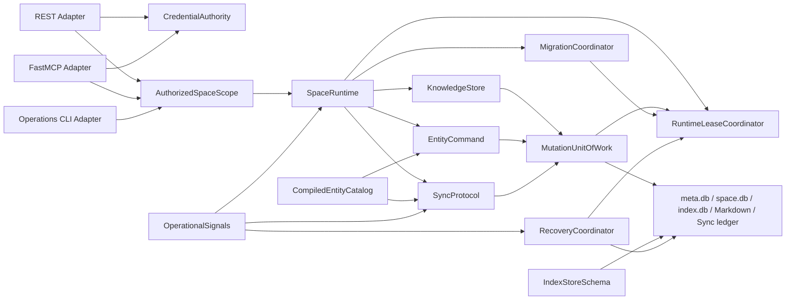
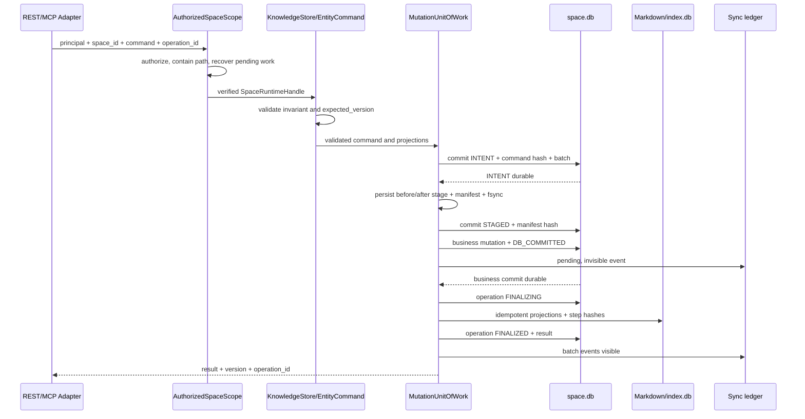

# PomodoroXII Backend 95+ Upgrade Design

## Goal

Raise the PomodoroXII backend to a defensible 95+ engineering score without
rewriting the product, replacing SQLite, or hiding weak modules behind a high
average. The finished program must satisfy all of these conditions at the same
target commit:

- backend composite score is at least 95.0 before rounding;
- every one of the nine backend modules scores at least 90.0;
- no P0 finding, release blocker, or critical `xfail` remains;
- the target commit has High-confidence source, test, runtime, recovery, and
  delivery evidence;
- production can be restored and rolled back from verified artifacts rather
  than operator memory.

This document is the approved program design. It governs seven independently
reviewable implementation waves. Each wave will receive its own implementation
plan after this specification is reviewed.

## Approved Direction

Use the approved **risk-dependency-driven** direction:

1. fail closed at unsafe ingress and legacy operations;
2. establish authoritative migration and Space runtime seams;
3. close the database/filesystem consistency gap;
4. converge Sync and MCP on shared command and protocol modules;
5. make recovery, observability, CI, deployment, and rollback first-class;
6. certify 95+ from a clean target commit.

The design favors deep Modules: small Interfaces with substantial behavior
behind them. REST, MCP, and CLI remain thin Adapters. Complexity is concentrated
at explicit Seams so one fix produces Leverage across all callers and preserves
Locality for maintainers.

## Snapshot And Evidence Contract

The planning snapshot was captured on 2026-07-14 Asia/Shanghai:

- repository: `E:\Development\MyAwesomeApp\PomodoroXII`;
- local branch: `main@d20f200`;
- saved remote-tracking reference: `origin/main@1e4f0fc`;
- local relation: 18 commits ahead of `origin/main`, consisting of the existing
  deep-audit report line; backend source, CI workflow, and README content match
  the saved `origin/main` reference;
- Python: 3.13.13 from `backend/.venv`;
- backend collection: 828 tests collected successfully;
- Ruff: `app` and `tests` passed;
- focused production/auth verification: 83 passed with one warning;
- focused Sync verification: 64 passed and one expected failure;
- focused migration/Notes/MCP verification: 79 passed;
- critical expected failure: the legacy global timestamp cursor can skip older
  truncated entity rows when another entity advances the global cursor;
- live GitHub CI and branch protection: unverified because `gh` is not
  authenticated and the public Actions request failed at transport;
- a complete backend suite was not rerun during discovery because the retained
  test sandbox already contained roughly 459 MiB of artifacts.

Counts from focused groups overlap and must not be added together. Historical
HTML and Markdown reports are context only. Current source, current tests,
current Git references, and runtime artifacts are authoritative.

All final score evidence must identify the exact commit SHA, command, runtime,
timestamp, result, and retained artifact. A static report cannot certify a
different checkout.

The documentation commit carrying this specification and HTML will be newer
than the audited backend subject. `d20f200` remains the immutable planning
subject; the carrier's `git rev-parse HEAD` identifies only the documentation
revision and must not be substituted into the baseline evidence.

## Current Planning Baseline

The current figures below are planning judgements, not a 95+ certification.
They normalize the three independent review slices onto the approved module
model.

| Module | Indicative composite | Confidence | Dominant blocker |
|---|---:|---|---|
| Runtime/Auth | 82 | Medium | weak production credentials and blocking bcrypt |
| Migration/Space Lifecycle | 81 | Medium | lazy migration, path authority, WAL durability |
| Registry/Meta | 87 | Medium | mutable weakly validated catalog |
| Entity Commands | 76 | Medium | ingress-specific invariants and no CAS |
| Sync Push | 82 | Medium | incomplete mutation-to-ledger coverage |
| Sync Pull/Recovery | 74 | Medium | legacy data loss, unsafe retention, monolithic snapshot |
| Notes/FS | 78 | Medium | database/filesystem commit and projection drift |
| Deploy/Operations | 58 | Medium | no complete restore, rollback, or supply-chain proof |
| MCP | 65 | Medium | unauthenticated HTTP and incomplete REST parity |

The raw planning mean is 75.9. The claimable current backend score is capped at
69 because confirmed P0 findings include possible data loss, path escape,
cross-store inconsistency, and absence of a complete restore path.

## Confirmed Blocking Findings

### P0-01: Folder And Note Storage Lifecycles Diverge

REST Folder mutations update `space.db`, while filesystem Note creation checks
the Folder catalog in `index.db`. Note metadata updates can change database
title and folder values without updating Markdown frontmatter, the file path,
FTS, or the filesystem index. Existing integration coverage works around the
gap by creating a root Note and then changing only its database `folder_id`.

Evidence:

- `backend/app/routes/v1/folders.py:25`
- `backend/app/file_system/engine/note_ops.py:38`
- `backend/app/services/note.py:188`
- `backend/tests/test_integration.py:200`

### P0-02: Note Compensation Does Not Survive Outer Rollback Or Crash

Note and QuickNote conversion logic performs filesystem work before the route
owns the final database commit. Compensation covers method-local flush errors,
not a later SAVEPOINT rollback, commit failure, or process termination. The
test suite explicitly records the SAVEPOINT filesystem drift as a known
limitation.

Evidence:

- `backend/app/services/note.py:104`
- `backend/app/routes/v1/notes.py:186`
- `backend/app/services/quick_note.py:103`
- `backend/app/routes/v1/quick_notes.py:59`
- `backend/tests/test_note_service.py:304`

### P0-03: MCP HTTP Has No Shared Authorization Or Space Containment

MCP tools accept `space_id`, derive a path, and ask `SpaceEngineManager` to open
it without proving that the Space exists in Meta or remains below the configured
Space root. A traversal-like identifier can therefore initialize storage
outside the intended root. HTTP transport does not share REST authentication.

Evidence:

- `backend/app/mcp/server.py:44`
- `backend/app/mcp/server.py:82`
- `backend/app/settings.py:93`
- `backend/app/space_manager.py:50`

### P0-04: Legacy Pull Can Silently Skip Rows

The legacy protocol limits each entity independently but advances one global
timestamp. A newer untruncated entity can advance the cursor past remaining
older rows in a truncated entity. The repository contains a strict expected
failure for this case.

Evidence:

- `backend/app/services/sync.py:470`
- `backend/app/services/sync.py:588`
- `backend/tests/test_sync_cursor_pagination.py:175`

### P0-05: Committed Mutations Can Bypass The V2 Ledger

Non-Note restore and Note/Folder/QuickNote purge flows directly mutate database
state without recording a Sync event. These entity types are Sync-enabled, so a
v2 cursor client can miss committed changes even when the ledger protocol itself
behaves correctly. Settings and Note restore are not part of this finding:
Settings are explicitly not Sync-enabled, and Note restore records its update
through `NoteService`.

Evidence:

- `backend/app/routes/v1/trash.py:174`
- `backend/app/routes/v1/trash.py:205`
- `backend/app/routes/v1/trash.py:231`
- `backend/app/registry/builtin.py:141`
- `backend/app/services/sync_outbox.py:28`

### P0-06: Production Has No Complete Recoverable Snapshot

Startup backup runs after Meta migration and covers only each Space database.
It does not create a coordinated snapshot of `meta.db`, every `space.db`, Notes,
and the filesystem index. Backup failure does not stop startup, and there is no
restore-to-staging command or automated restore drill. The deployment guide's
online `tar` command cannot prove a consistent SQLite/WAL/filesystem snapshot.

Evidence:

- `backend/app/main.py:36`
- `backend/app/main.py:46`
- `backend/app/file_system/backup.py:24`
- `backend/DEPLOY.md:62`

### P0-07: Production Credentials Fail Open

Production settings reject only a short weak-key blacklist, setup accepts an
empty password, and bcrypt silently truncates both hash and verification input
to 72 bytes. Current behavior permits low-strength secrets and password aliases.

Evidence:

- `backend/app/settings.py:70`
- `backend/app/routes/v1/auth.py:25`
- `backend/app/auth/security.py:25`

## Important P1 Findings

- **P1-01 — Legacy migration entrypoint.** The default `backend/alembic.ini` still points at the legacy combined chain,
  and the scaffold script still emits legacy revisions.
- **P1-02 — Space path authority.** `SpaceEngineManager` recalculates paths from settings, can ignore Meta's
  stored location, and initializes a missing registered database as a new one.
- **P1-03 — Migration durability.** Migration replacement uses copy and replace without a coordinated SQLite
  backup/checkpoint, cross-process lock, or complete file/directory fsync.
- **P1-04 — Entity invariants.** Folder cycle checks, relation endpoint validation, CAS, and stable pagination
  ordering differ across REST, Sync, and MCP ingress.
- **P1-05 — Catalog compilation.** Registry registration only protects the entity name; effective protocol keys,
  model/schema resolution, route flags, primary keys, and freeze state are not
  compiled into an immutable catalog.
- **P1-06 — Index-store schema.** `index.db` uses an independent schema version and hand-compiled table DDL;
  ordinary SQLAlchemy `Index` objects are not created by `CreateTable`, so its
  schema and indexes need an explicit verification and upgrade Module. A fresh
  temporary initialization found zero of six declared Note/Folder indexes; only
  SQLite auto-indexes and `ix_sync_audit_entity` existed.
- **P1-07 — Retention waterline.** Tombstone and ledger retention have no client acknowledgement safety waterline.
- **P1-08 — MCP parity.** MCP exposes only a hand-selected Sync subset and its parity gate proves stats,
  not complete operation parity.
- **P1-09 — Operational probes.** Readiness writes a TEMP table rather than persistent storage, and metrics
  expose only process-up state.
- **P1-10 — CI evidence lifecycle.** CI disables pytest cache but uploads cache/log paths it does not produce;
  `.test-artifacts` is neither uploaded on failure nor cleaned on success.
- **P1-11 — Supply-chain gates.** Actions and the base image are not digest-pinned; there is no dependency or
  image security gate, SBOM, signature, or provenance.
- **P1-12 — Reproducible deployment.** Compose deploys mutable `latest`, does not prove host bind-mount permissions,
  and has no tested rollback workflow.
- **P1-13 — Documentation contracts.** README and deployment documentation contain stale test counts and operational
  contracts that differ from the implementation.

## Supported Topology

The 95+ target supports one active backend process per persistent data root.
SQLite, local Markdown, and local filesystem indexes remain authoritative.
Cross-process file locks protect migration, snapshot, restore, and accidental
concurrent process access, but this design does not claim multi-writer operation
over a network filesystem.

If active-active replicas or shared multi-writer storage become a requirement,
the storage and coordination architecture must be reopened. It is not valid to
add replicas behind the current SQLite/filesystem topology and retain the 95+
claim.

## Target Architecture



Ingress Adapters may validate transport syntax and map identities, but they may
not construct arbitrary storage paths, create sessions directly, implement
domain invariants, or decide transaction commit order.

## Module Interfaces

### CredentialAuthority

Interface responsibilities:

- `setup(password)` creates the first credential exactly once;
- `login(password)` performs bounded asynchronous verification;
- `verify(token, required_scope)` validates type, scope, expiry, subject,
  credential version, and Space existence;
- `revoke(subject)` advances credential version so old tokens stop working.

Policy:

- production JWT secret is at least 32 UTF-8 bytes and not a known default;
- passwords are 12 to 64 UTF-8 bytes and are never silently truncated;
- bcrypt runs outside the event loop;
- concurrent setup has one success and stable conflict responses;
- HTTP MCP uses Bearer authentication and the same scope rules as REST;
- trusted stdio is an explicit deployment Adapter, never an implicit bypass.

S1 stores the credential version in the existing Meta settings store so the
fail-closed security work does not depend on a new schema revision. The rollout
creates epoch `1`; existing JWTs have no epoch and are intentionally rejected,
causing one documented re-login/bootstrap event. There is no implicit epoch-0
grace period. If a later implementation replaces the setting with a dedicated
table, that additive Meta migration belongs to S2 and must preserve the current
epoch value according to an explicit migration test.

### MigrationCoordinator

Interface:

```text
verify(kind, path) -> MigrationStatus
upgrade(kind, path) -> MigrationResult
```

It owns revision selection, SQLite online backup/checkpoint, cross-process
locking, temporary upgrade, integrity verification, atomic replacement, and
file/directory fsync. The default legacy Alembic entry fails with instructions
to use the named Meta or Space environment. Entity scaffolding only targets the
Space chain unless an explicit Meta entity type is requested.

This specification reaffirms sections 4.3 through 4.5 of
`docs/2026-07-11-dual-alembic-migration-design.md`: production migration runs
before Uvicorn, all registered Spaces reach head before readiness, a new Space
is provisioned and migrated before Meta registration, and application request
paths verify rather than lazily migrate. Any implementation assumption that
request-time lazy migration is acceptable is superseded.

### AuthorizedSpaceScope And SpaceRuntime

Interface:

```text
open(principal, space_id, mode) -> SpaceRuntimeHandle
provision(space_spec) -> SpaceRuntimeHandle
health(space_id) -> SpaceHealth
```

`AuthorizedSpaceScope` validates identity, scope, registered Space existence,
and access mode. `SpaceRuntime` resolves the canonical location from Meta,
proves containment below the configured root, verifies migration state,
recovers pending mutations, and leases database/filesystem Adapters.

A missing or moved registered store returns `space_storage_missing`; it is never
recreated implicitly. Path relocation is an explicit operation with its own
snapshot, validation, and rollback.

### RuntimeLeaseCoordinator

Interface:

```text
acquire_global(mode, purpose, timeout_seconds) -> Lease[fence]
acquire_spaces(space_ids, mode, purpose, timeout_seconds) -> Lease[fence]
```

The only modes are shared and exclusive. Every runtime request first acquires a
global shared lease. Reads then acquire a per-Space shared lease; every
`MutationUnitOfWork` acquires a per-Space exclusive lease. Startup migration,
snapshot, restore, cutover, and data-root relocation acquire the global
exclusive lease, which waits for all requests and prevents new reads or writes.
This participation rule is what makes the Recovery snapshot consistent.

Locks are always acquired in this order: global, Space IDs sorted
lexicographically, Meta/Space/Index/filesystem stores. Code may never acquire in
reverse order. Normal requests use a five-second acquisition timeout;
maintenance commands use 60 seconds and exit non-zero on timeout. A request
timeout returns retryable `lease_timeout` with `Retry-After`.

The implementation uses OS advisory locks and never steals ownership because a
wall-clock TTL expired. Process death releases the OS lock. Stale diagnostic
metadata is ignored only after the OS lock is acquired. Each exclusive lease
increments and fsyncs a monotonic fence value; migration replacement, mutation
finalization, and restore cutover verify the fence immediately before a
destructive step. Engine handles are reference-counted beneath the Space lease,
and eviction/shutdown awaits every active handle.

### CompiledEntityCatalog

The mutable registration builder is allowed only during startup. Compilation
rejects duplicate names, tables, route prefixes, effective Sync keys, missing
primary keys, invalid delete strategies, unresolved model/schema references,
and inconsistent route or MCP flags. The result is immutable and exposes a
stable catalog version and hash to health, metadata, parity, snapshot, and Sync
contracts.

### IndexStoreSchema

`index.db` has its own versioned schema and is not part of either Alembic chain.
This internal Module owns `verify`, `upgrade`, and `rebuild_indexes`. It creates
ordinary indexes explicitly instead of assuming table DDL contains them, and it
reports its schema version through Space health. `SpaceRuntime` verifies it
before opening a Space; `KnowledgeStore` can rebuild it from the authoritative
database metadata and Markdown bodies.

### EntityCommand

All REST, Sync, and MCP mutations delegate to the same aggregate command
Interface. It owns parent existence, Folder cycle prevention, relation endpoint
existence, optimistic CAS, stable `(sort_key, id)` ordering, and delete
strategy. It returns typed domain outcomes rather than HTTP errors: REST maps
them to status/envelope responses, Sync maps them to applied/conflict results,
and MCP maps them to tool errors. Transport Adapters cannot reimplement domain
rules.

### KnowledgeStore

Interface operations cover Folder and Note creation, Note content and metadata
updates, move, trash, restore, purge, version cleanup, and QuickNote conversion.
It produces validated mutation commands and filesystem projections, but it does
not independently commit. That keeps Sync push batch composition intact.

Authority is explicit:

- `space.db` is authoritative for entity identity, Folder graph, Note metadata,
  lifecycle, version, and Sync state;
- the Markdown file is authoritative for the Note body;
- frontmatter, file paths, `index.db`, and FTS are derived projections;
- the Folder representation in `index.db` has no independent writer;
- a controlled rebuild recreates every derived projection from `space.db` and
  Markdown.

This removes the current two-writer ambiguity instead of hiding it behind a new
Interface.

### MutationUnitOfWork

Interface:

```text
execute(scope, command, operation_id) -> MutationResult
execute_batch(scope, commands, batch_id) -> list[MutationResult]
recover(scope) -> RecoveryResult
```

This Module owns database transactions, per-event SAVEPOINT behavior, durable
operation records, staged filesystem artifacts, Sync ledger visibility, and
idempotent recovery. A direct REST command is a one-command batch. Sync push can
retain accepted/rejected event semantics without moving commit responsibility
back into routes or Note implementations.

Operation records use a closed state machine:

```text
INTENT -> STAGED -> DB_COMMITTED -> FINALIZING -> FINALIZED
   |         |             |              |
   +------> ABORTED        +------> COMPENSATING -> COMPENSATED
                                          |
                                          +------> FAILED_MANUAL
```

- `INTENT` is committed before a named stage directory is published. It stores
  `operation_id`, `batch_id`, canonical command hash, expected versions, and the
  intended projection set. Reusing an ID with a different hash returns
  `idempotency_conflict`.
- staging writes before-images, after-images, and a manifest beneath a temporary
  name, fsyncs files and directories, atomically renames it to the operation ID,
  then commits `STAGED` with the manifest hash.
- the business transaction applies the database mutation, records a pending
  ledger event only for Sync-enabled commands, and advances the operation to
  `DB_COMMITTED` in the same commit.
- finalization applies each projection idempotently and records per-step hashes.
  Only `FINALIZED` makes a pending ledger event visible. `FINALIZED`, `ABORTED`,
  and `COMPENSATED` release the lease and reads after hashes prove the complete
  new or old state; only `FAILED_MANUAL` continues blocking reads and writes.
- failure before `DB_COMMITTED` preserves the old state and ends as `ABORTED`.
  A stage directory without a matching durable record, or a temporary stage
  left before atomic rename, is removed only after the Space lock is acquired
  and no live owner exists.
- failure after `DB_COMMITTED` first attempts forward completion. If a required
  after-image is missing or invalid, the durable before-images drive database
  and projection compensation in reverse step order. Ledger events remain
  hidden and the terminal state is `COMPENSATED`.
- failure to prove either forward or inverse hashes enters `FAILED_MANUAL`,
  marks the Space degraded, blocks reads and writes, and exposes a repair CLI;
  it never guesses or silently discards an artifact.

Each accepted Sync event has a child operation under one batch record. Rejected
events create no operation or ledger row. Accepted children share the outer
database transaction. After commit, the Space remains leased and the entire
accepted set is finalized; if any child cannot finalize, recovery completes all
children forward or compensates all accepted children in reverse order. Batch
ledger events become visible together, so partial filesystem finalization is
never externally observable.

### SyncProtocol

Interface:

```text
push(events, batch_id) -> PushResult
pull(opaque_cursor, limit) -> PullPage
recover(page_token, limit) -> RecoveryPage
ack(client_id, cursor) -> AckResult
```

The v2 event ledger is the primary Adapter. Every successful Sync-enabled
mutation emits exactly one event, a successful non-Sync mutation emits none by
catalog policy, and every rolled-back mutation emits none. The cursor is opaque
to callers. Retention uses the minimum acknowledgement among active clients;
expired clients receive an explicit full-recovery contract.

Legacy pull remains a compatibility Adapter only. If it detects a truncation
shape that can skip rows, it returns `cursor_upgrade_required` rather than a
possibly incomplete page. Its removal requires telemetry and a documented
deprecation release.

Snapshots are manifest-backed, chunked, resumable, bounded in memory, and tied
to a catalog hash and event waterline. MCP delegates to this same Interface and
does not instantiate a reduced Sync implementation.

### RecoveryCoordinator

Interface:

```text
snapshot(target) -> SnapshotManifest
verify(snapshot) -> VerificationResult
restore_to_staging(snapshot) -> StagedRestore
cutover(staged_restore) -> CutoverResult
```

A snapshot obtains the `RuntimeLeaseCoordinator` global exclusive lease, uses SQLite's online backup API for
Meta and Space databases, captures Notes and required indexes, and records
relative paths, sizes, SHA-256 digests, schema heads, catalog hash, and event
waterlines. The target must be outside the active data root; production
certification restores from a separate failure domain.

Restore never overwrites a live volume. It restores to staging, verifies hashes
and schema, opens every Space, runs consistency checks, preserves a rollback
snapshot, then performs a controlled cutover under the same global exclusive
lease and fence protocol.

### OperationalSignals

This Module provides low-cardinality request count, error count, latency,
rate-limit, Sync lag, pending mutation, recovery, backup, database, and degraded
Space metrics. Metrics use an operations credential distinct from the master
user credential.

`python -m app.ops.credentials issue` creates a random 32-byte bearer token,
prints it once, and stores only its SHA-256 digest plus an operations epoch in
Meta settings. `rotate` replaces the digest and advances the epoch; `revoke`
removes the digest and disables the protected operations surface. Comparison is
constant-time. No default operations credential exists, and master or Space
JWTs cannot access the metrics/maintenance scope.

Global readiness verifies Meta head, persistent data-root writes, startup
migration completion, and runtime initialization. A Space that fails after
startup is reported as degraded and returns a per-Space 503 without causing a
restart loop for healthy Spaces.

## Durable Mutation Flow



Rules:

- every internal command has an operation ID;
- REST v1 accepts `Idempotency-Key` and returns the effective operation ID;
  official clients must reuse the key for retry safety;
- MCP mutation tools require an operation ID;
- INTENT is durable before staging, and STAGED plus its verified manifest are
  durable before the business commit;
- failure before DB_COMMITTED transitions to ABORTED and leaves the old state;
- after DB_COMMITTED, open/read first completes forward or compensates the
  operation from durable before-images before exposing the Space;
- a missing stage before DB_COMMITTED transitions to ABORTED; after
  DB_COMMITTED it triggers inverse recovery, and only an irrecoverable
  forward/inverse mismatch transitions to FAILED_MANUAL, marks the Space
  degraded, and blocks reads and writes;
- Sync can only read ledger events whose operation is FINALIZED;
- every Unit of Work holds the global shared lease plus a per-Space exclusive
  lease through its terminal state; snapshot/restore use the global exclusive
  lease and fence;
- accepted child operations in a Sync batch expose their ledger events together
  only after the whole accepted set is FINALIZED;
- purge covers ORM rows, Markdown, filesystem index, FTS, version backups,
  tombstones, and the event ledger.

## Shared Error Contract

Modules return the same canonical domain error record, and MCP exposes it
directly:

```json
{
  "code": "space_storage_missing",
  "message": "Registered space storage is unavailable.",
  "retryable": false,
  "request_id": "req_...",
  "details": {}
}
```

REST v1 preserves its existing default body exactly: `message` maps to
`detail`, and `code` maps to the established `error_type` alias. Existing
validation and Sync recovery fields remain in their current key sets. The
canonical code, retryability, and request ID are also carried in
`X-PomodoroXII-Error-Code`, `X-PomodoroXII-Retryable`, and `X-Request-ID`.
Clients that explicitly send
`Accept: application/vnd.pomodoroxii.error+json;version=2` receive the canonical
five-key record shown above. This opt-in Adapter is additive; the default REST
v1 representation does not gain keys.

Legacy aliases are explicit: `auth_required -> authentication_error`;
`forbidden` and `path_outside_space -> authorization_error`;
`space_not_found -> not_found`; `space_storage_missing`,
`space_recovery_required`, and `lease_timeout -> service_not_ready`;
`version_conflict`, `cycle_detected`, `idempotency_conflict`, and
`cursor_upgrade_required -> conflict`; `cursor_expired -> sync_cursor_expired`;
and `snapshot_invalid -> validation_error`. Contract tests verify both the exact
legacy bodies and the canonical representation. OpenAPI documents both media
types and their headers.

Stable codes include:

- `auth_required`, `forbidden`;
- `space_not_found`, `space_storage_missing`, `path_outside_space`;
- `version_conflict`, `cycle_detected`, `idempotency_conflict`;
- `lease_timeout`;
- `cursor_upgrade_required`, `cursor_expired`;
- `space_recovery_required`, `snapshot_invalid`.

Internal exceptions never expose absolute host paths, SQL, secrets, tokens, or
password material. Retryability is explicit. MCP transport errors preserve the
same code and details rather than reducing failures to prose.

## Implementation Waves

### S0: Evidence Baseline

Deliverables:

- lock the nine-module scoring worksheet and evidence schema;
- capture exact target commands and test inventory;
- classify every finding as confirmed, inferred, or unverified;
- add `pytest-cov>=6.0` to the development dependency group and refresh the
  locked environment so the final coverage command is executable;
- redirect test artifacts to a run-scoped external temporary root for discovery
  and record the existing retained-artifact debt without deleting user data.

Exit gate:

```powershell
cd backend
uv lock --check --offline
.\.venv\Scripts\python.exe -m pytest --collect-only -q -p no:cacheprovider
.\.venv\Scripts\ruff.exe check --no-cache app tests
```

Every current score must point to source, a test, or a runtime artifact.

### S1: Fail-Closed Safety

Deliverables:

- `CredentialAuthority` and explicit password/secret policy;
- authenticated MCP HTTP and explicit trusted-stdio mode;
- `AuthorizedSpaceScope` containment before any engine creation;
- legacy cursor unsafe-shape rejection;
- retention endpoints disabled until client ACK exists;
- legacy default Alembic entry fails with named-environment instructions;
- run-scoped test artifact cleanup and CI failure retention.

Exit gate:

```powershell
.\.venv\Scripts\python.exe -m pytest -q tests/test_security_policy.py tests/test_auth_concurrency.py tests/test_mcp_authorization.py tests/test_space_path_containment.py tests/test_sync_legacy_fail_closed.py tests/test_alembic_entrypoints.py -p no:cacheprovider
```

No traversal input creates a file; short secrets, empty passwords, bcrypt
aliases, unauthorized MCP access, unsafe cursor advance, and unsafe prune all
fail closed with stable errors.

### S2: Migration And Space Runtime

Deliverables:

- `MigrationCoordinator` with WAL-safe backup, lock, verification, replacement,
  and fsync;
- shared/exclusive `RuntimeLeaseCoordinator` with ordering, timeouts, fencing,
  and awaited engine handles;
- startup migration for Meta and every registered Space before Uvicorn;
- provision-and-migrate-before-register Space creation;
- authoritative Meta path resolution and missing-store failure;
- immutable `CompiledEntityCatalog` with version and hash;
- `IndexStoreSchema` verification, explicit ordinary-index creation, upgrade,
  and rebuild proof.

Exit gate:

```powershell
.\.venv\Scripts\python.exe -m pytest -q tests/test_migration_wal_durability.py tests/test_migration_runner.py tests/test_alembic_dual_environments.py tests/test_runtime_leases.py tests/test_space_lifecycle.py tests/test_space_manager.py tests/test_compiled_entity_catalog.py tests/test_index_store_schema.py -p no:cacheprovider
```

Uncheckpointed committed WAL rows survive; concurrent migration has one owner;
every injected failure leaves an openable known revision; a missing registered
Space remains missing; a new Space is at head before it is visible; fresh and
upgraded `index.db` stores contain the declared tables, FTS objects, and ordinary
indexes. Lock-order, timeout, process-death release, and stale-fence tests prove
that snapshot/migration/cutover cannot overlap a live Unit of Work.

### S3: Knowledge Consistency

Deliverables:

- `KnowledgeStore` and `MutationUnitOfWork`;
- durable operation journal and per-Space lease;
- Folder projection into filesystem index;
- Note content, metadata, move, trash, restore, purge, and version consistency;
- QuickNote conversion idempotency;
- shared EntityCommand invariants and CAS.

Exit gate:

```powershell
.\.venv\Scripts\python.exe -m pytest -q tests/test_note_workspace_atomicity.py tests/test_mutation_recovery.py tests/test_note_service.py tests/test_trash_routes.py tests/test_entity_invariants.py tests/test_entity_concurrency.py tests/test_routes_pagination.py -p no:cacheprovider
```

Fault injection covers INTENT commit, temporary stage write, stage rename,
STAGED commit, index commit, ORM flush, outer commit, each finalize step,
terminal status commit, orphan-stage collection, and restart. Single commands
and accepted-child batches must prove every legal transition and reject every
illegal transition. `space.db`, Markdown, `index.db`, FTS, versions, trash, and
ledger visibility converge to all-old or all-new; retry produces one logical
result, and an unprovable inverse reaches `FAILED_MANUAL` without exposing the
Space.

### S4: Sync And MCP Convergence

Deliverables:

- all Sync-enabled mutation paths emit ledger events through the Unit of Work;
- opaque v2 cursor and complete recovery contract;
- client registry, ACK waterline, safe ledger/tombstone retention;
- chunked resumable snapshot with catalog hash and memory bound;
- complete MCP push, pull, recover, and status delegation;
- generated or bidirectional REST/MCP operation parity tests.

Exit gate:

```powershell
.\.venv\Scripts\python.exe -m pytest -q tests/test_sync_cursor_pagination.py tests/test_sync_mutation_ledger.py tests/test_sync_client_ack.py tests/test_sync_ledger_retention.py tests/test_sync_snapshot_streaming.py tests/test_mcp_sync_parity.py -p no:cacheprovider
```

Critical expected failures are removed. Cross-entity and tombstone interleaving
has no loss or duplicate. Every successful Sync-enabled mutation emits one
event, rollback emits none, and MCP/REST share cursor/schema/error behavior. The
performance fixture contains 10,000 Notes with deterministic 4 KiB UTF-8 bodies.
Chunks contain at most 500 entities and at most 8 MiB uncompressed. The test
uses `tracemalloc` to require at most 128 MiB peak Python heap, while the Linux
system gate uses `/usr/bin/time -v` to require at most 256 MiB maximum RSS. The
snapshot must resume after every chunk boundary without duplicate or loss.

### S5: Recovery And Production Delivery

Deliverables:

- coordinated full snapshot, verify, restore-to-staging, and cutover CLI;
- scheduled backup with retention and a target outside the active data root;
- readiness, per-Space health, metrics, structured logs, and SLO definitions;
- JUnit, coverage, logs, and failed-sandbox CI artifacts;
- dependency audit, action pinning, base-image digest, image scan, SBOM,
  signature, and provenance;
- non-root bind-mount preparation, digest deployment, upgrade, and rollback
  runbooks with executable smoke gates.

For the first 95+ certification, N-1 is fixed to backend commit `1e4f0fc`.
S0 records a deterministic populated Meta/Space/Index/Notes fixture manifest;
S5 builds the N-1 container from that exact commit, records its local digest,
upgrades the fixture with the target image, then restores and rolls back to the
recorded baseline. Later releases replace this fixture with the previous signed
production digest rather than silently moving the reference.

Exit gate:

```powershell
.\.venv\Scripts\python.exe -m pytest -q tests/test_recovery.py tests/test_backup_lifespan.py tests/test_operational_endpoints.py tests/test_observability.py tests/test_prod_hardening.py -p no:cacheprovider
```

In a fresh Linux environment, restore an independently stored snapshot, upgrade
N-1 data, deploy the scanned digest, and roll back to the preserved digest and
snapshot. Restored schema, entity counts, Note hashes, catalog hash, and Sync
waterline must match the manifest.

### S6: 95+ Certification

Deliverables:

- clean-checkout full backend suite and static gates;
- consolidated fault matrix, security matrix, and resource tests;
- exact-SHA GitHub required checks and branch protection evidence;
- release candidate image digest and provenance;
- final module scoring worksheet and standalone HTML certification report;
- README, deployment, recovery, and incident runbooks aligned with behavior.

Exit gate:

```powershell
uv lock --check --offline
.\.venv\Scripts\ruff.exe check --no-cache app tests
.\.venv\Scripts\python.exe -m pytest -q -p no:cacheprovider --junitxml=.test-results/junit.xml --cov=app --cov-branch --cov-fail-under=90 --cov-report=xml:.test-results/coverage.xml
```

The score is accepted only after the required CI, container, restore, upgrade,
rollback, scan, and provenance artifacts exist for the same commit. Branch-aware
total coverage must be at least 90%; each new authority, migration, mutation,
Sync, recovery, and lease Module must have at least 95% line and 90% branch
coverage, checked from `coverage.xml` by the certification verifier.

## Wave Dependencies And Change Control

- S1 must complete before feature expansion.
- S2 is a hard dependency of S3.
- S3 is a hard dependency of S4.
- Recovery manifest design may begin during S2, but S5 restore certification
  uses the final S3/S4 storage contracts.
- Metrics and fault injection are added with each Module; S5 consolidates them.
- Each wave uses its own branch, PR, review, test evidence, and rollback point.
- A reintroduced P0 pauses later waves and reapplies the score cap.
- No wave may combine unrelated frontend work or historical report cleanup.

## Scoring And Certification

Each module receives five raw dimensions from 0 to 20:

1. Completeness;
2. Integrity;
3. Verification;
4. Operability;
5. Maintainability.

```text
Maturity = (Completeness + Integrity) / 40 * 100
Health = (Verification + Operability + Maintainability) / 60 * 100
Module composite = 0.4 * Maturity + 0.6 * Health
Backend composite = arithmetic mean of nine module composites
```

The fixed modules are Runtime/Auth, Migration/Space Lifecycle, Registry/Meta,
Entity Commands, Sync Push, Sync Pull/Recovery, Notes/FS, Deploy/Operations, and
MCP.

Certification requires:

- backend composite at least 95.0 before rounding;
- every module composite at least 90.0;
- zero P0, zero release blockers, and zero critical expected failures;
- exact-SHA required CI jobs green;
- scanned digest image with SBOM, signature, and provenance;
- fresh-volume deploy, N-1 upgrade, full restore, and rollback drills;
- High confidence for every module.

Hard caps:

- any data-loss, authorization, path-escape, or unrecoverable P0 caps the claim
  at 69;
- any release blocker or missing rollback caps the claim at 89;
- missing restore drill, exact-SHA CI, or digest evidence caps the claim at 94;
- test count, old reports, or unverified prose do not raise a score.

Verification layers are Contract, Property, Integration, System, Production,
Security, and Performance. Coverage is supporting evidence rather than a score
substitute. Test growth alone cannot compensate for missing runtime or recovery
proof.

## HTML Planning Report

Create a standalone Chinese report at:

`output/PomodoroXII-后端95Plus升级规划-2026-07-14.html`

Its dedicated machine verifier is:

`scripts/audit-report/verify-backend-95-plan.cjs`

It is the human-readable rendering of this specification, not a separate source
of truth. It must contain:

1. executive verdict and the current hard cap;
2. snapshot and verification ledger;
3. nine-module baseline and 95+ target matrix;
4. confirmed P0/P1 findings with persistent source paths;
5. target Module map and durable mutation sequence;
6. S0-S6 roadmap with dependencies and exit gates;
7. scoring formula, hard caps, and certification checklist;
8. risk register, non-goals, and implementation handoff.

Presentation and interaction requirements:

- dense, quiet, work-focused layout rather than a marketing page;
- sticky navigation and readable first-viewport verdict;
- severity/module/wave filters for findings and work items;
- expandable evidence and acceptance details;
- light/dark theme, print action, and expand/collapse controls;
- semantic HTML, keyboard access, visible focus, reduced-motion handling;
- mobile single-column behavior and scrollable tables without page overflow;
- one standalone file with inline CSS/JavaScript and no network request, CDN,
  analytics, external font, or build step;
- evidence links display persistent repository-root paths rather than temporary
  worktree paths;
- the existing 2026-07-13 deep-audit report remains unchanged.

## Report Verification

Before delivery:

1. scan the specification and HTML for placeholders, contradictions, and
   unfinished template markers;
2. parse the HTML and verify unique IDs, internal targets, required sections,
   score arithmetic, and finding counts;
3. verify every displayed source path exists in the snapshot;
4. open the standalone file in a real browser at 1440x1000, 1024x768,
   768x1024, and 390x844;
5. verify filters, theme, details, print styles, copy controls, and JavaScript-
   disabled readability;
6. confirm no horizontal page overflow or overlapping text;
7. confirm the report states that live GitHub CI was not verified.

The static and browser contracts run with the bundled Node.js runtime:

```powershell
node --check scripts/audit-report/verify-backend-95-plan.cjs
node scripts/audit-report/verify-backend-95-plan.cjs all
node scripts/audit-report/verify-backend-95-plan.cjs all --browser
```

## Compatibility

- REST v1 default response bodies remain byte-for-byte contract-compatible;
  canonical errors are opt-in by media type and are always reflected in stable
  response headers. Unsafe operations may change from success to a stable
  fail-closed error.
- Metadata additions such as catalog version/hash are additive.
- MCP HTTP authentication is an intentional security change.
- Legacy Sync receives a stable upgrade error before eventual removal.
- REST idempotency is additive through `Idempotency-Key`; official clients must
  adopt it before the S3 gate is certified.
- Minimal official-client protocol maintenance is included: the existing
  frontend transport/Sync libraries must send and persist `Idempotency-Key`, use
  the opaque v2 cursor, submit client ACK, and execute the declared full-recovery
  path. MCP Adapters receive the corresponding protocol updates. This scope is
  limited to transport code, generated types, and contract tests; it does not
  include UI or business-feature development.

## Out Of Scope

- replacing SQLite or Markdown storage;
- active-active or network-filesystem multi-writer deployment;
- splitting the backend into microservices;
- frontend UI or business-feature development beyond the explicitly included
  official-client protocol maintenance;
- changing product behavior unrelated to a confirmed backend invariant;
- deleting existing untracked files or retained test artifacts;
- rewriting or deleting the 2026-07-13 audit report;
- claiming live CI, restore, or release evidence before it exists;
- assigning calendar dates or effort estimates without measured team capacity.

## Written Deliverables After Review

After this specification and its HTML rendering are approved, create one
implementation plan per wave:

- `2026-07-14-backend-95plus-s0-evidence-baseline.md`
- `2026-07-14-backend-95plus-s1-fail-closed-safety.md`
- `2026-07-14-backend-95plus-s2-space-runtime.md`
- `2026-07-14-backend-95plus-s3-knowledge-consistency.md`
- `2026-07-14-backend-95plus-s4-sync-mcp.md`
- `2026-07-14-backend-95plus-s5-delivery.md`
- `2026-07-14-backend-95plus-s6-certification.md`

Each plan must produce independently testable software, use TDD, name exact
files and Interfaces, define expected command output, and end with a focused
commit and review gate.
