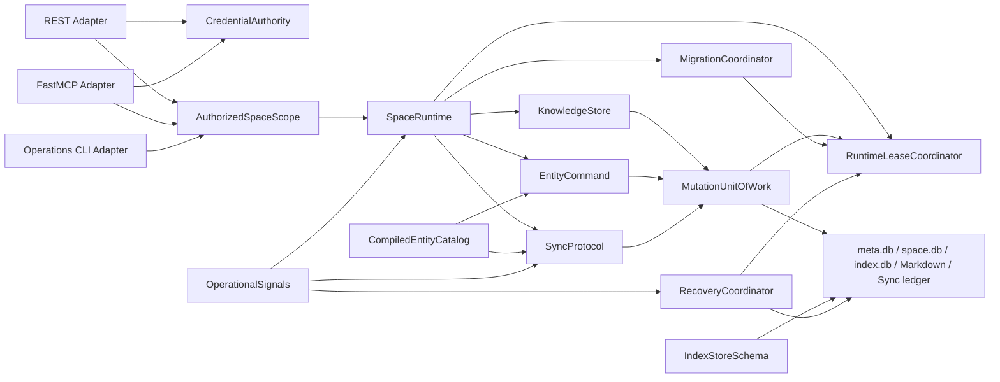
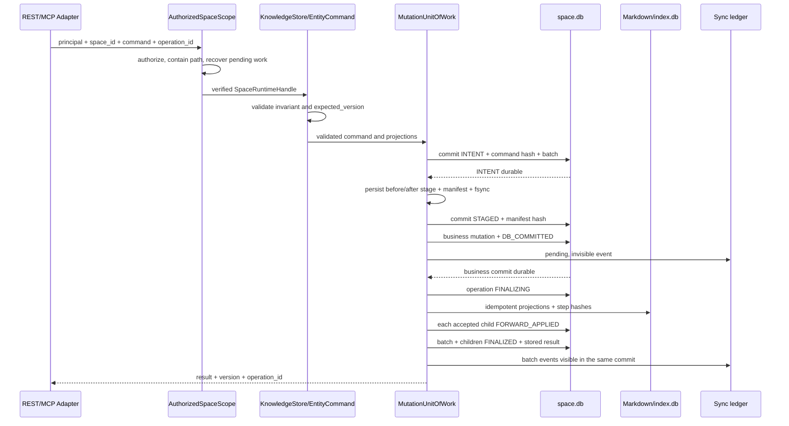

# PomodoroXII Backend 95+ Upgrade Design

## Goal

Raise the PomodoroXII backend to a defensible 95+ engineering score without
rewriting the product, replacing SQLite, or hiding weak modules behind a high
average. The finished program must satisfy all of these conditions at the same
target commit:

- backend composite score is at least 95.0 before rounding;
- every one of the nine backend modules scores at least 90.0;
- no P0 finding, release blocker, or critical `xfail` remains;
- the target commit has High-confidence source, test, runtime, recovery, and
  delivery evidence;
- production can be restored and rolled back from verified artifacts rather
  than operator memory.

This document is the approved program design. It governs seven independently
reviewable implementation waves. Each wave will receive its own implementation
plan after this specification is reviewed.

## Approved Direction

Use the approved **risk-dependency-driven** direction:

1. fail closed at unsafe ingress and legacy operations;
2. establish authoritative migration and Space runtime seams;
3. close the database/filesystem consistency gap;
4. converge Sync and MCP on shared command and protocol modules;
5. make recovery, observability, CI, deployment, and rollback first-class;
6. certify 95+ from a clean target commit.

The design favors deep Modules: small Interfaces with substantial behavior
behind them. REST, MCP, and CLI remain thin Adapters. Complexity is concentrated
at explicit Seams so one fix produces Leverage across all callers and preserves
Locality for maintainers.

## Approved Task Space Integration Amendment (2026-07-15)

The user-approved
`docs/superpowers/specs/2026-07-15-task-space-session-integration-design.md`
is the domain authority for Project, WorkItem, WorkItemNote, FocusSession, and
ActiveSession ownership. The orchestration authority is
`docs/superpowers/plans/2026-07-15-task-space-session-integration-master.md`.
Where this older program design assumed the legacy Task/Session catalog or a
direct S3-to-S4 transition, those two newer authorities supersede that
assumption without weakening any 95+ safety, recovery, evidence, or scoring
gate.

The immutable execution order is:

```text
S3 -> TS0 -> TS1 -> TS2 -> TS3 -> S4 -> S5 -> S6
```

TS0 owns breaking schema/catalog/OpenAPI cutover; TS1 owns Task Space and the
single aggregate WorkItemNote; TS2 owns FocusSession plus global active
coordination; TS3 owns the local-first frontend loop. S4 therefore consumes the
final catalog rather than the pre-integration model. S5 and S6 must independently
verify all of these final predicates at one exact subject:

The strict-A provisional-review boundary is also final-model authority. Before
import, review retains only the structured `SessionReviewDraftRow` and its
unsent fixed operation ID; it changes no Session state, persists no Outcome,
and does not widen the original held batch. Only after exact terminal evidence
is `meta_reconciled` and its Meta root is `transport_resolved` may recovery use the authoritative
imported Session version to execute the original TS2 review. Only authoritative
review success clears the still-matching draft.

Before `meta_002` or any Space revision runs, S2's startup owner performs one
read-only preflight over the existing Meta database and every registered Space,
using TS0's registered cutover predicate. It closes all probe handles before the
first recovery write, checkpoint, backup, DDL, index rebuild, or replacement.
Any rejection, including a late Space with one legacy row, produces zero
migration calls and a byte-identical complete Meta/Space/Index/Notes inventory.
The per-Space Alembic predicate remains a defense-in-depth repeat of the same
pure query, not permission to migrate Meta first.

The final FocusSession model has no `sessionType`. Meta revision
`meta_002_active_session_locator` creates both the singleton locator and its
internal active-operation journal with immutable intent/result descriptor and
monotonic phase transitions. The master Coordinator is the sole
authoritative path for lifecycle plus Session note/current-plan/completion-draft/
plan-add/plan-remove commands; those writes are owner/epoch fenced and cannot be
replayed as ordinary S4 entity updates. Cross-Space conflict resolution selects
only the persisted `active|candidate` role, derives its complete Space/Session
identity, transfers `claiming` directly to that winner with epoch + 1, and exposes no winner
until both intent-named child outcomes are terminal-success. Command hashes use
RFC 8785 with explicit field mappings, and command replay requires both the
server envelope declaration and current caller permission. Unresolved durable
coordination returns `active_session_recovery_required` rather than pretending
there is no active Session.
Reconciliation persists one client root ID and serializes replay versus explicit
abandonment in a Space-exclusive durable claim. The Task Space transition
compiler fences every Session envelope unless that exact request has a live
replay claim, so `abandoned` cannot be bypassed by a direct route. Activation
conflict is locally read-only; its selected role and one canonical resolution
timestamp remain stable across both Space commits and restart recovery.
Level-2 `effortActualSeconds` is a materialized projection whose sole writer is
FocusSession policy; it is recomputed from terminal valid Sessions and their one
effective attribution revision in the same S3 UoW, never assigned by Task Space
or Sync input and never coupled to task-command receipt success.

```text
Space head: space_011_sync_clients_streaming
Meta head: meta_002_active_session_locator
Catalog: version 2, exactly 31 entries
Dexie: v19
Legacy Task/Session routes, keys, aliases, and writable authority: absent
```

No earlier score, report, test count, or pre-TS evidence certifies that final
model. This amendment changes planning authority only; it does not claim that
TS0-TS3 or backend 95+ have been implemented or certified.

## Snapshot And Evidence Contract

The planning snapshot was captured on 2026-07-14 Asia/Shanghai:

- repository: audited repository root (all report links are repository-relative);
- local branch: `main@d20f200`;
- saved remote-tracking reference captured at planning time:
  `origin/main@1e4f0fc`;
- local relation: 18 commits ahead of `origin/main`, consisting of the existing
  deep-audit report line; backend source, CI workflow, and README content match
  the saved `origin/main` reference;
- Python: 3.13.13 from `backend/.venv`;
- backend collection: 828 tests collected successfully;
- Ruff: `app` and `tests` passed;
- focused production/auth verification: 83 passed with one warning;
- focused Sync verification: 64 passed and one expected failure;
- focused migration/Notes/MCP verification: 79 passed;
- critical expected failure: the legacy global timestamp cursor can skip older
  truncated entity rows when another entity advances the global cursor;
- live GitHub CI and branch protection: unverified because `gh` is not
  authenticated and the public Actions request failed at transport;
- a complete backend suite was not rerun during discovery because the retained
  test sandbox already contained roughly 459 MiB of artifacts.

The saved remote SHA is an immutable historical Git object, not a requirement
that the movable current `origin/main` ref remain equal to it. S0 proves the
saved object exists as a commit and is exactly 18 commits behind the immutable
audited subject. It records the current remote-tracking tip separately as
implementation context without letting that movable ref redefine or invalidate
the captured snapshot.

Counts from focused groups overlap and must not be added together. Historical
HTML and Markdown reports are context only. Current source, current tests,
current Git references, and runtime artifacts are authoritative.

All final score evidence must identify the exact commit SHA, command, runtime,
timestamp, result, and retained artifact. A static report cannot certify a
different checkout.

The documentation commit carrying this specification and HTML will be newer
than the audited backend subject. `d20f200` remains the immutable planning
subject; the carrier's `git rev-parse HEAD` identifies only the documentation
revision and must not be substituted into the baseline evidence.

## Current Planning Baseline

The current figures below are planning judgements, not a 95+ certification.
They normalize the three independent review slices onto the approved module
model.

| Module | Indicative composite | Confidence | Dominant blocker |
|---|---:|---|---|
| Runtime/Auth | 82 | Medium | weak production credentials and blocking bcrypt |
| Migration/Space Lifecycle | 81 | Medium | lazy migration, path authority, WAL durability |
| Registry/Meta | 87 | Medium | mutable weakly validated catalog |
| Entity Commands | 76 | Medium | ingress-specific invariants and no CAS |
| Sync Push | 82 | Medium | incomplete mutation-to-ledger coverage |
| Sync Pull/Recovery | 74 | Medium | legacy data loss, unsafe retention, monolithic snapshot |
| Notes/FS | 78 | Medium | database/filesystem commit and projection drift |
| Deploy/Operations | 58 | Medium | no complete restore, rollback, or supply-chain proof |
| MCP | 65 | Medium | unauthenticated HTTP and incomplete REST parity |

The raw planning mean is 75.9. The claimable current backend score is capped at
69 because confirmed P0 findings include possible data loss, path escape,
cross-store inconsistency, and absence of a complete restore path.

## Confirmed Blocking Findings

### P0-01: Folder And Note Storage Lifecycles Diverge

REST Folder mutations update `space.db`, while filesystem Note creation checks
the Folder catalog in `index.db`. Note metadata updates can change database
title and folder values without updating Markdown frontmatter, the file path,
FTS, or the filesystem index. Existing integration coverage works around the
gap by creating a root Note and then changing only its database `folder_id`.

Evidence:

- `backend/app/routes/v1/folders.py:25`
- `backend/app/file_system/engine/note_ops.py:38`
- `backend/app/services/note.py:188`
- `backend/tests/test_integration.py:200`

### P0-02: Note Compensation Does Not Survive Outer Rollback Or Crash

Note and QuickNote conversion logic performs filesystem work before the route
owns the final database commit. Compensation covers method-local flush errors,
not a later SAVEPOINT rollback, commit failure, or process termination. The
test suite explicitly records the SAVEPOINT filesystem drift as a known
limitation.

Evidence:

- `backend/app/services/note.py:104`
- `backend/app/routes/v1/notes.py:186`
- `backend/app/services/quick_note.py:103`
- `backend/app/routes/v1/quick_notes.py:59`
- `backend/tests/test_note_service.py:304`

### P0-03: MCP HTTP Has No Shared Authorization Or Space Containment

MCP tools accept `space_id`, derive a path, and ask `SpaceEngineManager` to open
it without proving that the Space exists in Meta or remains below the configured
Space root. A traversal-like identifier can therefore initialize storage
outside the intended root. HTTP transport does not share REST authentication.

Evidence:

- `backend/app/mcp/server.py:44`
- `backend/app/mcp/server.py:82`
- `backend/app/settings.py:93`
- `backend/app/space_manager.py:50`

### P0-04: Legacy Pull Can Silently Skip Rows

The legacy protocol limits each entity independently but advances one global
timestamp. A newer untruncated entity can advance the cursor past remaining
older rows in a truncated entity. The repository contains a strict expected
failure for this case.

Evidence:

- `backend/app/services/sync.py:470`
- `backend/app/services/sync.py:588`
- `backend/tests/test_sync_cursor_pagination.py:175`

### P0-05: Committed Mutations Can Bypass The V2 Ledger

Non-Note restore and Note/Folder/QuickNote purge flows directly mutate database
state without recording a Sync event. These entity types are Sync-enabled, so a
v2 cursor client can miss committed changes even when the ledger protocol itself
behaves correctly. Settings and Note restore are not part of this finding:
Settings are explicitly not Sync-enabled, and Note restore records its update
through `NoteService`.

Evidence:

- `backend/app/routes/v1/trash.py:174`
- `backend/app/routes/v1/trash.py:205`
- `backend/app/routes/v1/trash.py:231`
- `backend/app/registry/builtin.py:141`
- `backend/app/services/sync_outbox.py:28`

### P0-06: Production Has No Complete Recoverable Snapshot

Startup backup runs after Meta migration and covers only each Space database.
It does not create a coordinated snapshot of `meta.db`, every `space.db`, Notes,
and the filesystem index. Backup failure does not stop startup, and there is no
restore-to-staging command or automated restore drill. The deployment guide's
online `tar` command cannot prove a consistent SQLite/WAL/filesystem snapshot.

Evidence:

- `backend/app/main.py:36`
- `backend/app/main.py:46`
- `backend/app/file_system/backup.py:24`
- `backend/DEPLOY.md:62`

### P0-07: Production Credentials Fail Open

Production settings reject only a short weak-key blacklist, setup accepts an
empty password, and bcrypt silently truncates both hash and verification input
to 72 bytes. Current behavior permits low-strength secrets and password aliases.

Evidence:

- `backend/app/settings.py:70`
- `backend/app/routes/v1/auth.py:25`
- `backend/app/auth/security.py:25`

## Important P1 Findings

- **P1-01 — Legacy migration entrypoint.** The default `backend/alembic.ini` still points at the legacy combined chain,
  and the scaffold script still emits legacy revisions.
- **P1-02 — Space path authority.** `SpaceEngineManager` recalculates paths from settings, can ignore Meta's
  stored location, and initializes a missing registered database as a new one.
- **P1-03 — Migration durability.** Migration replacement uses copy and replace without a coordinated SQLite
  backup/checkpoint, cross-process lock, or complete file/directory fsync.
- **P1-04 — Entity invariants.** Folder cycle checks, relation endpoint validation, CAS, and stable pagination
  ordering differ across REST, Sync, and MCP ingress.
- **P1-05 — Catalog compilation.** Registry registration only protects the entity name; effective protocol keys,
  model/schema resolution, route flags, primary keys, and freeze state are not
  compiled into an immutable catalog.
- **P1-06 — Index-store schema.** `index.db` uses an independent schema version and hand-compiled table DDL;
  ordinary SQLAlchemy `Index` objects are not created by `CreateTable`, so its
  schema and indexes need an explicit verification and upgrade Module. A fresh
  temporary initialization found zero of six declared Note/Folder indexes; only
  SQLite auto-indexes and `ix_sync_audit_entity` existed.
- **P1-07 — Retention waterline.** Tombstone and ledger retention have no client acknowledgement safety waterline.
- **P1-08 — MCP parity.** MCP exposes only a hand-selected Sync subset and its parity gate proves stats,
  not complete operation parity.
- **P1-09 — Operational probes.** Readiness writes a TEMP table rather than persistent storage, and metrics
  expose only process-up state.
- **P1-10 — CI evidence lifecycle.** CI disables pytest cache but uploads cache/log paths it does not produce;
  `.test-artifacts` is neither uploaded on failure nor cleaned on success.
- **P1-11 — Supply-chain gates.** Actions and the base image are not digest-pinned; there is no dependency or
  image security gate, SBOM, signature, or provenance.
- **P1-12 — Reproducible deployment.** Compose deploys mutable `latest`, does not prove host bind-mount permissions,
  and has no tested rollback workflow.
- **P1-13 — Documentation contracts.** README and deployment documentation contain stale test counts and operational
  contracts that differ from the implementation.

## Supported Topology

The 95+ target supports one active backend process per persistent data root.
SQLite, local Markdown, and local filesystem indexes remain authoritative.
Cross-process file locks protect migration, snapshot, restore, and accidental
concurrent process access, but this design does not claim multi-writer operation
over a network filesystem.

If active-active replicas or shared multi-writer storage become a requirement,
the storage and coordination architecture must be reopened. It is not valid to
add replicas behind the current SQLite/filesystem topology and retain the 95+
claim.

## Target Architecture


```mermaid
flowchart LR
    REST[REST Adapter]
    MCP[FastMCP Adapter]
    CLI[Operations CLI Adapter]

    REST --> AUTH[CredentialAuthority]
    MCP --> AUTH
    REST --> SCOPE[AuthorizedSpaceScope]
    MCP --> SCOPE
    CLI --> SCOPE

    SCOPE --> RUNTIME[SpaceRuntime]
    RUNTIME --> LEASE[RuntimeLeaseCoordinator]
    RUNTIME --> MIG[MigrationCoordinator]
    RUNTIME --> KNOW[KnowledgeStore]
    RUNTIME --> ENTITY[EntityCommand]
    RUNTIME --> SYNC[SyncProtocol]

    KNOW --> UOW[MutationUnitOfWork]
    ENTITY --> UOW
    SYNC --> UOW

    CATALOG[CompiledEntityCatalog] --> ENTITY
    CATALOG --> SYNC

    UOW --> STORES[meta.db / space.db / index.db / Markdown / Sync ledger]
    UOW --> LEASE
    MIG --> LEASE
    INDEX[IndexStoreSchema] --> STORES
    RECOVERY[RecoveryCoordinator] --> STORES
    RECOVERY --> LEASE
    OPS[OperationalSignals] --> RUNTIME
    OPS --> RECOVERY
    OPS --> SYNC
```

Ingress Adapters may validate transport syntax and map identities, but they may
not construct arbitrary storage paths, create sessions directly, implement
domain invariants, or decide transaction commit order.

## Module Interfaces

### CredentialAuthority

Interface responsibilities:

- `setup(password)` creates the first credential exactly once;
- `login(password)` performs bounded asynchronous verification;
- `verify(token, required_scope)` validates type, scope, expiry, subject,
  credential version, and Space existence;
- `revoke(subject)` advances credential version so old tokens stop working.

Policy:

- production JWT secret is at least 32 UTF-8 bytes and not a known default;
- passwords are 12 to 64 UTF-8 bytes and are never silently truncated;
- bcrypt runs outside the event loop;
- concurrent setup has one success and stable conflict responses;
- HTTP MCP uses Bearer authentication and the same scope rules as REST;
- trusted stdio is an explicit deployment Adapter, never an implicit bypass.

S1 stores the credential version in the existing Meta settings store so the
fail-closed security work does not depend on a new schema revision. The rollout
creates epoch `1`; existing JWTs have no epoch and are intentionally rejected,
causing one documented re-login/bootstrap event. There is no implicit epoch-0
grace period. If a later implementation replaces the setting with a dedicated
table, that additive Meta migration belongs to S2 and must preserve the current
epoch value according to an explicit migration test.

### MigrationCoordinator

Interface:

```text
verify(kind, path) -> MigrationStatus
upgrade(kind, path) -> MigrationResult
```

It owns revision selection, SQLite online backup/checkpoint, cross-process
locking, temporary upgrade, integrity verification, atomic replacement, and
file/directory durability. `path` is only an initial request to S1's
package-private no-follow maintenance binder; after it returns a
`BoundSQLiteTarget`, backup, Alembic, verification, checkpoint, temporary
replacement, commit, and discard consume only opaque authorities. Alembic is
given the bound `sqlite3.Connection` through `Config.attributes["connection"]`
and cannot construct a URL or pathname connection. The S1 Module privately
owns `begin_bound_replacement`/commit/discard and all WAL/SHM/journal names.
Windows non-database replacement uses checked native write-through semantics;
an unverifiable directory/volume flush fails rather than logging and
continuing. The default legacy Alembic entry fails with instructions to use the
named Meta or Space environment. Entity scaffolding only targets the Space
chain unless an explicit Meta entity type is requested.

This specification reaffirms sections 4.3 through 4.5 of
`docs/2026-07-11-dual-alembic-migration-design.md`: production migration runs
before Uvicorn, all registered Spaces reach head before readiness, a new Space
is provisioned and migrated before Meta registration, and application request
paths verify rather than lazily migrate. Any implementation assumption that
request-time lazy migration is acceptable is superseded.

### AuthorizedSpaceScope And SpaceRuntime

Interface:

```text
open(principal, space_id, mode) -> SpaceRuntimeHandle
provision(space_spec) -> SpaceRuntimeHandle
health(space_id) -> SpaceHealth
```

`AuthorizedSpaceScope` validates identity, scope, registered Space existence,
and access mode. `SpaceRuntime` resolves the canonical location from Meta,
proves containment below the configured root, verifies migration state,
recovers pending mutations, and leases database/filesystem Adapters.

A missing or moved registered store returns `space_storage_missing`; it is never
recreated implicitly. Path relocation is an explicit operation with its own
snapshot, validation, and rollback.

### RuntimeLeaseCoordinator

Interface:

```text
acquire_global(mode, purpose, timeout_seconds) -> Lease[fence]
acquire_spaces(space_ids, mode, purpose, timeout_seconds) -> Lease[fence]
```

The only modes are shared and exclusive. Every runtime request first acquires a
global shared lease. Reads then acquire a per-Space shared lease; every
`MutationUnitOfWork` acquires a per-Space exclusive lease. Startup migration,
snapshot, restore, cutover, and data-root relocation acquire the global
exclusive lease, which waits for all requests and prevents new reads or writes.
This participation rule is what makes the Recovery snapshot consistent.

Locks are always acquired in this order: global, Space IDs sorted
lexicographically, Meta/Space/Index/filesystem stores. Code may never acquire in
reverse order. Normal requests use a five-second acquisition timeout;
maintenance commands use 60 seconds and exit non-zero on timeout. A request
timeout returns retryable `lease_timeout` with `Retry-After`.

The implementation uses OS advisory locks and never steals ownership because a
wall-clock TTL expired. Process death releases the OS lock. Stale diagnostic
metadata is ignored only after the OS lock is acquired. Each exclusive lease
increments and fsyncs a monotonic fence value; migration replacement, mutation
finalization, and restore cutover verify the fence immediately before a
destructive step. Engine handles are reference-counted beneath the Space lease,
and eviction/shutdown awaits every active handle.

### CompiledEntityCatalog

The mutable registration builder is allowed only during startup. Compilation
rejects duplicate names, tables, route prefixes, effective Sync keys, missing
primary keys, invalid delete strategies, unresolved model/schema references,
and inconsistent route or MCP flags. The result is immutable and exposes a
stable catalog version and hash to health, metadata, parity, snapshot, and Sync
contracts.

### IndexStoreSchema

`index.db` has its own versioned schema and is not part of either Alembic chain.
This internal Module owns `verify_open`, `upgrade_open`, and `rebuild_open`, all
of which require `BoundSQLiteTarget`. It has no synchronous path overload or
internal connector factory. Only a marker-bound exact-absent target can use
`create_if_missing=True`; the caller owns `aclose()`. The Module creates
ordinary indexes explicitly instead of assuming table DDL contains them, and
it reports its schema version through Space health. `SpaceRuntime` verifies it
before opening a Space; `KnowledgeStore` can rebuild it from the authoritative
database metadata and Markdown bodies.

### EntityCommand

All REST, Sync, and MCP mutations delegate to the same aggregate command
Interface. It owns parent existence, Folder cycle prevention, relation endpoint
existence, optimistic CAS, stable `(sort_key, id)` ordering, and delete
strategy. It returns typed domain outcomes rather than HTTP errors: REST maps
them to status/envelope responses, Sync maps them to applied/conflict results,
and MCP maps them to tool errors. Transport Adapters cannot reimplement domain
rules.

### KnowledgeStore

Interface operations cover Folder and Note creation, Note content and metadata
updates, move, trash, restore, purge, version cleanup, and QuickNote conversion.
It produces validated mutation commands and filesystem projections, but it does
not independently commit. That keeps Sync push batch composition intact.

Authority is explicit:

- `space.db` is authoritative for entity identity, Folder graph, Note metadata,
  lifecycle, version, and Sync state;
- the Markdown file is authoritative for the Note body;
- frontmatter, file paths, `index.db`, and FTS are derived projections;
- the Folder representation in `index.db` has no independent writer;
- a controlled rebuild recreates every derived projection from `space.db` and
  Markdown.

This removes the current two-writer ambiguity instead of hiding it behind a new
Interface.

### MutationUnitOfWork

Interface:

```text
execute(scope, request, operation_id) -> MutationResult
execute_batch(scope, requests, batch_id, *, operation_ids=None) -> BatchMutationResult
execute_prepared_batch(scope, items, batch_id) -> BatchMutationResult
recover_under_lease(scope, lease) -> RecoveryResult
inspect_recovery(view) -> RecoveryInspection
```

This Module owns database transactions, per-event SAVEPOINT behavior, durable
operation records, staged filesystem artifacts, Sync ledger visibility, and
idempotent recovery. A direct REST command is a one-command batch. The ordinary
batch method wraps request-only items; the prepared method additionally accepts
original input index, operation ID, canonical intent hash, and exactly one of a
request or pre-rejection. Sync push can therefore retain accepted/rejected event
semantics without moving receipt or commit responsibility back into routes or
Note implementations.

Operation records use a closed state machine:

```text
INTENT -> STAGED -> DB_COMMITTED -> FINALIZING -> FORWARD_APPLIED -> FINALIZED
   |         |             |              |              |
   +------> ABORTED        +--------------+----> COMPENSATING -> COMPENSATED
                                                         |
                                                         +------> FAILED_MANUAL
```

- `INTENT` is committed before a named stage directory is published. It stores
  `operation_id`, `batch_id`, canonical command hash, expected versions, and the
  intended projection set. Reusing an ID with a different hash returns
  `idempotency_conflict`.
- staging writes before-images, after-images, and a manifest beneath a temporary
  name, fsyncs files and directories, then atomically renames it to the
  deterministic lowercase SHA-256 directory key derived from the operation ID.
  The original caller ID remains data inside the manifest and is never used as a
  filesystem path component. Only then does the journal commit `STAGED` with the
  manifest SHA-256.
- the business transaction applies the database mutation, records a pending
  ledger event only for Sync-enabled commands, and advances the operation to
  `DB_COMMITTED` in the same commit.
- finalization applies each projection idempotently and records per-step hashes.
  Only `FINALIZED` makes a pending ledger event visible. `FINALIZED`, `ABORTED`,
  and `COMPENSATED` release the lease and reads after hashes prove the complete
  new or old state; only `FAILED_MANUAL` continues blocking reads and writes.
- failure before `DB_COMMITTED` preserves the old state and ends as `ABORTED`.
  A stage directory without a matching durable record, or a temporary stage
  left before atomic rename, is removed only after the Space lock is acquired
  and no live owner exists.
- failure after `DB_COMMITTED` first attempts forward completion. If a required
  after-image is missing or invalid, the durable before-images drive database
  and projection compensation in reverse step order. Ledger events remain
  hidden and the terminal state is `COMPENSATED`.
- failure to prove either forward or inverse hashes enters `FAILED_MANUAL`,
  marks the Space degraded, blocks reads and writes, and exposes a repair CLI;
  it never guesses or silently discards an artifact.

Each accepted Sync event has a child operation under one batch record. Rejected
events create no operation or ledger row. Accepted children share the outer
database transaction. After commit, the Space remains leased and the entire
accepted set is finalized; if any child cannot finalize, recovery completes all
children forward or compensates all accepted children in reverse order. Batch
ledger events become visible together, so partial filesystem finalization is
never externally observable.

Deterministic child operation identity is the versioned `child-v1` persistence
protocol, not a local UoW naming convention. `app.mutation.types` is its only
backend implementation owner. It first applies the canonical operation-ID
validator to the printable-ASCII parent, then accepts only a 1-to-512-byte ASCII
suffix from `[A-Za-z0-9._:-]`. A result of at most 128 ASCII bytes is
`childp:<parent-byte-length>:<parent>:<suffix>`. Longer results are
`childh:<sha256>`, where the digest preimage is
`b"child-v1\0" + uint16be(parent-byte-length) + parent-bytes + suffix-bytes`.
The tracked backend authority is
`backend/tests/fixtures/task_space_session_child_operation_id_vectors.json`;
TS3 must copy those bytes unchanged to
`frontend/src/lib/contracts/fixtures/task-space-session-child-operation-id-vectors.json`
and verify both language implementations against that one oracle. Manual child
concatenation, a second helper, or an unversioned hash change is forbidden.

### SyncProtocol

Interface:

```text
query_operations(client_id, operation_ids) -> OperationQueryResult
push(client_id, events, batch_id) -> PushResult
pull(client_id, opaque_cursor, limit) -> PullPage
recover(client_id, page_token) -> RecoveryPage
ack(client_id, cursor) -> AckResult
status(client_id=None) -> SyncStatusResult
```

The v2 event ledger is the primary Adapter. Every successful Sync-enabled
mutation emits exactly one event, a successful non-Sync mutation emits none by
catalog policy, and every rolled-back mutation emits none. The cursor is opaque
to callers. Retention uses the minimum acknowledgement among active clients;
expired clients receive an explicit full-recovery contract.

These are exactly six shared public operations across REST, MCP, and the
official frontend. Before a push receipt is created or replayed, the client
queries every selected persisted operation ID. `unknown`, `pending`, `terminal`,
and `recovery_required` are distinct states: terminal returns the immutable
original complete batch result, pending/recovery-required blocks transport, and
only confirmed-unknown operations may send. A WorkItemNote whose response was
lost retains its original operation/batch identity. TS3 provisional compounds
send `prepareHeldProvisionalBatch(...).batchId`, which is the persisted
`compoundOperationId`; S4 must not re-hash child operation IDs into a different
batch authority. Dexie v19 admits valid `awaiting_s4` groups through
`pending -> meta_pending -> ready` and keeps `blocked_conflict` held.
One exclusive per-Space Browser Web Lock token fences every frontend authority
writer and remains held through query, final proof, push, and response
application. Admission freezes the complete canonical post-image bytes and
separately recomputes the entity-specific command business `payloadHash`; these
are not interchangeable for WorkItemNote. Both queried and pushed terminal
results write crash-safe Space evidence before queue deletion and reconcile Meta
idempotently. Retained terminal conflict/error rows are non-sendable; any retry
uses a new operation ID while preserving the original payload and caller time.

S4 must not reuse an API/cache schema as either its command post-image parser or
its authoritative recovery parser. The three representations are independent:
the cache may contain derived `clockState`; the complete FocusSession command
post-image maps `sessionId -> id`, includes `overallProgress` and `mood`, and
strictly excludes `clockState`; the recovery wire schema carries complete
`id/spaceId/createdAt/updatedAt/version` system identity and maps `id ->
sessionId` only after top-level entity identity/version verification. The four
Session child entities use their own complete wire schemas and real entity IDs,
and Outcome hashing includes `executionPersona`, `personaSwitched`, and
`personaNote`. Both WorkItemNote writers call one complete-next-row serializer;
a three-field overwrite post-image is invalid. Recovery parsing enforces
`has_more === (next_page_token !== null)`, retained Schedule/TimeBlock time
fields accept the locked `HH:mm | canonical UTC RFC3339` union, and public
operation/batch IDs use the shared 1-128 UTF-8 byte printable-ASCII grammar.
Only a `child-v1` suffix uses the narrower allowlist.

Before the TS0 breaking cutover, any still-running legacy pull safety patch must
fail closed with `cursor_upgrade_required` on a truncation shape that can skip
rows. It is not compatibility authority for the final model: TS0/S4 remove the
legacy endpoint/key completely, with no dual read, telemetry-gated retention, or
deprecation bridge because this installation has no data or old clients to
migrate.

Snapshots are manifest-backed, chunked, resumable, bounded in memory, and tied
to a catalog hash and event waterline. MCP delegates to this same Interface and
does not instantiate a reduced Sync implementation.

#### Normative Detailed-Plan Amendment (2026-07-14)

This amendment records refinements found while reviewing the seven executable
plans. It is normative and supersedes any earlier prose or diagram in this
document when the two conflict.

- `AuthorizedSpaceScope` resolves and tears down resources with primary-first
  failure aggregation. A failed release never masks the body/acquisition
  failure or discards the last retryable owner: unresolved engine, filesystem,
  Space-lease, and global-lease cleanup remains in the bounded pending-cleanup
  registry. A dirty read closes all read resources, releases Space-shared, and
  only then acquires Space-exclusive for recovery; no shared-to-exclusive
  upgrade is permitted. Every read or writer acquisition runs recovery
  preflight before exposing authority, and a `FAILED_MANUAL` Space stays
  degraded while all acquired leases unwind in ownership order.
- `MigrationCoordinator.upgrade_under_lease()` opens its bound maintenance
  target and enters one primary/cleanup envelope before `drain_identity()`.
  Drain failure or cancellation still closes that target and invokes idempotent
  `resume_identity()`; a failed resume remains a same-Task pending-resume owner
  that blocks readiness, shutdown success, and another migration until retry
  completes. Partial quiesce is never an unowned side effect.
- Standalone `MigrationCoordinator.upgrade()` uses keyed serialization while
  `_upgrade_once` executes inline in the public caller Task; it never uses a
  short-lived `create_task(_upgrade_once)`. Fail-once pending cleanup converges
  in that owner Task before top-level exit. Persistent cleanup enters explicit
  `process_exit_required`, publishes neither success nor readiness, and keeps
  process/global locks live until the offline process exits. Destructive
  upgrade/create workers are joined to terminal while exact process/global/
  drain or provision dependencies remain pinned, followed by close, resume,
  and lease release in that physical order.
- Migration cleanup is an owner-Task `_ReleaseSequence`: target close must be
  physically terminal before resume, and isolated target close must be terminal
  before its separately committed discard stage. A close failure retains the
  drained identity and exact remaining sequence. Cancellation after physical
  close may propagate only after resume advances. Verify/body failures remain
  first before close failures; no `finally` masks the primary.
- `MutationUnitOfWork` accepts immutable `MutationRequest` values, compiles them
  only after acquiring the Space-exclusive lease, and persists a closed
  `BatchMutationResult` containing ordered applied and rejected children.
  Rejected children create no operation, stage, or ledger row; their caller
  operation ID and result remain in the batch receipt so an identical retry
  after restart returns the same result.
- Transport mapping uses `PreparedBatchItem(request_index, operation_id,
  intent_hash, request|pre_rejection)`. The UoW hashes every original item in
  input order, persists mapper and compiler rejections in one receipt, and
  returns that stored receipt before reclassification on retry. An all-rejected
  batch still records the legal `INTENT -> ABORTED` receipt.
- Batch compilation applies each accepted full `MutationCommand` to an
  in-memory authority overlay, including DB state, authoritative Markdown body,
  and planned path/projection descriptors. A later child cannot compile against
  stale pre-batch authority.
- `FORWARD_APPLIED` is a durable nonterminal barrier. Only one transaction that
  proves every accepted child at this barrier may set all children and the
  batch to `FINALIZED` and expose their ledger events together.
- Mutation rejection and idempotency failures are S1 `AppError` carriers with
  stable code, retryability, and details from one exhaustive specification
  table. Adapters serialize `AppError.to_domain_record(request_id)` and never
  invent an S3/S4-only error hierarchy or recompute a stored terminal result.
- `SyncState.current_cursor` is the authoritative durable ledger high-watermark.
  Invisible event append and `current_cursor` advance occur in the same business
  transaction; every cursor consumer first completes clean recovery, so a
  compensated invisible sequence is a harmless gap. Pull, snapshot, future
  cursor checks, and ACK use this value even after all visible rows are pruned,
  and always preserve `retention_floor <= current_cursor`.
- Sync cursors, ACKs, page tokens, and recovery manifests bind the Space,
  client, catalog hash, and recovery generation. A fresh, expired, or
  catalog-mismatched client remains `requires_recovery` until it completes the
  current generation and ACKs exactly that generation's waterline.
- Every unexpired current recovery manifest waterline participates in the
  retention minimum while its client downloads. Pruning cannot advance past a
  recoverer's final ACK waterline; expiry releases the pin, invalidates the old
  token, and requires a new generation. Superseded/expired manifests are
  collected under the Space-exclusive lease and chunks cascade-delete.
- A recovery response is exactly one persisted whole chunk and has no public
  `limit`. It carries raw uncompressed canonical JSONL bytes as base64,
  `entity_count`, SHA-256, opaque next-page token, catalog hash, and opaque
  waterline cursor. Clients hash decoded bytes before parsing and never verify a
  cross-language reserialization.
- A clean pushed event is in `applied` with no resolution; successful
  remote-wins LWW is in `applied` with `resolution="remote"`. Local,
  tombstone, circular-reference, and unresolved CAS outcomes are mutually
  exclusive conflicts or errors and never masquerade as applied work.
- V2 retains canonical `client_updated_at` from the durable official outbox.
  The S3 compiler, while holding Space-exclusive, is the only owner of the
  CAS/LWW comparison. Timestamp and successful remote resolution are covered by
  request/command hashes and terminal result JSON; retry and recovery never use
  the current clock or recompute a resolution.
- REST and MCP share one canonical event parser with per-event, event-count,
  and aggregate UTF-8 byte ceilings. The official frontend routes all six v2
  operations -- query, push, pull, recover, ACK, and status -- through one
  transport helper that forces
  `Accept: application/vnd.pomodoroxii.error+json;version=2`, including retries.
- The pinned canonical implementations are Python `rfc8785==0.1.4` and npm
  `json-canonicalize@2.0.0`, exercised by shared valid/invalid vectors and real
  REST/MCP exact-boundary and plus-one tests. Limits are 256 KiB per event,
  500 events, 10 MiB canonical batch, 11 MiB raw HTTP body, and 8 MiB pull or
  recovery page; configuration validation requires the raw cap to cover the
  canonical cap plus fixed framing headroom and the event cap not to exceed the
  batch cap.
- Recovery ACK requires a current, unexpired manifest matching Space, client,
  catalog, generation, token, and waterline. Garbage collection clears client
  completion pointers before deleting an expired manifest. Persisted gzip is
  decoded with an `8 MiB + 1` output bound and rejects size mismatch,
  concatenated members, and trailing data before returning bytes.
- Incremental pull rejects any cursor above `SyncState.current_cursor`. ACK of
  the already persisted exact generation/waterline is idempotent across a lost
  response and process restart; backward, future, cross-client, cross-Space,
  expired, or mismatched ACKs fail closed. Expired client rows and their
  superseded manifests have bounded, lease-protected garbage collection so the
  registry cannot grow without limit.
- Before network I/O the frontend durably freezes the complete pending push
  batch: client ID, batch ID, ordered operation IDs, canonical event snapshots,
  and idempotency header. Timeout, cancellation, 5xx, malformed response, or a
  committed-but-lost response replays byte-equivalent content after restart.
  Concurrent edits receive successor operation IDs, six generated response
  shapes pass explicit runtime parsers before state mutation, and a response
  with zero applied work and zero queue shrink terminates the current cycle.
- Startup recovery uses S2's internal `runtime.borrow_prepared_space(...)`
  context. Its handle has both lease-ownership flags false, so per-Space
  filesystem/engine resources close under that Space's exclusive lease while
  bootstrap retains and releases its global-exclusive/process-owner exactly
  once after all Spaces or primary-first cleanup.
- Bootstrap calls the S1 short-lived credential-epoch helper and stores only a
  stateless fresh-session verifier. `CredentialAuthority(AsyncSession)` never
  survives its Meta session. `MigrationCoordinator.upgrade_under_lease()` is
  the sole drain/resume owner; Space preparation must not nest another quiesce.
- Every evidence producer uses the closed S0 v1.0 record with stable
  `evidence_id`, exact `subject_sha`, command/cwd, closed runtime identity,
  ordered RFC3339 timestamps, consistent exit/result, artifact hash and byte
  size, trust level, unique `modules`, unique `finding_ids`, and unique
  certification tags. Its envelope is validated against an explicit
  `artifact_root`; bundle-relative and controlled
  `external://pomodoroxii-test-artifacts/...` paths are contained and rehashed
  by every consumer. Release and drills emit these records rather than
  unaudited receipt arrays.
- Certification tags are never claimable from an artifact-free record. A
  nonempty tag set requires a concrete path/hash/size triple whose contained
  bytes were rehashed successfully by the consumer. S0 locks the complete
  baseline evidence-ID set, reads every nonexternal baseline artifact from the
  audited target Git object regardless of ID spelling, validates timestamps
  against a strict RFC3339 lexical grammar before aware parsing, and accepts
  score dimensions only when their exact type is non-Boolean integer `0..20`.
- S1 freezes and recursively thaws canonical error details through the sole
  `app/errors.py::to_wire_json(value: object) -> JsonValue` serializer imported
  by REST, MCP, S3, and S4; `dataclasses.asdict()` and a shallow `dict(details)`
  are not transport contracts. Stored S3 rejection details use the same
  recursive freezer before hashing or persistence and preserve byte-equivalent
  wire JSON after source mutation and restart.
- `ContainedSpacePaths` remains a four-field non-authority registration snapshot.
  `SpaceContainmentCapability.open_verified()` does not yield it to a storage
  consumer. The capability itself performs the kernel open with POSIX
  descriptor-relative `openat`/no-follow semantics or Windows identity-bound
  handles that reject reparse traversal and rename/delete sharing, then yields
  only opaque `ContainedSpaceOpens`. SQLite, Notes, and index consumers bind to
  those already opened identities and cannot reopen a host path. Tests swap an
  ancestor after the final identity check but before the kernel-open hook; no
  outside read, write, journal, or index side effect is permitted.
- S1 owns the contained FileSystem conversion in the existing engine rather
  than copying it into `file_system/api.py`. Exact ownership is
  `engine/base.py`, `engine/note_ops.py`, `engine/folder_ops.py`,
  `engine/search_ops.py`, `engine/trash_ops.py`, `engine/version_ops.py`,
  `engine/export_ops.py`, `engine/consistency_ops.py`, and `engine/__init__.py`.
  `FileSystemStorage` routes contained Note operations through an internal
  relative-name-only Notes authority backed by `BoundDirectoryHandle`, and
  routes index connections through an internal authority backed only by
  `BoundSQLiteTarget.open_maintenance`. Contained objects store no root/index
  host `Path`; the path-backed constructor remains only for existing tests and
  the fixed N-1 fixture, and production dependencies have static and runtime
  no-fallback tests.
- `import_from_md(file_path)` and `export_folder(output_dir)` remain legacy
  host-path operations only in path-backed test/N-1 mode. Contained mode has no
  external path capability in S1 and raises the stable non-retryable
  `external_path_capability_required` domain error before inspecting, opening,
  creating, resolving, or serializing either supplied path.
- S1 does not add snapshot/restore; S5 retains sole ownership of the formal
  backup capability. S1 removes the legacy path-backed startup backup from the
  production call graph: `backup_enabled` defaults false, disabled startup does
  zero backup storage I/O and never enumerates Space paths, and explicit enable
  fails before storage initialization with `LegacyBackupConfigurationError`
  and stable code `legacy_backup_unsupported`. `file_system/backup.py` retains
  no production-callable host-path `sqlite3.connect`; the fixed N-1 fixture
  opts out explicitly rather than relying on the current default.
- The per-canonical-parent containment lock is Task-reentrant and cross-Task
  exclusive. Same-owner nesting increments depth; normal, exceptional, and
  cancelled exits restore depth/owner exactly; a cancelled waiter cannot alter
  the current holder and a later waiter still acquires after release. Focused
  timeout tests cover nested entry, exclusion, owner cancellation, waiter
  cancellation, and subsequent acquisition.
- SQLite identity binding is a deep native Module, not a pathname connector.
  A packaged C17 loadable extension registers `pxii-vfs` in the same stock
  `sqlite3` library at controlled bootstrap. A private control connection binds
  an unforgeable token to duplicated open main/parent authority or one-shot
  isolated-create authority; SQLite receives only
  `file:pxii-<token>?vfs=pxii`. Bootstrap may discover the packaged extension
  path, but no database host path crosses the storage seam or is reopened after
  binding. S1 supports this native storage runtime only on Windows x64 with
  CPython 3.13. Windows companions use `NtCreateFile(RootDirectory=...)`
  without reparse traversal and retain handle-bound delete semantics. Linux and
  other POSIX production entry points fail before extension bootstrap or storage
  I/O with stable `platform_unsupported`; the retained POSIX C path is
  defense-in-depth, not a supported S1 runtime.
- `BoundSQLiteTarget` exposes only `identity`, `make_async_engine(options)`,
  `open_maintenance(options)`, and `aclose()`. Callers never observe URI/token,
  fd/HANDLE, sidecar, or raw connector. The VFS implements authority-bound
  open/access/full-path, locking, WAL shared memory, and fsync on Windows.
  Windows companion deletion remains handle-bound. Linux native runtime,
  POSIX exact/deferred-delete compatibility, Linux filesystem capability probes,
  and physical POSIX cleanup are S5/Platform Track responsibilities. It denies
  ATTACH, arbitrary extension loading, and unsafe PRAGMAs. The CPython 3.13 Windows x64 wheel, swap isolation, WAL and
  hot-journal recovery, cross-process locks, AsyncSession/savepoint/Alembic,
  cancellation, pool disposal, and revocation are a hard feasibility gate.
- `AsyncEngineOptions` and `MaintenanceOptions` are concrete frozen records.
  Invalid pool/timeout values fail construction; read-only plus create is
  invalid, and `create_if_missing` succeeds only for a one-shot isolated-create
  binding. Provision markers validate nonce and anchored parent only, then call
  the S1 package-private binder. S2 never enumerates companion suffixes.
  Isolated success is target-close then authority commit; failure is
  target-close then authority discard, with either sequence retained for
  same-Task retry if not physically terminal.
- `pxii-vfs` handles every stock SQLite open class and `zName == NULL` without
  default-VFS fallback: MAIN_DB and exact journal/WAL/SHM stay relative to the
  bound parent; TEMP_DB, TRANSIENT_DB, TEMP_JOURNAL, SUBJOURNAL, MEMORY, and
  DELETEONCLOSE use an authority-owned anonymous temp root. SUPER_JOURNAL is
  explicitly rejected with ATTACH disabled. Ambiguous flag combinations fail
  before I/O; savepoint, sort, TEMP-table, and hot-journal tests prove zero
  outside access.
- **S1 Windows-only amendment:** Windows x64 is the sole supported S1 native
  runtime. Linux/POSIX requests return `platform_unsupported` with HTTP 501 and
  `retryable=false` before extension bootstrap, SQLite connection creation,
  companion enumeration, or storage I/O. A native `SQLITE_IOERR_DELETE` or disk
  I/O error is never translated into success. Existing POSIX fail-closed C code
  must not perform pathname `unlinkat` or publish successful delete receipts,
  but it is not runtime acceptance evidence. Linux native runtime, wheels,
  exact/deferred-delete compatibility, receipts/manifests, and filesystem
  capability gates move to S5 or a separately authorized Platform Track.
- CI publishes stable Windows-only `pxii-vfs-wheel-manifest-v1` evidence with
  platform set exactly `["windows-x86_64"]`, candidate subject SHA, native
  source tree/input hashes, toolchain IDs, wheel hash/size, and unpacked
  extension hash/size/build-id. S1 has no Linux wheel or Linux receipt gate.
- Lease and engine release are retryable state machines. Each completed cleanup
  callback/phase is recorded exactly once; `_released` and the ContextVar order
  token change only after every callback succeeds. Body failure or cancellation
  remains the primary exception and simultaneous cleanup failures are appended
  in deterministic `[primary, *cleanup]` order. Read, write, startup, shutdown,
  REST, and MCP paths all use the same pending-cleanup ownership rule.
- `run_joined_thread` and package-private `run_joined_awaitable` join worker and
  terminal effects through repeated cancellation. `on_success` commits terminal
  state in the owner Task before the original cancellation is rethrown; a
  cancelled resource result is disposed instead of published. A newly opened
  portal stream is wrapped and appended to the caller-owned acquisition record
  synchronously before the first `portalocker.lock` await, so failure before
  helper return is still registered. Portal acquire has one idempotent cleanup
  owner. `_PortalHandle`, `ProcessOwnerReceipt`, and
  `_ReleaseStage` never mark terminal state only after an await, and every
  post-process-owner-acquire failure compensates through Lease publication.
- The general awaitable helper uses `asyncio.ensure_future` (or narrows its type
  to Coroutine); it never passes an arbitrary Awaitable/Future to
  `create_task`. Cancellation order is exactly
  `[original_cancel, *later_cancels, *terminal_errors]`.
- Global/Space acquisition cleanup uses physical-terminal `_ReleaseStage`s in
  reverse dependency order. A stage may advance after cancellation only when
  its physical receipt is complete. Generic `PendingCleanup(owner_task, retry,
  holds)` strongly retains exact OS/local resources and parent lineage; all
  register/complete/retry/readiness/process-exit APIs are runnable, same-Task,
  stable-order code. Persistent cleanup raises the defined
  `RuntimeCleanupPendingError(code="runtime_cleanup_pending")` and blocks
  readiness and parent release.
- `SyncState` has a migration-owned durable invariant
  `0 <= retention_floor <= current_cursor`, including legacy validation, ORM
  checks, and raw-SQL rejection tests. Invisible append and cursor allocation
  remain one transaction; pruning never derives the allocated watermark from
  surviving rows.
- Retention eligibility changes only through durable client state. A TTL- or
  catalog-ineligible client continues to pin at its ACK until its bounded
  transition commits; any still-referenced manifest continues to pin at its
  waterline even when its wall-clock expiry passed. Floor queries contain no
  wall-clock/catalog shortcut that can skip an unprocessed page. More-than-one-
  batch tests cover low ACKs, catalog drift, expired manifests, crash, and retry.
- REST v2 validation begins with the capped raw request bytes. A duplicate-
  preserving decoder rejects repeated member names at every nesting level and
  all other non-I-JSON inputs before the shared semantic parser. Python and
  TypeScript contracts share exact UTC RFC3339 grammar, non-Boolean JavaScript-
  safe integers, 500-record and 8 MiB decoded page caps, and the corresponding
  bounded base64 representation.
- Incremental pull budgets the tentative canonical whole response before each
  append, including event-array/object framing, the exact next cursor,
  `has_more`, and catalog hash. An event that would cross 8 MiB is deferred to
  the next page and later delivered exactly once; final response construction is
  an assertion, not the first place an oversize page can be discovered.
- A durable pending push stores the exact idempotency header, canonical request
  and per-event bytes, ordered operation identity, and SHA-256 receipts. Restart
  rehashes and replays those bytes directly; it never regenerates a header or
  reserializes mutable application objects.
- For one target SHA, the trusted `push` on `refs/heads/main` is the only image
  build/push owner. Release consumes and verifies that immutable digest and its
  provenance, then produces SBOM, scan, signature, upgrade, restore, and deploy
  evidence without rebuilding.
- The release DAG is `publish -> drills -> read-only release aggregator`.
  Matrix expansion, reusable invocation, and reruns cannot create a second
  build owner. Jobs use exact least privilege; artifact download is pinned to
  `d3f86a106a0bac45b974a628896c90dbdf5c8093`. With only `contents: read`,
  `actions: read`, and `checks: read`, the aggregator independently bounded-
  polls the same full SHA, fully paginates Checks, Actions runs/jobs, and
  artifacts, and cross-checks event/ref/workflow/run/attempt/artifact identity.
  A publish selector receipt is only a hint. Zero, duplicate, failed,
  cancelled, timed-out, ambiguous, or incompletely paginated identities fail.
- Fresh deploy certification allocates a never-existing run-unique volume,
  proves its mounted data root empty through a digest-pinned read-only probe
  container whose retained create argv and raw inspect bytes bind the exact
  volume name/source to `/app/data`, then prepares UID/GID 1000 ownership with
  a separate digest-pinned init container. It records volume identity and
  probe/prepare/mount/deploy/smoke receipts and proves exact cleanup afterward.
  Empty-root and post-remove not-found claims retain the raw command, stdout,
  stderr, timestamps, exit code, artifact path, hash, and byte size so an
  independent consumer can rehash the proof rather than trust a reported count.
- The first N-1 proof pins the complete commit
  `1e4f0fc6d82ce6203f4bada0e84b518b16fcd97f`. Docker must return the exact
  not-found condition before volume creation, and cleanup ownership is installed
  immediately afterward. Baseline population executes only from that archived
  source and its frozen runtime; target-worktree Python imports, Alembic config,
  and migration locations are forbidden before the `meta_001`/`space_008`
  receipt exists. Release indexing excludes the index itself and future
  aggregate evidence to prevent self-reference.
- Trusted CI/release selection binds event, ref, full SHA, workflow ID/path,
  run ID/attempt, artifact identity, and trust level. The required policy
  workflow runs only on pull requests and trusted-main pushes; the manual
  certification workflow has a distinct name/context and never emits that
  required context. Required checks bind context plus GitHub App and eligible
  workflow/event/run identity, so one current manual dispatch cannot become a
  duplicate required-check candidate. Branch protection is a complete fail-
  closed normalized policy, including bypass and restrictions.
- S6 tracked-input eligibility is equality of the reviewed path/hash set read
  from the target Git object; it does not inherit a prior S6 implementation
  commit or shell variable. This content rule does not waive S5's separately
  evidenced producer-before-activation history: the producer and activation
  commits must remain distinct and reachable by the target. Squash/rebase of
  S6-only documentation is acceptable when content remains exact, while
  squashing the S5 producer/activation pair makes release evidence ineligible.
- N-1 and rollback receipts bind the Meta/Space migration heads, compiled
  catalog hash, IndexStore schema version, declared tables/FTS/ordinary indexes,
  and a complete file inventory with hashes at baseline, upgraded, restored,
  and rolled-back stages. File existence alone is not index or rollback proof.
- The release required context has two explicit event branches: pull requests
  skip all publishing producers and pass the same context through static
  validation only when both predecessors are skipped and otherwise run an
  explicit nonzero `Reject invalid PR predecessors` step; trusted main pushes require `publish` and
  `drills` to succeed before the read-only aggregator may pass. Workflow tests
  assert exhaustive, mutually exclusive event and `needs.*.result` conditions.
  An event-triggered consumer may be activated only by an activation commit
  whose first-parent ancestry already contains every referenced producer/tool
  and focused test. Same-commit producer creation/modification is forbidden;
  the activation commit changes only the consumer workflow and its contract
  tests, and it may not be squash-merged with the producer commit.
- S5 creates the sole
  `backend/app/audit/producer_contracts.py::PRODUCER_CONTRACTS` authority before
  release aggregation, including reserved S6 matrix producers. Its computed
  `S5_INPUT_PRODUCERS` excludes output-only `release`; S6 imports the complete
  mapping unchanged and cannot shadow or extend it. Fault, security, and
  resource matrices each emit a closed S0 envelope with stable evidence IDs;
  closure validates every `(finding_id, required_tag)` pair rather than a global
  tag union. Certification resolves each artifact under its declared root,
  rejects symlink/path escape, rehashes bytes, compares the exact tracked-input
  set, and verifies detached verifier/tool bytes before trusting their output.
- REST and MCP remain thin Adapters over the same operation catalog. The MCP
  protocol factory is an async context manager and closes its authorized
  `SpaceRuntimeHandle` on success, domain failure, unexpected failure, and
  cancellation.
- S6's pull measurement counts the full 512-event traversal exactly and records
  a separate `max_page_events <= 500`; a page cap is never confused with the
  traversal total. Detached certification creates a run-scoped frozen/offline
  Python environment from the target `uv.lock`, hashes the synchronized Python
  executable with `sha256sum`/`Get-FileHash` against the target lock before its
  first version or verifier invocation, records interpreter and installed
  distribution identities, and similarly records Node/runtime dependency
  integrity. Every later local shell repeats that Python pre-execution hash and
  version gate. Its detached tooling worktree is also fresh and run-ID-scoped;
  every pre-execution gate rejects tracked changes plus all untracked and
  ignored files, so no reusable checkout or shadow module can influence a
  receipt. Python uses isolated startup, and every npm/Playwright/Node launch
  rejects nonempty `NODE_OPTIONS` before a preload can run. GitHub artifacts
  first land as raw ZIPs in an empty quarantine and
  pass the detached central-directory gate before atomic publication into a new
  local evidence root. That gate caps members at exactly 10,000 and rejects
  links/special files, ADS colons, Win32 reserved device names, control
  characters, trailing dots/spaces, and case/Win32-normalization collisions in
  addition to absolute/drive/UNC/backslash/dot/parent paths and size limits.
  Independent local report JSON/screenshots stay under quarantine and are never
  inserted into or published with the workflow-indexed staged bundle. After an
  in-process final rehash, publication uses a same-volume OS atomic no-replace
  primitive (`MoveFileExW` without replace or `renameat2(RENAME_NOREPLACE)`),
  so an existing destination fails atomically and recursive copy is forbidden.
- Git and GitHub CLI are part of the closed per-platform S6 toolchain lock, not
  ambient PATH trust. Workflow and local shells bind absolute executables,
  verify hash plus normalized version before their first authority-bearing
  fetch/ref/protection/run/API call, pass those bindings into runtime receipts,
  and use only `$GIT`/`$GH` afterward. Every later local shell repeats the
  hash/version check; operator-facing certification command snippets are held to
  the same rule and reject ambient `git`/`gh`. A re-resolved Node executable is
  likewise checked before the report verifier runs.
- Certification policy owns a complete closed set of module/dimension criterion
  IDs and a complete evidence-binding map. Each criterion has explicit weight,
  required evidence IDs/tags/classes, and a machine-verifiable predicate; the
  verifier derives every `0..20` dimension, module composite, minimum module,
  and backend mean from satisfied criteria. No score or `97.0/96` summary is a
  trusted input. Removing, downgrading, or invalidating evidence must lower the
  derived score or reject certification.

### RecoveryCoordinator

Interface:

```text
snapshot(target) -> SnapshotManifest
verify(snapshot) -> VerificationResult
restore_to_staging(snapshot) -> StagedRestore
cutover(staged_restore) -> CutoverResult
```

A snapshot obtains the `RuntimeLeaseCoordinator` global exclusive lease, uses SQLite's online backup API for
Meta and Space databases, captures Notes and required indexes, and records
relative paths, sizes, SHA-256 digests, schema heads, catalog hash, and event
waterlines. The target must be outside the active data root; production
certification restores from a separate failure domain.

Restore never overwrites a live volume. It restores to staging, verifies hashes
and schema, opens every Space, runs consistency checks, preserves a rollback
snapshot, then performs a controlled cutover under the same global exclusive
lease and fence protocol.

### OperationalSignals

This Module provides low-cardinality request count, error count, latency,
rate-limit, Sync lag, pending mutation, recovery, backup, database, and degraded
Space metrics. Metrics use an operations credential distinct from the master
user credential.

`python -m app.ops.credentials issue` creates a random 32-byte bearer token,
prints it once, and stores only its SHA-256 digest plus an operations epoch in
Meta settings. `rotate` replaces the digest and advances the epoch; `revoke`
removes the digest and disables the protected operations surface. Comparison is
constant-time. No default operations credential exists, and master or Space
JWTs cannot access the metrics/maintenance scope.

Global readiness verifies Meta head, persistent data-root writes, startup
migration completion, and runtime initialization. A Space that fails after
startup is reported as degraded and returns a per-Space 503 without causing a
restart loop for healthy Spaces.

## Durable Mutation Flow


```mermaid
sequenceDiagram
    participant A as REST/MCP Adapter
    participant S as AuthorizedSpaceScope
    participant K as KnowledgeStore/EntityCommand
    participant U as MutationUnitOfWork
    participant D as space.db
    participant F as Markdown/index.db
    participant L as Sync ledger

    A->>S: principal + space_id + command + operation_id
    S->>S: authorize, contain path, recover pending work
    S->>K: verified SpaceRuntimeHandle
    K->>K: validate invariant and expected_version
    K->>U: validated command and projections
    U->>D: commit INTENT + command hash + batch
    D-->>U: INTENT durable
    U->>U: persist before/after stage + manifest + fsync
    U->>D: commit STAGED + manifest hash
    U->>D: business mutation + DB_COMMITTED
    U->>L: pending, invisible event
    D-->>U: business commit durable
    U->>D: operation FINALIZING
    U->>F: idempotent projections + step hashes
    U->>D: each accepted child FORWARD_APPLIED
    U->>D: batch + children FINALIZED + stored result
    U->>L: batch events visible in the same commit
    U-->>A: result + version + operation_id
```

Rules:

- every internal command has an operation ID;
- REST v1 accepts `Idempotency-Key` and returns the effective operation ID;
  official clients must reuse the key for retry safety;
- MCP mutation tools require an operation ID;
- INTENT is durable before staging, and STAGED plus its verified manifest are
  durable before the business commit;
- failure before DB_COMMITTED transitions to ABORTED and leaves the old state;
- after DB_COMMITTED, open/read first completes forward or compensates the
  operation from durable before-images before exposing the Space;
- a missing stage before DB_COMMITTED transitions to ABORTED; after
  DB_COMMITTED it triggers inverse recovery, and only an irrecoverable
  forward/inverse mismatch transitions to FAILED_MANUAL, marks the Space
  degraded, and blocks reads and writes;
- Sync can only read ledger events whose operation is FINALIZED;
- every Unit of Work holds the global shared lease plus a per-Space exclusive
  lease through its terminal state; snapshot/restore use the global exclusive
  lease and fence;
- accepted child operations in a Sync batch expose their ledger events together
  only after the whole accepted set is FINALIZED;
- purge covers ORM rows, Markdown, filesystem index, FTS, version backups,
  tombstones, and the event ledger.

## Shared Error Contract

Modules return the same canonical domain error record, and MCP exposes it
directly:

```json
{
  "code": "space_storage_missing",
  "message": "Registered space storage is unavailable.",
  "retryable": false,
  "request_id": "req_...",
  "details": {}
}
```

REST v1 preserves its existing default body exactly: `message` maps to
`detail`, and `code` maps to the established `error_type` alias. Existing
validation and Sync recovery fields remain in their current key sets. The
canonical code, retryability, and request ID are also carried in
`X-PomodoroXII-Error-Code`, `X-PomodoroXII-Retryable`, and `X-Request-ID`.
Clients that explicitly send
`Accept: application/vnd.pomodoroxii.error+json;version=2` receive the canonical
five-key record shown above. This opt-in Adapter is additive; the default REST
v1 representation does not gain keys. The official Sync v2 client always opts
in through one shared request helper for query, push, pull, recover, ACK, and
status;
its recovery classifier therefore never depends on a legacy alias body.

Legacy aliases are explicit: `auth_required -> authentication_error`;
`forbidden` and `path_outside_space -> authorization_error`;
`space_not_found -> not_found`; `space_storage_missing`,
`space_recovery_required`, and `lease_timeout -> service_not_ready`;
`active_session_recovery_required -> service_not_ready`;
`version_conflict`, `cycle_detected`, `idempotency_conflict`, and
`cursor_upgrade_required -> conflict`; `cursor_expired -> sync_cursor_expired`;
and `snapshot_invalid -> validation_error`. Contract tests verify both the exact
legacy bodies and the canonical representation. OpenAPI documents both media
types and their headers.

Stable codes include:

- `auth_required`, `forbidden`;
- `space_not_found`, `space_storage_missing`, `path_outside_space`;
- `version_conflict`, `cycle_detected`, `idempotency_conflict`;
- `lease_timeout`;
- `cursor_upgrade_required`, `cursor_expired`;
- `space_recovery_required`, `active_session_recovery_required`,
  `snapshot_invalid`.

`active_session_recovery_required` is canonical HTTP 503 with
`retryable=true`: the caller retries only after request/startup recovery or
operator repair can prove the unique global owner. REST v1 keeps the
`service_not_ready` alias and never presents the locator as empty.

Internal exceptions never expose absolute host paths, SQL, secrets, tokens, or
password material. Retryability is explicit. MCP transport errors preserve the
same code and details rather than reducing failures to prose.

## Implementation Waves

### S0: Evidence Baseline

Deliverables:

- lock the nine-module scoring worksheet and evidence schema;
- require tagged evidence to resolve and rehash a concrete artifact, lock the
  complete evidence-ID set, strict RFC3339, and exact audited-Git blobs;
- capture exact target commands and test inventory;
- execute audited baseline imports/tests only from a clean detached worktree at
  the full audited SHA with the frozen lock, and record that worktree/runtime
  identity; untracked primary-worktree Python can never inherit that subject;
- classify every finding as confirmed, inferred, or unverified;
- add `pytest-cov>=6.0` to the development dependency group and refresh the
  locked environment so the final coverage command is executable;
- redirect test artifacts to a run-scoped external temporary root for discovery
  and record the existing retained-artifact debt without deleting user data.

Exit gate:

```powershell
cd backend
uv lock --check --offline
.\.venv\Scripts\python.exe -m pytest --collect-only -q -p no:cacheprovider
.\.venv\Scripts\ruff.exe check --no-cache app tests
```

Every current score must point to source, a test, or a runtime artifact.

### S1: Fail-Closed Safety

Deliverables:

- `CredentialAuthority` and explicit password/secret policy;
- authenticated MCP HTTP and explicit trusted-stdio mode;
- JSON-safe frozen error-detail parity across REST and MCP;
- `AuthorizedSpaceScope` protected-open containment before any engine creation,
  including descriptor/HANDLE-relative kernel opens, final-check-to-open swap
  resistance, and distinct storage roles without yielding authoritative paths;
- legacy cursor unsafe-shape rejection;
- retention endpoints disabled until client ACK exists;
- legacy default Alembic entry fails with named-environment instructions;
- run-scoped test artifact cleanup and CI failure retention.

Exit gate:

```powershell
.\.venv\Scripts\python.exe -m pytest -q tests/test_security_policy.py tests/test_auth_concurrency.py tests/test_mcp_authorization.py tests/test_space_path_containment.py tests/test_sync_legacy_fail_closed.py tests/test_alembic_entrypoints.py -p no:cacheprovider
```

No traversal input creates a file; short secrets, empty passwords, bcrypt
aliases, unauthorized MCP access, unsafe cursor advance, and unsafe prune all
fail closed with stable errors.

### S2: Migration And Space Runtime

Deliverables:

- `MigrationCoordinator` with WAL-safe backup, lock, verification, replacement,
  and fsync;
- shared/exclusive `RuntimeLeaseCoordinator` with ordering, timeouts, fencing,
  and awaited engine handles;
- primary-first `AuthorizedSpaceScope` acquisition/cleanup with bounded pending
  ownership, read-resource close-before-upgrade, and recovery preflight;
- retryable per-phase lease/engine cleanup that marks release only after every
  callback succeeds and preserves body/cancellation as the primary failure;
- startup migration for Meta and every registered Space before Uvicorn;
- provision-and-migrate-before-register Space creation;
- authoritative Meta path resolution and missing-store failure;
- immutable `CompiledEntityCatalog` with version and hash;
- `IndexStoreSchema` verification, explicit ordinary-index creation, upgrade,
  and rebuild proof.

Exit gate:

```powershell
.\.venv\Scripts\python.exe -m pytest -q tests/test_migration_wal_durability.py tests/test_migration_runner.py tests/test_alembic_dual_environments.py tests/test_runtime_leases.py tests/test_space_lifecycle.py tests/test_space_manager.py tests/test_compiled_entity_catalog.py tests/test_index_store_schema.py -p no:cacheprovider
```

Uncheckpointed committed WAL rows survive; concurrent migration has one owner;
every injected failure leaves an openable known revision; a missing registered
Space remains missing; a new Space is at head before it is visible; fresh and
upgraded `index.db` stores contain the declared tables, FTS objects, and ordinary
indexes. Lock-order, timeout, process-death release, and stale-fence tests prove
that snapshot/migration/cutover cannot overlap a live Unit of Work.

### S3: Knowledge Consistency

Deliverables:

- `KnowledgeStore` and `MutationUnitOfWork`;
- durable operation journal and per-Space lease;
- one S1 `AppError` rejection/idempotency carrier and authoritative
  `SyncState.current_cursor` advanced with invisible append;
- recursively frozen stored rejection details plus migration/ORM/raw-SQL proof
  of `0 <= retention_floor <= current_cursor`;
- Folder projection into filesystem index;
- Note content, metadata, move, trash, restore, purge, and version consistency;
- QuickNote conversion idempotency;
- shared EntityCommand invariants and CAS.

Exit gate:

```powershell
.\.venv\Scripts\python.exe -m pytest -q tests/test_note_workspace_atomicity.py tests/test_mutation_recovery.py tests/test_note_service.py tests/test_trash_routes.py tests/test_entity_invariants.py tests/test_entity_concurrency.py tests/test_routes_pagination.py -p no:cacheprovider
```

Fault injection covers INTENT commit, temporary stage write, stage rename,
STAGED commit, index commit, ORM flush, outer commit, each finalize step,
terminal status commit, orphan-stage collection, and restart. Single commands
and accepted-child batches must prove every legal transition and reject every
illegal transition. `space.db`, Markdown, `index.db`, FTS, versions, trash, and
ledger visibility converge to all-old or all-new; retry produces one logical
result, and an unprovable inverse reaches `FAILED_MANUAL` without exposing the
Space.

### S4: Sync And MCP Convergence

Deliverables:

- all Sync-enabled mutation paths emit ledger events through the Unit of Work;
- opaque v2 cursor with future-watermark rejection and complete recovery
  contract;
- client registry, ACK waterline, safe ledger/tombstone retention;
- durable-state-only retention pins across bounded TTL/catalog/manifest cleanup;
- chunked resumable snapshot with catalog hash and memory bound;
- durable official-client pending push batches, successor operations, runtime
  response parsers, exact idempotency/canonical-byte receipts, and lost-response
  replay without reserialization;
- capped duplicate-preserving raw JSON decoding, safe integers, strict UTC
  RFC3339, and shared record/decoded/base64 response bounds;
- complete MCP query, push, pull, recover, ACK, and status delegation;
- one official-client v2 transport helper that sends the canonical error media
  type on all six operations;
- generated or bidirectional REST/MCP operation parity tests.

Exit gate:

```powershell
.\.venv\Scripts\python.exe -m pytest -q tests/test_sync_cursor_pagination.py tests/test_sync_mutation_ledger.py tests/test_sync_client_ack.py tests/test_sync_ledger_retention.py tests/test_sync_snapshot_streaming.py tests/test_mcp_sync_parity.py -p no:cacheprovider
```

Critical expected failures are removed. Cross-entity and tombstone interleaving
has no loss or duplicate. Every successful Sync-enabled mutation emits one
event, rollback emits none, and MCP/REST share cursor/schema/error behavior. The
performance fixture contains 10,000 Notes with deterministic 4 KiB UTF-8 bodies.
Chunks contain at most 500 entities and at most 8 MiB uncompressed. The test
uses `tracemalloc` to require at most 128 MiB peak Python heap, while the Linux
system gate uses `/usr/bin/time -v` to require at most 256 MiB maximum RSS. The
snapshot must resume after every chunk boundary without duplicate or loss.
The S6 evidence run also measures bounded incremental pull with the same
deterministic fixture; a snapshot-only memory probe is insufficient.

### S5: Recovery And Production Delivery

Deliverables:

- coordinated full snapshot, verify, restore-to-staging, and cutover CLI;
- scheduled backup with retention and a target outside the active data root;
- readiness, per-Space health, metrics, structured logs, and SLO definitions;
- JUnit, coverage, logs, and failed-sandbox CI artifacts;
- dependency audit, action pinning, base-image digest, image scan, SBOM,
  signature, and provenance;
- one trusted-main publish followed by drills and a read-only release
  aggregator that fully paginates and binds same-SHA evidence;
- the sole frozen S5/S6 producer contract map and a non-self-referential release
  input view;
- non-root bind-mount preparation, digest deployment, upgrade, and rollback
  runbooks with executable smoke gates.

For the first 95+ certification, N-1 is fixed to backend commit
`1e4f0fc6d82ce6203f4bada0e84b518b16fcd97f`.
S0 records a deterministic populated Meta/Space/Index/Notes fixture manifest.
The fixed legacy-bearing fixture remains a negative lane with `tasks=1`: target
startup must fail closed with `breaking_cutover_requires_empty_legacy`, and its
before/after inventory must be byte-identical. A separate
`n_minus_one_empty_legacy_manifest.json` is the only positive upgrade lane. S5
builds the N-1 container from that exact commit, records its local digest, uses
the drill-only `n_minus_one_baseline` manifest for old-model backup/rollback,
upgrades the empty-legacy fixture with the target image, and creates the
production S5 final-model snapshot only after that upgrade. Later releases
replace these fixtures with the previous signed production digest rather than
silently moving the reference.
The fixture and every drill stage also bind both migration heads, catalog hash,
IndexStore schema and declared table/FTS/index objects, plus a complete hashed
file inventory. Fresh-volume empty/not-found claims retain independently
rehashable raw stdout/stderr command artifacts. Pull requests pass the stable
release context through static validation, while trusted main pushes require
successful publish and drills before aggregation.

Exit gate:

```powershell
.\.venv\Scripts\python.exe -m pytest -q tests/test_recovery.py tests/test_backup_lifespan.py tests/test_operational_endpoints.py tests/test_observability.py tests/test_prod_hardening.py -p no:cacheprovider
```

In a fresh Linux environment, restore an independently stored snapshot, upgrade
N-1 data, deploy the scanned digest, and roll back to the preserved digest and
snapshot. Restored schema, entity counts, Note hashes, catalog hash, and Sync
waterline must match the manifest.

### S6: 95+ Certification

Deliverables:

- clean-checkout full backend suite and static gates;
- consolidated fault matrix, security matrix, and resource tests;
- three closed S0 matrix envelopes with stable IDs and bounded pull evidence;
- exact-SHA GitHub required checks and branch protection evidence;
- release candidate image digest and provenance;
- authoritative producer contracts, per-finding required-tag closure,
  containment/rehash, exact tracked-input equality, and detached tool integrity;
- a 512-event pull traversal receipt with separate `max_page_events <= 500`;
- quarantine extraction plus a detached, lock-frozen Python/Node verifier runtime;
- complete criterion/evidence bindings and a derived module scoring worksheet,
  never a prefilled certification score;
- standalone HTML certification report;
- README, deployment, recovery, and incident runbooks aligned with behavior.

The final-model gate independently verifies all seven predicates: final Space
head, final Meta head, catalog version/count, Dexie version, legacy
Task/Session authority absence, active-session coordination classified
`clean_or_recoverable`, and EffortProjection classified `verified`. A stored
summary cannot substitute for `ActiveSessionCoordinationInspector.inspect_read_only`
or `EffortProjectionCompiler.verify_all` evidence.

Exit gate:

```powershell
uv lock --check --offline
.\.venv\Scripts\ruff.exe check --no-cache app tests
.\.venv\Scripts\python.exe -m pytest -q -p no:cacheprovider --junitxml=.test-results/junit.xml --cov=app --cov-branch --cov-fail-under=90 --cov-report=xml:.test-results/coverage.xml
```

The score is accepted only after the required CI, container, restore, upgrade,
rollback, scan, and provenance artifacts exist for the same commit. Branch-aware
total coverage must be at least 90%; each new authority, migration, mutation,
Sync, recovery, and lease Module must have at least 95% line and 90% branch
coverage, checked from `coverage.xml` by the certification verifier.

## Wave Dependencies And Change Control

- S1 must complete before feature expansion.
- S2 is a hard dependency of S3.
- S3 is a hard dependency of S4.
- Recovery manifest design may begin during S2, but S5 restore certification
  uses the final S3/S4 storage contracts.
- Metrics and fault injection are added with each Module; S5 consolidates them.
- Each wave uses its own branch, PR, review, test evidence, and rollback point.
- A reintroduced P0 pauses later waves and reapplies the score cap.
- No wave may combine unrelated frontend work or historical report cleanup.

## Scoring And Certification

Each module receives five raw dimensions from 0 to 20:

1. Completeness;
2. Integrity;
3. Verification;
4. Operability;
5. Maintainability.

```text
Maturity = (Completeness + Integrity) / 40 * 100
Health = (Verification + Operability + Maintainability) / 60 * 100
Module composite = 0.4 * Maturity + 0.6 * Health
Backend composite = arithmetic mean of nine module composites
```

The fixed modules are Runtime/Auth, Migration/Space Lifecycle, Registry/Meta,
Entity Commands, Sync Push, Sync Pull/Recovery, Notes/FS, Deploy/Operations, and
MCP.

S6 does not prefill those scores. `certification-policy.json` contains a closed
rubric for all 45 `(module, dimension)` cells. Each cell's criteria have stable
IDs and exact integer weights summing to 20, and each criterion names its
required evidence binding and executable predicate. `evidence-bindings.json`
contains every referenced binding, not an example plus implementation prose.
The independent verifier recomputes satisfied criterion weights from contained,
rehashed, exact-SHA evidence and rejects unknown, missing, duplicate, or unused
criteria/bindings. Tests remove and downgrade evidence and prove the derived
dimension/module/backend result falls or certification fails. Displayed scores
and summaries are outputs only.

Certification requires:

- backend composite at least 95.0 before rounding;
- every module composite at least 90.0;
- zero P0, zero release blockers, and zero critical expected failures;
- exact-SHA required CI jobs green;
- scanned digest image with SBOM, signature, and provenance;
- fresh-volume deploy, N-1 upgrade, full restore, and rollback drills;
- High confidence for every module.

Therefore 95+ is an acceptance target, not a result asserted by this planning
artifact. Until S6 derives the score from complete same-subject evidence, the
current audited baseline and hard caps remain authoritative.

Hard caps:

- any data-loss, authorization, path-escape, or unrecoverable P0 caps the claim
  at 69;
- any release blocker or missing rollback caps the claim at 89;
- missing restore drill, exact-SHA CI, or digest evidence caps the claim at 94;
- test count, old reports, or unverified prose do not raise a score.

Verification layers are Contract, Property, Integration, System, Production,
Security, and Performance. Coverage is supporting evidence rather than a score
substitute. Test growth alone cannot compensate for missing runtime or recovery
proof.

## HTML Planning Report

Create a standalone Chinese report at:

`output/PomodoroXII-后端95Plus升级规划-2026-07-14.html`

Its dedicated machine verifier is:

`scripts/audit-report/verify-backend-95-plan.cjs`

It is the human-readable rendering of this specification, not a separate source
of truth. It must contain:

1. executive verdict and the current hard cap;
2. snapshot and verification ledger;
3. nine-module baseline and 95+ target matrix;
4. confirmed P0/P1 findings with persistent source paths;
5. target Module map and durable mutation sequence;
6. S0-S6 roadmap with dependencies and exit gates;
7. scoring formula, hard caps, and certification checklist;
8. risk register, non-goals, and implementation handoff.

Presentation and interaction requirements:

- dense, quiet, work-focused layout rather than a marketing page;
- sticky navigation and readable first-viewport verdict;
- severity/module/wave filters for findings and work items;
- expandable evidence and acceptance details;
- light/dark theme, print action, and expand/collapse controls;
- semantic HTML, keyboard access, visible focus, reduced-motion handling;
- mobile single-column behavior and scrollable tables without page overflow;
- one standalone file with inline CSS/JavaScript and no network request, CDN,
  analytics, external font, or build step;
- evidence links display persistent repository-root paths rather than temporary
  worktree paths;
- the existing 2026-07-13 deep-audit report remains unchanged.

## Report Verification

Before delivery:

1. scan the specification and HTML for placeholders, contradictions, and
   unfinished template markers;
2. parse the HTML and verify unique IDs, internal targets, required sections,
   score arithmetic, and finding counts;
3. verify every displayed source path exists in the snapshot;
4. open the standalone file in a real browser at 1440x1000, 1024x768,
   768x1024, and 390x844;
5. verify filters, theme, details, print styles, copy controls, and JavaScript-
   disabled readability;
6. confirm no horizontal page overflow or overlapping text;
7. confirm the report states that live GitHub CI was not verified.

The static and browser contracts run with the bundled Node.js runtime:

```powershell
node --check scripts/audit-report/verify-backend-95-plan.cjs
node scripts/audit-report/verify-backend-95-plan.cjs all
node scripts/audit-report/verify-backend-95-plan.cjs all --browser
```

## Compatibility

- REST v1 default response bodies remain byte-for-byte contract-compatible;
  canonical errors are opt-in by media type and are always reflected in stable
  response headers. Unsafe operations may change from success to a stable
  fail-closed error.
- Metadata additions such as catalog version/hash are additive.
- MCP HTTP authentication is an intentional security change.
- Legacy Sync receives a stable upgrade error before eventual removal.
- REST idempotency is additive through `Idempotency-Key`; official clients must
  adopt it before the S3 gate is certified.
- Minimal official-client protocol maintenance is included: the existing
  frontend transport/Sync libraries must send and persist `Idempotency-Key`, use
  the opaque v2 cursor, submit client ACK, and execute the declared full-recovery
  path. MCP Adapters receive the corresponding protocol updates. This scope is
  limited to transport code, generated types, and contract tests; it does not
  include UI or business-feature development.

## Out Of Scope

- replacing SQLite or Markdown storage;
- active-active or network-filesystem multi-writer deployment;
- splitting the backend into microservices;
- frontend UI or business-feature development beyond the explicitly included
  official-client protocol maintenance;
- changing product behavior unrelated to a confirmed backend invariant;
- deleting existing untracked files or retained test artifacts;
- rewriting or deleting the 2026-07-13 audit report;
- claiming live CI, restore, or release evidence before it exists;
- assigning calendar dates or effort estimates without measured team capacity.

## Written Deliverables After Review

After this specification and its HTML rendering are approved, create one
implementation plan per wave:

- `2026-07-14-backend-95plus-s0-evidence-baseline.md`
- `2026-07-14-backend-95plus-s1-fail-closed-safety.md`
- `2026-07-14-backend-95plus-s2-space-runtime.md`
- `2026-07-14-backend-95plus-s3-knowledge-consistency.md`
- `2026-07-14-backend-95plus-s4-sync-mcp.md`
- `2026-07-14-backend-95plus-s5-delivery.md`
- `2026-07-14-backend-95plus-s6-certification.md`

Each plan must produce independently testable software, use TDD, name exact
files and Interfaces, define expected command output, and end with a focused
commit and review gate.
