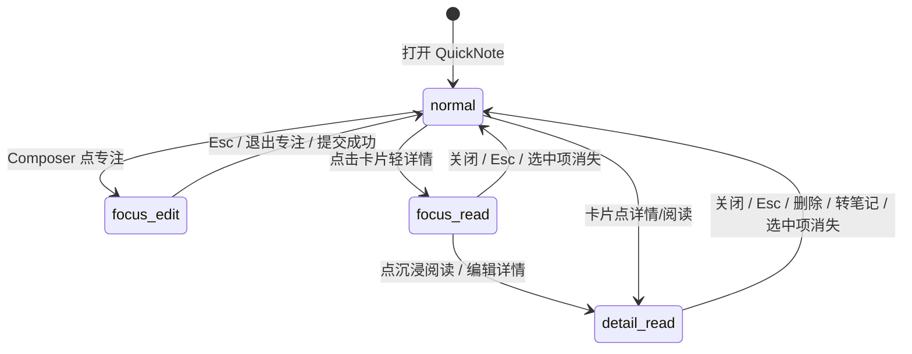

# PR-I QuickNote Focus Modes / 小记详情与专注模式重建派发文档

> ⚠️ 历史派发文档，仅供追溯，不再作为当前实现入口。
>
> 当前 QuickNote 已收敛为 `normal / focus-edit / detail-read` 三个 store focusMode；
> 双击卡片是 normal 态下的本地 Quick Preview：卡片自身向下生长并渲染完整内容，
> 不进入 `focus-read`，不渲染独立轻详情面板，也不展示元信息块。
> 后续实现请以代码与测试为准，避免按本文旧“四态 / focus-read / QuickNoteDetailPanel”路径继续开发。

## 1. 任务定位

PR-I 的目标是恢复并重建原 Pomodoroxi Memo 系统里的四态工作台逻辑，让当前 PomodoroXII 的 QuickNote 页面从“composer + timeline 卡片流”升级为具备详情、专注写作、轻阅读、沉浸阅读/编辑的 Memo workspace。

本 PR 不继续扩展 sync engine、Dexie schema 或 backend。当前 QuickNote 的 repository、store、outbox、trash、runtime refresh、conflict panel、conversion lifecycle 已经基本稳定，PR-I 的核心是补齐界面状态机和用户操作逻辑。

一句话目标：

```text
QuickNote 从快速记录列表升级为四态小记工作台：
normal → focus-edit → focus-read → detail-read
```

## 2. 当前项目状态判断

当前主干已具备：

- QuickNote repository：create / update / trash / restore / purge / convert。
- QuickNote store：真实 repository-backed Zustand store。
- QuickNote UI：composer、timeline、search、tag、pin、trash panel、convert、pending/failed sync status。
- Sync runtime refresh：onPullComplete / onPushComplete / onSyncComplete 后刷新 repository 并穿透 UI。
- Editing remote-change protection：编辑中遇到远端更新、tombstone、converted 有保护。
- Conflict panel：已有本地草稿 vs 远端版本的基础处理。
- Trash lifecycle：统一 `/trash` 已支持 Note / QuickNote / Folder 的恢复、彻删、清空。
- Conversion lifecycle：QuickNote 转 Note 已在本地 Dexie transaction 中完成 Note 创建、QuickNote archived/converted 标记和 outbox 入队。

当前缺失：

- `focusMode`
- `selectedQuickNoteId`
- composer 专注写作模式
- 工作台内轻详情
- 沉浸阅读详情页
- 详情页内 inline edit
- 详情 inline edit draft 与 composer draft 隔离
- selected note lifecycle 变化后的详情态退出逻辑

## 3. 原项目需要保留的核心设计

原 Pomodoroxi 的 Memo 不是普通详情页，而是四态状态机：

```ts
type MemoFocusMode = 'normal' | 'focus-edit' | 'focus-read' | 'detail-read'
```

需要迁移的是设计思想，不是 Vue 组件代码。

必须保留的核心逻辑：

- `normal`：默认工作台，composer + explorer/timeline。
- `focus-edit`：输入专注模式，放大新建/编辑输入区，隐藏或弱化列表。
- `focus-read`：工作台内轻详情，保留上下文，快速查看一条小记。
- `detail-read`：沉浸阅读详情，正文主栏 + aside，支持已有小记的 inline edit。
- inline edit 使用局部 draft，不污染全局 composer draft。

原项目参考文件：

```text
E:\Development\MyAwesomeApp\pomodoroxi\frontend\src\stores\memo.ts
E:\Development\MyAwesomeApp\pomodoroxi\frontend\src\views\MemoView.vue
E:\Development\MyAwesomeApp\pomodoroxi\frontend\src\components\memo\MemoContentPanel.vue
E:\Development\MyAwesomeApp\pomodoroxi\frontend\src\components\memo\MemoDetailPanel.vue
E:\Development\MyAwesomeApp\pomodoroxi\frontend\src\components\memo\MemoReadView.vue
E:\Development\MyAwesomeApp\pomodoroxi\frontend\src\components\memo\MemoReadArticle.vue
E:\Development\MyAwesomeApp\pomodoroxi\frontend\src\components\memo\MemoReadAside.vue
E:\Development\MyAwesomeApp\pomodoroxi\frontend\src\components\memo\MemoEditorPanel.vue
```

## 4. 目标状态机



四态语义：

| 状态 | 产品语义 | 用户操作重点 |
|---|---|---|
| `normal` | 默认小记工作台 | 快速记录、搜索、浏览、置顶、删除、转笔记 |
| `focus-edit` | composer 专注写作 | 长输入、低干扰写作、提交或退出 |
| `focus-read` | 工作台内轻详情 | 快速阅读、快速处理、进入沉浸详情 |
| `detail-read` | 沉浸阅读/编辑 | 完整正文阅读、aside 信息、局部 inline edit |

## 5. 产品边界

PR-I 要做：

- 四态状态机。
- 选中小记状态。
- composer focus variant。
- 工作台内轻详情。
- 沉浸阅读详情。
- detail inline edit。
- Esc 退出。
- selected note 不存在、trashed、converted、sync-deleted 后退出详情态。
- 回归当前 QuickNote 的 tags、trash、sync status、theme、runtime refresh 行为。

PR-I 不做：

- Notes 页面。
- QuickNote 转 Note 后跳转。
- backend 改动。
- sync engine 改动。
- Dexie schema 改动。
- comments。
- relation selector。
- TOC。
- Markdown 导出。
- 版本历史。
- 富文本 toolbar。
- 大型 Markdown 编辑器依赖。
- 复杂 conflict resolution。

## 6. Store 设计

修改文件：

```text
frontend/src/stores/quick-note-store.ts
```

新增类型：

```ts
export type QuickNoteFocusMode =
  | 'normal'
  | 'focus-edit'
  | 'focus-read'
  | 'detail-read'
```

新增 state：

```ts
interface QuickNoteState {
  focusMode: QuickNoteFocusMode
  selectedQuickNoteId: string | null
}
```

新增 actions：

```ts
interface QuickNoteActions {
  toggleFocusEdit: () => void
  enterFocusRead: (id: string) => void
  enterDetailRead: (id: string) => void
  exitFocus: () => void
}
```

行为规则：

- `toggleFocusEdit()`
  - `normal -> focus-edit`
  - `focus-edit -> normal`
  - 从其他模式调用时，推荐进入 `focus-edit` 并清空 `selectedQuickNoteId`。
- `enterFocusRead(id)`
  - `focusMode = 'focus-read'`
  - `selectedQuickNoteId = id`
- `enterDetailRead(id)`
  - `focusMode = 'detail-read'`
  - `selectedQuickNoteId = id`
- `exitFocus()`
  - `focusMode = 'normal'`
  - `selectedQuickNoteId = null`
- `reset()`
  - 必须清空 `focusMode` 和 `selectedQuickNoteId`。

新增 helper，建议放在：

```text
frontend/src/lib/quick-notes/quick-note-focus.ts
```

建议 API：

```ts
export function getSelectedQuickNote(
  quickNotes: QuickNote[],
  selectedQuickNoteId: string | null,
): QuickNote | null

export function isFocusEdit(mode: QuickNoteFocusMode): boolean
export function isFocusRead(mode: QuickNoteFocusMode): boolean
export function isDetailRead(mode: QuickNoteFocusMode): boolean
```

约束：

- 不把 selected note 派生结果存进 store。
- 不把 detail inline draft 存进全局 store。
- 不改 repository 数据结构。

## 7. 组件设计

### 7.1 `QuickNotesView`

现有文件：

```text
frontend/src/components/quick-notes/quick-notes-view.tsx
```

职责：

- 读取 store。
- 调用 `useQuickNoteEditor`。
- 调用 `useQuickNoteItemActions`。
- 装配 `QuickNotesWorkspace`。
- 保留现有 load、preview、error、trash panel 等入口。

不应继续承载：

- 大量 focus mode 分支。
- detail-read 内联编辑 draft。
- 复杂布局状态。

### 7.2 `QuickNotesWorkspace`

新增文件：

```text
frontend/src/components/quick-notes/quick-notes-workspace.tsx
```

职责：

- 根据 `focusMode` 分发主视图。
- 统一处理 Esc 退出。
- 统一处理 selected note 不存在时退出。
- 组合 composer、timeline、detail panel、read view。

建议模式渲染：

- `normal`：compact composer + search + timeline。
- `focus-edit`：focus composer，timeline 隐藏或弱化。
- `focus-read`：timeline + `QuickNoteDetailPanel`。
- `detail-read`：`QuickNoteReadView`。

### 7.3 `QuickNoteComposer`

现有文件：

```text
frontend/src/components/quick-notes/quick-note-composer.tsx
```

新增 props：

```ts
variant?: 'compact' | 'focus'
isFocusMode?: boolean
onToggleFocus?: () => void
```

要求：

- compact 模式保持现有 UI。
- focus 模式放大 textarea。
- focus 模式显示退出专注按钮。
- Esc 可退出专注。
- 提交成功后可返回 normal。
- composer draft 仍由现有 `useQuickNoteEditor` 管理。

### 7.4 `QuickNoteTimeline`

现有文件：

```text
frontend/src/components/quick-notes/quick-note-timeline.tsx
```

新增事件：

```ts
onOpenPreview: (id: string) => void
onOpenDetail: (id: string) => void
```

交互建议：

- 点击卡片正文进入 `focus-read`。
- 点击单独详情/阅读按钮进入 `detail-read`。
- 现有置顶、转笔记、删除保持不变。

### 7.5 `QuickNoteCard`

现有文件：

```text
frontend/src/components/quick-notes/quick-note-card.tsx
```

建议调整：

- 卡片正文区域触发轻详情。
- 增加“阅读/详情”入口。
- 保持置顶、转笔记、移到回收站按钮。
- 不增加过多复杂操作，避免卡片过重。

### 7.6 `QuickNoteDetailPanel`

新增文件：

```text
frontend/src/components/quick-notes/quick-note-detail-panel.tsx
```

对应 `focus-read`。

内容：

- 完整正文。
- tags。
- created_at / updated_at。
- sync status。
- pinned 状态。
- 操作：置顶、转笔记、移到回收站、进入沉浸阅读、关闭。

第一版不做：

- 评论。
- 关系。
- TOC。
- 导出。
- Markdown 高级渲染。

### 7.7 `QuickNoteReadView`

新增文件：

```text
frontend/src/components/quick-notes/quick-note-read-view.tsx
```

对应 `detail-read`。

职责：

- 沉浸阅读容器。
- Header：返回、标题、主要 actions。
- 桌面端正文 + aside 双栏。
- 移动端单栏。
- Esc 返回 normal。
- 删除/转笔记成功后退出 normal。

### 7.8 `QuickNoteReadArticle`

新增文件：

```text
frontend/src/components/quick-notes/quick-note-read-article.tsx
```

职责：

- 展示正文。
- 支持 inline edit。
- 本地 `draft` state。
- 保存调用 `updateQuickNote(id, { content })`。
- 保存成功后保持在 detail-read 或退出编辑态。
- 保存失败显示错误。

关键约束：

- 不使用 composer draft。
- 不调用 `setDraft` 修改 composer。
- selected note 更新时：
  - 本地未 dirty：允许同步远端内容。
  - 本地 dirty：不覆盖草稿，可显示轻量提示。

### 7.9 `QuickNoteReadAside`

新增文件：

```text
frontend/src/components/quick-notes/quick-note-read-aside.tsx
```

第一版内容：

- tags。
- created_at。
- updated_at。
- sync status。
- pinned 状态。
- 转笔记入口。
- 移到回收站入口。

后续扩展：

- TOC。
- 导出 Markdown。
- 关联 task/session/schedule。
- comments。
- versions。

## 8. 生命周期规则

### 8.1 selected note 被移到回收站

场景：

```text
focus-read/detail-read 中
→ 当前 note 被 deleteQuickNote 或 sync tombstone 移入 trash
```

行为：

- 调用 `exitFocus()`。
- 返回 normal。
- 显示提示：`当前小记已移入回收站` 或复用已有同步提示。

### 8.2 selected note 被 converted

行为：

- 调用 `exitFocus()`。
- toast：`当前小记已迁移为笔记`。
- 后续 PR 再增加 `查看笔记` action。

### 8.3 selected note 被 sync-deleted

行为：

- 调用 `exitFocus()`。
- toast：`当前小记已在同步中移除/移入回收站`。

### 8.4 selected note 被远端更新

在 `focus-read`：

- 直接刷新展示内容。

在 `detail-read`：

- 非 inline editing：直接刷新展示内容。
- inline editing 且本地 draft dirty：不覆盖本地 draft，显示提示或 conflict panel。

## 9. 样式规则

继续使用 QuickNote token：

```text
--qn-*
```

禁止：

- 新增散落硬编码文字色。
- 新建一套主题 token。
- 弹窗套弹窗。
- 把 detail-read 做成独立路由。
- 引入大型 UI/Markdown 编辑器依赖。

视觉要求：

- normal：保持当前 Memos-like 轻卡片。
- focus-edit：突出输入区，降低列表噪音。
- focus-read：保留工作台上下文。
- detail-read：阅读空间更宽松，正文主栏优先。

## 10. 推荐实现顺序

### Step 1：Store 状态机

修改：

```text
frontend/src/stores/quick-note-store.ts
frontend/src/lib/quick-notes/quick-note-focus.ts
frontend/src/stores/quick-note-store.test.ts
```

完成：

- `focusMode`
- `selectedQuickNoteId`
- `toggleFocusEdit`
- `enterFocusRead`
- `enterDetailRead`
- `exitFocus`
- helper tests

### Step 2：Workspace 壳

新增：

```text
frontend/src/components/quick-notes/quick-notes-workspace.tsx
```

调整：

```text
frontend/src/components/quick-notes/quick-notes-view.tsx
```

完成：

- 四态主视图切换。
- Esc 退出。
- selected note 不存在退出。

### Step 3：Composer focus variant

修改：

```text
frontend/src/components/quick-notes/quick-note-composer.tsx
```

完成：

- `variant="focus"`。
- 专注按钮。
- Esc 退出。
- focus mode 下 timeline 隐藏或弱化。

### Step 4：轻详情面板

新增：

```text
frontend/src/components/quick-notes/quick-note-detail-panel.tsx
```

完成：

- 完整正文展示。
- tags/meta/sync status。
- 置顶、转笔记、删除、进入 detail-read、关闭。

### Step 5：沉浸阅读详情

新增：

```text
frontend/src/components/quick-notes/quick-note-read-view.tsx
frontend/src/components/quick-notes/quick-note-read-article.tsx
frontend/src/components/quick-notes/quick-note-read-aside.tsx
```

完成：

- detail-read 页面状态。
- 正文 + aside。
- inline edit。
- 不污染 composer。
- 删除/转笔记后退出。

### Step 6：测试和回归

运行 focused tests 和 full gate。

## 11. 测试矩阵

必须新增或调整：

- store：`toggleFocusEdit()` normal/focus-edit 切换。
- store：`enterFocusRead(id)` 设置 focus-read + selected id。
- store：`enterDetailRead(id)` 设置 detail-read + selected id。
- store：`exitFocus()` 返回 normal 并清空 selected。
- store：`reset()` 清空 focus state。
- selector：selected id 存在时返回 note。
- selector：selected id 不存在时返回 null。
- UI：normal 渲染 composer + search + timeline。
- UI：focus-edit 渲染 expanded composer。
- UI：focus-edit 下 timeline 隐藏或弱化。
- UI：点击卡片进入 focus-read。
- UI：focus-read 渲染 `QuickNoteDetailPanel`。
- UI：focus-read 关闭返回 normal。
- UI：点击详情进入 detail-read。
- UI：detail-read 渲染 `QuickNoteReadView`。
- UI：Esc 退出 focus-edit/focus-read/detail-read。
- UI：detail inline edit 保存调用 update。
- UI：detail inline edit 不污染 composer draft。
- lifecycle：选中小记被删除后退出详情态。
- lifecycle：选中小记 converted 后退出详情态。
- regression：tags/search/trash/autosave/pending/theme/sync smoke 不回退。

## 12. Gate

在 `frontend/` 下运行：

```bash
npm run lint
npm run typecheck
npm run test
npm run build
```

Focused gate：

```bash
npm run test -- src/stores/quick-note-store.test.ts src/components/quick-notes/quick-notes-view.test.tsx src/components/quick-notes/quick-notes-view.runtime-sync.test.tsx src/components/quick-notes/quick-note-theme-smoke.test.ts
```

## 13. 手动 Smoke

启动：

```bash
cd frontend
npm run dev:preview
```

打开：

```text
http://127.0.0.1:3005/quick-notes?quickNotePreview=1
```

验证：

- normal：可新建小记，timeline 显示卡片。
- focus-edit：点击专注，composer 扩大，Esc 可退出。
- focus-read：点击卡片，显示轻详情，可关闭。
- detail-read：从卡片或轻详情进入沉浸阅读。
- inline edit：编辑保存后内容更新。
- composer 隔离：detail inline edit 不改变 composer draft。
- 删除：详情中删除后退出 normal。
- 转笔记：详情中转笔记后退出 normal。
- 主题：Light / Dark / Midnight / Nord / Daylight 下无低对比。

## 14. 验收标准

PR-I 完成后必须满足：

- `/quick-notes?quickNotePreview=1` 支持 normal / focus-edit / focus-read / detail-read 四态。
- focus-edit 是 composer 专注，不绑定已有小记。
- focus-read 是工作台内轻详情，不是弹窗堆叠。
- detail-read 是沉浸式阅读/编辑页。
- detail inline edit 不污染 composer draft。
- selected note 删除、converted、sync-deleted 后退出详情态。
- 现有 QuickNote CRUD、search、tag、trash、sync status 不回退。
- 全量 gate 通过。

## 15. PR 拆分建议

如果 review 压力较大，拆为三段：

### PR-I1：Focus Mode State + Workspace Shell

- store focus state。
- selector/helper。
- QuickNotesWorkspace。
- 四态空壳切换。

### PR-I2：Detail Panel + Read View

- QuickNoteDetailPanel。
- QuickNoteReadView。
- QuickNoteReadAside。
- 基础阅读详情。

### PR-I3：Inline Edit + Lifecycle Hardening

- QuickNoteReadArticle inline edit。
- draft 隔离。
- selected note lifecycle 退出。
- 测试补齐。

如果合成一个 PR，PR body 必须按这三块列清边界和测试证据。

## 16. 深度派发解读 Prompt

```text
你是 PomodoroXII 项目的实现型 coding agent。当前任务是实现 PR-I：QuickNote Focus Modes / 小记详情与专注模式重建。

项目路径：
E:\Development\MyAwesomeApp\PomodoroXII

原项目参考路径：
E:\Development\MyAwesomeApp\pomodoroxi

请先阅读当前项目文件：
- frontend/src/stores/quick-note-store.ts
- frontend/src/components/quick-notes/quick-notes-view.tsx
- frontend/src/components/quick-notes/quick-note-composer.tsx
- frontend/src/components/quick-notes/quick-note-timeline.tsx
- frontend/src/components/quick-notes/quick-note-card.tsx
- frontend/src/components/quick-notes/use-quick-note-editor.ts
- frontend/src/components/quick-notes/use-quick-note-item-actions.ts
- frontend/src/components/quick-notes/quick-note-conflict-panel.tsx
- frontend/src/lib/quick-notes/quick-note-repository.ts
- frontend/src/lib/quick-notes/quick-note-selectors.ts
- frontend/src/lib/quick-notes/quick-note-tags.ts

再阅读原项目参考文件，理解四态工作台逻辑，但不要照搬 Vue 组件：
- E:\Development\MyAwesomeApp\pomodoroxi\frontend\src\stores\memo.ts
- E:\Development\MyAwesomeApp\pomodoroxi\frontend\src\views\MemoView.vue
- E:\Development\MyAwesomeApp\pomodoroxi\frontend\src\components\memo\MemoContentPanel.vue
- E:\Development\MyAwesomeApp\pomodoroxi\frontend\src\components\memo\MemoDetailPanel.vue
- E:\Development\MyAwesomeApp\pomodoroxi\frontend\src\components\memo\MemoReadView.vue
- E:\Development\MyAwesomeApp\pomodoroxi\frontend\src\components\memo\MemoReadArticle.vue
- E:\Development\MyAwesomeApp\pomodoroxi\frontend\src\components\memo\MemoReadAside.vue
- E:\Development\MyAwesomeApp\pomodoroxi\frontend\src\components\memo\MemoEditorPanel.vue

当前 QuickNote 已完成：
- repository-backed Zustand store
- create/update/trash/restore/purge/convert
- tags 自动提取
- outbox hook
- runtime sync refresh
- pending/failed card sync status
- editing remote-change protection
- conflict panel
- unified trash lifecycle
- theme smoke

本任务目标：
为 QuickNote 增加四态界面状态机：

type QuickNoteFocusMode = 'normal' | 'focus-edit' | 'focus-read' | 'detail-read'

四态语义：
- normal：当前 composer + search + timeline + trash panel。
- focus-edit：composer 专注写作模式，timeline 隐藏或弱化。
- focus-read：工作台内轻详情，快速查看选中小记。
- detail-read：沉浸式详情阅读页，支持本地 inline edit，不污染 composer draft。

必须实现：
1. 在 useQuickNoteStore 增加 focusMode、selectedQuickNoteId。
2. 增加 toggleFocusEdit、enterFocusRead、enterDetailRead、exitFocus。
3. 增加 getSelectedQuickNote、isFocusEdit、isFocusRead、isDetailRead helper。
4. 新增 QuickNotesWorkspace。
5. QuickNoteComposer 支持 compact/focus variant。
6. QuickNoteTimeline / QuickNoteCard 支持轻详情和沉浸详情入口。
7. 新增 QuickNoteDetailPanel。
8. 新增 QuickNoteReadView。
9. 新增 QuickNoteReadArticle。
10. 新增 QuickNoteReadAside。
11. Esc 可退出 focus-edit/focus-read/detail-read。
12. detail-read inline edit 使用局部 draft，保存调用 updateQuickNote，不污染 composer。
13. 选中小记被删除、converted、sync-deleted 后退出详情态。

禁止事项：
- 不改 backend。
- 不改 sync engine。
- 不改 Dexie schema。
- 不做 Notes 页面。
- 不做 comments。
- 不做 relation selector。
- 不做 TOC。
- 不做 Markdown 导出。
- 不做版本历史。
- 不引入大型 UI/Markdown 编辑器依赖。
- 不把 QuickNote 做成完整 Notes 管理器。

实现建议：
第一步先做 store focus state 和 helper tests。
第二步抽出 QuickNotesWorkspace，保证四态能切换。
第三步扩展 QuickNoteComposer 的 focus variant。
第四步实现 QuickNoteDetailPanel。
第五步实现 QuickNoteReadView / Article / Aside。
第六步补 inline edit draft 隔离和 selected lifecycle hardening。

测试要求：
- store focusMode 切换。
- selectedQuickNote selector。
- normal 渲染 composer + timeline。
- focus-edit 渲染 expanded composer，timeline 隐藏或弱化。
- focus-read 渲染 QuickNoteDetailPanel。
- detail-read 渲染 QuickNoteReadView。
- Esc 退出。
- inline edit 保存调用 updateQuickNote。
- inline edit 不污染 composer。
- 选中小记删除后退出详情态。
- 现有 QuickNote tags/trash/autosave/pending/theme/sync 测试保持通过。

Gate：
在 frontend 下运行：
npm run lint
npm run typecheck
npm run test
npm run build

手动 smoke：
cd frontend
npm run dev:preview
打开：
http://127.0.0.1:3005/quick-notes?quickNotePreview=1

验证：
- normal 能新建小记。
- focus-edit 能进入/退出专注写作。
- focus-read 能显示轻详情。
- detail-read 能沉浸阅读。
- detail inline edit 保存不污染 composer。
- 删除/转笔记后退出详情态。
- 多主题下无低对比。

最终交付请说明：
- 修改文件列表。
- 四态状态机实现方式。
- inline edit 与 composer 隔离方式。
- lifecycle 退出策略。
- 测试和 gate 结果。
- 未实现但刻意延后的范围。
```

## 17. 最终结论

PR-I 的成功标准不是堆更多按钮，而是把 QuickNote 的界面状态边界打牢：

```text
normal：快速捕捉和浏览
focus-edit：输入专注
focus-read：工作台内轻详情
detail-read：沉浸阅读与局部编辑
```

只要这四态清楚，后续再扩展 TOC、导出、关系、Notes 跳转都会更稳。
