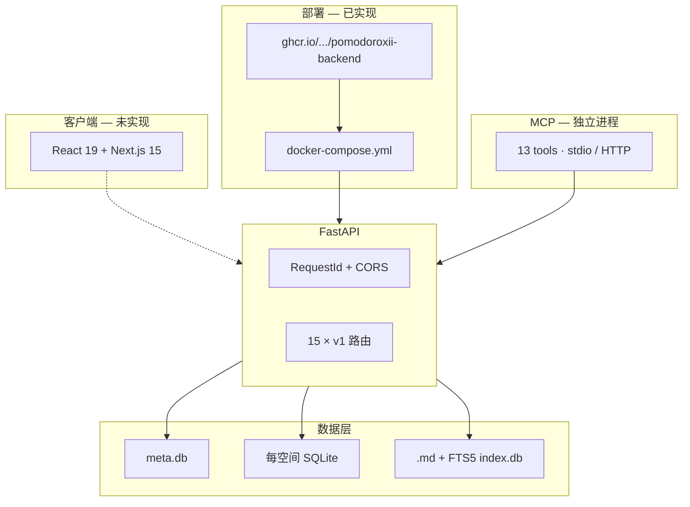

# PomodoroXII 全面跟踪与审查（main 基线）

> **审查时间：** 2026-07-05 下午  
> **审查分支：** `main` @ `775b3b8`  
> **对比基准：** [01-首轮深度审查-20260705.md](./01-首轮深度审查-20260705.md)（上午，`codex/sync-tombstone-ms` 时期）  
> **对照路线图：** `.trae/documents/多阶段路线图-收口到部署MVP.md`、`.trae/documents/全局8阶段战略指导-v1.md`

---

## TL;DR

**自上午审查以来，main 合并 6 个 PR，完成 MCP/部署收口路线阶段 1–5。** 后端从「工程扎实但 HTTP MCP 有 bug、不可部署」进入「**可 Docker 部署、MCP 双传输可用**」。下一战场：**阶段 6 生产安全加固** + **Phase F 前端 MVP**。

---

## 一、相对上午的增量变更

| 维度 | 上午 | 当前 main | 变更 |
|------|------|-----------|------|
| 分支 | `codex/sync-tombstone-ms` | `main` | 已合主线 |
| MCP HTTP lifespan | ❌ | ✅ PR #3 + 4 TDD 测试 | 已修复 |
| MCP ruff | 排除 `app/mcp/**` | ✅ 全量 lint | PR #4 |
| MCP tool parity | 分散硬编码 | ✅ `EXPECTED_MCP_TOOLS` | PR #5 |
| GHCR | `push: false` | ✅ latest + sha | PR #6 |
| docker-compose | 无 | ✅ `backend/docker-compose.yml` | PR #6 |
| DEPLOY.md | 无 | ✅ 108 行 | PR #6 |
| 测试函数 | 487 | **491** | +4 |
| 工作区 | 12 文件未提交 sync 修复 | 干净（仅 `uv.lock` 改动） | 风险降低 |

### main 最近合并轨迹

```
775b3b8  docs: archive final MCP/deploy rollout plans
e6f532e  Merge PR #6  ci: GHCR + docker-compose + DEPLOY.md
fb377f3  Merge PR #5  refactor(mcp): EXPECTED_MCP_TOOLS
980671b  Merge PR #4  chore(mcp): ruff lint gate
f8a245f  Merge PR #3  fix(mcp): HTTP transport init/dispose
3150111  Merge PR #2  fix(sync): tombstone ms precision
```

---

## 二、五阶段 MCP/部署路线图跟踪

来源：`.trae/documents/多阶段路线图-收口到部署MVP.md`

| 阶段 | 目标 | 状态 | 证据 |
|------|------|------|------|
| **1** MCP WIP 合入 | FastMCP 3.x + 测试增强 | ✅ | PR #1–2 |
| **2** HTTP lifespan | meta DB init/cleanup | ✅ | `server.py:428-439`, `test_mcp_http_lifespan.py` |
| **3** lint cleanup | MCP 纳入 ruff | ✅ | `pyproject.toml` 无 exclude |
| **4** Spec 化 | `EXPECTED_MCP_TOOLS` | ✅ | `tests/parity_helpers.py:138-154` |
| **5** 部署基线 | GHCR + compose + DEPLOY | ✅ | `ci.yml`, `docker-compose.yml`, `DEPLOY.md` |
| **6** 生产安全加固 | 限流 + 安全头 | ❌ **P0 下一项** | — |
| **7** 前端 MVP | Next.js 15 | ❌ | — |
| **8** 长期扩展 | 备份调度/迁移 | ❌ | — |

### 阶段 2 修复细节（PR #3）

```python
# backend/app/mcp/server.py — 所有 transport 统一生命周期
asyncio.run(init_meta_db())
try:
    if args.transport == "http":
        mcp.run(transport="http", host=args.host, port=args.port)
    else:
        mcp.run()
finally:
    asyncio.run(dispose_space_engine_manager())
    asyncio.run(close_meta_db())
```

测试：`test_mcp_http_lifespan.py` — init 顺序、异常 finally、stdio 回归、 stale 注释移除。

### 阶段 5 部署链路

**CI（`.github/workflows/ci.yml`）：**

- test job：pytest + ruff（blocking）
- build job（main push）：GHCR login → build push → smoke `/api/health`

**镜像：** `ghcr.io/zc63463-cmyk/pomodoroxii-backend:latest`

**本地启动：**

```bash
cd backend
# .env: POMODOROXII_SECRET_KEY=...
docker compose up -d
curl -fsS http://localhost:8000/api/health
```

---

## 三、8 阶段 v4 进度（更新）

```
Phase A  ████████████████████ 100%
Phase B  ████████████████████ 100%
Phase C  ███████████████████░  95%
Phase D  ███████████████░░░░░  75%
Phase E  ███████████████░░░░░  75%   ↑ (上午 55%)
Phase F  ░░░░░░░░░░░░░░░░░░░░   0%
Phase G  ███░░░░░░░░░░░░░░░░░  15%
Phase H  ██████████████░░░░░░  70%   ↑ (上午 45%)
────────────────────────────────────
仅后端 (A–E,H)                    ≈ 82%
完整产品 (A–H)                    ≈ 45%
```

---

## 四、代码库实况快照

### 4.1 规模

| 指标 | 数值 |
|------|------|
| `app/` Python 文件 | 116 |
| 测试文件 | 68 |
| 测试函数 | 491 |
| Alembic 迁移 | 7 |
| REST 路由模块 | 15 |
| HTTP 端点 | ~75 |
| MCP 工具 | 13（`EXPECTED_MCP_TOOLS` 门禁） |
| 注册实体 | 20 |

### 4.2 MCP 工具清单（parity 常量）

```python
# tests/parity_helpers.py — EXPECTED_MCP_TOOLS
list_all_spaces
get_stats_overview, get_focus_trend, get_task_distribution
get_daily_detail, get_habit_summary, get_schedule_summary, get_note_summary
get_registry_health, list_entities, get_entity_schema
get_sync_status, sync_pull
```

Stats 域另由 `STAT_SPECS`（`stats_spec.py`）约束 REST/MCP 对齐。

### 4.3 REST 完成度（未变部分）

| 类别 | 状态 |
|------|------|
| 完整 CRUD | tasks, folders, notes, quick-notes, trash, settings |
| 无 PUT | sessions, reflections, schedules, time-blocks, habits |
| 未暴露 HTTP | notes search (FTS5), export, consistency, relations |
| sync-only | memo_comment |

### 4.4 仍缺失 / 未接线

| 项 | 状态 |
|----|------|
| `BackupService` | 代码在 `file_system/backup.py`，**lifespan 未调用** |
| MCP mount FastAPI | `main.py` 无 mount，独立进程 |
| 认证限流 | grep `slowapi` 无结果 |
| 安全响应头 | 仅 `RequestIdMiddleware` + CORS |
| 前端 | 无 `frontend/` 目录 |
| pytest-cov | 未配置 |
| 根 README | 无（有 `backend/DEPLOY.md`） |

---

## 五、架构图（当前态）



---

## 六、测试与 CI

| 项 | 状态 |
|----|------|
| 本地 pytest | 沙箱 temp 目录限制未实跑；**以 CI 为准** |
| ruff | `app` + `tests` 全量，含 MCP |
| 新增 | `test_mcp_http_lifespan.py`（4） |
| 缺口 | 并发 sync、跨 space 隔离、覆盖率 |

---

## 七、问题分级（当前）

### P0 — 下一 Sprint

| # | 问题 | 建议 |
|---|------|------|
| 1 | 认证无限流 | `slowapi` 5/min/IP on `/auth/login` |
| 2 | 无安全响应头 | `SecurityHeadersMiddleware` |
| 3 | GHCR 未本地验证 | `docker pull` + `compose up` smoke |

### P1 — MVP

| # | 问题 |
|---|------|
| 4 | 前端 Phase F |
| 5 | BackupService 接入 lifespan |
| 6 | REST notes search |
| 7 | 5 类资源 PUT |
| 8 | 根 README.md |

### P2

- sync payload Pydantic 校验
- `list_trash` DB 分页
- pytest-cov
- 更新过时 `.trae` 规划文档

---

## 八、文档可信度（第二轮）

| 文档 | 状态 |
|------|------|
| `多阶段路线图` §2.1 | ⚠️ 过时 — 阶段 1–5 已完成 |
| `全局8阶段战略指导` §3–4 | ⚠️ 称 EXPECTED_MCP_TOOLS 未实现 — **main 已有** |
| `backend/DEPLOY.md` | ✅ 与 compose/CI 一致 |
| **main 代码 + 本报告** | ✅ Ground truth |

---

## 九、健康度评分（更新）

| 维度 | 上午 | 当前 |
|------|------|------|
| MCP/Agent | ★★★☆☆ | ★★★★☆ |
| 部署/运维 | ★★★☆☆ | ★★★★☆ |
| 安全防护 | ★★★☆☆ | ★★★☆☆ |
| 后端综合 | ★★★★☆ | ★★★★☆+ |
| 可交付产品 | ★★☆☆☆ | ★★☆☆☆ |

---

## 十、Sprint 跟踪清单

### 本周

- [ ] 阶段 6a：slowapi + 测试
- [ ] 阶段 6b：SecurityHeadersMiddleware + 测试
- [ ] 验证 GHCR 镜像
- [ ] 根目录 README.md

### 下周

- [ ] `GET /notes/search`
- [ ] sessions/habits 等 PUT
- [ ] BackupService lifespan
- [ ] Phase F 前端骨架

### 中期

- [ ] Vue → React 迁移（Phase G）
- [ ] MCP mount FastAPI（可选）
- [ ] pytest-cov CI

---

## 十一、审查结论

PomodoroXII 后端已完成 **MCP 收口 + 部署基线**，工程质量与测试覆盖处于高位。项目阶段已从「后端开发期」转入「**可部署、待安全加固 + 前端**」。

**最紧迫：** 阶段 6（限流 + 安全头）。  
**最大缺口：** Phase F 前端（用户仍无法使用产品）。

---

*Cursor Agent · 2026-07-05 下午 · main @ 775b3b8*
